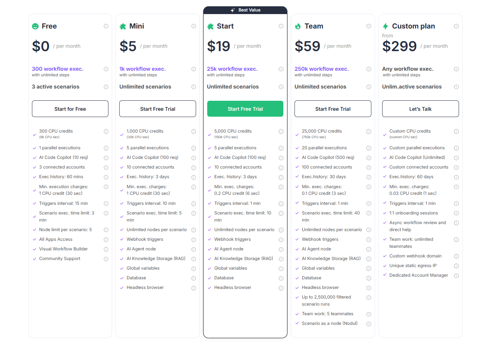

# Plans Overview

You can always find the latest plan details and current pricing on our pricing page: **[latenode.com/pricing-plans](https://latenode.com/pricing-plans)**.

## Choosing a plan

When evaluating a plan, consider both the included limits and the features you need:

- **Free**: Best for exploring the platform, building and testing scenarios, and running a small number of workflows.
- **Mini**: Great for individuals who run workflows occasionally and want access to advanced features like **webhook triggers**, **database**, and **headless browser**.
- **Start**: Best value for production usage with frequent runs (higher workflow execution quota, faster billing granularity, and a 1-minute trigger interval).
- **Team**: Ideal for teams that need high throughput (more parallel executions, longer history, more connected accounts, and team collaboration).
- **Custom plan**: Best for enterprise requirements (custom limits, custom webhook domain, static egress IP, dedicated support).

## How credits are consumed

Latenode charges **only for processing time**, not per node/operation.

- **What is a CPU credit**: 1 credit equals **30 seconds** of scenario execution time.
- **How charging works**: during execution, credits are consumed based on total run time. The minimum charge per execution depends on your plan (see table above).

