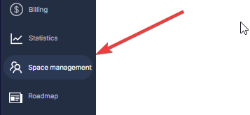

# Workspace Management

Workspace Management lets you grant an existing Latenode user access to your workspace with management permissions (excluding subscription and user management). This is designed for partners who need access to client accounts and seamless one-click switching between workspaces.

<Callout type="info" title="Note">
This is not a classic invite system. You can only add a user who is already registered, activated, and has an active account (subscription, trial, or LTD).
</Callout>

## Access Rights

The added user can:

- View, run, edit, and delete scenarios
- Manage account structure, scenarios, and databases
- **Cannot**: change the plan, manage billing, or add/remove other users

## How to Add a User

1. Open **Workspace Management**.

2. Enter the email of another active Latenode account and click **Grant Access**.

3. The user will appear in the access list.

    

## Switching Between Accounts

After being added, the user will be able to switch between their own and connected accounts using the workspace switcher in the top menu.

The account you've granted access to can switch to your workspace by clicking the **account switcher menu** in the top navigation and selecting your account from the dropdown list.

## Remove access

You can remove access at any time by clicking **Remove** next to the user in the access list.

