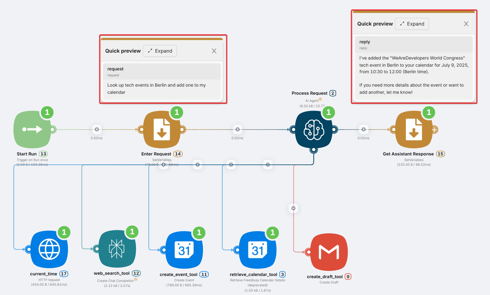
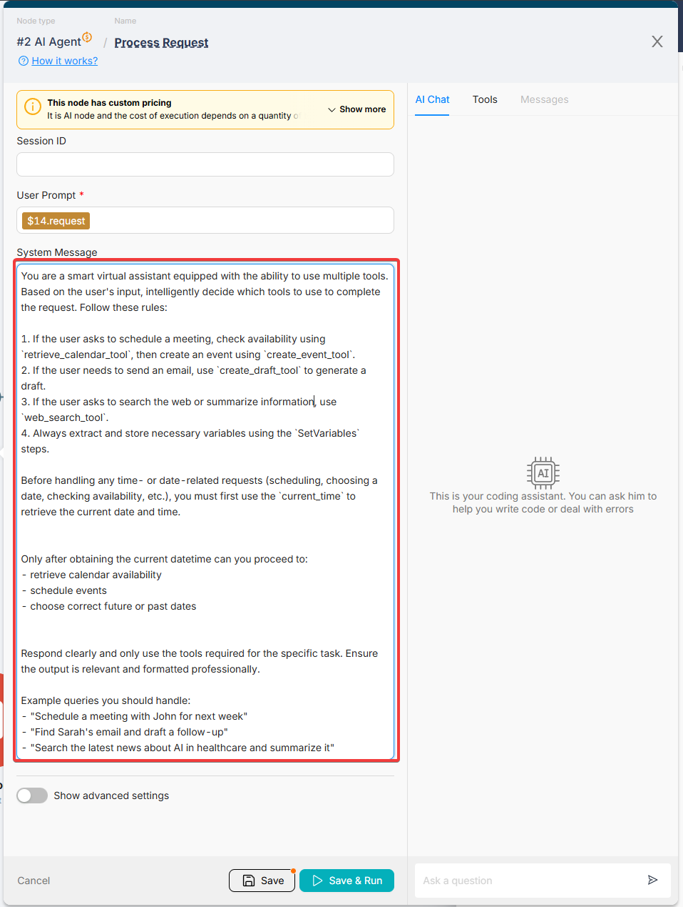

# Agent Design Foundations

## Overview 

Latenode AI Agents are powered by a built-in LLM and driven by two key components you control:

- **Instructions** � define the agent�s behavior, logic, and decisions.
- **Tools** � connected nodes that the agent can call to perform actions or retrieve data.

This page explains how to design those components effectively to build reliable, task-oriented agents.



---

## How It Works

Each time the AI Agent node receives a message, it:

1. Reads the instructions.
2. Analyzes the input.
3. Decides whether to call a tool or generate a direct reply.
4. Executes the logic based on your setup.

The quality of this process depends on how clearly you structure the agent�s instructions and tools.


---

## Instructions

Instructions define how the agent should behave. They are written in plain language and describe what the agent is allowed to do, how it should react to user inputs, and how to use the available tools.



---

## Recommendations

---

- Be explicit about allowed and disallowed actions.
- Include fallback logic for missing data.
- Keep instructions focused on one scenario.
- Use simple, direct language.
- **Clearly describe each tool�s purpose** � the agent relies on these descriptions to decide which tool to call.
- **Avoid vague tool labels or descriptions** � instead of �get info�, say �fetch current weather data� or �retrieve currency exchange rate�.

<Callout type="info">
The more accurately you define what each tool does, the better the agent can reason and choose the right one for the task.

</Callout>
---

## Tools

Tools are the external actions the agent can take. In Latenode, these are the connected nodes � such as HTTP requests, Notion, or Google Sheets.


---

### Best Practices

- Use descriptive names: `create_invoice`, `send_email`
- Avoid connecting too many tools per agent
- Design each tool to do one task well
- Test tools separately before connecting


```
{{fromAIAgent("email"; "Customer email address")}}
```

---