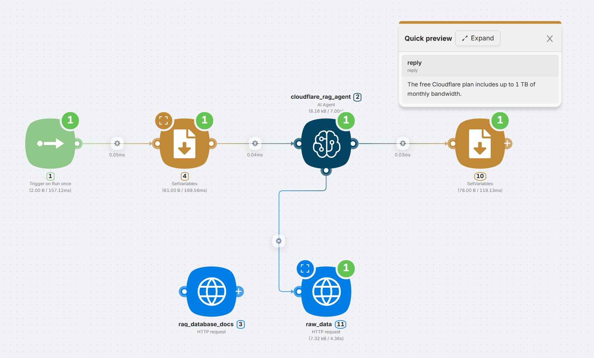

# AI Agent Examples

Latenode's **AI Agent** is flexible enough to support multiple architectures: from a single dynamic assistant to modular multi-agent systems and external knowledge integration.

---

## 1. AI Agent Basic Workflow Example

A single AI Agent receives user prompts and decides which tools to use, if any. This setup is lightweight but powerful � capable of parsing, routing, and composing responses dynamically.

### Scenario Structure



- One central `AI Agent`
- Connected to:
    - `weather_tool` (e.g. wttr.in)
    - `exchangerate_tool` (e.g. exchangerate.host)
    - `web_search_tool` (e.g. factual search)
- Input from `Trigger`, output to `SetVariables`

---

### Call Example 1 � Weather + Currency

**Prompt:**

> �What�s the weather in Berlin and how much is 100 EUR in USD?�
> 
- The agent triggers:
    - `weather_tool` with the city "Berlin"
    - `exchangerate_tool` for EUR to USD
- Skips unrelated tools


**Expected output:**

```
It's currently 17�C in Berlin. 100 EUR is about 108 USD.
```

---

### Call Example 2 � Simple Fact

**Prompt:**

> �Who is the CEO of Apple?�
> 
- Agent skips weather and currency
- Only triggers `web_search_tool`


**Expected output:**

```
The CEO of Apple is Tim Cook.
```

?? This scenario is great for lightweight assistants that respond contextually without complex logic trees.

**?? You can copy this template here: [AI Agent Basic Workflow Example](https://app.latenode.com/templates/shared/684725a0ed2b4d6c0a7d111c)**

---

## 2. Multiagent - AI Multi-Agent Interaction Example

This approach uses a **main agent** to break down user requests and forward sub-tasks to specialized agents. Each sub-agent operates independently and can have its own API logic.

### Scenario Structure


- `main_agent` controls the overall logic
- Delegates to:
    - `weather_agent`
    - `finance_agent`
    - `web_search_tool`
- Each sub-agent is connected to dedicated APIs or logic blocks

---

### Call Example 1 � Weather + BTC

**Prompt:**

> �What�s the weather in Tokyo and what�s the BTC price?�
> 
- `main_agent` sends:
    - Weather part > `weather_agent`
    - Bitcoin price part > `finance_agent`
    
    
    

**Expected output:**

```
The current weather in Tokyo is 27�C and sunny. The current price of Bitcoin (BTC) is $119,218 USD.
```

---

### Call Example 2 � CEO + HQ Weather

**Prompt:**

> �Who is the CEO of Apple and what�s the weather like at their HQ?�
> 
- Agent parses:
    - Apple HQ location > via `web_search_tool`
    - Weather in that location > via `weather_agent`
    
    
    

**Expected output:**

```
The CEO of Apple is Tim Cook. He has held this position since August 2011, succeeding Steve Jobs.

As for the weather at Apple�s headquarters in Cupertino, California, it is currently 27�C and sunny.
```

?? This pattern fits well for scalable assistants, where logic needs to be cleanly split.

**?? You can copy this template here: [AI Multi-Agent Interaction Example](https://app.latenode.com/templates/shared/684725a0cd09a51e3217b514)**

---

## 3. AI Agent with Cloudflare AutoRAG Database

---

Integrate an AI Agent with [Cloudflare AutoRAG](https://developers.cloudflare.com/autorag/usage/rest-api/) to retrieve structured external knowledge � such as product documentation, policies, or internal data.

### Scenario Structure


- `cloudflare_rag_agent` handles free-form prompts
- Two HTTP tools connected:
    - `rag_database_docs` � deep semantic retrieval
    - `raw_data` � fast, factual lookups

<Callout type="warning">
Before using this scenario, you must:
- [Create an account](https://developers.cloudflare.com/autorag/get-started/) on Cloudflare AutoRAG
- Create a **database instance**
- Upload your own documents via the dashboard or API
- **Replace all placeholders** (`YOUR_ACCOUNT_ID`, `YOUR_RAG_ID`, `YOUR_API_TOKEN`) in the scenario�s HTTP request blocks with your actual values from the Cloudflare dashboard

</Callout>
<Callout type="success">
Most modern RAG platforms - including AutoRAG - automatically generate embeddings server-side. You don�t need to preprocess documents or manage vectors manually.

</Callout>
---

### Call Example 1 � Documentation Question

**Prompt:**

> �How does the billing system of Cloudflare work?�
> 
- Agent detects it�s a high-level question
- Selects `rag_database_docs` to retrieve semantic context
- Responds based on indexed content


**Expected output:**

```
Cloudflare's billing system uses a monthly subscription model with pro-rated charges...
```

---

### Call Example 2 � Quick Data Point

**Prompt:**

> �What�s the max bandwidth on the free Cloudflare plan?�
> 
- The agent determines it's a factual request
- Selects `raw_data` for direct value retrieval


**Expected output:**

```
The free Cloudflare plan includes up to 1 TB of monthly bandwidth.
```

?? Use AutoRAG-style integrations for assistants that can reason over your documents and give context-aware, accurate replies � without hosting your own vector database or embeddings pipeline.

**?? You can copy this template here: [AI Agent with Cloudflare AutoRAG Database](https://app.latenode.com/templates/shared/684725a0efb7b1fe5317711f)**

---

## Best Practices

- Name all nodes descriptively � they become visible "tools" to the agent
- Use `Agent ID` to maintain session-based memory
- Set `Max Iterations` to prevent loops
- Use `Output JSON Schema` if the response needs to be structured