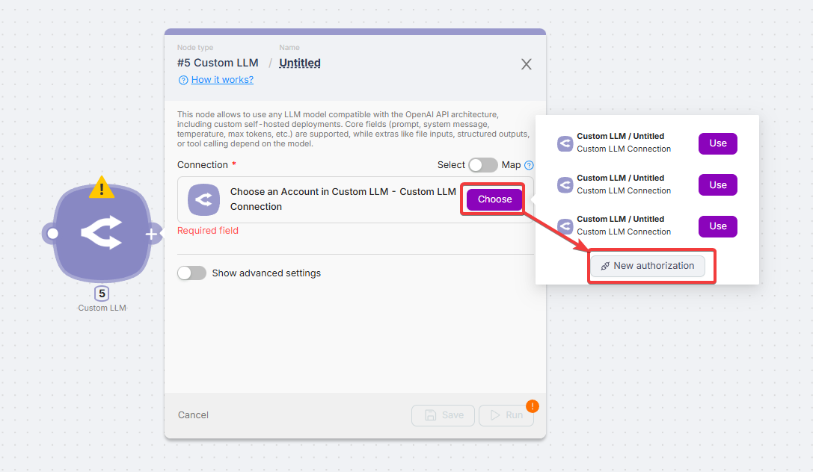
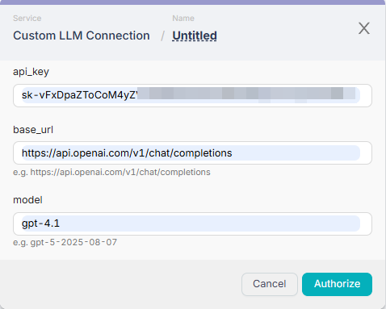
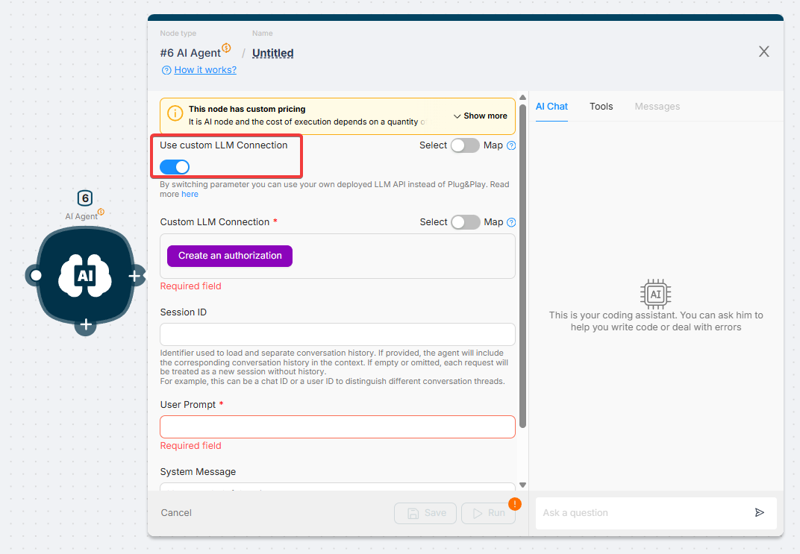
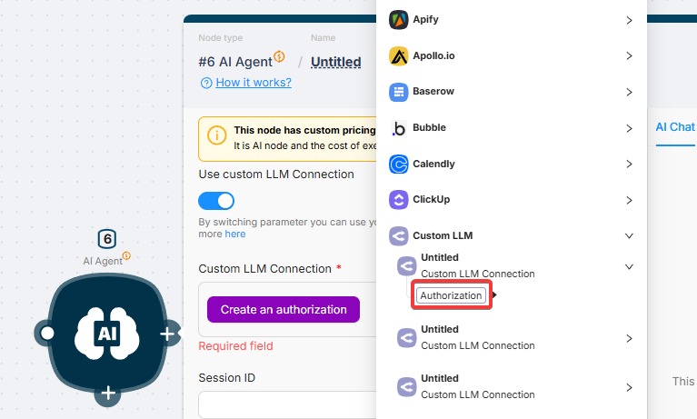
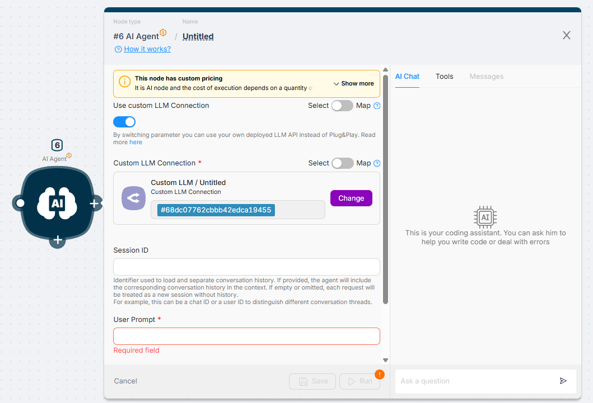

# How to Use Your Own API Keys: Custom LLM Node and AI Agent

This guide covers how to integrate any **OpenAI API-compatible** (LLM) into your Latenode workflow, including self-hosted and third-party services. Both the **Custom LLM Node** and the **AI Agent Node** share the exact same connection method.

---

## 1. Establishing the Custom LLM Connection

The connection mechanism relies on the widely adopted OpenAI API structure, allowing you to use external services (like Groq, Perplexity, or Ollama) by correctly specifying the Base URL.

### A. Creating a New Authorization

1. Click **"Choose"** and select **"New authorization"**.

2. Fill in the connection details:
    - **API Key:** Your secret key provided by the LLM service.
    - **Base URL:** The URL endpoint that accepts OpenAI-compatible chat completion requests. This is the **most crucial field** for compatibility.
    - **Model:** The model identifier (e.g., `gpt-4-turbo`, `llama-3`).

**Compatible Base URL Examples:**

| Service | Base URL |
| --- | --- |
| OpenAI | `https://api.openai.com/v1/chat/completions` |
| Groq | `https://api.groq.com/openai/v1/chat/completions` |
| Perplexity | `https://api.perplexity.ai/chat/completions` |
| Ollama (Local) | `http://localhost:11434/v1/chat/completions` |
| Azure OpenAI | `https://[YOUR-RESOURCE].openai.azure.com/openai/deployments/[MODEL-NAME]/chat/completions?api-version=2024-02-15` |

### B. Sharing the Connection with the AI Agent Node

The authorization created in Step 1 is reusable. This allows you to power your AI Agents with the same custom models.

1. In the **AI Agent Node**, toggle the **"Use Custom LLM Connection"** switch to ON.

2. Click **"Create an authorization"**.

3. Choose the authorization you created earlier (and click **"Authorization"** to create a new one).

Your authorization has been successfully added.

---

## 2. Advanced Settings: Controlling LLM Behavior

These settings are found under **"Show advanced settings"** in the Custom LLM Node and provide granular control over the model's output, creativity, and context management.

### Context and Input Parameters

| Parameter | Description | Use Case |
| --- | --- | --- |
| **File Content** | Accepts a URL or a variable containing file data. | Used for **multimodal** models to analyze images or process non-image files like PDFs (when paired with **File Name**). |
| **File Name** | Required for non-image files (text, PDF, documents) when passing data via **File Content**. |  |
| **Dialog History JSON** | A valid JSON array detailing the conversation history (`{"role": "user", "content": "..."}`). | Essential for maintaining **context** in multi-turn chatbot conversations. |

### Generation and Creativity Parameters

These parameters control the quality and diversity of the generated response. It is recommended to adjust either **Temperature** or **Top P**, but not both.

| Parameter | Description | Effect |
| --- | --- | --- |
| **Max Tokens** | The maximum number of tokens the model can generate in its output. | Controls the **length** of the response. |
| **Temperature** | Sampling temperature. **Lower values** (e.g., 0.1) result in more focused and deterministic output. | Best for accurate, factual tasks. |
| **Top P** | Nucleus sampling parameter. **Lower values** make the output more focused by limiting token consideration to a small probability mass. | Alternative control for response **diversity**. |
| **Stop Sequences** | A list of tokens that, when generated, cause the model to immediately stop outputting text. | Used to prevent the model from continuing beyond a desired end point. |

### Structuring and Tool Use

| Parameter | Description | Primary Function |
| --- | --- | --- |
| **Structured Output (Toggle)** | Forces the LLM to respond using a **JSON format**. | Ideal for reliable data extraction into variables. |
| **Output JSON Schema** | A valid JSON Schema defining the precise fields, types, and required properties of the expected output. | Guarantees structured, predictable output for downstream nodes. |
| **Tools JSON** | A JSON object describing the **functions** the model can call to fulfill a user request. | Enables **Function Calling** or **Tool Use** capabilities of advanced models. |
| **Tool Choice JSON** | Controls which tool (if any) the model is allowed to call (`none`, `auto`, `required`, or a specific function name). | Determines the model's action when tools are available. |
| **Frequency Penalty** | Reduces the likelihood of repeating tokens based on their existing frequency in the text. | **Discourages** the model from repeating words. |
| **Presence Penalty** | Reduces the likelihood of reusing tokens that have already appeared in the context. | **Encourages** the model to introduce new topics or concepts. |
