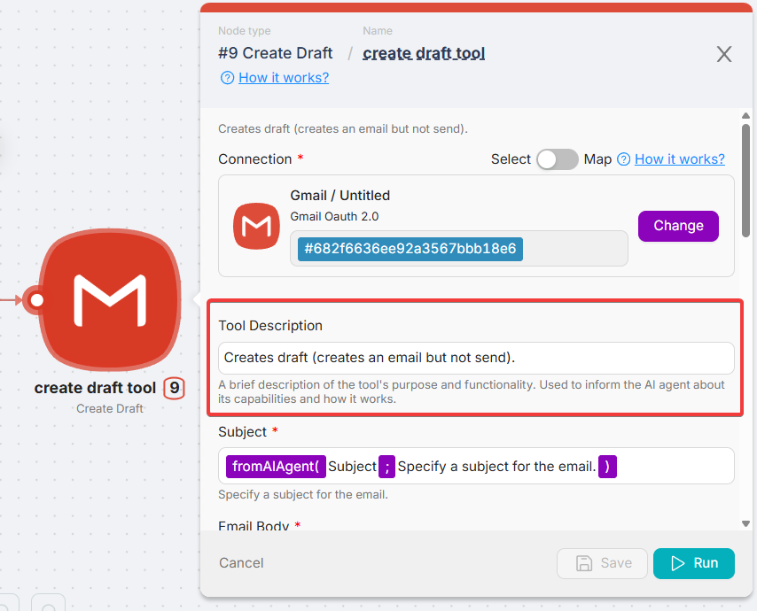

# Tool Design for AI Agents

## Overview

Tools are nodes connected to the AI Agent that perform specific actions or return data. They must be well-defined so the agent can use them reliably.

---

### Naming

Agents refer to tools by their node names. Use clear, descriptive names that directly reflect the purpose of the tool.

### Good examples

- `create_event_tool`
- `send_email_draft`
- `retrieve_calendar_tool`

### Poor examples

- `Node 3`
- `tempTool`
- `doStuff`

<Callout type="info">
Tool names are a key part of the agent's reasoning. If the name doesn't convey the purpose, the agent may ignore or misuse the tool.

</Callout>
---

### Behavior Guidelines

- Tools should be deterministic and return consistent results
- If the tool performs irreversible actions (e.g. sending an email, booking a meeting), ensure that the agent logic confirms intent before calling it
- Tools should return helpful errors when required input is missing or invalid — in a format the agent can interpret

---

### Tool Descriptions

Each tool should include a short description that explains its function. This is used by the agent to decide when (and if) to use it.

> **Note:** The tool description is not just for documentation — it is also passed via API and directly affects how the agent reasons about and chooses to call the tool. A vague or missing description can lead to the tool being ignored or misused.

### Good examples

> create_event_tool: "Creates a new calendar event using title, time, and participant list."

### Poor examples

> "Does stuff with the calendar"
>
> `"Test tool"`

> **Tip:** Keep descriptions short, specific, and action-oriented. Write them for the agent — not just for humans.

---

### Testing

Always test each tool in isolation before connecting it to an agent. Validate that the tool:

- Executes reliably with real input
- Returns usable results
- Fails gracefully when needed

---
