import { Cards, Card } from 'fumadocs-ui/components/card';

# Database essentials

If you use the **built-in database** in scenarios, **start here**: one path from setup in the app to every database node. Latenode stores that data in **storages** and **collections** on the platform. For many scenarios you can skip an external database: less integration work, fewer moving parts, and data stays next to your automations. **How to create a database** below is a quick setup in the app; then the examples follow one sample client record in **`users`** / **`test_storage`**.

<h2 id="how-to-create-database">How to create a database</h2>

<Steps>
  <Step>

### Open the Databases page

In the app, go to [**Databases**](https://app.latenode.com/data-storage/database).

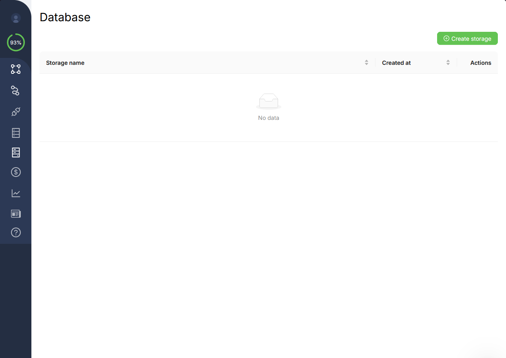

  </Step>
  <Step>

### Create a storage

Click **Create storage**. In the name field, use **Latin characters** and **`_` between words**; **spaces are usually not allowed**. Below we use **`test_storage`**.

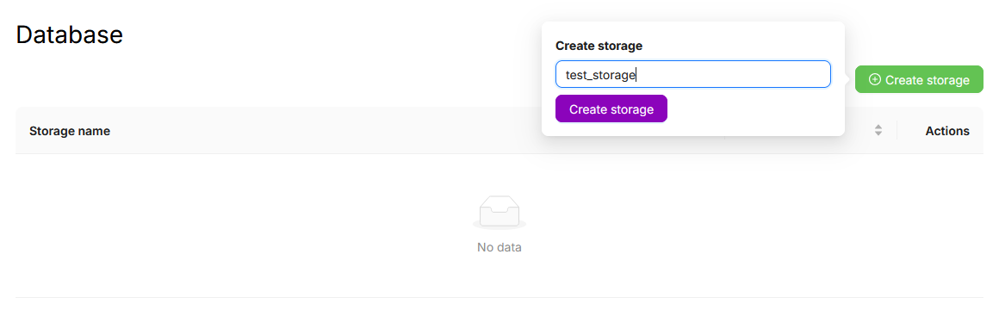

After you save, the new storage shows up on the **Databases** list.

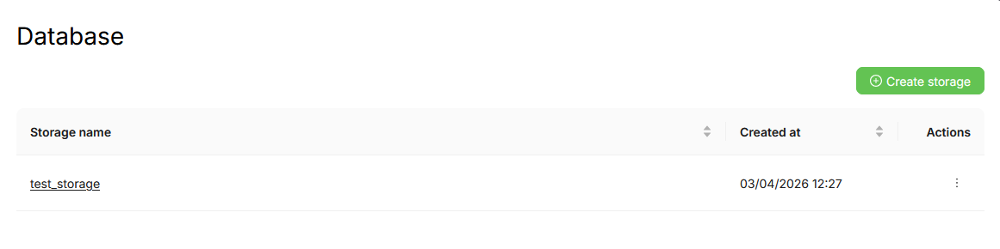

  </Step>
  <Step>

### Create a collection

Open storage **`test_storage`**, click **Create collection**, and set the collection name (**same naming rules**), e.g. **`users`**.

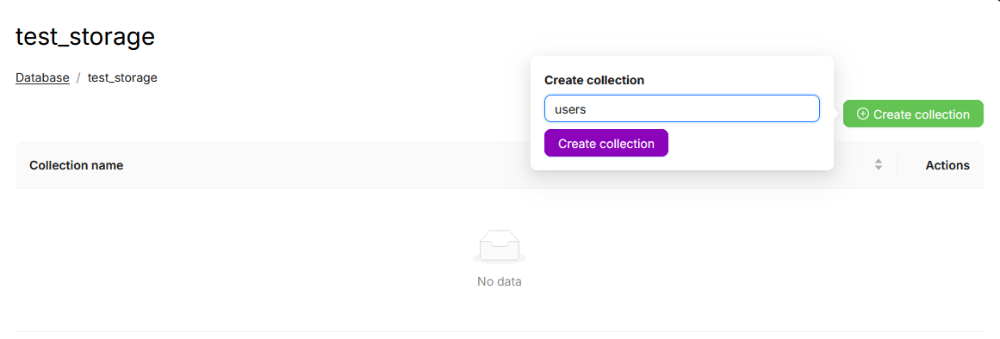

After you confirm, the collection appears in that storage’s UI alongside any others.

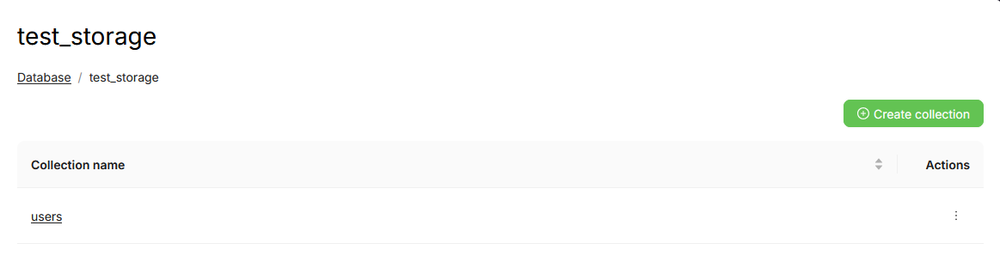

  </Step>
</Steps>

On the **collection screen** in the app (where you just created **`users`**), you can also **create objects** or run a **YAML filter** on the table. That path skips nodes; below we use the **visual builder** and database nodes.

<Callout type="info">
Detailed filter options, operators, and bulk YAML update formats are on [Querying a collection](./querying-collection) and [Modifying data in a collection](./modifying-data-in-a-collection). The sections below cover **basic** settings that are enough to start.
</Callout>

## Nodes in your scenario

**Once for every node below:** **Get elements**, **Create element**, **Update object**, **Update objects**, and **Delete object** all share the same **Storage ID** and **Collection name** fields, both **dropdowns**. Pick **`test_storage`** and **`users`** (or whatever you named them). We show this screenshot once and do not repeat it in each section.

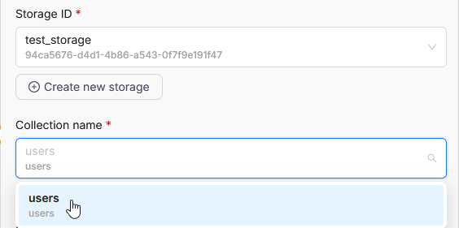

The same sample record is covered **step by step** next: create, read, update, delete.

## Create element: insert one object

**What it does:** write **one** object from **Object value** (JSON) into the collection.

**Fields:** **Storage ID**, **Collection name**, **Object value**.

**Minimal sample** (client card):

```json
{
  "name": "Anna Petrova",
  "phone": "+79001234567",
  "email": "anna@example.com",
  "active": "yes",
  "notes": "First contact from form"
}
```

**Result:** a new row with a generated object id. The node **output** includes the new **Object ID**. Pass it to **Update object** or **Delete object** when the next steps target the same row. Running again with the same `phone` creates **another** row unless you dedupe in the scenario (e.g. **Get elements** plus branching).

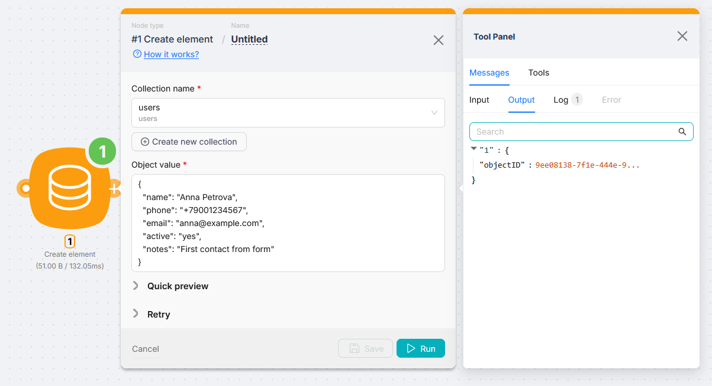

## Get elements: fetch objects by filter

**What it does:** return up to **Limit** objects from the collection that match the YAML **Filter**.

**Fields:** **Storage ID**, **Collection name** (e.g. `users`), **Filter** (YAML), **Limit**.

**Example:** read back the row you created above, by `phone`:

```yaml
conditions:
  - operation: equal
    query:
      path: phone
    expected:
      value: "+79001234567"
```

Keep **Limit** small (e.g. `10`). Another common filter is by email:

```yaml
conditions:
  - operation: equal
    query:
      path: email
    expected:
      value: "anna@example.com"
```

**Output:** an **array** of objects that matched the filter; each row has an **Object ID** for **Update object** and **Delete object** (often you map `object_id` from the first match).

If you already changed **email** with **Update object**, use the **current** address in the filter (in this walkthrough that is **`anna.new@example.com`**).

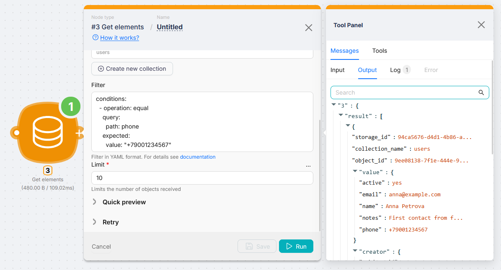

## Update object: update one object by id

**What it does:** find the row by **Object ID** and apply **Value** (JSON).

**Fields:** **Storage ID**, **Collection name**, **Object ID**, **Value**, **Replace** toggle.

- **Replace off:** list **only fields to change**; the rest of the stored object stays.  
  **Example:** change notes and deactivate the client:

```json
{
  "notes": "Call back on Friday",
  "active": "no"
}
```

- **Replace on:** **Value** **fully replaces** the stored object. Any field missing from JSON is removed.  
  **Full replacement** example after an email change:

```json
{
  "name": "Anna Petrova",
  "phone": "+79001234567",
  "email": "anna.new@example.com",
  "active": "yes",
  "notes": "Updated email"
}
```

**Object ID** usually comes from **Create element** (id in the output) or **Get elements**. In the screenshots below it is already mapped from a previous node.

**First screenshot: Replace off.** This is a **partial** update: **Value** lists **only** the fields you want to change. Every other field in the stored row **stays as-is** (the node does not rewrite **name**, **phone**, or **email** if they are not in the JSON). The UI shows **Replace** disabled and a short JSON payload. Check **rows_affected** in the output to confirm the row was found and updated.

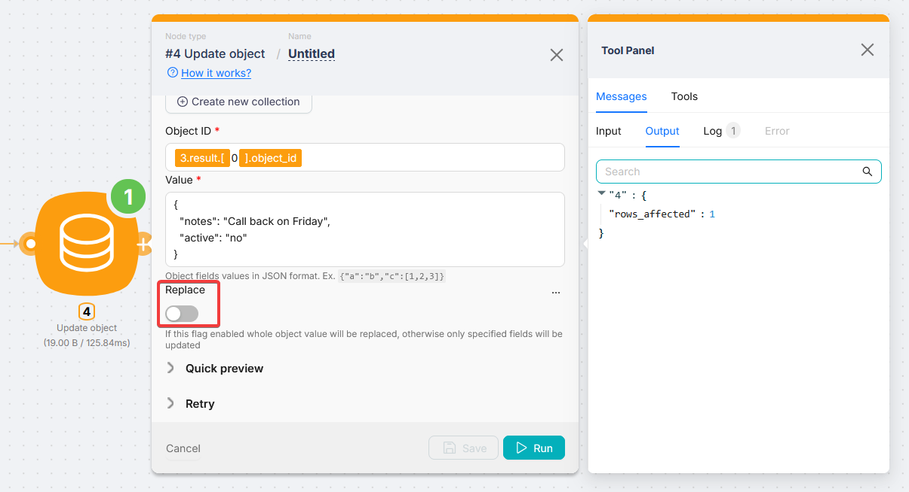

**Second screenshot: Replace on.** This is a **full overwrite**: the collection row becomes **exactly** the JSON in **Value**. Any field **missing** from that JSON is **removed** from the stored object. The UI shows **Replace** enabled and a full object (same shape as the JSON example above).

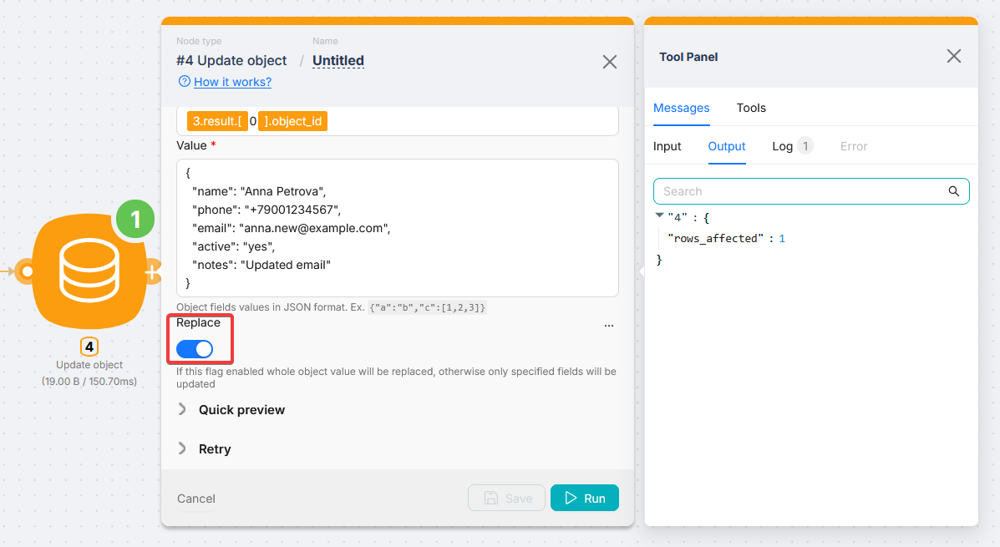

## Update objects: update multiple rows by filter

**What it does:** find **all** rows that match the YAML **Filter** (same idea as **Get elements**) and apply the YAML **Updater** to **each** match.

**Fields:** **Storage ID**, **Collection name**, **Filter**, **Updater**.

**Example:** the client row now has **`anna.new@example.com`** (after full replace in **Update object**). Set **`active`** to **`"no"`** for rows with that email. **Filter:**

```yaml
conditions:
  - operation: equal
    query:
      path: email
    expected:
      value: "anna.new@example.com"
```

**Updater** lists changes under **`items`** (full syntax: [Modifying data in a collection](./modifying-data-in-a-collection)). Minimal case, one field:

```yaml
items:
  - path: "active"
    set:
      value: "no"
```

**Result:** every matching row gets `active` set to `"no"`. Check **rows_affected** in the output. If it is **0**, the filter matched nothing (verify email and conditions) and nothing changes in the table.

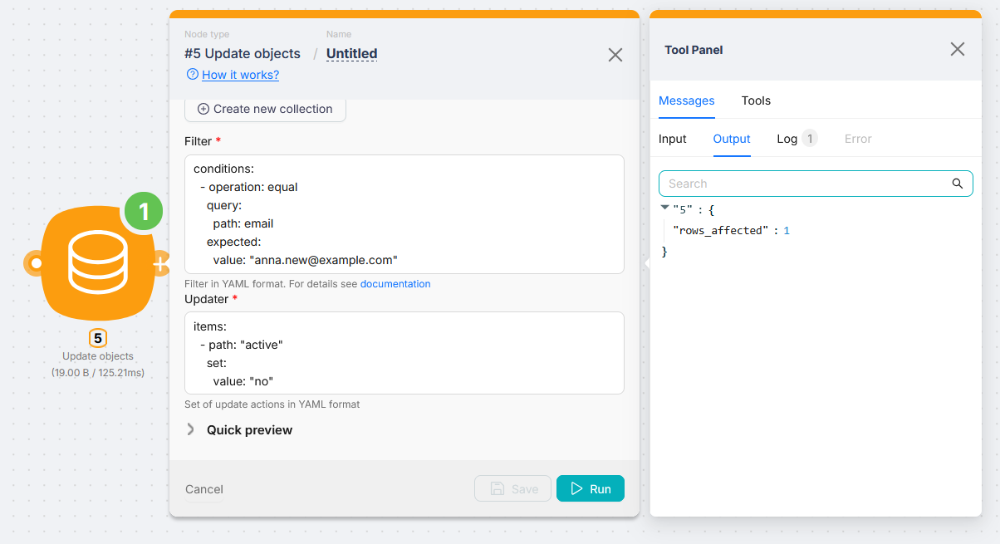

## Delete object: delete one object

**What it does:** delete the row for **Object ID**.

**Fields:** **Storage ID**, **Collection name**, **Object ID**.

**Example:** pass **Object ID** from **Get elements**, **Create element**, or another step. The node removes that row. The **output** returns the **Object ID** of the deleted record.

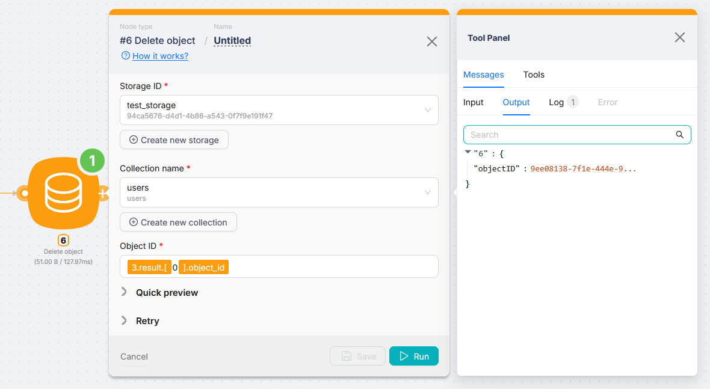

## Notes

- **IDs from the URL.** For [Database from JS code](./using-databases-from-js-code) or when you need exact **storage** and **collection** values outside the dropdowns, open the collection in the app and check the address bar: after `/data-storage/database/` you get the **storage ID** (UUID), then the **collection** segment.

- **No raw booleans in the samples.** The JSON examples on this page avoid `true` / `false` and numeric `1` / `0` for flags: the “client is active” field uses the strings **`"yes"`** and **`"no"`** in `active`.

- **Storage size.** Each storage currently has a **1 GB** limit. Plan for growth, cleanup, or moving some data elsewhere as you approach it.

## Next steps

<Cards>
  <Card href="/databases/database/querying-collection" title="Querying a collection">
    Full YAML filter reference: operators, nesting, examples.
  </Card>
  <Card href="/databases/database/modifying-data-in-a-collection" title="Modifying data in a collection">
    `items` modifiers and `path` / `set` expressions for bulk updates.
  </Card>
  <Card href="/databases/database/using-databases-from-js-code" title="Database from JS code">
    Access the same collections from a code node.
  </Card>
</Cards>
