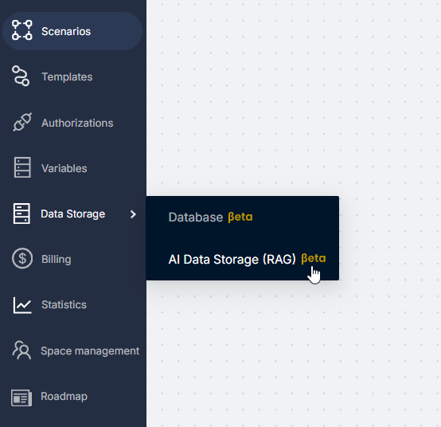
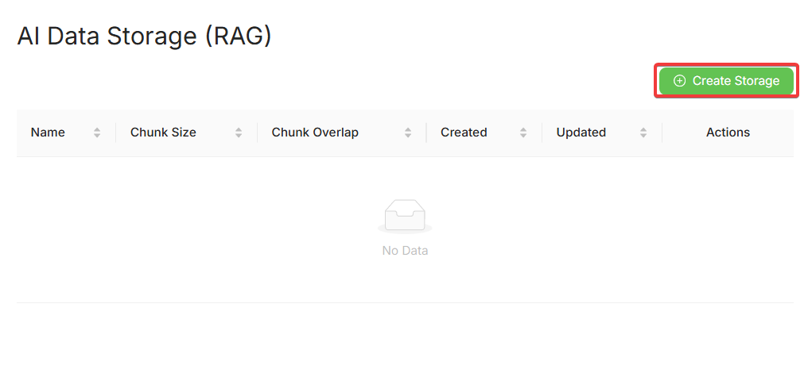
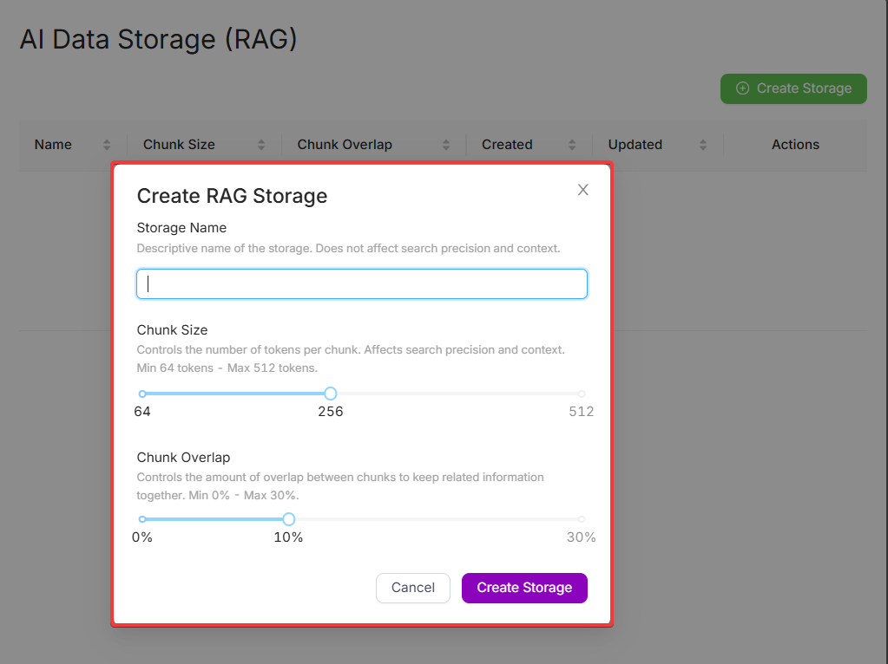
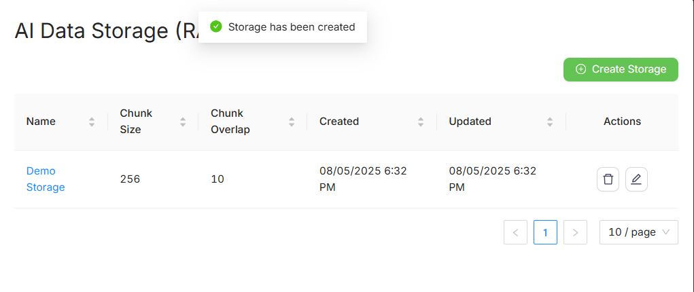
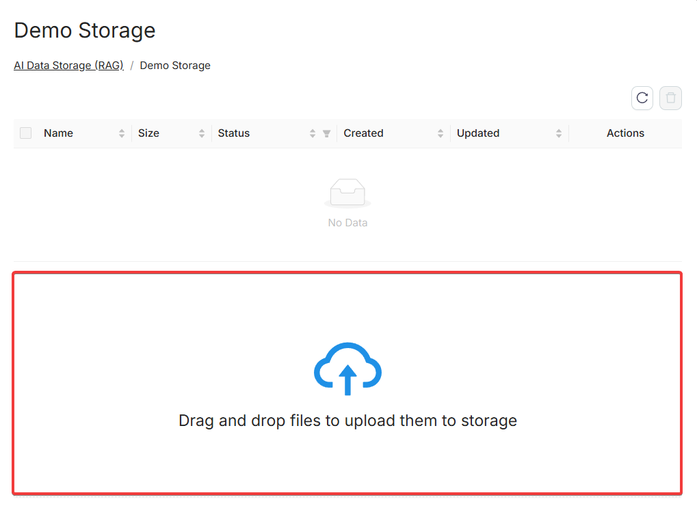
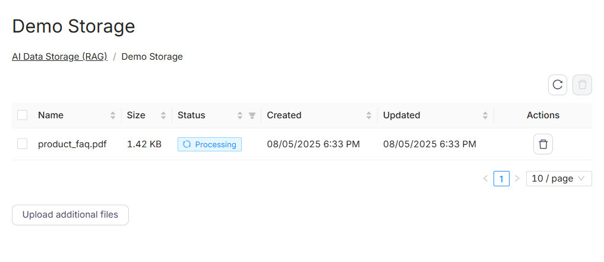

# AI Data Storage

<Callout type="warning">
RAG is currently in beta. Pricing, behavior, and limitations may change.
</Callout>

### Purpose

AI Data Storage (RAG) is a component of the Latenode platform designed for storing and indexing text files, images, and other knowledge sources.

<Callout type="info">
This tool is primarily intended to be used in conjunction with the AI Agent — it provides documents in the form of chunks, which the agent can then use to generate responses.

</Callout>
Use cases include:

- Uploading and storing structured or unstructured content
- Generating embedding vectors for fast semantic search
- Running natural language search queries
- Connecting to the **RAG Search** node inside a scenario

---

### How to Access

You can access this feature via **Data Storage → AI Data Storage (RAG)** in the left-hand side menu.

---

### Creating Storage

Click **Create Storage** to open the setup modal:

Fill in the required fields: **Storage Name, Chunk Size, Chunk Overlap**

---

### What are Chunk Size and Overlap?

- **Chunk Size** — the number of tokens in a single chunk. Smaller chunks provide higher accuracy but increase the total number of chunks.
- **Chunk Overlap** — the percentage of token overlap between neighboring chunks. Helps maintain context across them.

---

### Managing Storage

Created storages are displayed in a table:

| Field | Description |
| --- | --- |
| Name | Storage name |
| Chunk Size | Number of tokens per chunk |
| Chunk Overlap | Overlap between chunks in % |
| Created | Creation date |
| Updated | Last updated date |

---

### Uploading Files

Open a storage to access the upload interface. Drag-and-drop is supported.

After uploading:

- Each file is processed and indexed (status: **Processing**)
- Files are listed with size, upload date, and status
- Editing or downloading files is currently **not supported**

---

### Multimodal RAG Features

For working with images and non-textual data, RAG Storage uses an advanced approach:

- **Automatic Image Description:** When uploading images (JPEG, PNG), the system automatically generates their textual description (summary) using a multimodal LLM and indexes this description along with the text content.
- **Text Indexing:** Text extracted via OCR from images (or PDF files) is also split into chunks and indexed.

This allows the AI Agent to effectively find answers to questions based on both textual and visual content.

---

### Features & Limits

| Feature | Status |
| --- | --- |
| OCR | Supported (English and Russian) |
| Image Upload | Supported (if image contains text) |
| File Editing | Not supported |
| File Download | Not yet available |
| Automatic Indexing | Yes |
| Supported Formats | PDF, TXT, JSON, MD, PNG, JPG, and more |
| Upload via scenario | Not yet supported |

---

### Technical Details

| Parameter | Value |
| --- | --- |
| Max file size | 20 MB (50 MB planned) |
| Embedding model | Cloudflare + LlamaIndex |
| Vector limit | 5 000 000 vectors per account |
| Billing | 0.0066 PNP tokens per page, charged only during file upload |

---

### Billing

- [PNP tokens](/get-started/frequently_asked_questions/what-is-pnp-nodes) are deducted upon file upload
- Billing is based on pages/chunks
- Vectorization cost: **0.0066 [PNP tokens](/get-started/frequently_asked_questions/what-is-pnp-nodes) per page**
- "1 page" corresponds to approximately 1000 words or 5000 characters of text
- For unstructured data (e.g. TXT, MD), the same linear pricing model applies — cost is proportional to total text length

**Examples:**
- 10 pages (PDF/DOCX/PPTX) → 0.066 PNP tokens ($0.066)
- TXT ≈ 10 000 words (≈ 50 000 chars) → 0.066 PNP tokens ($0.066)
- MD ≈ 20 000 words (≈ 100 000 chars) → 0.132 PNP tokens ($0.132)
- 100 pages → 0.66 PNP tokens ($0.66)

- Queries via RAG Search **are not additionally billed**

