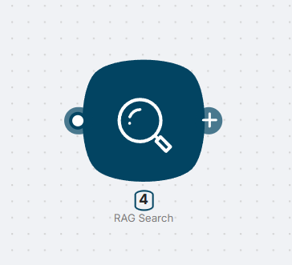
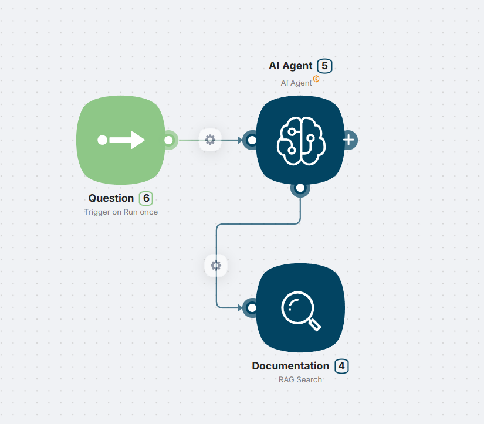
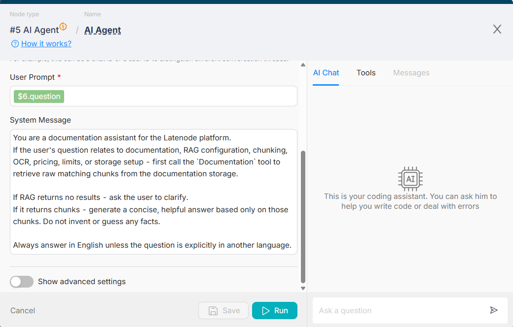
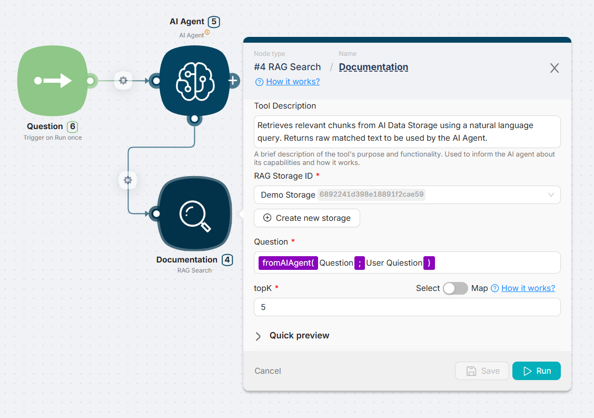
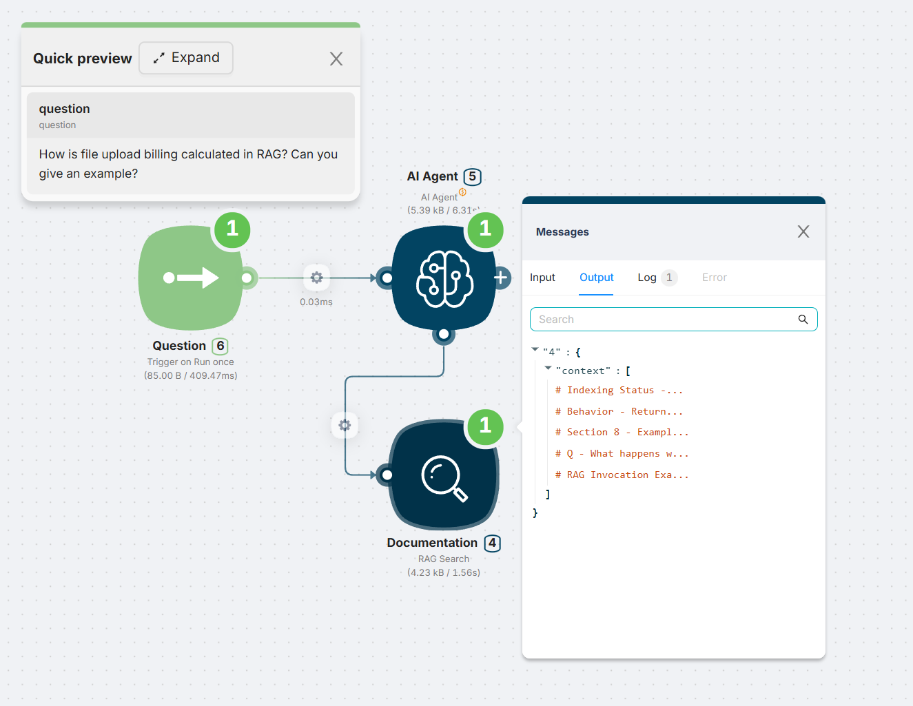
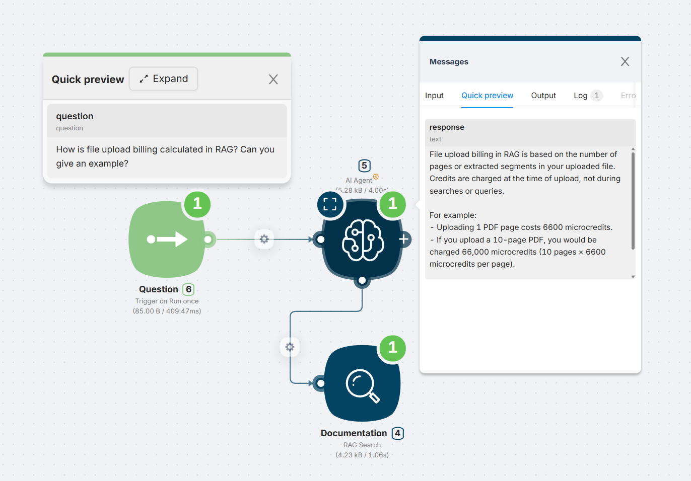

# Using AI Agent with RAG

### Working with AI Agent

Example scenario with an **AI Agent** using RAG Search as a tool:

---

### Prompt Configuration for Agent

The agent is configured with a system prompt instructing it to use the RAG Search tool when the user asks for documentation-related information:

---

### RAG Search Tool Setup

The RAG Search node is connected to the agent using `fromAIAgent()`. A storage is selected, `top_k` is set, and the tool description helps the model understand its capabilities.

---

### End-to-End Example

1. The user sends a question to the agent
2. The agent uses RAG Search to retrieve relevant chunks
    

    
    
3. The agent composes and returns a final response
    
    
