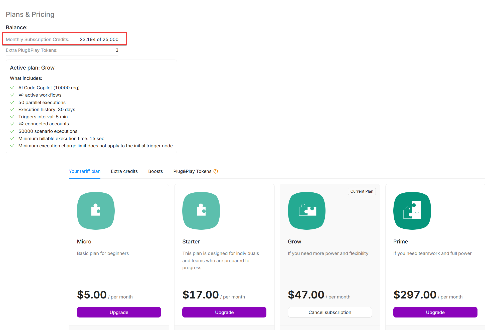
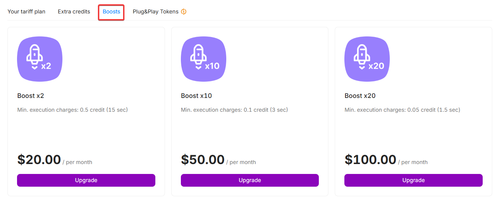
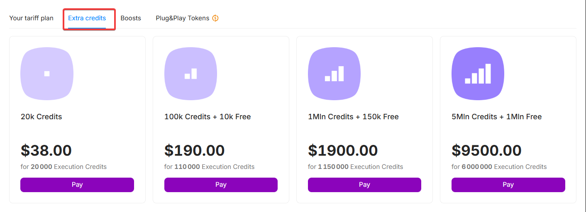

# What Are Credits?

## Latenode Credits (Execution Credits)

**Latenode Credits** are the primary unit used for executing scenarios on the platform.

### How it works

- **1 credit** starts a scenario execution and grants up to **30 seconds** of execution time.
- Within this time frame, you can run any number of operations and nodes (apps, JavaScript, headless browser, etc.).
- Credit consumption depends **only on total execution time**, not on the number of operations.

### Minimum credit usage

- The minimum number of credits charged per execution depends on your pricing plan.
- Even if a scenario runs for only a few seconds, the minimum amount defined by your plan will be charged.
- For up-to-date minimum values, see the [pricing page](https://latenode.com/pricing-plans).

> You can view detailed usage statistics for Execution Credits on the [Statistics page](https://app.latenode.com/statistic).

---

## Boosts

**Boosts** are add-ons that expand your plan’s capabilities. Depending on the boost type, they can:

- Add more credits
- Increase limits for triggers, flows, or accounts
- Reduce the minimum scenario interval

Boosts are purchased separately and **do not expire** at the end of the month.

---

## Extra Credits

If your included credits aren’t enough, you can purchase **Extra Credits**. They are added to your balance and used **after** the monthly limit is reached.

- Extra Credits **do not expire**
- Extra Credits are used **after** the included credits are depleted

