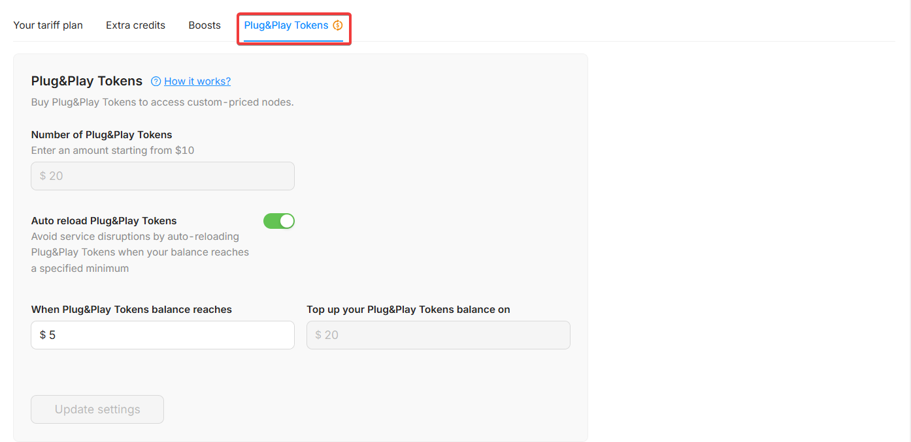
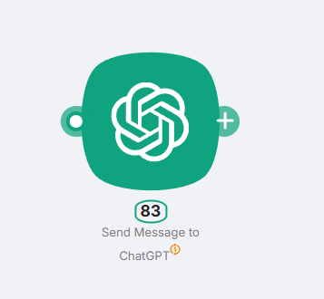
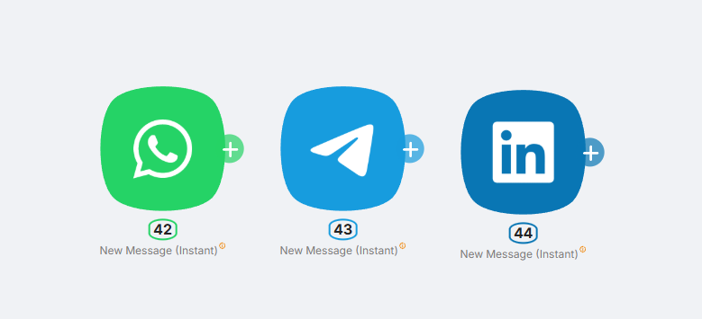
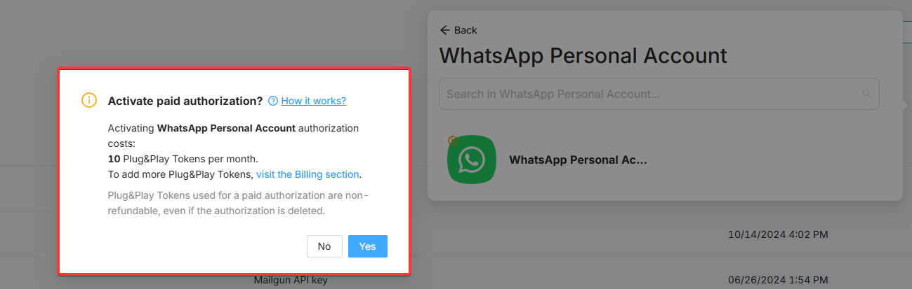
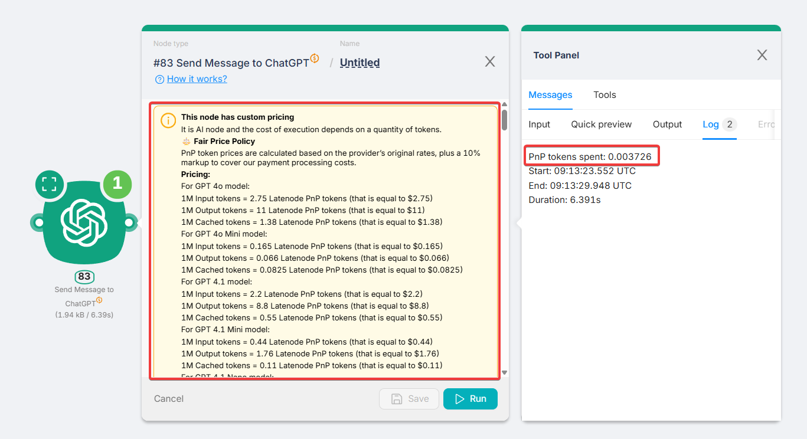
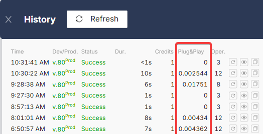

# Plug-n-Play (PnP) Tokens

## What are PnP tokens?

**PnP tokens** are an **optional** billing unit used for nodes marked with the **`$`** icon.

These nodes interact with external paid resources (third-party APIs, AI models, etc.) **without requiring you to provide your own API keys or maintain external accounts**.

Instead, you work with Latenode as an intermediary: usage is billed through a **single, unified account**, and tokens are charged accordingly.

---

## Pricing and billing

- **1 PnP token = 1 USD**. When a node is executed, the cost is calculated based on actual provider usage, and the equivalent number of tokens is deducted.
- PnP tokens are charged **in addition to** Execution Credits during a scenario run.
- **Pay-as-you-go**: you are charged for actual provider usage, not “per request”.
- Each PnP node shows pricing in its interface (typically provider rate + a small markup for processing costs).

---

## Billing modes

### Pay-per-use (default)

Applies to most PnP nodes such as AI models, file converters, enrichment nodes, and AI agents. Tokens are charged **based on usage**.

### Monthly subscription for authentication

This applies **only** to personal account connections for the following services. In this case, the **`$`** icon means the connection itself is paid and costs **10 PnP tokens per month**:

- Telegram (Personal account)
- WhatsApp (Personal account)
- LinkedIn (Personal account)

You will see a clear warning about this when creating the authorization:

---

## Viewing usage

Each PnP node shows its **detailed pricing** in a collapsible section inside the node configuration.

After scenario execution, you can view:

- The exact number of PnP tokens spent
- The actual execution cost of the node

This data is available under the **Log** tab on the right side of the node.

You can also track overall PnP token usage in **Execution History** (clock icon in the top-right corner of the interface):

> You can view detailed usage statistics for PnP Tokens on the [Statistics page](https://app.latenode.com/statistic).

