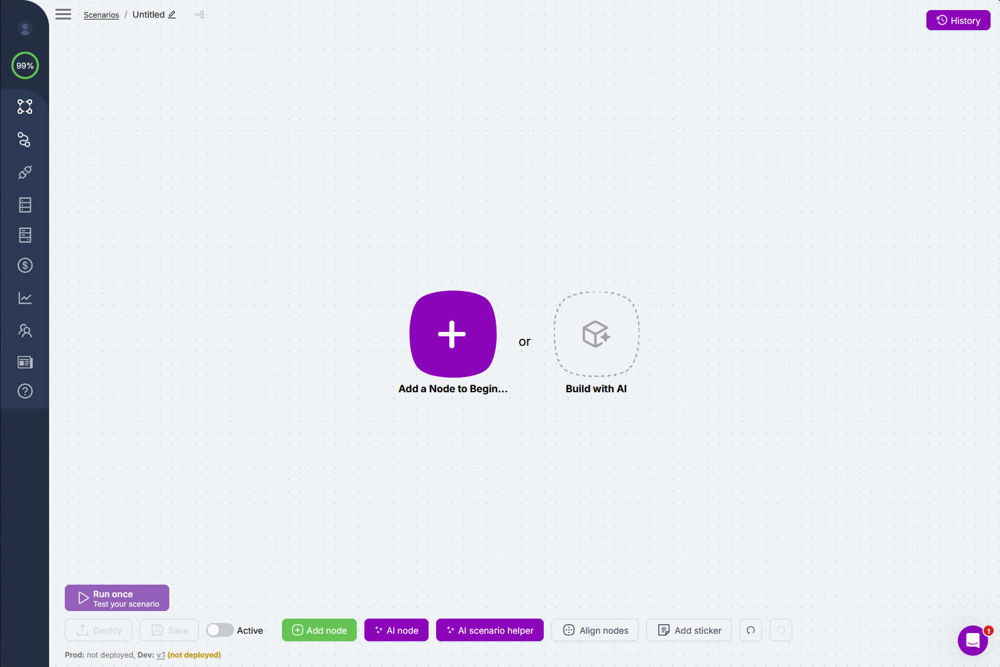

import { Cards, Card } from 'fumadocs-ui/components/card';
import { Play, Puzzle, Bot } from 'lucide-react';

# Introduction

Latenode is an AI workflow automation platform. Build automations on a drag-and-drop canvas, use 1,200+ AI models without managing API keys, and connect 5,500+ integrations - all in one subscription.

---

## What you can build

**AI Agents and Chatbots.**
Build intelligent assistants that handle customer support, answer questions from your knowledge base, and take real actions: create tickets, update CRM records, send messages - without human intervention.

<video autoPlay muted loop playsInline width="100%">
  <source src="/assets/videos/intro-ai-builder.mp4" type="video/mp4" />
</video>

**Business Process Automation.**
Eliminate manual work: sync leads between CRM and spreadsheets, route support tickets, send follow-ups, process form submissions, generate reports on a schedule.

**Data Pipelines.**
Extract data from any source, transform and enrich it, and push it where it needs to go. Process invoices, aggregate analytics, move records between databases automatically.

**Developer Workflows.**
Build on top of any API with custom HTTP requests and full JavaScript in every node. Handle webhooks, orchestrate multi-step processes, connect internal services, and automate dev team operations.

---

## AI Assistant

<video autoPlay muted loop playsInline width="100%">
  <source src="/assets/videos/intro-ai-agent.mp4" type="video/mp4" />
</video>

**Ask questions.** Ask about any node, have it explain a scenario, or suggest improvements. The AI assistant answers in the context of what is open on the canvas.

**Build scenarios.** Describe the task - the assistant proposes a structure and places nodes on the canvas. Refine, edit, add conditions right in the chat.

**Debug.** Something went wrong - describe the problem. The assistant finds where it broke and suggests how to fix it.

---

## How it works

<video autoPlay muted loop playsInline width="100%">
  <source src="/assets/videos/intro-canvas.mp4" type="video/mp4" />
</video>

**Visual builder:** nodes and connectors on the canvas - you see the full path from input to output at once, without hunting through nested settings.

**When it runs:** on an event in a connected app, on a schedule, or when a webhook receives a request.

**Hundreds of AI models out of the box:** drop in a node - the model is ready to use instantly. No API keys required.

**Agentic workflows:** the AI Agent picks which tool nodes to call and in what order - based on the task, not a fixed if-then ladder.

---

## Integrations

<video autoPlay muted loop playsInline width="100%">
  <source src="/assets/videos/intro-integrations.mp4" type="video/mp4" />
</video>

Latenode connects to your entire stack. OAuth is handled automatically.

- **AI models**: GPT-4o, Claude, Gemini, Llama, Mistral, DeepSeek, Stable Diffusion, HeyGen, and 1,200+ more - all on one balance, no separate API keys
- **CRM and sales**: Salesforce, HubSpot, Pipedrive, Zoho
- **Communication**: Slack, Gmail, Telegram, WhatsApp, Discord, Microsoft Teams
- **Productivity**: Notion, Google Sheets, Airtable, Jira, Asana, ClickUp
- **Databases**: PostgreSQL, MySQL, MongoDB, Supabase, Airtable
- **Custom**: HTTP Request node, JavaScript node, webhooks - connect anything with an API

---

## What's next

<Cards>
  <Card
    icon={<Play />}
    href="/get-started/quickstarts/building-first-scenario"
    title="Build your first scenario"
    description="Step-by-step from trigger to result, in minutes."
  />
  <Card
    icon={<Puzzle />}
    href="/integrations"
    title="Browse integrations"
    description="5,500+ apps, AI models, and core nodes."
  />
  <Card
    icon={<Bot />}
    href="/ai-agents"
    title="AI Agents"
    description="Build agents that reason, decide, and act."
  />
</Cards>
