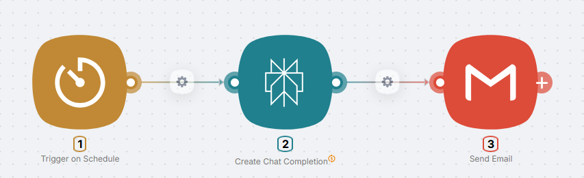
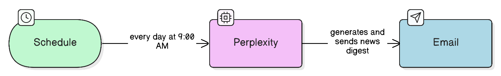
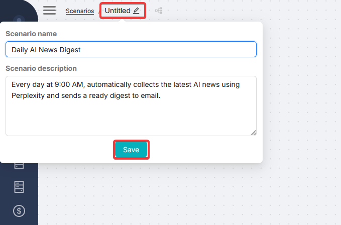
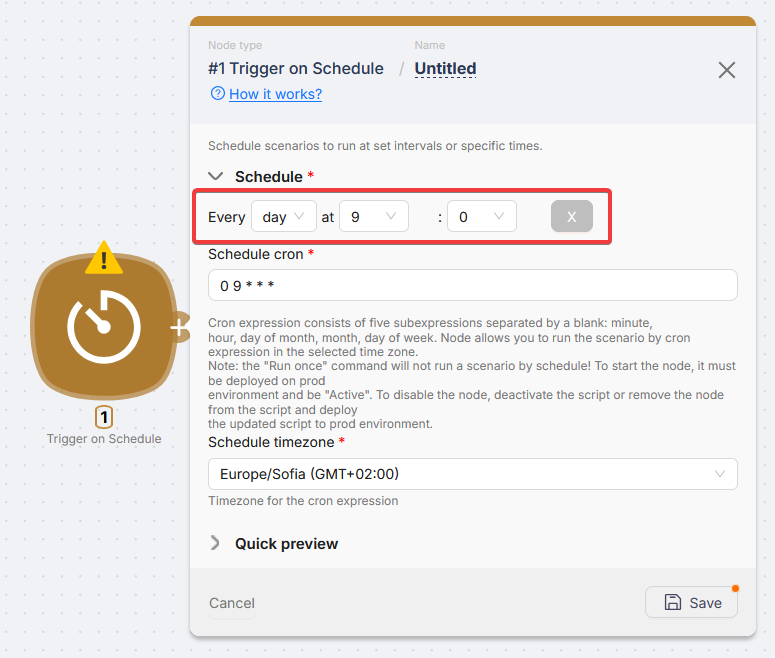
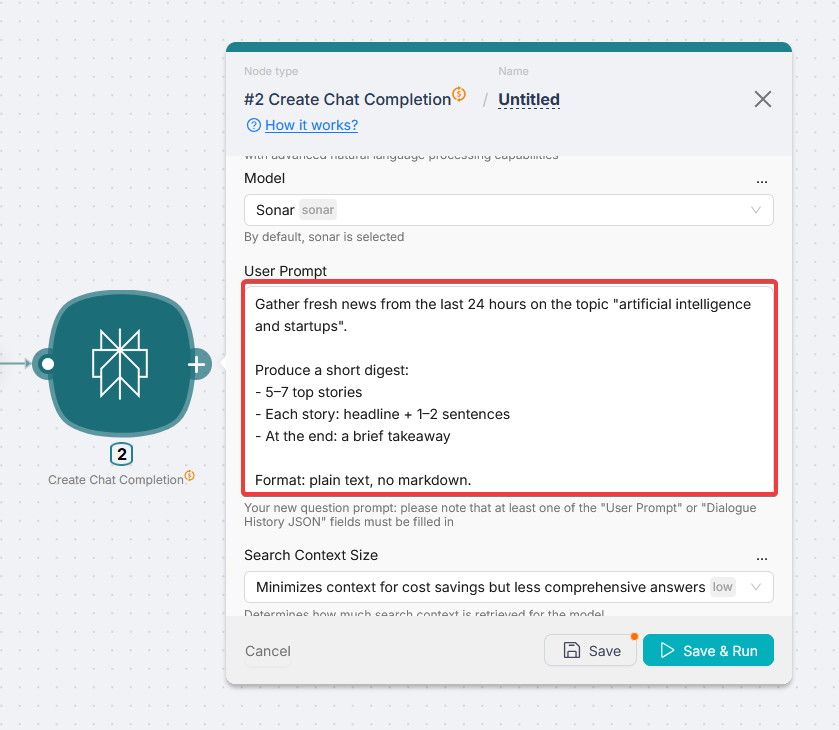
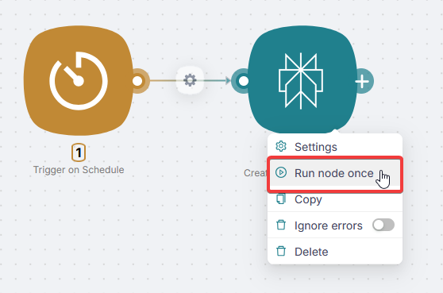
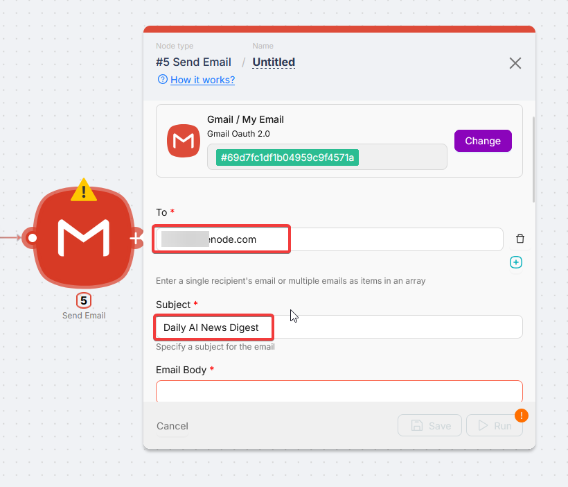
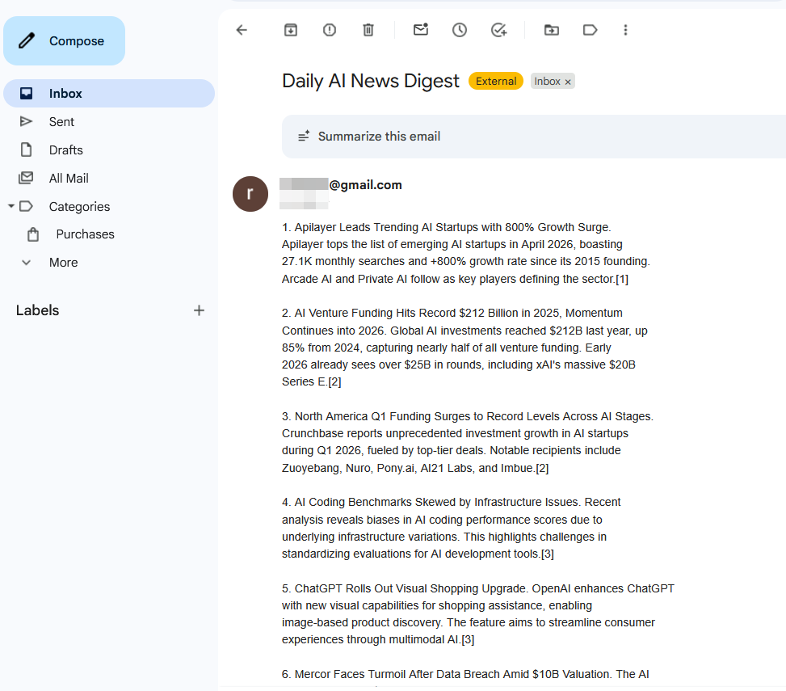
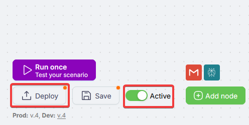

# Your first scenario in 15 minutes



Here is a practical automation: every morning you get an email digest of fresh news on a topic you care about.

**What you will have:**

- AI gathers the latest news for your topic (for example, "AI and startups")
- It turns them into a short digest with the main events
- It emails you every day at 9:00

**Time:** 15 minutes  
**Level:** Beginner  
**You need:** A Latenode account and a Gmail inbox

---

## How it works

Every day at 9:00, a **schedule trigger** starts the scenario. **Perplexity AI** runs your prompt, finds fresh news, and returns a digest. **Gmail** sends that text to your email.



---

## Step 1: Create a scenario

1. Open Latenode and click **Create scenario** (or **New Scenario**).

2. Give the scenario a clear name and optional description, for example **"AI news digest"**.

3. Click **Save** (disk icon or **Save** button).



<Callout type="info">
Use clear scenario names so you can find them later when you have many automations.
</Callout>

---

## Step 2: Add a trigger (schedule)

The trigger is what starts the scenario. Here we use a **schedule**.

### Add the Trigger on Schedule node

1. Click **Add node** (**Add Node** in the center of the canvas).

2. Search for **Schedule**.

3. Choose **Trigger on Schedule** under **Triggers**.

<video autoPlay muted loop playsInline width="100%">
  <source src="/assets/videos/first-scenario-schedule-add-node.mp4" type="video/mp4" />
</video>

### Configure the schedule

4. Click the **Trigger on Schedule** node on the canvas to open its settings.

5. Set when the scenario should run:
   - In the **top row** of the panel, pick period and time from the dropdowns, for example every day at 9:00
   - **Or** set a schedule with a **cron** expression in **Schedule cron** (format is hinted under the field in the UI)
   - In **Schedule timezone**, choose your time zone



6. Click **Save** at the bottom of the panel.

---

## Step 3: Add Perplexity AI

Next we add AI that collects the news.

### Add the node

1. Click the **right connector** on **Trigger on Schedule**. You do not need to drag the line anywhere: the node picker opens right away.

2. Open the **Plug and Play** folder (nodes that do not require your API keys).

3. Select **Perplexity AI**.

<video autoPlay muted loop playsInline width="100%">
  <source src="/assets/videos/first-scenario-perplexity-add-node.mp4" type="video/mp4" />
</video>

### Configure Perplexity AI

4. Click the **Perplexity AI** node to open settings.

5. Fill in the fields:

   **Model:** leave the default as is.

   **Prompt:** paste this text:

```text
Collect fresh news from the last 24 hours on the topic "artificial intelligence and startups".

Build a short digest:
- 5 to 7 main stories
- Each story: headline plus 1 to 2 sentences
- End with a brief takeaway

Format: plain text, no markdown.
```



6. Click **Save**.

<Callout type="info">
Change the topic in the prompt to whatever you want: crypto, marketing, real estate, sports, and so on.
</Callout>

### Test Perplexity AI

Now **run and test** this node on its own.

7. **Right-click** **Perplexity AI** and choose **Run Node Once**.  
   Or, with the node settings panel open, click **Save and run**.



8. Wait for the run to finish (**about 5 to 10 seconds** for this prompt; longer if the request is heavy). After a successful run, a **green status dot** appears on the node.

9. After some runs, nodes may show a preview of the most useful output fields. You can configure these previews for any node later.

<video autoPlay muted loop playsInline width="100%">
  <source src="/assets/videos/first-scenario-perplexity-run-preview.mp4" type="video/mp4" />
</video>

10. To see **full run data**, click the **green dot** (success). The panel shows **input**, **output**, and **logs**. For the digest text, follow the path **`message` → `content` → `message`**.

<video autoPlay muted loop playsInline width="100%">
  <source src="/assets/videos/first-scenario-perplexity-output-green-dot.mp4" type="video/mp4" />
</video>

11. If the text is not what you want, edit the prompt and run **Run Node Once** again until you are happy.

Next we send **this digest** to your **inbox**.

---

## Step 4: Add Gmail

We need an **email node** that sends the digest.

### Add the node on the canvas

1. Click the **plus** next to **Perplexity AI**.

2. Choose **Gmail** from the list.

<video autoPlay muted loop playsInline width="100%">
  <source src="/assets/videos/first-scenario-add-gmail-from-perplexity.mp4" type="video/mp4" />
</video>

### Create authorization (Gmail)

3. Open the **Gmail** node you added.

4. Click **Create Authorization**.

5. Choose **OAuth** (Google).

6. Name the connection so you can tell it apart from others.

7. In the browser window, grant **all requested permissions**.

<video autoPlay muted loop playsInline width="100%">
  <source src="/assets/videos/first-scenario-gmail-oauth-connection.mp4" type="video/mp4" />
</video>

After authorization completes, **all Gmail fields** appear in the node panel.

### Email fields

8. In **To**, enter **your email** so the digest lands in **your** inbox.

9. In **Subject**, set the subject line. In this example: **`Daily AI News Digest`**.



### Body from Perplexity output

In **Body**, insert the **variable** that holds the digest from **Perplexity AI**.

<Callout type="info">
Clicking **any field** in the node settings opens a panel with a **Data** tab: data from **all upstream nodes** connected to this node on the canvas.
</Callout>

<video autoPlay muted loop playsInline width="100%">
  <source src="/assets/videos/first-scenario-gmail-body-data-tab.mp4" type="video/mp4" />
</video>

10. Click **Body** to open the data picker.

11. On **Data**, you see **previous nodes** in the chain: here **Trigger on Schedule** and **Perplexity AI**.

12. Click a node to **expand** it and see its output fields.

13. Pick the **value** you need; it is **inserted** into **Body**. For the digest text, use output from **Perplexity AI**.

14. Click **Save** on **Gmail**.

---

## Step 5: Test the full chain

If you **Run Node Once** on **Gmail** alone, it still **sends** mail the same way we tested **Perplexity AI** in step 3.

Now test the **whole path**: one **Run once** for the scenario runs **every node** in order.

1. Click **Run once** for the **scenario** (full chain).

<video autoPlay muted loop playsInline width="100%">
  <source src="/assets/videos/first-scenario-full-chain-run-once.mp4" type="video/mp4" />
</video>

2. Wait until all nodes finish **without errors** and show **green** status.

3. Check your inbox: you should see the digest (in this example, subject **Daily AI News Digest**).



<Callout type="warning">
**If something fails:** on the failing node, look for a **red** status dot and open the node. The **error text** usually states the cause.

Typical issues here: a **required Gmail field** left empty (**Subject** or **To**), **incomplete OAuth scopes**, or an empty **Prompt** on **Perplexity**.
</Callout>

---

## Step 6: Publish the scenario

The scenario already works end to end with **Run once**. To let it run **on its own** on the schedule, use the **footer** of the editor:

1. Turn the scenario **Active** (**Active** toggle).

2. Click **Deploy**: the scenario moves to **Production** and will run on **Trigger on Schedule**.



From now on, you get the digest email every day at the time you set.

<Callout type="success">
**Done.** The scenario runs in the background. You can close Latenode: the digest still arrives on schedule.
</Callout>

---

## What you learned

You can now:

- Create scenarios
- Add schedule triggers (**Trigger on Schedule**)
- Add actions (Perplexity, Gmail)
- Connect nodes
- Pass data between nodes
- Test runs
- Publish and activate
