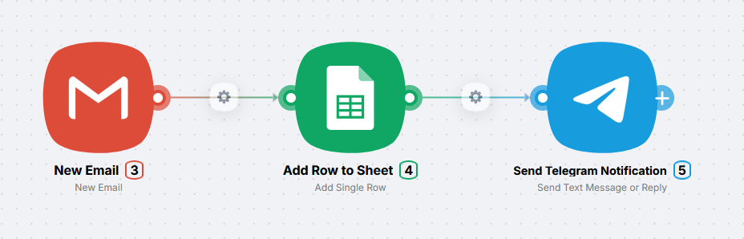
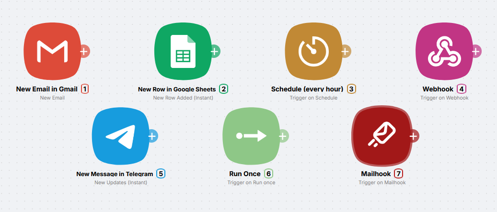
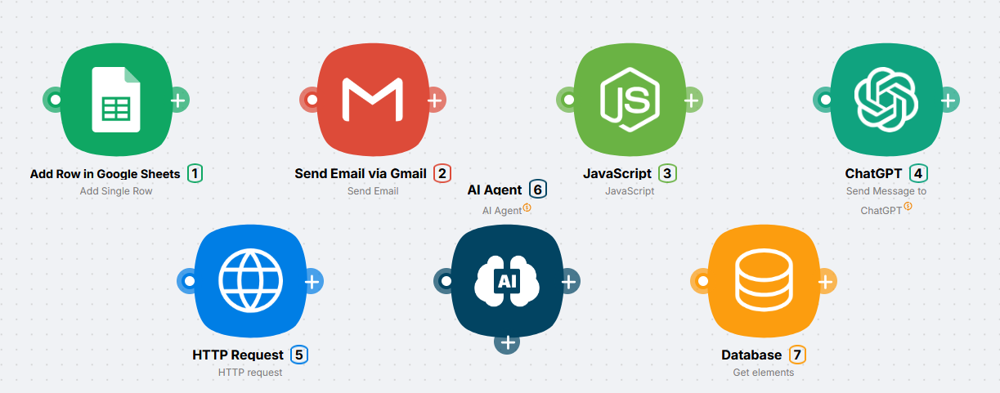
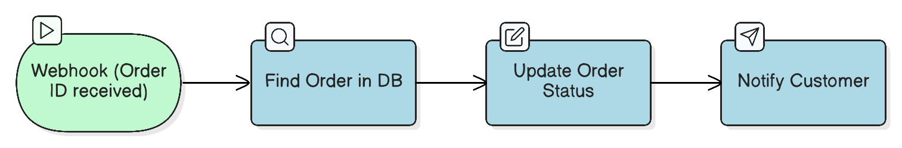

# How Latenode works

Latenode is a visual automation builder. You assemble scenarios from nodes like Lego blocks. No code: everything is on the canvas.

<video autoPlay muted loop playsInline width="100%">
  <source src="/assets/videos/intro-canvas.mp4" type="video/mp4" />
</video>

---

## Key concepts

### Scenario

A **scenario** is a chain of steps that runs automatically. It is made of **nodes**, and each node does one step.

For example:

- New email → append a row to a sheet → notify Telegram
- Every day at 9:00 → gather news → send an email digest
- New form submission → AI check → create a CRM task

### Node

A **node** is one block on the canvas. You build the scenario from nodes.

Each node:

- Receives data from the previous node
- Performs its job
- Passes the result onward

Nodes fall into two types: **triggers** and **actions**.

### Trigger

A **trigger** is the first node in a scenario. It answers **when** the scenario should run.

**Examples of triggers:**

- New Gmail message
- Mailhook
- New row in Google Sheets
- Schedule (every day, every hour)
- Webhook (incoming HTTP requests)
- New Telegram message

<Callout type="info">
**Every scenario starts with a trigger.** Without a trigger, the scenario will not run on its own.
</Callout>

### Action

An **action** is any node after the trigger. It answers **what to do**.

**Examples of actions:**

- Send a Telegram message
- Add a row to Google Sheets
- Send an email
- Call an AI model
- Run an AI Agent
- Run JavaScript
- Query the built-in database
- Send an HTTP request

---

## How runs flow

<video autoPlay muted loop playsInline width="100%">
  <source src="/assets/videos/how-it-works-data-flow.mp4" type="video/mp4" />
</video>

Think of a conveyor: the trigger fires first, then nodes run in order along the chain.

**Step by step:**

1. **The trigger waits for an event** (new email, scheduled time, incoming request)
2. **When the event happens, the trigger passes data forward**
3. **Each following node:**
   - Receives data
   - Does its work
   - Passes the result to the next node
4. **The run finishes when every node in the path has completed**

---

## Why Latenode

**No code**  
Visual builder: no traditional programming required.

**Plug-and-play nodes**  
Many nodes (AI, utilities) work out of the box without your API keys.

**Integrations**  
Hundreds of ready-made connections to popular apps.

**AI inside**  
Built-in models and agents, from simple calls to multi-agent setups.

**Low-code when you need it**  
JavaScript and Python nodes for heavier logic.

---

## What's next?

Continue with Quickstarts:

- [Your first scenario in 15 minutes](/get-started/quickstarts/first-scenario): step-by-step example (news digest to email)
- [Passing data between nodes](/visual-builder/data-flow/passing-data): how output from one node becomes input for the next
- [Building scenarios](/visual-builder/scenarios/building-scenarios): linear flows, branches, and patterns
