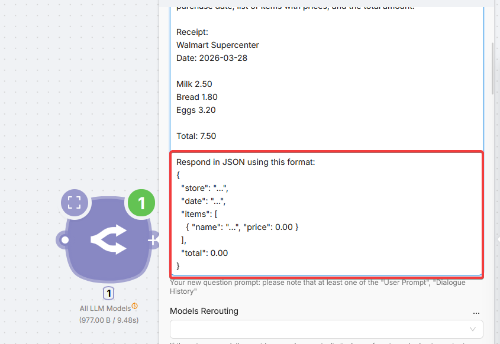
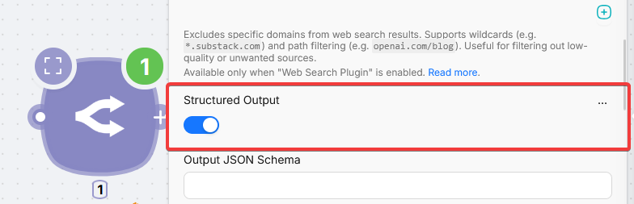
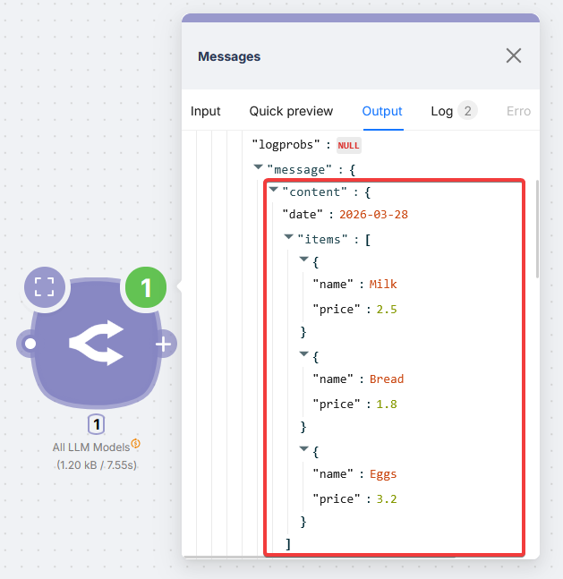

# AI GPT Router (OpenRouter)


The **AI GPT Router** node reaches models from OpenAI, Anthropic, Google, Grok, Qwen, DeepSeek, Perplexity, and more through **OpenRouter**, in a single node.

This is a **PnP (Plug and Play)** node: no API key or connection. You pay in **PnP tokens** from real token usage (1 PnP token = $1). Prices for specific models are listed in the **Model ID** dropdown next to each option.

## Getting structured output

For normal use, enter a prompt and run the node; the reply is plain text.

To feed the next nodes with structured data (extract fields, classify, parse forms), turn on **Structured Output** and tell the model in the prompt to answer in JSON.

### Simple: toggle plus prompt

Enable **Structured Output** and add JSON instructions to the prompt.





Example (receipt):

```
You are given a receipt text. Extract the store name, purchase date, list of items with prices, and the total amount.

Receipt:
{receipt_text}

Respond in JSON using this format:
{
  "store": "...",
  "date": "...",
  "items": [
    { "name": "...", "price": 0.00 }
  ],
  "total": 0.00
}
```



### Advanced: Output JSON Schema

For fixed field names and types, fill **Output JSON Schema**. The model follows it strictly.

<Callout type="info" title="Schema format differs by node">
  For **OpenRouter** and **ChatGPT**, the schema uses a `name` wrapper. For **Anthropic Claude**, the schema starts with `"type": "object"` with no wrapper. Copying a schema between nodes without adjusting the format can error.
</Callout>

## Fields

<Accordions type="multiple">
<Accordion title="Model selection">

| Field | Description |
| --- | --- |
| Provider | Filter **Model ID** by provider (OpenAI, Anthropic, Google, etc.). Optional |
| Input Modality | Filter by input type (text, image, …). Default: all |
| Payment Options | Filter by payment type |
| Model ID | Model to use. Each row shows name, short description, and price (per 1M tokens). Set this **or** enable **Auto Router** |
| Models Rerouting | Optional fallbacks if the primary model is unavailable, rate-limited, or blocked |
| Auto Router | Routes the prompt to a suitable model. When on, **Model ID** and **Models Rerouting** are ignored |
| Auto Router Allowed Models | Optional allowlist when Auto Router is on (patterns like `anthropic/*`). If empty, a default list is used |

Either **Model ID** or **Auto Router** must be set, not both.

</Accordion>
<Accordion title="Basic">

| Field | Description |
| --- | --- |
| User Prompt | Message to the model. At least one of **User Prompt**, **Dialogue History JSON**, or **File Content** |
| File Content | Optional. URL (`https://…`) or content from a previous node (e.g. `1.body.files.[0].content`) |
| Dialogue History JSON | Optional. Array of `{ role, content }`. Roles: `system`, `developer`, `user`, `assistant`, `tool` |

</Accordion>
<Accordion title="Web Search">

**Native search** (**Web Search Option**) - the model searches when it chooses. Supported on some OpenAI, Anthropic, Perplexity, and xAI models.

**Plugin search** (**Web Search Plugin**) - search runs explicitly and results go into context. Works with any model; can cost more.

| Field | Description |
| --- | --- |
| Web Search Option | Native search for supported models |
| Search Context Size | How much web text to pull in (native). More context = higher cost |
| Web Search Plugin | Explicit search plugin |
| Search Max Results | Max results in context (plugin only) |
| Search Prompt | How to use and cite results (plugin only) |
| Search Engine | `native`, `exa`, `parallel`, or `firecrawl` (plugin only) |
| Search Include Domains | Limit to domains (wildcards and paths allowed, plugin only) |
| Search Exclude Domains | Exclude domains (plugin only) |

</Accordion>
<Accordion title="Generation">

| Field | Description |
| --- | --- |
| Temperature | 0 to 2. Higher = more random. Use **Temperature** or **Top P**, not both |
| Top P | Nucleus sampling. Default: 1 |
| Top K | Cap choices to top K tokens; 0 = no limit. Default: 0 |
| Min P | Minimum probability vs top token. Default: 0 |
| Top A | Probability relative to top token. Default: 0 |
| Max Completion Tokens | Max generated tokens, including reasoning |
| Frequency Penalty | -2 to 2. Default: 0 |
| Presence Penalty | -2 to 2. Default: 0 |
| Repetition Penalty | 0 to 2. Default: 1 |
| Stop Sequences | Sequences that stop generation |
| Seed | Same seed + params can repeat output; not guaranteed for all models |
| Context Compression | Compresses long prompts by dropping middle messages |
| Logit Bias | Token ID to bias (-100 to 100) |

</Accordion>
<Accordion title="Output">

| Field | Description |
| --- | --- |
| Structured Output | Force JSON. Often enough with a JSON instruction in the prompt |
| Output JSON Schema | Exact output shape when Structured Output is on |
| Grammar Output | Custom grammar response |
| Grammar | GBNF string (llama.cpp-style). Grammar wins if both Grammar and Structured Output are on |
| Logprobs | Return token log probabilities |
| Top Logprobs | How many top tokens per position (needs Logprobs) |

</Accordion>
<Accordion title="Tools">

| Field | Description |
| --- | --- |
| Tools JSON | Tool definitions, e.g. `[{"type":"function","function":{…}}]` |
| Tools Choice | `none`, `auto`, `required`, or a specific function. Default: `none` without tools, `auto` with tools |

</Accordion>
<Accordion title="Reasoning">

| Field | Description |
| --- | --- |
| Reasoning Effort | OpenAI-style effort for reasoning models |
| Reasoning Summary | Include a reasoning summary in the response |
| Reasoning Max Tokens | Non-OpenAI reasoning budget. Do not use with **Reasoning Effort** at the same time |
| Reasoning Exclude | Exclude reasoning tokens from the visible output |

</Accordion>
<Accordion title="Other">

| Field | Description |
| --- | --- |
| Include Cache Control | Prompt caching (not all models) |
| Cache Control TTL | Cache lifetime. Default: 1 hour |
| Session ID | Groups requests for observability (max 128 characters) |

</Accordion>
</Accordions>
