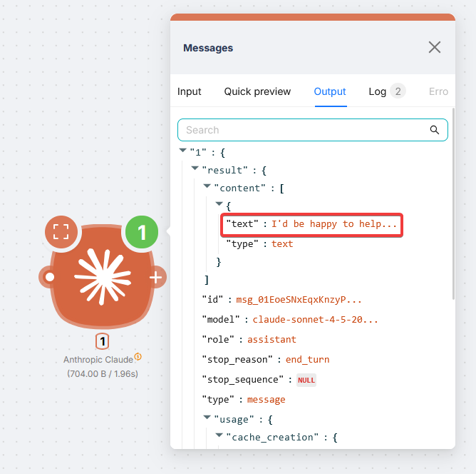
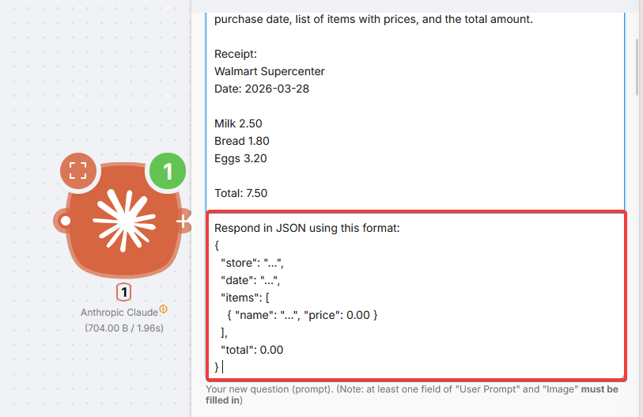
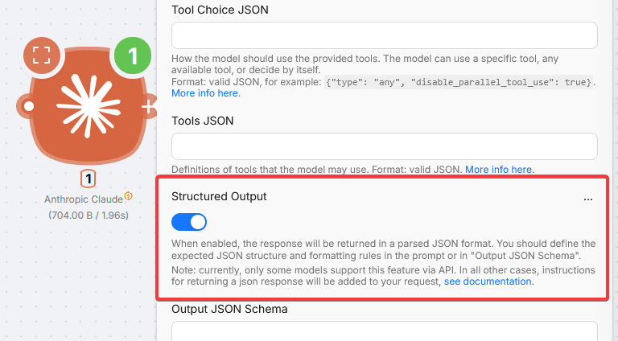
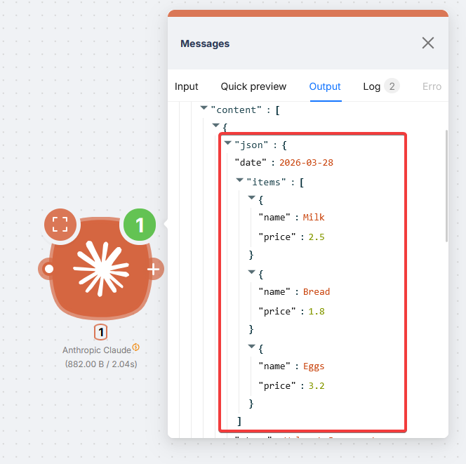
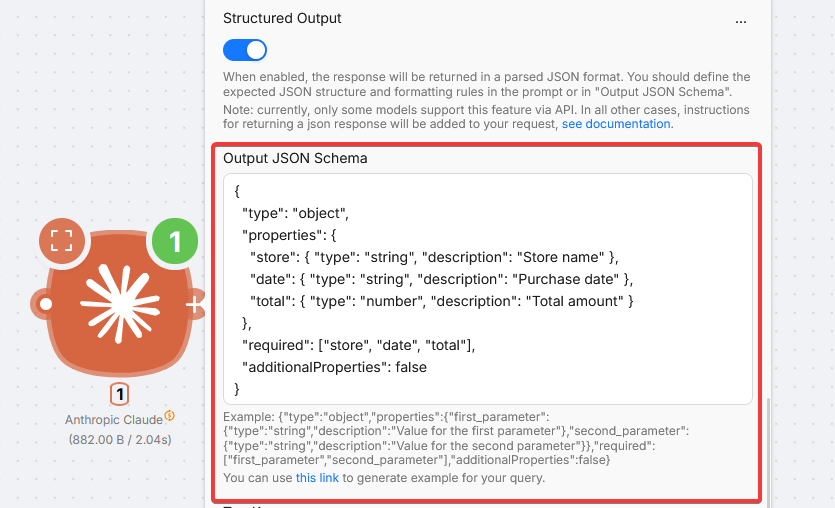

# Anthropic Claude


The **Anthropic Claude** node runs Sonnet, Opus, and Haiku in your scenarios without an API key.

This is a **PnP (Plug and Play)** node. Cost uses **PnP tokens** from actual usage (1 PnP token = $1). Prices for specific models are listed at the top of the node settings panel.

## Getting structured output

Enter a prompt and run; the reply is plain text by default.



For JSON the next nodes can parse, enable **Structured Output** and ask for JSON in the prompt.

### Simple: toggle plus prompt





Example (receipt):

```
You are given a receipt text. Extract the store name, purchase date, list of items with prices, and the total amount.

Receipt:
{receipt_text}

Respond in JSON using this format:
{
  "store": "...",
  "date": "...",
  "items": [
    { "name": "...", "price": 0.00 }
  ],
  "total": 0.00
}
```



Native structured output via API exists only on some Claude models. If the model does not support it, Latenode adds JSON formatting instructions for you.

### Advanced: Output JSON Schema

For strict fields and types, use **Output JSON Schema**.

<Callout type="info" title="Claude schema shape">
  Claude schemas start with `"type": "object"` **without** the `name` wrapper used in ChatGPT and OpenRouter. Adjust when copying between nodes.
</Callout>



```json
{
  "type": "object",
  "properties": {
    "store": { "type": "string", "description": "Store name" },
    "date": { "type": "string", "description": "Purchase date" },
    "total": { "type": "number", "description": "Total amount" }
  },
  "required": ["store", "date", "total"],
  "additionalProperties": false
}
```

## Fields

<Accordions type="multiple">
<Accordion title="Basic">

| Field | Description |
| --- | --- |
| Model | Claude model. Default: Sonnet 4.5 |
| User Prompt | Message. At least one of **User Prompt** or **Image** |
| Image | Optional. File from a previous node or image URL. **Media Type** required for file content |
| Media Type | MIME type when **Image** is file content |
| System Prompt | Optional role and behavior for the whole turn |
| Dialogue History JSON | Optional. Roles `user` and `assistant` must alternate |

**Dialogue History JSON** example:

```json
[
  { "role": "user", "content": "What is the capital of Australia?" },
  { "role": "assistant", "content": "The capital of Australia is Canberra." }
]
```

</Accordion>
<Accordion title="Generation">

| Field | Description |
| --- | --- |
| Temperature | 0.0 to 1.0. Lower for analysis, higher for creativity. Default: 1.0 |
| Max Tokens | Max tokens to generate. **Budget Tokens** (with Thinking) counts toward this cap |
| Top P | Nucleus sampling. Use **Top P** or **Temperature**, not both |
| Top K | Long-tail filter. Usually **Temperature** is enough |
| Stop Generation | Optional stop sequences |

</Accordion>
<Accordion title="Thinking">

Extended thinking shows reasoning before the final answer.

| Field | Description |
| --- | --- |
| Thinking Type | Turn extended thinking on or off |
| Budget Tokens | Tokens for internal reasoning. Must be at least 1024 and less than **Max Tokens** when thinking is on |

</Accordion>
<Accordion title="Tools and Web">

| Field | Description |
| --- | --- |
| Activate Web Search Tool | Claude web search (advanced: use **Tools JSON**) |
| Activate Code Execution Tool | Built-in code execution (advanced: **Tools JSON**) |
| Tools JSON | Full tool definitions |
| Tool Choice JSON | Example: `{"type": "any", "disable_parallel_tool_use": true}` |

</Accordion>
<Accordion title="Output">

| Field | Description |
| --- | --- |
| Structured Output | Force JSON; usually pair with a JSON prompt |
| Output JSON Schema | Exact shape when Structured Output is on |

</Accordion>
</Accordions>
