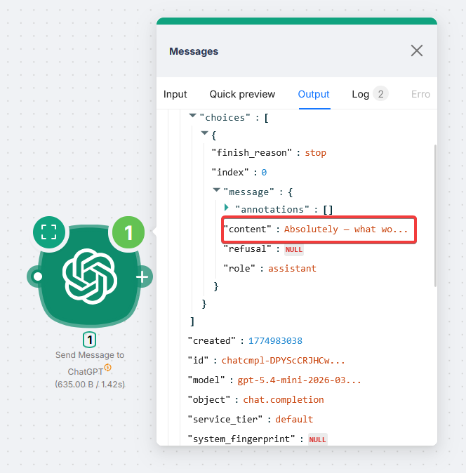
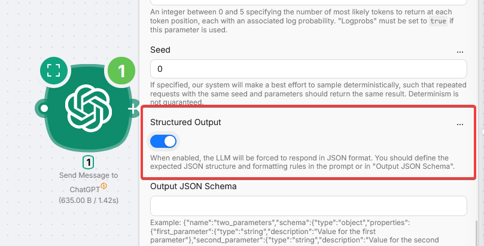
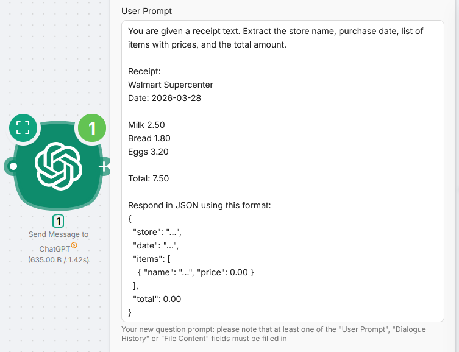
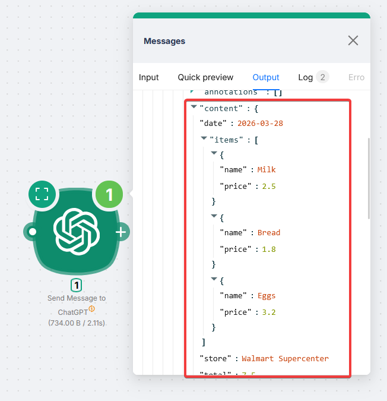
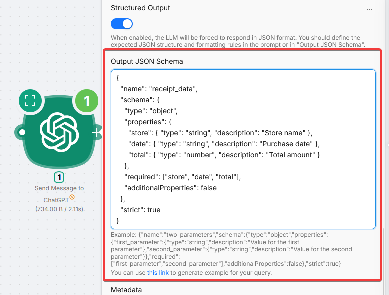

# ChatGPT


The **Send Message to ChatGPT** node calls OpenAI models for text, images, and files inside your scenario without your own API key.

This is a **PnP (Plug and Play)** node. Cost is **PnP tokens** on top of execution credits (1 PnP token = $1). Prices for specific models are listed at the top of the node settings panel.

<Callout type="info" title="Your own OpenAI key">
  To use your API key, add the **Custom LLM Connection** node and a connection with your provider **Base URL**.
</Callout>

## Getting structured output

Default replies are plain text.



For JSON downstream nodes can use, enable **Structured Output** and describe the JSON shape in the prompt.



Example (receipt):



```
You are given a receipt text. Extract the store name, purchase date, list of items with prices, and the total amount.

Receipt:
{receipt_text}

Respond in JSON using this format:
{
  "store": "...",
  "date": "...",
  "items": [
    { "name": "...", "price": 0.00 }
  ],
  "total": 0.00
}
```



### Advanced: Output JSON Schema

<Callout type="info" title="Schema format">
  **ChatGPT** and **OpenRouter** use a `name` wrapper around the schema. **Claude** does not. Copying between nodes without reformatting can fail.
</Callout>



```json
{
  "name": "receipt_data",
  "schema": {
    "type": "object",
    "properties": {
      "store": { "type": "string", "description": "Store name" },
      "date": { "type": "string", "description": "Purchase date" },
      "total": { "type": "number", "description": "Total amount" }
    },
    "required": ["store", "date", "total"],
    "additionalProperties": false
  },
  "strict": true
}
```

## Fields

<Accordions type="multiple">
<Accordion title="Basic">

| Field | Description |
| --- | --- |
| Model | OpenAI model from the dropdown |
| User Prompt | Message (variables allowed). At least one of **User Prompt**, **Dialogue History JSON**, or **File Content** |
| File Name | With extension when **File Content** is set and not a bare image URL |
| File Content | URL or prior node content (e.g. `1.body.files.[0].content`). Types depend on the model |
| Dialogue History JSON | Prior turns. Roles alternate: `system`, `user`, `assistant`, `tool` |

```json
[
  { "role": "user", "content": "Hello!" },
  { "role": "assistant", "content": "Hi there! How can I help you today?" }
]
```

</Accordion>
<Accordion title="Generation">

| Field | Description |
| --- | --- |
| Temperature | 0 to 2. Use **Temperature** or **Top P**, not both. Default: 1.0 |
| Top P | 0 to 1. Default: 1 |
| Max Tokens | Upper bound on generated tokens, including reasoning |
| Chat Completion Choices | Number of completions per input |
| Stop | Up to 4 stop sequences |
| Presence Penalty | -2 to 2 |
| Frequency Penalty | -2 to 2 |
| Reasoning Effort | For o1 / o3 / o4 |
| Verbosity | For GPT-5 family |
| Seed | Best-effort deterministic sampling |

<Callout type="info" title="Reasoning and search models">
  **Top P**, **Presence Penalty**, **Frequency Penalty**, **Temperature**, and token probability are not sent for reasoning models (o1, o3, o4) or search models (`gpt-4o-search`, `gpt-4o-mini-search`), even if set.
</Callout>

</Accordion>
<Accordion title="Output">

| Field | Description |
| --- | --- |
| Structured Output | JSON responses; pair with prompt instructions |
| Output JSON Schema | Strict schema when Structured Output is on |
| Log Probs | Token log probabilities |
| Top Log Probs | 0 to 5; needs Log Probs |

</Accordion>
<Accordion title="Tools">

| Field | Description |
| --- | --- |
| Tools JSON | Function definitions (functions only today) |
| Tool Choice JSON | `none`, `auto`, `required`, or a specific function |
| Parallel Tool Calls | Allow multiple tools in one response |

**Tools JSON** example:

```json
{
  "type": "function",
  "function": {
    "name": "get_rain_probability",
    "description": "Get the probability of rain for a specific location",
    "parameters": {
      "type": "object",
      "properties": {
        "location": {
          "type": "string",
          "description": "The city and state, e.g., San Francisco, CA"
        }
      },
      "required": ["location"]
    }
  }
}
```

**Tool Choice JSON** (force one tool):

```json
{ "type": "function", "function": { "name": "get_rain_probability" } }
```

</Accordion>
<Accordion title="Other">

| Field | Description |
| --- | --- |
| Store | Store output for OpenAI distillation or evals |
| Prediction | `{"type": "content", "content": "some prediction"}` to speed up near-known outputs |
| Metadata | Up to 16 key-value pairs (keys up to 64 chars, values up to 512) |

</Accordion>
</Accordions>
