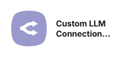
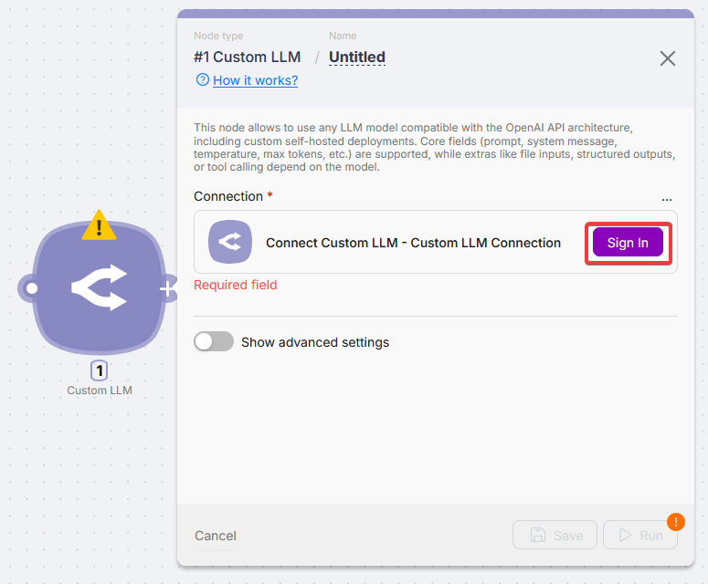
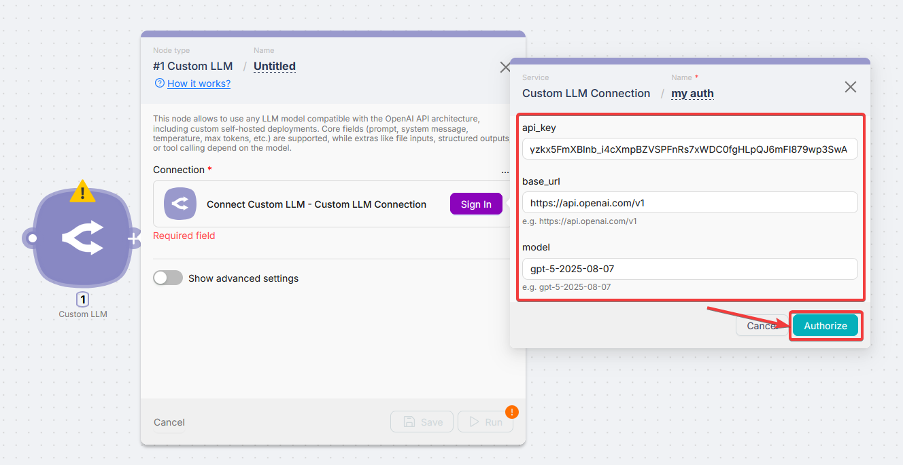
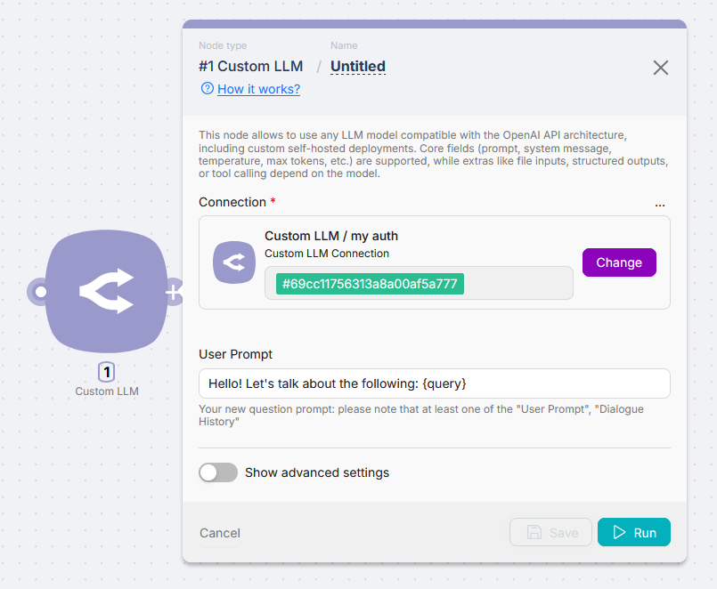
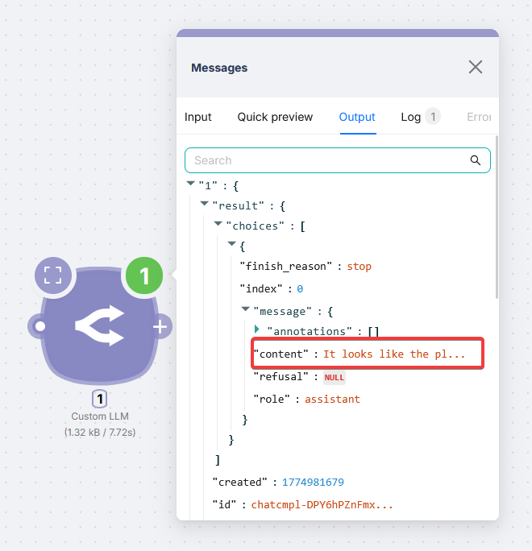
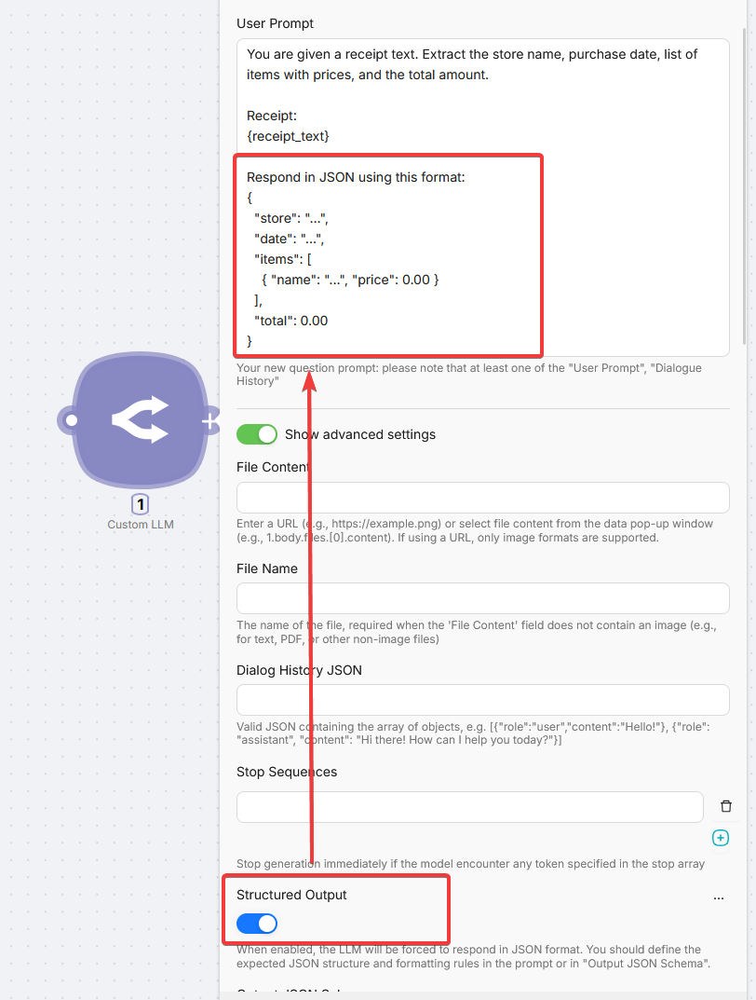
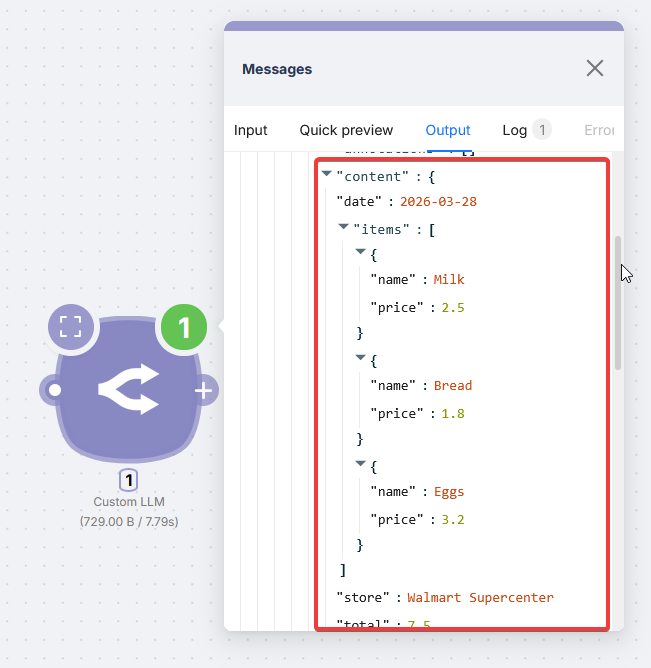
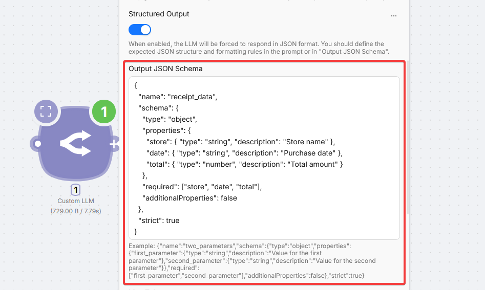

# Custom LLM Connection



The **Custom LLM** node talks to any **OpenAI-compatible** API: Groq, Perplexity, Ollama, Azure OpenAI, or your own server. Use it when you want your own API key instead of Latenode PnP pricing.

<Callout type="info" title="OpenAI without your key">
  For hosted OpenAI on Latenode PnP billing without your own key, use the **Send Message to ChatGPT** node from the catalog.
</Callout>

## Connection setup

Before running the node, create a **Custom LLM** connection with provider credentials.





| Field | Description |
| --- | --- |
| API Key | Key from the provider |
| Base URL | OpenAI-compatible base URL |
| Model | Provider model id (e.g. `llama-3.3-70b-versatile`) |

**Base URL examples**

| Provider | Base URL |
| --- | --- |
| OpenAI | `https://api.openai.com/v1` |
| Groq | `https://api.groq.com/openai/v1` |
| Perplexity | `https://api.perplexity.ai/chat/completions` |
| Azure OpenAI | `https://[YOUR-RESOURCE].openai.azure.com/openai/deployments/[MODEL-NAME]/chat/completions?api-version=2024-02-15` |



## Getting structured output



Enable **Structured Output** and ask for JSON in the prompt when downstream nodes need structured data.



Example (receipt):

```
You are given a receipt text. Extract the store name, purchase date, list of items with prices, and the total amount.

Receipt:
{receipt_text}

Respond in JSON using this format:
{
  "store": "...",
  "date": "...",
  "items": [
    { "name": "...", "price": 0.00 }
  ],
  "total": 0.00
}
```



### Advanced: Output JSON Schema

Support depends on the model; check the provider docs.



```json
{
  "name": "receipt_data",
  "schema": {
    "type": "object",
    "properties": {
      "store": { "type": "string", "description": "Store name" },
      "date": { "type": "string", "description": "Purchase date" },
      "total": { "type": "number", "description": "Total amount" }
    },
    "required": ["store", "date", "total"],
    "additionalProperties": false
  },
  "strict": true
}
```

## Fields

<Accordions type="multiple">
<Accordion title="Basic">

| Field | Description |
| --- | --- |
| Connection | Custom LLM connection to use |
| User Prompt | Message (variables allowed). At least one of **User Prompt** or **Dialogue History JSON** |
| File Content | URL (images) or prior node file content |
| File Name | Required when **File Content** is not a simple image URL |
| Dialogue History JSON | `{ role, content }` array |

```json
[
  { "role": "user", "content": "Hello!" },
  { "role": "assistant", "content": "Hi there! How can I help you today?" }
]
```

</Accordion>
<Accordion title="Generation">

| Field | Description |
| --- | --- |
| Temperature | Use **Temperature** or **Top P**, not both |
| Top P | Nucleus sampling |
| Max Tokens | Max generated tokens (limit depends on model) |
| Stop Sequences | Stop strings |
| Presence Penalty | Discourage reusing topics |
| Frequency Penalty | Discourage repetition |

</Accordion>
<Accordion title="Output">

| Field | Description |
| --- | --- |
| Structured Output | JSON mode with prompt instructions |
| Output JSON Schema | Strict schema when supported |

</Accordion>
<Accordion title="Tools">

| Field | Description |
| --- | --- |
| Tools JSON | Function definitions |
| Tool Choice JSON | `none`, `auto`, `required`, or specific function |

```json
{
  "type": "function",
  "function": {
    "name": "get_rain_probability",
    "description": "Get the probability of rain for a specific location",
    "parameters": {
      "type": "object",
      "properties": {
        "location": {
          "type": "string",
          "description": "The city and state, e.g., San Francisco, CA"
        }
      },
      "required": ["location"]
    }
  }
}
```

</Accordion>
</Accordions>

Core options (prompt, temperature, max tokens) work on compatible APIs. Files, structured output, and tools depend on the model and provider.
