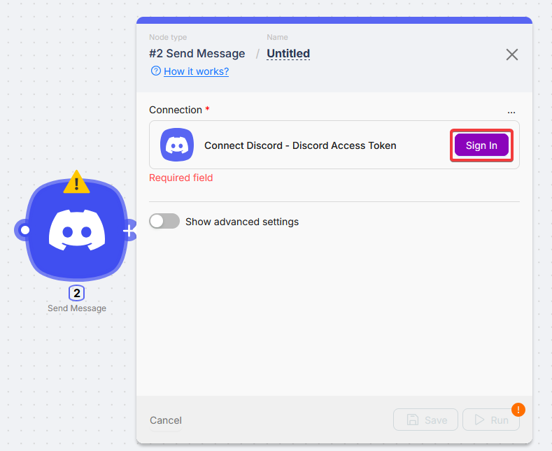
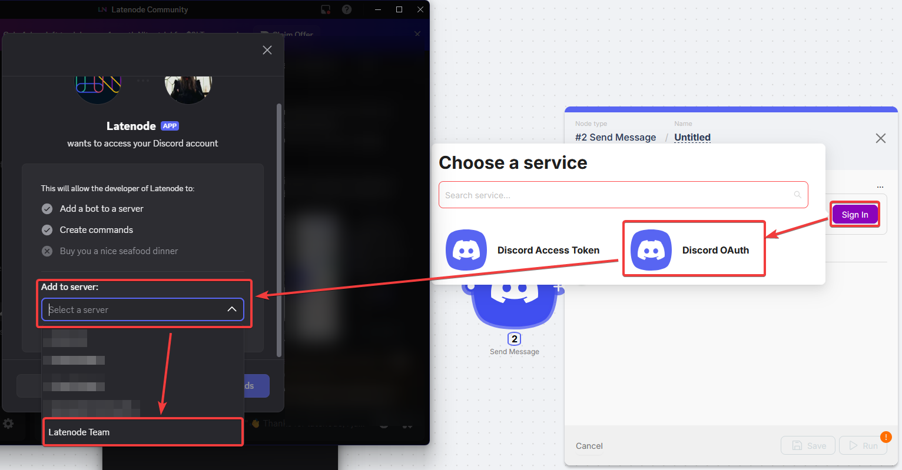
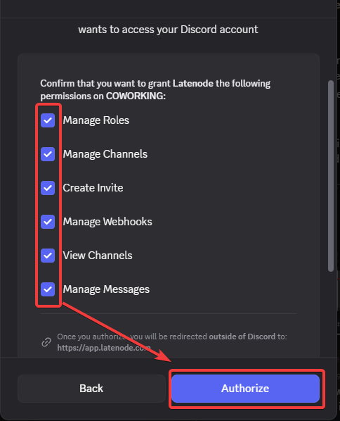
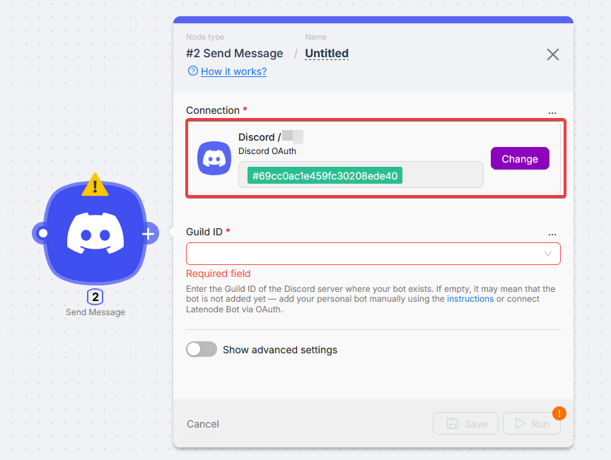
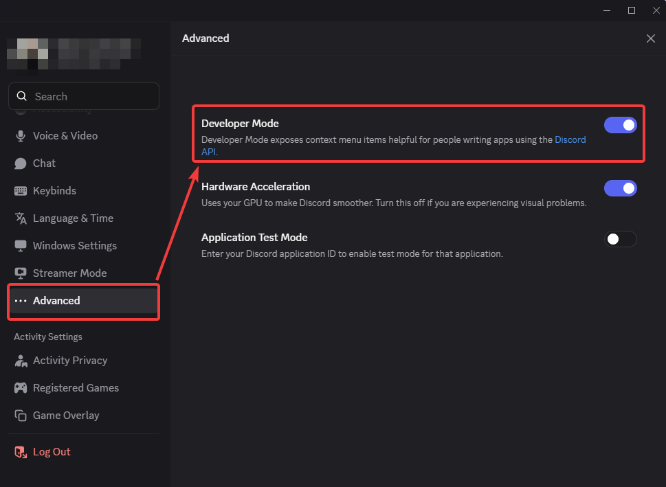
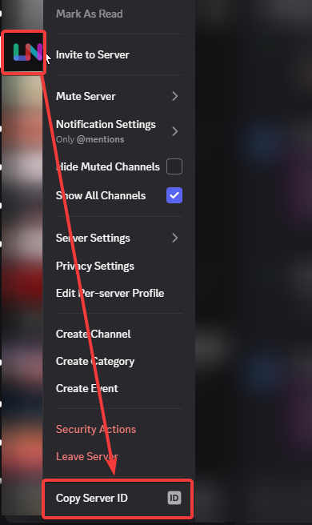
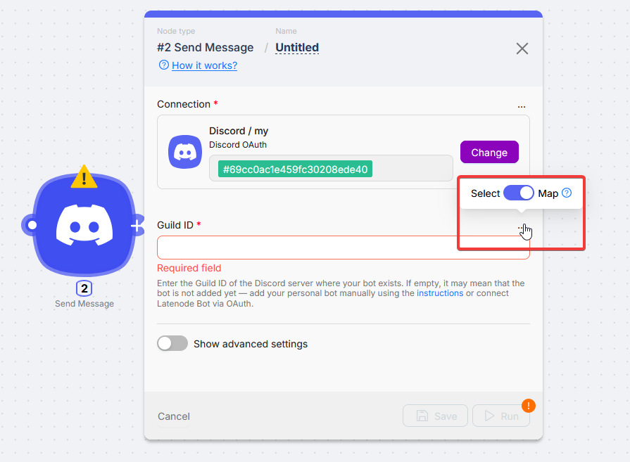
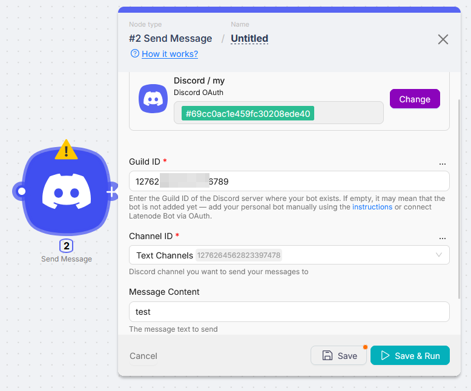

# Discord

Discord nodes let you send messages, manage channels and roles, handle members, and start scenarios from Discord events.

## Connection

Discord supports **OAuth** (Latenode shared bot) and **Access Token (Personal App)** (your bot).

### OAuth

You authorize Latenode's bot and add it to your server. No separate bot hosting on your side.

<Steps>
  <Step>

### Sign in with Discord

Click **Sign in with Discord**, choose the server, and confirm permissions.

  </Step>
  <Step>

### Save the connection

Name the connection and save.

  </Step>
</Steps>

#### Server ID for channel lists

After OAuth, set **Server ID** so Latenode can load channels.

<Steps>
  <Step>

### Turn on Developer Mode

In Discord: **Settings → Advanced → Developer Mode**.

  </Step>
  <Step>

### Copy Server ID

Right-click the server in the sidebar → **Copy Server ID**.

  </Step>
  <Step>

### Paste into the node

Switch **Guild ID** from **Select** to **Map**, paste the ID, then set the channel field (paste **Channel ID** if needed).

  </Step>
</Steps>

### Access Token (Personal App)

Your bot from the [Discord Developer Portal](https://discord.com/developers/applications).

<Steps>
  <Step>

### Open your application

In the portal, open the app that owns the bot.

  </Step>
  <Step>

### Copy the bot token

**Bot** → copy **Token**.

  </Step>
  <Step>

### Paste into Latenode

Paste into **Bot Token**, name the connection, and save.

  </Step>
</Steps>

Add the bot to the target server with the right permissions before using it in a scenario.

## Actions

<Accordions type="multiple">
<Accordion title="Roles: Add Role">

Adds a role to a user on the server.

| Field | Description |
| --- | --- |
| Guild ID | Server where the bot is present |
| User ID | User to update |
| Available Role | Role to add |

</Accordion>
<Accordion title="Roles: Remove User Role">

| Field | Description |
| --- | --- |
| Guild ID | Server |
| User ID | User |
| User Role | Role to remove |

</Accordion>
<Accordion title="Channels: Find Channel">

Returns one channel or all channels.

| Field | Description |
| --- | --- |
| Guild ID | Server |
| Channel ID | Optional. If empty, all channels |
| Channel Name | Optional filter by name |

</Accordion>
<Accordion title="Channels: Rename Channel">

| Field | Description |
| --- | --- |
| Guild ID | Server |
| Channel ID | Channel to rename |
| New Channel Name | New name |

</Accordion>
<Accordion title="Members: Find User">

Returns one member or all members.

| Field | Description |
| --- | --- |
| Guild ID | Server |
| User ID | Optional |
| Username | Optional search |

</Accordion>
<Accordion title="Stickers: List Stickers">

| Field | Description |
| --- | --- |
| Guild ID | Server |

</Accordion>
<Accordion title="Messages: Send Direct Message">

| Field | Description |
| --- | --- |
| Guild ID | Server |
| User ID | Recipient |
| Message Content | Text |

</Accordion>
<Accordion title="Messages: Send Message">

| Field | Description |
| --- | --- |
| Guild ID | Server |
| Channel ID | Target channel |
| Message Content | Optional text |

</Accordion>
<Accordion title="Messages: Send Message with Attachment">

| Field | Description |
| --- | --- |
| Guild ID | Server |
| Channel ID | Target channel |
| Message Content | Optional text |
| Attachment Name | e.g. `1.body.files.[0].filename` |
| Attachment Path or URL | e.g. `1.body.files.[0].content` or URL |

</Accordion>
<Accordion title="Message components: Buttons JSON">

Builds a JSON block with 1 to 5 buttons for **Send Message**.

| Field | Description |
| --- | --- |
| Buttons Count | 1 to 5 |
| Button N: Style | Primary, Secondary, Link, … |
| Button N: Label | Button text |
| Button N: Custom ID | Required except for Link |
| Button N: URL | Required for Link |
| Button N: Disabled | Optional |

Field count follows **Buttons Count**.

</Accordion>
</Accordions>

## Triggers

<Accordions type="multiple">
<Accordion title="New Member In Guild">

Fires when someone joins the server.

| Field | Description |
| --- | --- |
| Guild ID | Server to watch |

</Accordion>
<Accordion title="New Message In Channel">

| Field | Description |
| --- | --- |
| Guild ID | Server |
| Channel ID | Channel to watch |

</Accordion>
<Accordion title="New Message In Thread">

| Field | Description |
| --- | --- |
| Guild ID | Server |
| Channel ID | Parent channel |
| Thread ID | Thread to watch |

</Accordion>
<Accordion title="Message components: Selectors JSON">

Dropdown component JSON for **Send Message**.

| Field | Description |
| --- | --- |
| Custom ID | Select menu id |
| Placeholder | Optional |
| Minimum Values | Optional |
| Maximum Values | Optional |
| Options Count | 1 to 25 |

</Accordion>
</Accordions>
