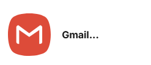
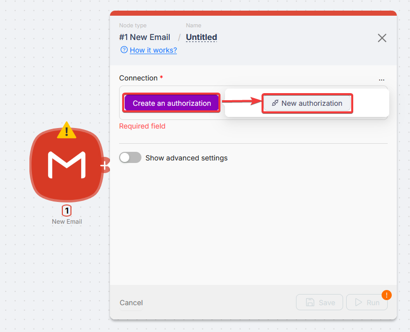
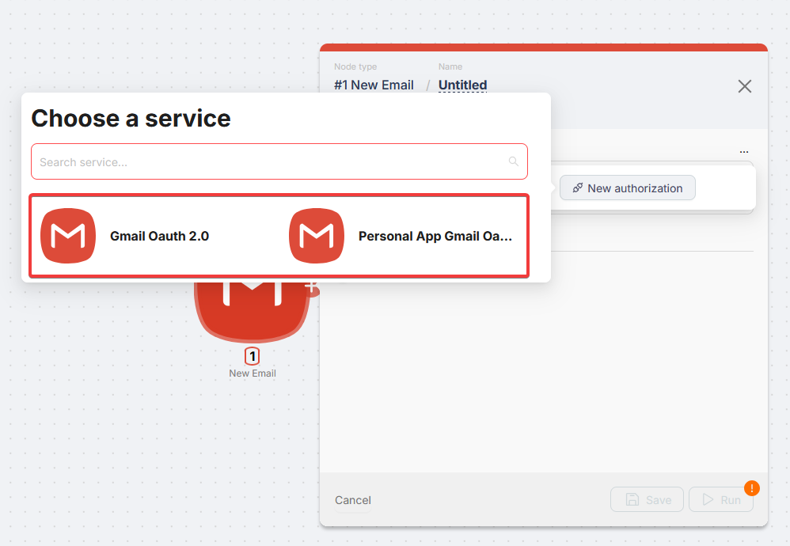
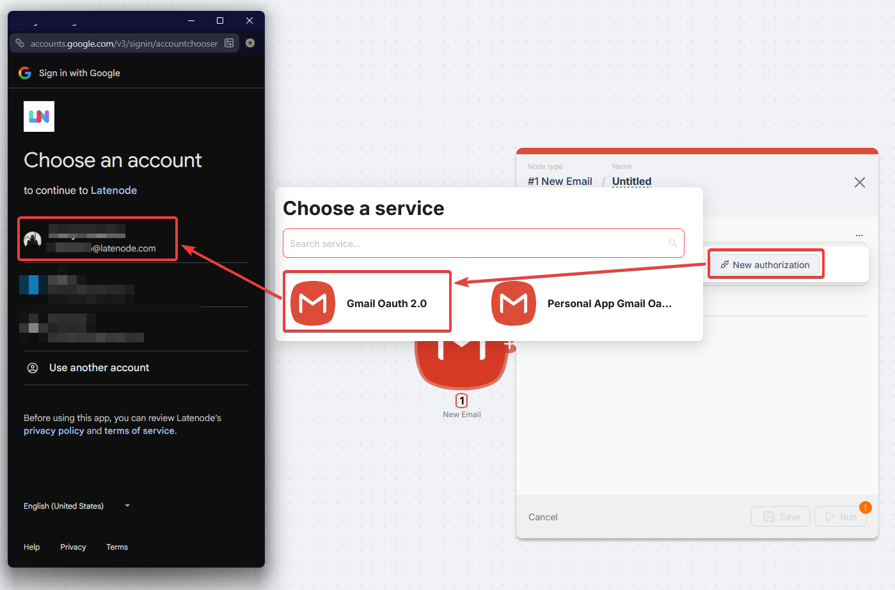

# Gmail

Gmail nodes send and receive email, work with drafts and labels, and start runs when something happens in Gmail or Google Workspace.

## Connection

Every Gmail module needs a Google connection. Create it once and reuse it.

### First-time setup

When **Connection** is empty:

Click **Create an authorization** and pick a type.

### Connection types

- **Gmail OAuth 2.0** - Sign in with Google. Default for most cases.
- **Personal App Gmail** - Your Google Cloud OAuth client (Client ID / Secret). Use for your own quotas or policies.

<Callout type="info" title="Personal App in Google Cloud">
  Step-by-step: [Google Services (Personal Account)](/integrations/authorizations/app-authorization-instructions/google-services).
</Callout>

### Authorization

<Steps>
  <Step>

### Choose Gmail OAuth 2.0

Select **Gmail OAuth 2.0** in the dialog.

  </Step>
  <Step>

### Name and save

Enter a connection name and click **Save**. The Google sign-in window opens.

  </Step>
  <Step>

### Sign in and allow

Pick the account and grant all requested permissions.

  </Step>
  <Step>

### Confirm in the node

When the window closes, the connection appears in **Connection**.

  </Step>
</Steps>

### Reusing a connection

Open **Connection**, click **Use** on an existing one, or **New authorization** to add another.

## Triggers

In the tables below, **Connection** is the Gmail account dropdown. Other fields are usually plain text or multi-select; switch any field to **Map** when the value should come from an earlier node (search text, label names, limits).

<Accordions type="multiple">
<Accordion title="New Email">

Runs when a new message arrives.

| Field | Description |
| --- | --- |
| Connection | Pick your Gmail **Connection** from the dropdown. |
| Search Query | Optional Gmail search (e.g. `from:amy OR from:david`) |
| Labels | Optional. All selected labels must be on the message |
| Maximum Items | Max messages per trigger run |

</Accordion>
<Accordion title="New Attachment">

Like New Email but only when the message has attachments.

| Field | Description |
| --- | --- |
| Connection | Pick your Gmail **Connection** from the dropdown. |
| Search Query | Optional |
| Labels | Optional |
| Maximum Items | Max per run |

</Accordion>
<Accordion title="New Label">

Runs when a new label is created.

| Field | Description |
| --- | --- |
| Connection | Pick your Gmail **Connection** from the dropdown. |

</Accordion>
<Accordion title="New Labeled Email">

Runs when a label is applied to a message.

| Field | Description |
| --- | --- |
| Connection | Pick your Gmail **Connection** from the dropdown. |
| Label | Label to watch |
| Events Limit | Max events per run (up to 500) |

</Accordion>
<Accordion title="New Starred Email">

Runs when a message is **starred** (marked important).

| Field | Description |
| --- | --- |
| Connection | Pick your Gmail **Connection** from the dropdown. |
| Events Limit | Max per run (up to 500) |

</Accordion>
<Accordion title="New Thread">

Runs when a **new email thread** starts. **Label** optionally narrows which threads count.

| Field | Description |
| --- | --- |
| Connection | Pick your Gmail **Connection** from the dropdown. |
| Label | Optional filter by label |
| Events Limit | Max per run (up to 500) |

</Accordion>
</Accordions>

## Actions

Same pattern: choose **Connection**, then fill **To**, subject, body, ids, and attachments by hand or use **Map** for dynamic recipients, **Message ID**, **Label ID**, and attachment URLs from the scenario.

<Accordions type="multiple">
<Accordion title="Send Email">

Sends outbound mail from the scenario: recipients, subject, plain text or HTML body, optional attachments via direct download URLs.

| Field | Description |
| --- | --- |
| Connection | Pick your Gmail **Connection** from the dropdown. |
| To | One address or array |
| Subject | Subject line |
| Email Body | Plain text or HTML |
| Body Type | `Plaintext` or `html` |
| Cc / Bcc | Optional |
| From Name | Display name |
| Message ID To Reply | Optional thread reply id |
| Attachments | Map: filename (with extension) → direct download URL |

</Accordion>
<Accordion title="Create Draft">

Creates a Gmail **draft** without sending. Same fields as send email; **To** is optional.

| Field | Description |
| --- | --- |
| Connection | Pick your Gmail **Connection** from the dropdown. |
| Subject | Subject |
| Email Body | Body |
| Body Type | `Plaintext` or `html` |
| To / Cc / Bcc | Optional |
| From Name / Reply To | Optional |
| Attachments | Optional |

</Accordion>
<Accordion title="Create Draft Reply">

Creates a **reply draft** in an existing thread. **Message ID To Reply** is the parent message you are replying to.

| Field | Description |
| --- | --- |
| Connection | Pick your Gmail **Connection** from the dropdown. |
| Message ID To Reply | Parent message id |
| Subject / Email Body / Body Type | Same as draft |
| To / Cc / Bcc / From Name / Reply To | Optional |
| Attachments | Optional |

</Accordion>
<Accordion title="Reply To Email">

Sends a **reply** in the thread. Requires **Message ID To Reply** and **To** (reply recipient).

| Field | Description |
| --- | --- |
| Connection | Pick your Gmail **Connection** from the dropdown. |
| Message ID To Reply | Parent message |
| Subject / Email Body / Body Type | Reply content |
| To | Required |
| Cc / Bcc / From Name / Reply To | Optional |
| Attachments | Optional |

</Accordion>
<Accordion title="Create Label">

Creates a new label. Use **/** in the name for **nested** labels (parent/child).

| Field | Description |
| --- | --- |
| Connection | Pick your Gmail **Connection** from the dropdown. |
| Name | Label name; use `/` for nested labels |

</Accordion>
<Accordion title="List Labels">

Returns the account's labels—handy for **Label ID** values in other nodes.

| Field | Description |
| --- | --- |
| Connection | Pick your Gmail **Connection** from the dropdown. |

</Accordion>
<Accordion title="Add Labels To Email">

**Adds** labels to an existing message by **Message ID** and **Label ID**(s).

| Field | Description |
| --- | --- |
| Connection | Pick your Gmail **Connection** from the dropdown. |
| Message ID | Message |
| Label ID | Label(s) to add |

</Accordion>
<Accordion title="Remove Labels From Email">

**Removes** labels from a message. Requires **Message ID** and **Label ID**(s).

| Field | Description |
| --- | --- |
| Connection | Pick your Gmail **Connection** from the dropdown. |
| Message ID | Message |
| Label ID | Label(s) to remove |

</Accordion>
<Accordion title="Find Email">

Searches messages by label and/or Gmail search query. **Up to 300** results per run.

| Field | Description |
| --- | --- |
| Connection | Pick your Gmail **Connection** from the dropdown. |
| Label ID | Optional |
| Search Query | Optional Gmail operators |
| Include Spam And Trash | Include those folders |

</Accordion>
<Accordion title="Get Attachment">

Downloads **attachments** for a message. Pass a JSON list of attachments or leave it empty to fetch **all** attachments.

| Field | Description |
| --- | --- |
| Connection | Pick your Gmail **Connection** from the dropdown. |
| Message ID | Message |
| Attachments | Optional JSON array `[{"attachmentId","extension","filename"}]`; if empty, all attachments |

</Accordion>
</Accordions>

## Troubleshooting

Built-in **Gmail OAuth 2.0** uses Latenode's Google project and should work without extra setup.

### Insufficient permissions / access denied

OAuth succeeded but nodes fail: some scopes were unchecked on Google's screen. Delete the connection, reconnect, and leave all requested permissions enabled before **Allow**.

### Error 400: Connection expired (Personal App)

**Testing** apps in Google Cloud get short-lived tokens (about 7 days). Reauthorize weekly or move the project to **In production** (may require verification).

For Personal App setup: [Google Services (Personal Account)](/integrations/authorizations/app-authorization-instructions/google-services).

### Error 403: Access denied right after auth

Add your Google account under OAuth consent screen → **Test users** in Google Cloud.

### Error 403: Gmail API not configured

Enable **Gmail API** in Google Cloud → APIs & Services.
