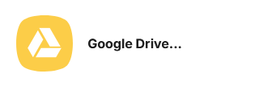
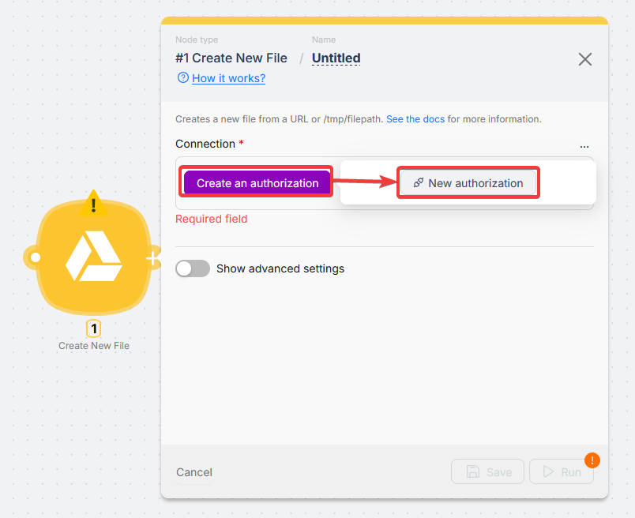
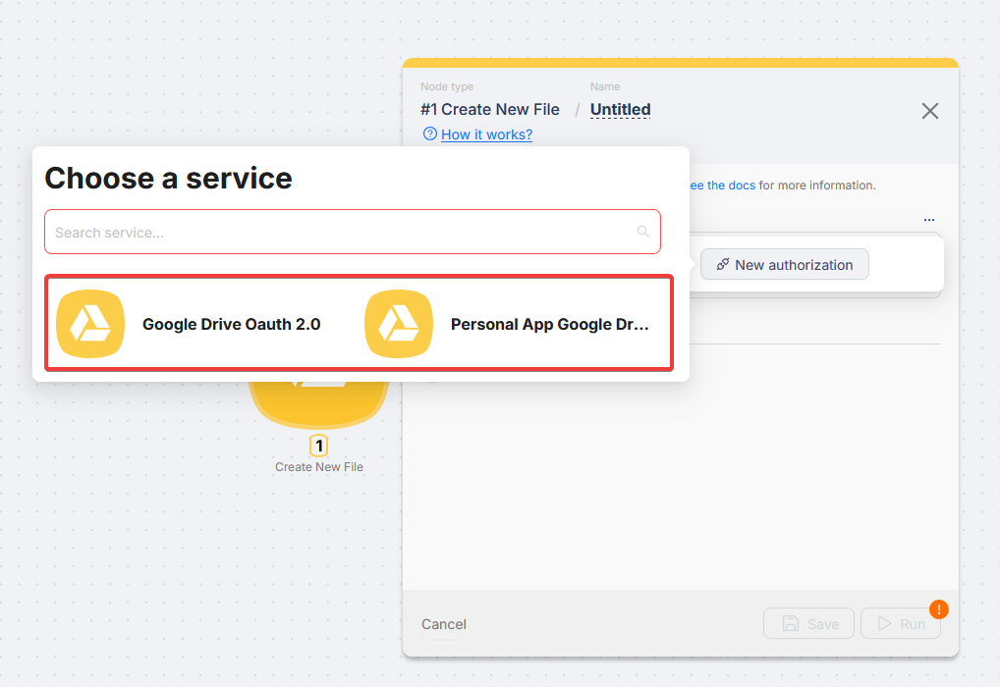
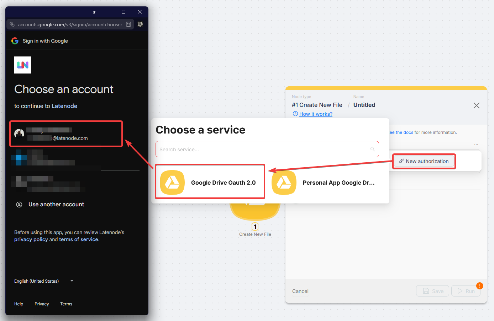

# Google Drive

Google Drive nodes manage files and folders (upload, download, copy, move, share) and can start scenarios when Drive changes.

## Connection

### First-time setup

Click **Create an authorization** and choose a connection type.

### Connection types

- **Google Drive OAuth 2.0** - Recommended.
- **Personal App Google Drive** - Your OAuth client in Google Cloud.

<Callout type="info" title="Personal App setup">
  [Google Services (Personal Account)](/integrations/authorizations/app-authorization-instructions/google-services).
</Callout>

### Authorization

<Steps>
  <Step>

### Select Google Drive OAuth 2.0

  </Step>
  <Step>

### Name the connection and save

  </Step>
  <Step>

### Sign in, grant access, confirm

The new connection appears in **Connection** when the window closes.

  </Step>
</Steps>

### Reusing a connection

Use **Use** in the **Connection** dropdown or **New authorization**.

## Triggers

All listed Drive triggers are **instant** (no polling delay).

**Connection** is your Google account dropdown. **Drive ID**, **File**, and **Folder** fields use searchable pickers with paging ([how lists work](/integrations/app-nodes/setting-up-app-nodes)). Switch a field to **Map** when you already have a drive or item id from another node.

<Accordions type="multiple">
<Accordion title="Changed File or Folder (Instant)">

Fires when watched files or folders change. **Change Types** narrows which change events count.

| Field | Description |
| --- | --- |
| Connection | Pick your Google **Drive** **Connection** from the dropdown. |
| Drive ID | Drive to watch. **Select** or **Map** the drive id. |
| Drive Item IDs | Files or folders to watch. Use the picker, or **Map** one or more item ids. |
| Change Types | Optional filter by change type. |

</Accordion>
<Accordion title="New Notification Watch Changes (Instant)">

Watches the **whole drive** and starts a run when matching changes occur (no specific file ids required).

| Field | Description |
| --- | --- |
| Connection | Pick your Google **Drive** **Connection** from the dropdown. |
| Drive ID | Which Drive (My Drive or shared). **Select** from the list or **Map** the drive id. |

</Accordion>
<Accordion title="New Notification Watch Files (Instant)">

Notifications for the **listed file ids** only.

| Field | Description |
| --- | --- |
| Connection | Pick your Google **Drive** **Connection** from the dropdown. |
| Drive ID | Which Drive (My Drive or shared). **Select** from the list or **Map** the drive id. |
| Drive Item IDs | Files to watch. Picker or **Map** with file ids. |

</Accordion>
<Accordion title="New or Modified File (Instant)">

Catches **new or updated files**. Optionally scope to folders and MIME type.

| Field | Description |
| --- | --- |
| Connection | Pick your Google **Drive** **Connection** from the dropdown. |
| Drive ID | Which Drive (My Drive or shared). **Select** from the list or **Map** the drive id. |
| Watch Type | New only, modified only, or both |
| Watch for Items in Folder IDs | Optional. Limit events to these folders (picker or **Map**). |
| Drive Item MIME Type | Optional type filter. See [Google Drive MIME types](https://developers.google.com/drive/api/guides/mime-types) |

</Accordion>
<Accordion title="New or Updated Comments (Instant)">

Fires on **new or updated comments** on the selected files.

| Field | Description |
| --- | --- |
| Connection | Pick your Google **Drive** **Connection** from the dropdown. |
| Drive ID | Which Drive (My Drive or shared). **Select** from the list or **Map** the drive id. |
| Drive Item IDs | Files to watch. Picker or **Map** with file ids. |

</Accordion>
</Accordions>

## Actions

Pick **Connection** and **Drive ID** first so file and folder pickers can load. Choose items in **Select** mode or paste ids with **Map** when the scenario supplies them.

<Accordions type="multiple">
<Accordion title="Files: Copy File">

**Copies a file** on Drive (creates another file with the same content).

| Field | Description |
| --- | --- |
| Connection | Pick your Google **Drive** **Connection** from the dropdown. |
| Drive ID | Drive with the source file |
| File | File to copy |

</Accordion>
<Accordion title="Files: Create New File">

**Creates a new file** from a URL, prior-node binary content, or path; set folder and metadata as needed.

| Field | Description |
| --- | --- |
| Connection | Pick your Google **Drive** **Connection** from the dropdown. |
| Drive ID | Target drive |
| Parent Folder | Optional folder |
| File URL | Or **File Path** (one required) |
| File Path | Prior node content, e.g. `1.body.files.[0].content` |
| Name / Mime Type / Description | Optional |
| Supports All Drives | `true` for shared drives |
| Starred / OCR Language / Keep Revision Forever / Use Content As Indexable Text | Optional |
| Writers Can Share / Copy Requires Writer Permission / Ignore Default Visibility | Optional |
| Shortcut Details Target ID | Optional shortcut target |

</Accordion>
<Accordion title="Files: Create New File From Template">

**Creates a file from a Google template** (Doc and/or PDF) with optional placeholder replacement.

| Field | Description |
| --- | --- |
| Connection | Pick your Google **Drive** **Connection** from the dropdown. |
| Drive ID | Drive with template |
| File | Template document |
| Mode | Google Doc, PDF, or both |
| Parent Folder / Name | Optional |
| Replace Text Placeholders | Optional `{{placeholder}}` map |

</Accordion>
<Accordion title="Files: Create New File From Text">

**Creates a file from plain text** using folder, name, and content fields.

| Field | Description |
| --- | --- |
| Connection | Pick your Google **Drive** **Connection** from the dropdown. |
| Drive ID | Which Drive (My Drive or shared). **Select** from the list or **Map** the drive id. |
| Folder / Name / Content | Optional |

</Accordion>
<Accordion title="Files: Download File">

**Downloads a file** from Drive; set export format for Google Workspace types when needed.

| Field | Description |
| --- | --- |
| Connection | Pick your Google **Drive** **Connection** from the dropdown. |
| Drive ID | Which Drive (My Drive or shared). **Select** from the list or **Map** the drive id. |
| File ID | File |
| Conversion Format | Optional export format for Workspace files |

</Accordion>
<Accordion title="Files: Find File">

**Finds a file** by name (or partial name) on the selected drive.

| Field | Description |
| --- | --- |
| Connection | Pick your Google **Drive** **Connection** from the dropdown. |
| Drive ID | Which Drive (My Drive or shared). **Select** from the list or **Map** the drive id. |
| Search Name | Optional |

</Accordion>
<Accordion title="Files: List Files">

**Lists files** in a folder or drive with filters and optional field selection.

| Field | Description |
| --- | --- |
| Connection | Pick your Google **Drive** **Connection** from the dropdown. |
| Drive ID | Which Drive (My Drive or shared). **Select** from the list or **Map** the drive id. |
| Folder | Optional folder |
| Fields / Filter Text / Include Trashed Files | Optional |

</Accordion>
<Accordion title="Files: Move File">

**Moves a file** into another folder on the same drive.

| Field | Description |
| --- | --- |
| Connection | Pick your Google **Drive** **Connection** from the dropdown. |
| Drive ID | Which Drive (My Drive or shared). **Select** from the list or **Map** the drive id. |
| File | File |
| Folder | Destination folder |

</Accordion>
<Accordion title="Files: Move File to Trash">

**Moves a file or folder to trash** (soft delete).

| Field | Description |
| --- | --- |
| Connection | Pick your Google **Drive** **Connection** from the dropdown. |
| Drive ID | Which Drive (My Drive or shared). **Select** from the list or **Map** the drive id. |
| File or Folder | Item |

</Accordion>
<Accordion title="Files: Replace File">

**Replaces file content** with new data from a URL or prior node output.

| Field | Description |
| --- | --- |
| Connection | Pick your Google **Drive** **Connection** from the dropdown. |
| Drive ID | Which Drive (My Drive or shared). **Select** from the list or **Map** the drive id. |
| File | File |
| File URL or File Path | New content (one required) |
| Name / Mime Type | Optional |

</Accordion>
<Accordion title="Files: Update File">

**Updates metadata and optionally content** (parents, name, MIME, advanced API fields).

| Field | Description |
| --- | --- |
| Connection | Pick your Google **Drive** **Connection** from the dropdown. |
| Drive ID | Which Drive (My Drive or shared). **Select** from the list or **Map** the drive id. |
| File | File |
| File URL / File Path / Name / Mime Type | Optional |
| Add Parents / Remove Parents | Optional |
| Keep Revision Forever / OCR Language / Use Content As Indexable Text | Optional |
| Advanced Options | Extra metadata. See [Files: update](https://developers.google.com/drive/api/v3/reference/files/update#request-body) |

</Accordion>
<Accordion title="Files: Upload File">

**Uploads a new file** to Drive from a URL or prior node output.

| Field | Description |
| --- | --- |
| Connection | Pick your Google **Drive** **Connection** from the dropdown. |
| Drive ID | Which Drive (My Drive or shared). **Select** from the list or **Map** the drive id. |
| Folder | Optional |
| File URL or File Path | One required |
| Name / Mime Type | Optional |

</Accordion>
<Accordion title="Folders: Create Folder">

**Creates a folder** on the drive, optionally under a parent folder.

| Field | Description |
| --- | --- |
| Connection | Pick your Google **Drive** **Connection** from the dropdown. |
| Drive ID | Which Drive (My Drive or shared). **Select** from the list or **Map** the drive id. |
| Name | Folder name |
| Folder | Optional parent |
| Create Only If Filename Is Unique | Optional |

</Accordion>
<Accordion title="Folders: Find Folder">

**Finds a folder** by name; optionally include trashed folders.

| Field | Description |
| --- | --- |
| Connection | Pick your Google **Drive** **Connection** from the dropdown. |
| Drive | Defaults to My Drive |
| Search Name | Optional |
| Include Trashed | Optional |

</Accordion>
<Accordion title="Folders: Get Folder ID for Path">

**Resolves a path** like `a/b/c` **to a folder id** (useful before creating nested files).

| Field | Description |
| --- | --- |
| Connection | Pick your Google **Drive** **Connection** from the dropdown. |
| Drive ID | Which Drive (My Drive or shared). **Select** from the list or **Map** the drive id. |
| Path | Path with `/`, e.g. `a/b/c` |

</Accordion>
<Accordion title="Sharing: Add File Sharing Preference">

**Adds a sharing rule** to a file (role and grantee type: user, domain, anyone with link, etc.).

| Field | Description |
| --- | --- |
| Connection | Pick your Google **Drive** **Connection** from the dropdown. |
| Drive ID | Which Drive (My Drive or shared). **Select** from the list or **Map** the drive id. |
| File | File |
| Role | Reader, Commenter, Writer, Owner |
| Type | Anyone, User, Group, Domain |
| Email Address / Domain | When required |

</Accordion>
<Accordion title="Sharing: Get Shared Link">

**Returns a shareable link** for a file or folder.

| Field | Description |
| --- | --- |
| Connection | Pick your Google **Drive** **Connection** from the dropdown. |
| Drive ID | Which Drive (My Drive or shared). **Select** from the list or **Map** the drive id. |
| Drive Item ID | File or folder |

</Accordion>
<Accordion title="Sharing: Revoke File or Folder Access">

**Revokes one permission** (**Permission ID**) on a file or folder.

| Field | Description |
| --- | --- |
| Connection | Pick your Google **Drive** **Connection** from the dropdown. |
| Drive ID | Which Drive (My Drive or shared). **Select** from the list or **Map** the drive id. |
| Drive Item ID | Item |
| Permission ID | Permission to remove |

</Accordion>
<Accordion title="Sharing: Share File or Folder Permissions">

**Grants access** to a user, group, domain, or link with a role (and optional expiry).

| Field | Description |
| --- | --- |
| Connection | Pick your Google **Drive** **Connection** from the dropdown. |
| Drive ID | Which Drive (My Drive or shared). **Select** from the list or **Map** the drive id. |
| Drive Item ID | Item |
| Role | Reader, Commenter, Writer, File Organizer, Organizer, Owner |
| Type | User, Group, Domain, Anyone |
| Email / Expiration Time / Allow File Discovery | Optional |

</Accordion>
<Accordion title="Sharing: Update File or Folder Access">

**Changes the role** of an existing permission (**Permission ID**).

| Field | Description |
| --- | --- |
| Connection | Pick your Google **Drive** **Connection** from the dropdown. |
| Drive ID | Which Drive (My Drive or shared). **Select** from the list or **Map** the drive id. |
| Drive Item ID | Item |
| Permission ID | Permission |
| New Role | New role |

</Accordion>
<Accordion title="Shared drives: Create Shared Drive">

**Creates a shared drive** with the given name.

| Field | Description |
| --- | --- |
| Connection | Pick your Google **Drive** **Connection** from the dropdown. |
| Name | Shared drive name |

</Accordion>
<Accordion title="Shared drives: Get Shared Drive">

**Fetches shared drive metadata** by id.

| Field | Description |
| --- | --- |
| Connection | Pick your Google **Drive** **Connection** from the dropdown. |
| Drive ID | Shared drive id |

</Accordion>
<Accordion title="Shared drives: Search for Shared Drives">

**Searches shared drives** with a query string (optional domain-admin mode).

| Field | Description |
| --- | --- |
| Connection | Pick your Google **Drive** **Connection** from the dropdown. |
| Search Query | Query string |
| Use Domain Admin Access | Optional |

</Accordion>
<Accordion title="Utilities: Convert Excel to Sheets">

**Converts an Excel file** on Drive **into a new Google Sheet**.

| Field | Description |
| --- | --- |
| Connection | Pick your Google **Drive** **Connection** from the dropdown. |
| Drive ID | Which Drive (My Drive or shared). **Select** from the list or **Map** the drive id. |
| Excel File ID | Source Excel |
| New Google Sheets Name / Parent Folder ID | Optional |

</Accordion>
</Accordions>

## Troubleshooting

### Insufficient permissions / access denied

Reconnect and approve **all** requested Google scopes.

### Connection expired (Personal App)

**Testing** projects: about 7-day tokens. Reauthorize or publish to **In production**.

<Callout type="info" title="Personal App">
  [Google Services (Personal Account)](/integrations/authorizations/app-authorization-instructions/google-services).
</Callout>
