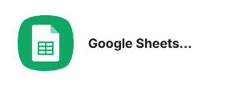
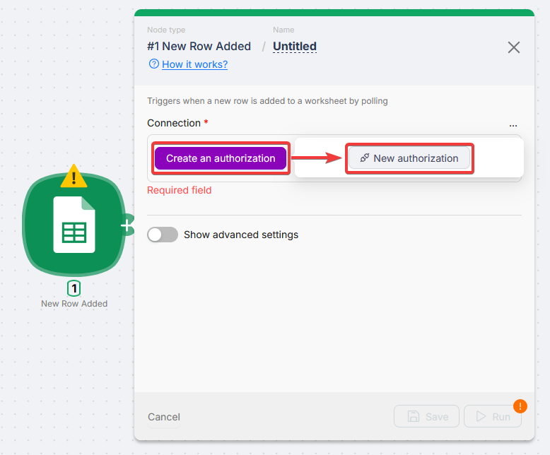
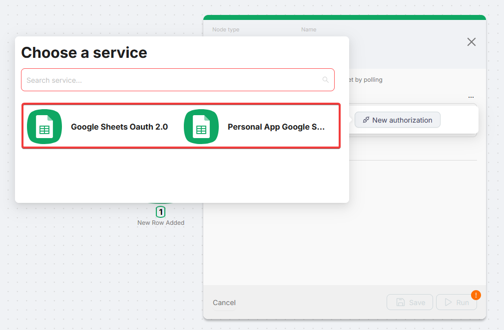
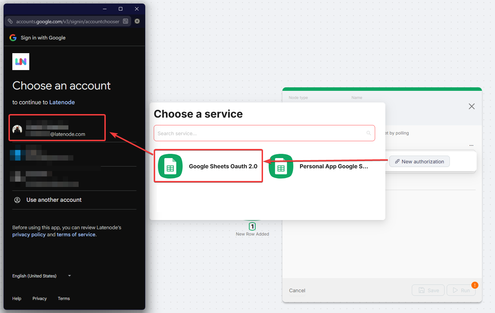
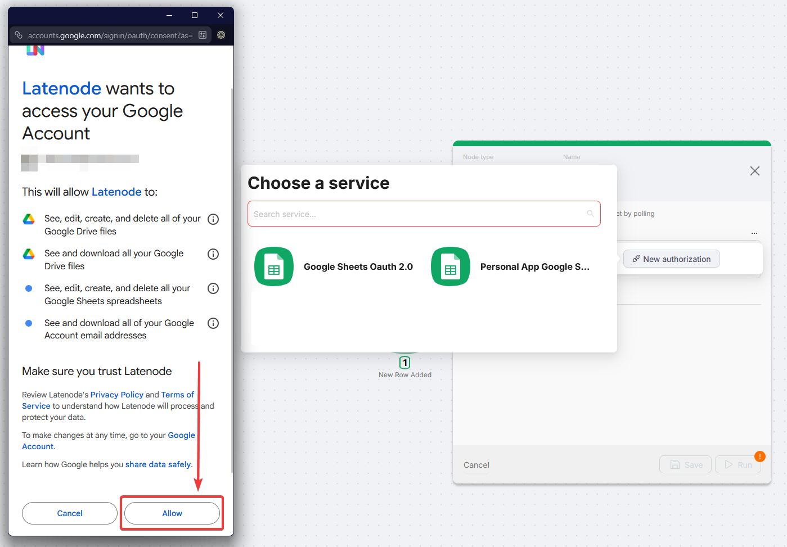
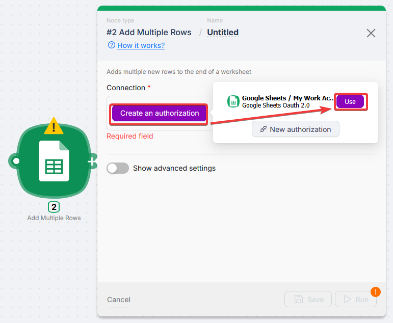
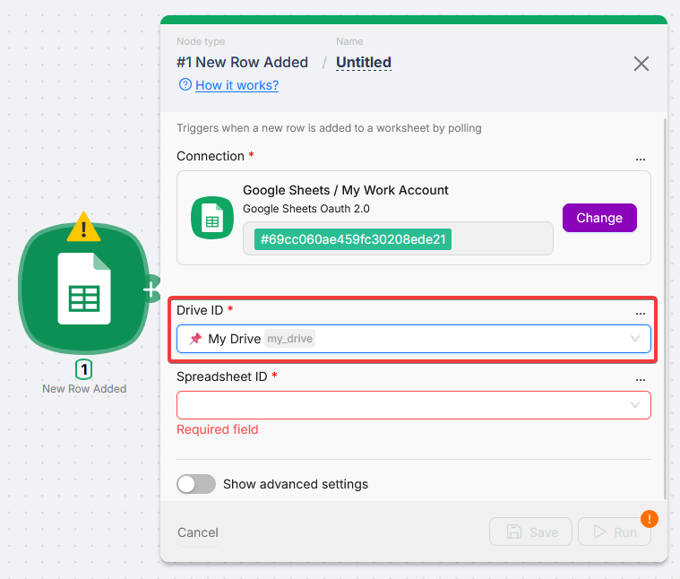
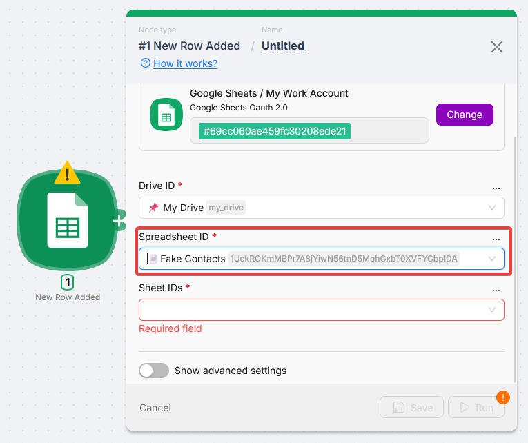
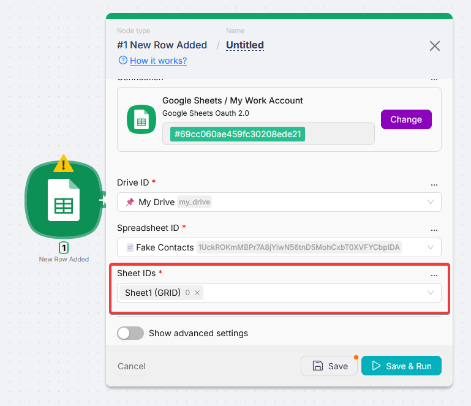

# Google Sheets



Google Sheets is an app node group for working with spreadsheets from your scenarios. It helps you add and update rows, search data, manage worksheets, and start runs when something changes in a sheet. When you add a Google Sheets node and open its settings, you pick a connection, drive, spreadsheet, and (for most modules) a worksheet.

## Connection

Every Google Sheets module needs an active connection to your Google account. You create it once and reuse it across modules.

### Setting up a connection

When you open any Google Sheets module for the first time, the **Connection** field is empty.



Click **Create an authorization**. A popup opens so you can choose the connection type.

### Connection types



There are two options:

- **Google Sheets OAuth 2.0** - Sign in with your Google account. Latenode requests the scopes it needs and redirects you to Google. Use this for most setups.
- **Personal App Google Sheets** - Use your own Google Cloud OAuth app (**Client ID** and **Client Secret**). Use this if you need your own quota or custom OAuth settings.

<Callout type="info" title="Personal App setup">
  For step-by-step Google Cloud setup, see [Google Services (Personal Account)](/integrations/authorizations/app-authorization-instructions/google-services).
</Callout>

### Authorization

<Steps>
  <Step>

### Choose **Google Sheets OAuth 2.0**

In the authorization dialog, select **Google Sheets OAuth 2.0**.

  </Step>
  <Step>

### Name the connection and save

Enter a **Connection** name you will recognize later (for example `My Work Account`). Click **Save**. A Google sign-in window opens.



  </Step>
  <Step>

### Sign in and allow access

Pick the Google account to connect and grant the requested permissions.

  </Step>
  <Step>

### Confirm the connection in the node

When the window closes, the new connection appears in the **Connection** field.



  </Step>
</Steps>

### Reusing an existing connection

If you already created connections, they appear in the **Connection** dropdown. Click **Use** next to one, or **New authorization** to add another.



## Selecting a spreadsheet

After you choose a connection, most modules need a **Drive**, **Spreadsheet**, and sheet (tab).

### Drive ID

Select the Google Drive that holds the spreadsheet. The list includes **My Drive** and **Shared drives** you can access.



### Spreadsheet ID

After the drive, choose the spreadsheet from **Spreadsheet ID**. The list loads spreadsheets from that drive.



### Sheet ID or Sheet Name

Most modules also need a worksheet (tab). After you pick a spreadsheet, the sheet field loads available tabs.



Some modules use **Sheet ID** (dropdown, stores the numeric id so renames do not break the node). Others use **Sheet Name** (text you can type or map from a previous node).

**Drive ID**, **Spreadsheet ID**, and the sheet field are required in almost every Google Sheets module.

## Triggers

Triggers start your scenario when something changes in a spreadsheet.

- **Polling** - Latenode checks the spreadsheet on a schedule. Interval depends on your plan; see [Triggers on the pricing page](https://latenode.com/pricing).
- **Instant** - The scenario runs as soon as the event happens.

In every trigger, set **Connection** first so **Drive ID**, **Spreadsheet ID**, and sheet fields can populate. Switch any of those fields to **Map** when another node supplies the ids.

<Accordions type="multiple">
<Accordion title="New Row Added (polling)">

Checks the chosen worksheets on an interval and runs when a new row appears.

| Field | Description |
| --- | --- |
| Connection | Pick your Google Sheets **Connection** from the dropdown. |
| Drive ID | Drive where the spreadsheet lives. **Select** or **Map** the drive id. |
| Spreadsheet ID | Workbook to watch. **Select** or **Map** the spreadsheet id. |
| Sheet IDs | One or more worksheets to watch for new rows |

</Accordion>

<Accordion title="New Row Added (Instant)">

Runs as soon as a new row is added to any selected worksheet.

| Field | Description |
| --- | --- |
| Connection | Pick your Google Sheets **Connection** from the dropdown. |
| Drive ID | Drive where the spreadsheet lives. **Select** or **Map** the drive id. |
| Spreadsheet ID | Workbook to watch. **Select** or **Map** the spreadsheet id. |
| Sheet IDs | Worksheets to monitor |

</Accordion>

<Accordion title="New Updates (polling)">

Checks a worksheet on an interval and runs when a value changes in the watched column.

| Field | Description |
| --- | --- |
| Connection | Pick your Google Sheets **Connection** from the dropdown. |
| Drive ID | Drive where the spreadsheet lives. **Select** or **Map** the drive id. |
| Spreadsheet ID | Workbook to watch. **Select** or **Map** the spreadsheet id. |
| Sheet ID | Worksheet to monitor |
| Column | Column letter to watch (for example `A`) |

</Accordion>

<Accordion title="New Updates (Instant)">

Runs immediately when any value in the spreadsheet is updated.

| Field | Description |
| --- | --- |
| Connection | Pick your Google Sheets **Connection** from the dropdown. |
| Drive ID | Drive where the spreadsheet lives. **Select** or **Map** the drive id. |
| Spreadsheet ID | Workbook to watch. **Select** or **Map** the spreadsheet id. |
| Sheet IDs | Worksheets to monitor |

</Accordion>

<Accordion title="New Worksheet (polling)">

Checks the spreadsheet on an interval and runs when a new worksheet (tab) is added.

| Field | Description |
| --- | --- |
| Connection | Pick your Google Sheets **Connection** from the dropdown. |
| Drive ID | Drive where the spreadsheet lives. **Select** or **Map** the drive id. |
| Spreadsheet ID | Workbook to watch. **Select** or **Map** the spreadsheet id. |

</Accordion>

<Accordion title="New Worksheet (Instant)">

Runs as soon as a new worksheet is added.

| Field | Description |
| --- | --- |
| Connection | Pick your Google Sheets **Connection** from the dropdown. |
| Drive ID | Drive where the spreadsheet lives. **Select** or **Map** the drive id. |
| Spreadsheet ID | Workbook to watch. **Select** or **Map** the spreadsheet id. |

</Accordion>
</Accordions>

## Actions

Use actions to read, write, and manage sheets from the middle of a scenario. Open a panel below to see fields for that method.

Choose **Connection**, then **Drive ID** and **Spreadsheet ID** (dropdowns load after the account is set). Use **Map** on ids, ranges, or cell values when they should come from scenario data.

### Rows

<Accordions type="multiple">
<Accordion title="Add Single Row">

Appends one row at the end of a worksheet.

| Field | Description |
| --- | --- |
| Connection | Pick your Google Sheets **Connection** from the dropdown. |
| Drive ID | Drive where the spreadsheet lives. **Select** or **Map** the drive id. |
| Spreadsheet ID | Target workbook. **Select** or **Map** the spreadsheet id. |
| Sheet ID | Worksheet to append to |
| Is Header Row | Whether row 1 is headers |

If **Is Header Row** is **Yes**, the node reads column names from the first row and shows named fields. If **No**, you get generic value fields.

The sheet needs at least one data row for headers to load; an empty sheet can fail header loading.

</Accordion>

<Accordion title="Add Multiple Rows">

Appends several rows in one call.

| Field | Description |
| --- | --- |
| Connection | Pick your Google Sheets **Connection** from the dropdown. |
| Drive ID | Drive where the spreadsheet lives. **Select** or **Map** the drive id. |
| Spreadsheet ID | Target workbook. **Select** or **Map** the spreadsheet id. |
| Sheet ID | Worksheet to append to |
| Row Values | Array of rows (see below) |

**Row Values** is an array of arrays. Each inner array is one row; each element is a cell. Example: `[["Foo", 1, 2], ["Bar", 3, 4]]` adds two rows with three columns.

You can pass data from another node, for example `[{{$3.result.response.values.[0]}}]`.

</Accordion>

<Accordion title="Update Row">

Updates one row. With **Table Contains Headers** enabled, column names come from the first row (same idea as Add Single Row).

| Field | Description |
| --- | --- |
| Connection | Pick your Google Sheets **Connection** from the dropdown. |
| Drive ID | Drive where the spreadsheet lives. **Select** or **Map** the drive id. |
| Spreadsheet ID | Target workbook. **Select** or **Map** the spreadsheet id. |
| Sheet ID | Worksheet with the row |
| Row Number | Row index (minimum 1) |
| Table Contains Headers | Use named columns from row 1 |

</Accordion>

<Accordion title="Update Rows">

Updates multiple rows in a range.

| Field | Description |
| --- | --- |
| Connection | Pick your Google Sheets **Connection** from the dropdown. |
| Drive ID | Drive where the spreadsheet lives. **Select** or **Map** the drive id. |
| Spreadsheet ID | Target workbook. **Select** or **Map** the spreadsheet id. |
| Sheet ID | Worksheet with the rows |
| Range A1 Notation | Range to update (for example `A1:A1` or `A1:B2`) |
| Row Values | Same array-of-arrays format as Add Multiple Rows |

</Accordion>

<Accordion title="Update Row (legacy)">

Legacy single-row update. Prefer **Update Row** for new scenarios.

| Field | Description |
| --- | --- |
| Connection | Pick your Google Sheets **Connection** from the dropdown. |
| Drive ID | Drive where the spreadsheet lives. **Select** or **Map** the drive id. |
| Spreadsheet ID | Target workbook. **Select** or **Map** the spreadsheet id. |
| Sheet ID | Worksheet with the row |
| Row Number | Row to update |
| Values | New values per column |

</Accordion>

<Accordion title="Delete Single Row">

Deletes a row permanently. Rows below shift up.

| Field | Description |
| --- | --- |
| Connection | Pick your Google Sheets **Connection** from the dropdown. |
| Drive ID | Drive where the spreadsheet lives. **Select** or **Map** the drive id. |
| Spreadsheet ID | Target workbook. **Select** or **Map** the spreadsheet id. |
| Sheet ID | Worksheet with the row |
| Row Number | Row to delete |

</Accordion>

<Accordion title="Clear Row">

Clears cell values in a row. The row is not removed.

| Field | Description |
| --- | --- |
| Connection | Pick your Google Sheets **Connection** from the dropdown. |
| Drive ID | Drive where the spreadsheet lives. **Select** or **Map** the drive id. |
| Spreadsheet ID | Target workbook. **Select** or **Map** the spreadsheet id. |
| Sheet Name | Worksheet with the row |
| Row Number | Row to clear |

</Accordion>

<Accordion title="Find Row in Column">

Returns the first row where a column equals a value.

| Field | Description |
| --- | --- |
| Connection | Pick your Google Sheets **Connection** from the dropdown. |
| Drive ID | Drive where the spreadsheet lives. **Select** or **Map** the drive id. |
| Spreadsheet ID | Target workbook. **Select** or **Map** the spreadsheet id. |
| Sheet ID | Worksheet to search |
| Search Column Letter | Column letter (for example `A`) |
| Search Value | Value to find |

</Accordion>

<Accordion title="Search Rows">

Search with filter rules on columns.

| Field | Description |
| --- | --- |
| Connection | Pick your Google Sheets **Connection** from the dropdown. |
| Drive ID | Drive where the spreadsheet lives. **Select** or **Map** the drive id. |
| Spreadsheet ID | Target workbook. **Select** or **Map** the spreadsheet id. |
| Sheet Name | Worksheet to search |
| Range | Optional A1 range (for example `A1:Z100`) |
| Filter JSON | Optional filter object (see below) |

**Filter JSON** supports nested `and` / `or`. Operators include `equal`, `not_equal`, `contains`, `not_contains`, `starts_with`, `ends_with`, `gt`, `lt`, `gte`, `lte`, `exists`, `does_not_exist`. String comparisons are case-insensitive. For `exists` and `does_not_exist`, omit `value`.

```json
{
  "type": "and",
  "rules": [
    {
      "type": "or",
      "rules": [
        { "column": "A", "operator": "equal", "value": "john" },
        { "column": "E", "operator": "contains", "value": "admin" }
      ]
    },
    { "column": "C", "operator": "gt", "value": "10" },
    { "column": "D", "operator": "lte", "value": "100" },
    { "column": "F", "operator": "exists" }
  ]
}
```

</Accordion>

<Accordion title="Search Rows (Advanced)">

Query with Google Visualization API language (SQL-like filters and sorting).

| Field | Description |
| --- | --- |
| Connection | Pick your Google Sheets **Connection** from the dropdown. |
| Drive ID | Drive where the spreadsheet lives. **Select** or **Map** the drive id. |
| Spreadsheet ID | Target workbook. **Select** or **Map** the spreadsheet id. |
| Sheet ID | Worksheet to query |
| Query | Query string (for example `select * where B = "John"`) |

</Accordion>
</Accordions>

### Cells

<Accordions type="multiple">
<Accordion title="Get Cell">

Reads one cell.

| Field | Description |
| --- | --- |
| Connection | Pick your Google Sheets **Connection** from the dropdown. |
| Drive ID | Drive where the spreadsheet lives. **Select** or **Map** the drive id. |
| Spreadsheet ID | Target workbook. **Select** or **Map** the spreadsheet id. |
| Sheet Name | Worksheet |
| Cell | A1 address (for example `A1`) |

</Accordion>

<Accordion title="Get Values">

Reads a range of cells.

| Field | Description |
| --- | --- |
| Connection | Pick your Google Sheets **Connection** from the dropdown. |
| Drive ID | Drive where the spreadsheet lives. **Select** or **Map** the drive id. |
| Spreadsheet ID | Target workbook. **Select** or **Map** the spreadsheet id. |
| Sheet Name | Worksheet |
| Range | Optional A1 range; if empty, returns the whole sheet |

</Accordion>

<Accordion title="Update Cell">

Writes one cell by A1 address.

| Field | Description |
| --- | --- |
| Connection | Pick your Google Sheets **Connection** from the dropdown. |
| Drive ID | Drive where the spreadsheet lives. **Select** or **Map** the drive id. |
| Spreadsheet ID | Target workbook. **Select** or **Map** the spreadsheet id. |
| Sheet ID | Worksheet |
| Cell | A1 address |
| Value | New value |

</Accordion>

<Accordion title="Clear Cells">

Clears values in a range. Formatting stays.

| Field | Description |
| --- | --- |
| Connection | Pick your Google Sheets **Connection** from the dropdown. |
| Drive ID | Drive where the spreadsheet lives. **Select** or **Map** the drive id. |
| Spreadsheet ID | Target workbook. **Select** or **Map** the spreadsheet id. |
| Sheet Name | Worksheet |
| Cell A1 Notation | Range (for example `A1:A1` or `A1:B2`) |

</Accordion>
</Accordions>

### Spreadsheets and worksheets

<Accordions type="multiple">
<Accordion title="Create Spreadsheet">

Creates a new spreadsheet.

| Field | Description |
| --- | --- |
| Connection | Pick your Google Sheets **Connection** from the dropdown. |
| Drive ID | Drive for the new file |
| Name | Spreadsheet title |
| Copy from Spreadsheet ID | Optional template spreadsheet id |

</Accordion>

<Accordion title="Create Worksheet">

Adds a tab to an existing spreadsheet.

| Field | Description |
| --- | --- |
| Connection | Pick your Google Sheets **Connection** from the dropdown. |
| Drive ID | Drive where the spreadsheet lives. **Select** or **Map** the drive id. |
| Spreadsheet ID | Target workbook. **Select** or **Map** the spreadsheet id. |
| Title | New worksheet name |

</Accordion>

<Accordion title="Copy Worksheet">

Copies a worksheet to another spreadsheet.

| Field | Description |
| --- | --- |
| Connection | Pick your Google Sheets **Connection** from the dropdown. |
| Drive ID | Drive with the source spreadsheet |
| Spreadsheet ID | Source workbook. **Select** or **Map** the spreadsheet id. |
| Sheet ID | Worksheet to copy |
| Destination Spreadsheet ID | Target spreadsheet |

</Accordion>

<Accordion title="Delete Worksheet">

Deletes a worksheet permanently.

| Field | Description |
| --- | --- |
| Connection | Pick your Google Sheets **Connection** from the dropdown. |
| Drive ID | Drive where the spreadsheet lives. **Select** or **Map** the drive id. |
| Spreadsheet ID | Target workbook. **Select** or **Map** the spreadsheet id. |
| Sheet ID | Worksheet to delete |

</Accordion>

<Accordion title="List Worksheets">

Returns all worksheets in a spreadsheet.

| Field | Description |
| --- | --- |
| Connection | Pick your Google Sheets **Connection** from the dropdown. |
| Drive ID | Drive where the spreadsheet lives. **Select** or **Map** the drive id. |
| Spreadsheet ID | Workbook whose tabs you list. **Select** or **Map** the spreadsheet id. |

</Accordion>

<Accordion title="Add Single Column">

Adds a column to a worksheet.

| Field | Description |
| --- | --- |
| Connection | Pick your Google Sheets **Connection** from the dropdown. |
| Drive ID | Drive where the spreadsheet lives. **Select** or **Map** the drive id. |
| Spreadsheet ID | Target workbook. **Select** or **Map** the spreadsheet id. |
| Sheet ID | Worksheet |
| Column Letter | Letter for the new column (for example `A`, `B`) |

</Accordion>

<Accordion title="Add Comment">

Adds a comment on the spreadsheet file (no sheet selection).

| Field | Description |
| --- | --- |
| Connection | Pick your Google Sheets **Connection** from the dropdown. |
| Drive ID | Drive where the spreadsheet lives. **Select** or **Map** the drive id. |
| Spreadsheet ID | Target workbook. **Select** or **Map** the spreadsheet id. |
| Comment | Comment text |

</Accordion>
</Accordions>

## Troubleshooting

### Error: insufficient permissions or access denied

The connection was created, but a node fails with a permissions error. Often the OAuth screen had some scopes unchecked. Google lets users remove individual scopes; if Sheets or Drive was unchecked, the token may be too limited.

Delete the connection and create it again. On the Google permissions screen, leave all requested permissions enabled, then click **Allow**.

### Error: connection expired (Personal App only)

OAuth apps in **Testing** in Google Cloud can expire tokens after about seven days.

Reauthorize every seven days, or move the project to **In production** for longer-lived tokens. For setup steps, use [Google Services (Personal Account)](/integrations/authorizations/app-authorization-instructions/google-services).
