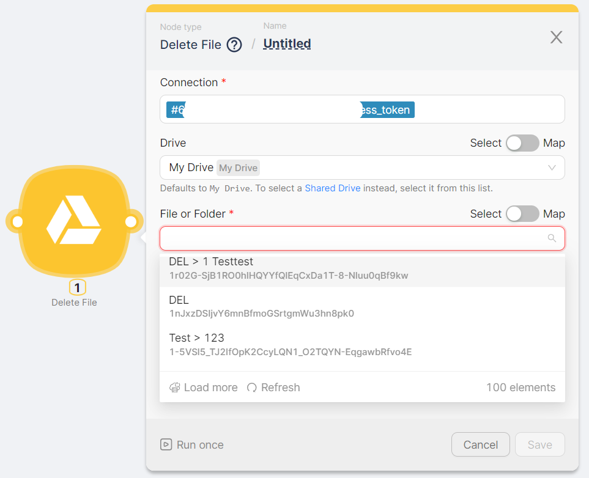
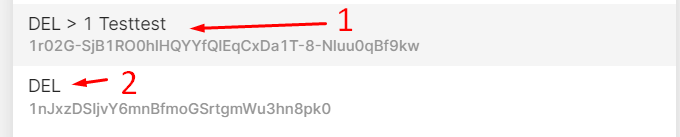
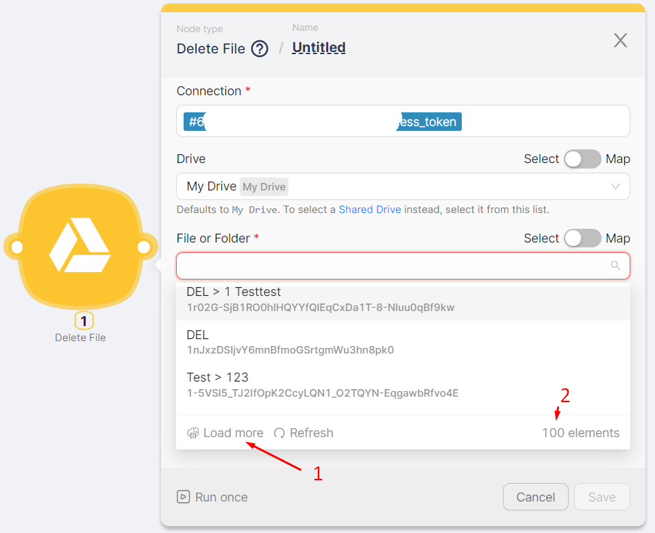
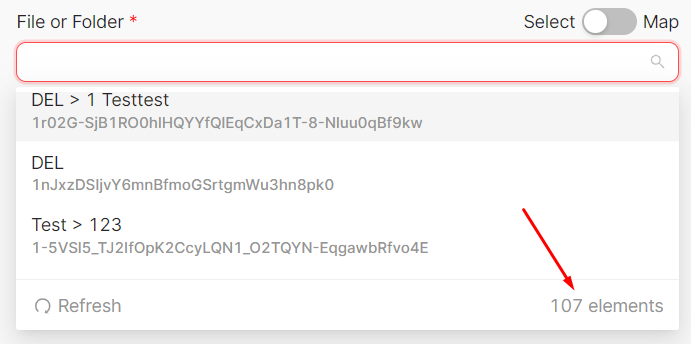
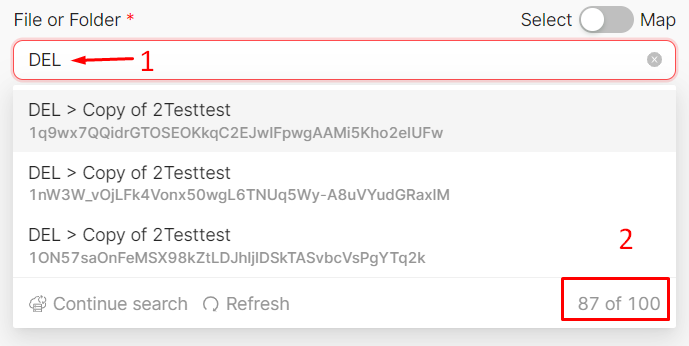
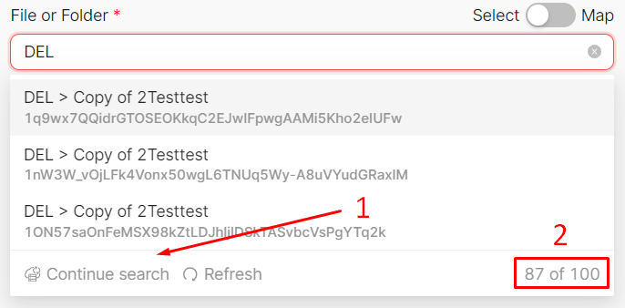
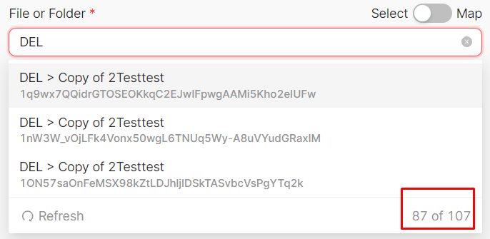

# Setting up App Nodes

Let's consider the node configuration fields using the example of the **Delete File** node in the **Google Drive** group.

When configuring nodes, it is often necessary to select folders or files. When you click on the configuration field:

## File and Folder Display

File and folder names are displayed, taking their identifiers into account:

- If a file is located within a folder, the name is displayed in the format **Folder Name > File Name** (1)
- If the file is located outside of a folder, the name is displayed without additional comments (2)
- The folder name is also displayed without additional comments

## Loading More Items

The first 100 items of the dropdown list are displayed (2). By clicking the **Load More** button (1), the next 100 items in the list are loaded for selection. The **Load More** button disappears when the entire list of values has been loaded.

## Search Functionality

Text input for searching values is available:

- When entering a search value (1), the number of found values out of the total number of loaded values is displayed (2), and unsuitable values disappear.

- The search is conducted within the loaded values, for example, within 100 values (2) out of the existing 107. By clicking the **Continue Search** button (1), a search is performed for the next hundred values. The **Continue Search** button disappears when the search has been conducted across the entire list of values.

