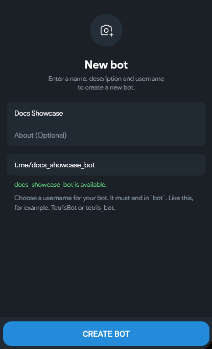
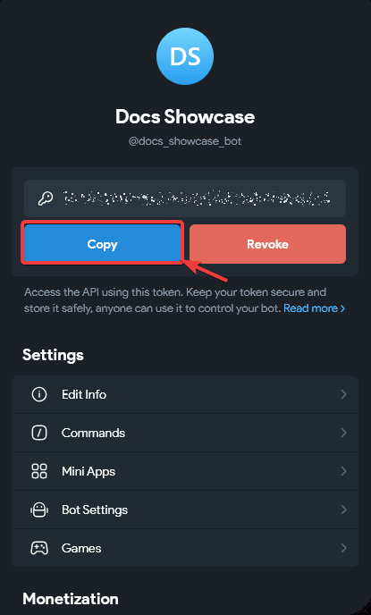
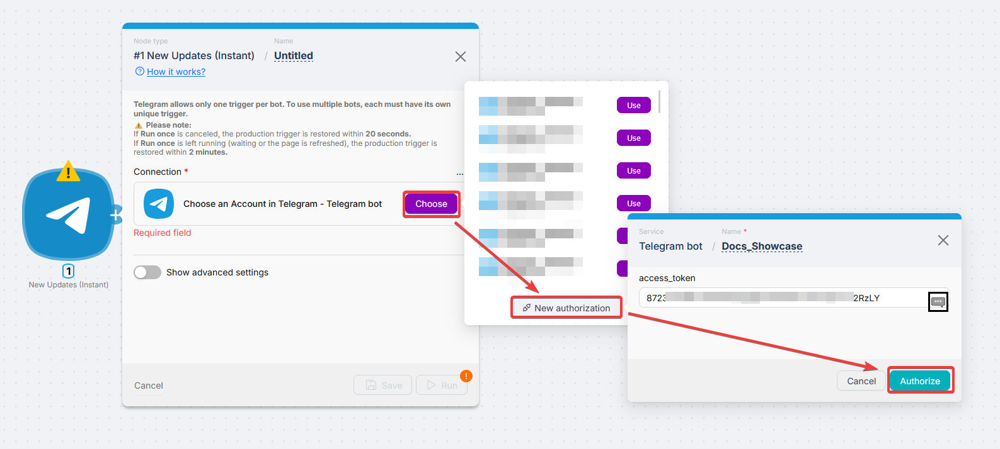
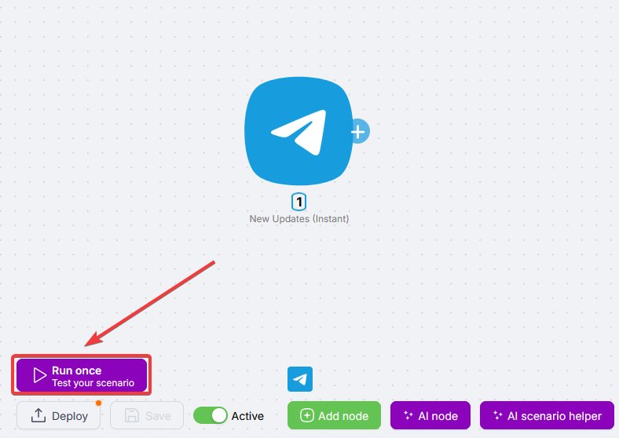
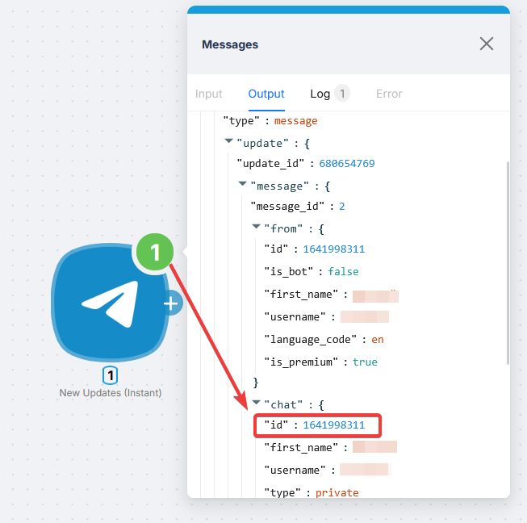
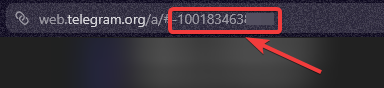
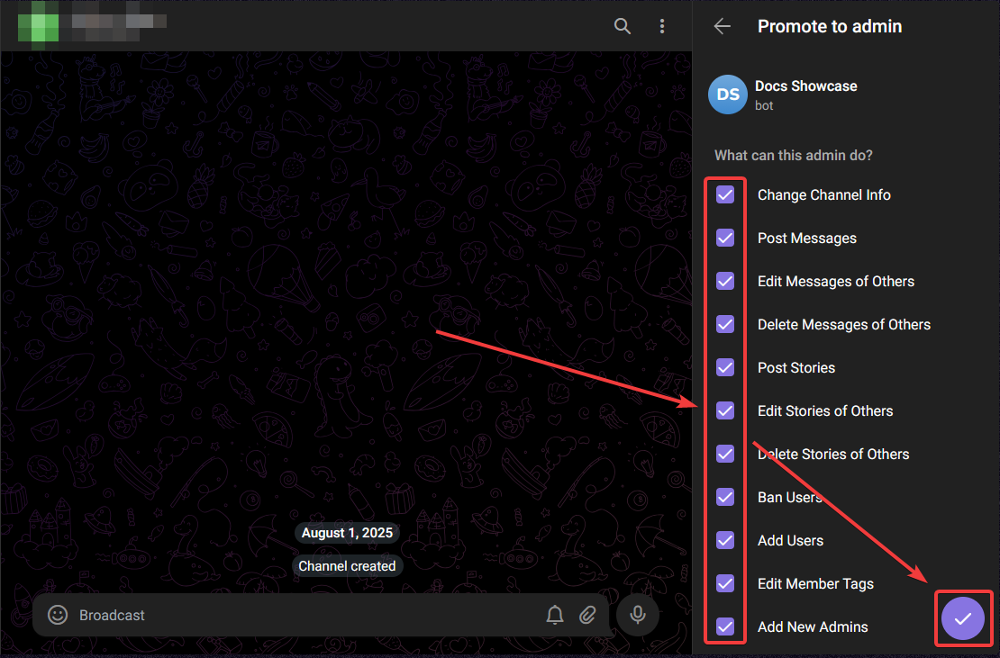

# Telegram Bot


Telegram Bot nodes send and receive messages, work with media, manage chats, and react to updates using a bot you create in Telegram.

## Creating a bot

Bots are created with **[@BotFather](https://t.me/BotFather)**.

<Steps>
  <Step>

### Open BotFather

Search for `@BotFather` or open [t.me/BotFather](https://t.me/BotFather).

  </Step>
  <Step>

### Run /newbot

Send `/newbot` and follow prompts: display name and username (must end in `bot`).



  </Step>
  <Step>

### Copy the token

BotFather returns a **token** (like `123456789:AAFabc...`). Store it securely.



  </Step>
</Steps>

<Callout type="warning" title="Keep the token secret">
  The token is your bot password. Do not post it publicly.
</Callout>

## Connecting to Latenode

<Steps>
  <Step>

### Open authorization

On any Telegram Bot module, click **Create an authorization** or **Choose**.

  </Step>
  <Step>

### Enter name and token

Name the connection and paste the token from BotFather.

  </Step>
  <Step>

### Save

Click **Save**. The connection fills **Connection** and works for all Telegram Bot modules.



  </Step>
</Steps>

## How to get a Chat ID

Most modules need **Chat ID** (chat, group, or channel).

### Method 1: Trigger output (recommended)

<Steps>
  <Step>

### Add **New Updates (Instant)** and enable it

Turn the trigger **Active** on.

  </Step>
  <Step>

### Run the scenario once

Use **Run once** or deploy.



  </Step>
  <Step>

### Message the bot and read output

Send any message to the bot. In the trigger output, read `message.chat.id`.



  </Step>
  <Step>

### Map the value downstream

Use that id in later nodes.

  </Step>
</Steps>

### Method 2: Private channel via web Telegram

<Steps>
  <Step>

### Open [web.telegram.org](https://web.telegram.org)

Go to the private channel.

  </Step>
  <Step>

### Read the URL

- Option A: `https://web.telegram.org/#/im?p=c1424271061_11793697872942794544` → take the number after `c`, prefix `-100` → `-1001424271061`.
- Option B: URL already like `https://web.telegram.org/a/#-1001833483575` → that value is the Chat ID.



  </Step>
</Steps>

For channels and supergroups the `-100` prefix matters; without it sends can fail.

## Adding a bot to a channel or group

<Steps>
  <Step>

### Open the group or channel settings

  </Step>
  <Step>

### Add the bot

**Administrators** (channels) or **Members** (groups) → add your bot.

  </Step>
  <Step>

### Grant permissions

For channels, allow **Post Messages** (and what you need).



  </Step>
</Steps>

The bot must be a **channel administrator** to post in channels.

## Triggers

### New Updates (Instant)

Main trigger: fires on any bot update (messages, callbacks, inline queries, system events).

Choose **Connection** for the bot that receives updates.

<Callout type="info" title="One active trigger per bot">
  Telegram allows only one active trigger per bot. Split workflows with separate bots and connections.
</Callout>

- If **Run once** is canceled, production trigger restores in about **20 seconds**.
- If **Run once** stays running or the page is refreshed, restore takes about **2 minutes**.

| Field | Description |
| --- | --- |
| Connection | Pick your Telegram bot **Connection** from the dropdown. |
| Allowed Updates | Optional filter (messages, callbacks, …). Empty = all |
| Enable Raw Data Updates | Deliver backlog when the trigger was off |
| Enable System Messages | Join/leave, pins, etc. |
| Include Message Thread | Topic info for forum groups |

## Reply Markup

Optional **Reply Markup** on send nodes: **inline keyboard** or **reply keyboard**.

**Inline keyboard** (URLs and callbacks):

```json
{
  "inline_keyboard": [
    [
      { "text": "Open link", "url": "https://example.com" },
      { "text": "Confirm", "callback_data": "confirm" }
    ],
    [{ "text": "Cancel", "callback_data": "cancel" }]
  ]
}
```

**Reply keyboard** (sends button text as a message):

```json
{
  "keyboard": [["Yes", "No"], ["Maybe"]],
  "resize_keyboard": true,
  "one_time_keyboard": true
}
```

Keyboards do not work in channels (only DMs and groups).

## Actions

Most actions need **Chat ID**: numeric id, `@username`, or channel id. Type it, **Map** it from the trigger or another node, or **Select** when the UI offers a list. See [How to get a Chat ID](#how-to-get-a-chat-id).

**Connection** is always your bot connection dropdown.

<Accordions type="multiple">
<Accordion title="Messages: Send Text Message or Reply">

**Sends text** (or a reply when **Original Message ID** is set). Supports parse modes and reply markup.

| Field | Description |
| --- | --- |
| Connection | Pick your Telegram bot **Connection** from the dropdown. |
| Chat ID | Where to send. Numeric id, `@username`, or channel id; often **Map** from data. |
| Text | Message body. Over 4096 chars split only with Plain Text parse mode |
| Parse Mode | Plain Text, Markdown, or HTML |
| Message Thread ID | Optional forum topic |
| Disable Notifications / Disable Link Previews | Optional |
| Original Message ID | Optional reply-to |
| Reply Markup | Optional. See [Reply Markup](#reply-markup) |
| Entities | Optional; Plain Text parse mode only |

</Accordion>
<Accordion title="Messages: Send Photo">

**Sends a photo** (`file_id`, URL, or binary from a prior node).

| Field | Description |
| --- | --- |
| Connection | Pick your Telegram bot **Connection** from the dropdown. |
| Chat ID | Where to send. Numeric id, `@username`, or channel id; often **Map** from data. |
| Photo | `file_id`, URL, or prior node content |
| File Name | Required for binary content |
| Caption / Parse Mode | Optional |
| Message Thread ID / Disable Notifications / Original Message ID / Reply Markup | Optional |

</Accordion>
<Accordion title="Messages: Send Video">

**Sends a video** with optional caption and metadata.

| Field | Description |
| --- | --- |
| Connection | Pick your Telegram bot **Connection** from the dropdown. |
| Chat ID | Where to send. Numeric id, `@username`, or channel id; often **Map** from data. |
| Video | `file_id`, URL, or binary |
| File Name | For binary |
| Caption / Duration / Width / Height | Optional |
| Message Thread ID / Reply Markup | Optional |

</Accordion>
<Accordion title="Messages: Send Video Note">

Round video; no caption.

| Field | Description |
| --- | --- |
| Connection | Pick your Telegram bot **Connection** from the dropdown. |
| Chat ID | Where to send. Numeric id, `@username`, or channel id; often **Map** from data. |
| Video Note | `file_id`, URL, or binary |
| Length / Duration / Original Message ID / Message Thread ID / Reply Markup | Optional |

</Accordion>
<Accordion title="Messages: Send Audio File">

**Sends an audio file** (music-style attachment).

| Field | Description |
| --- | --- |
| Connection | Pick your Telegram bot **Connection** from the dropdown. |
| Chat ID | Where to send. Numeric id, `@username`, or channel id; often **Map** from data. |
| Audio | `file_id`, URL, or binary |
| File Name | For binary |
| Caption / Parse Mode / Message Thread ID / Disable Notifications / Duration / Performer / Title / Original Message ID / Reply Markup | Optional |

</Accordion>
<Accordion title="Messages: Send Voice Message">

**Sends a voice note** (round voice message).

| Field | Description |
| --- | --- |
| Connection | Pick your Telegram bot **Connection** from the dropdown. |
| Chat ID | Where to send. Numeric id, `@username`, or channel id; often **Map** from data. |
| Voice Message | `file_id`, URL, or binary |
| Caption / Parse Mode / Message Thread ID / Disable Notifications / Duration / Original Message ID / Reply Markup | Optional |

</Accordion>
<Accordion title="Messages: Send Document or Image">

**Sends a document** / generic file attachment.

| Field | Description |
| --- | --- |
| Connection | Pick your Telegram bot **Connection** from the dropdown. |
| Chat ID | Where to send. Numeric id, `@username`, or channel id; often **Map** from data. |
| Document | `file_id`, URL, or binary |
| File Name | For binary |
| Caption / Parse Mode / Disable Notifications / Original Message ID / Message Thread ID / Reply Markup | Optional |

</Accordion>
<Accordion title="Messages: Send Media by URL or ID">

**Sends media by type** (photo, video, audio, document) using a URL or id without uploading bytes in the node.

| Field | Description |
| --- | --- |
| Connection | Pick your Telegram bot **Connection** from the dropdown. |
| Chat ID | Where to send. Numeric id, `@username`, or channel id; often **Map** from data. |
| Media Type | photo, video, audio, or document |

</Accordion>
<Accordion title="Messages: Send Sticker">

**Sends a sticker** to the chat.

| Field | Description |
| --- | --- |
| Connection | Pick your Telegram bot **Connection** from the dropdown. |
| Chat ID | Where to send. Numeric id, `@username`, or channel id; often **Map** from data. |
| Sticker | `file_id`, URL, or binary |
| Original Message ID / Message Thread ID / Reply Markup | Optional |

</Accordion>
<Accordion title="Messages: Send Chat Action">

Typing / uploading indicators.

| Field | Description |
| --- | --- |
| Connection | Pick your Telegram bot **Connection** from the dropdown. |
| Chat ID | Where to send. Numeric id, `@username`, or channel id; often **Map** from data. |
| Action | e.g. `typing`, `upload_photo`, `record_video`, … |
| Message Thread ID | Optional |

</Accordion>
<Accordion title="Messages: Edit Text Message">

**Edits the text** of an existing message.

| Field | Description |
| --- | --- |
| Connection | Pick your Telegram bot **Connection** from the dropdown. |
| Chat ID | Chat to act in. Numeric id or `@username`; **Map** when the scenario provides it. |
| Message ID | Message to edit |
| Text | New text |
| Parse Mode | Plain / Markdown / HTML |
| Reply Markup / Entities | Optional |

</Accordion>
<Accordion title="Messages: Delete Message">

**Deletes a message** by **Message ID**.

| Field | Description |
| --- | --- |
| Connection | Pick your Telegram bot **Connection** from the dropdown. |
| Chat ID | Chat to act in. Numeric id or `@username`; **Map** when the scenario provides it. |
| Message ID | Message to delete |

</Accordion>
<Accordion title="Messages: Forward Message">

**Forwards a message** from one chat to another.

| Field | Description |
| --- | --- |
| Connection | Pick your Telegram bot **Connection** from the dropdown. |
| Chat ID | Target chat. Numeric id, `@username`, or channel id; **Map** from data. |
| From Chat ID | Chat you forward from. Same id rules as **Chat ID**; **Map** from data. |
| Message ID | Message |
| Disable Notifications | Optional |

</Accordion>
<Accordion title="Messages: Pin Message">

**Pins a message** in the chat.

| Field | Description |
| --- | --- |
| Connection | Pick your Telegram bot **Connection** from the dropdown. |
| Chat ID | Chat to act in. Numeric id or `@username`; **Map** when the scenario provides it. |
| Message ID | Message |
| Disable Notifications | Optional |

</Accordion>
<Accordion title="Messages: Unpin Message">

**Unpins a message**.

| Field | Description |
| --- | --- |
| Connection | Pick your Telegram bot **Connection** from the dropdown. |
| Chat ID | Chat to act in. Numeric id or `@username`; **Map** when the scenario provides it. |
| Message ID | Message |

</Accordion>
<Accordion title="Chat: Create Chat Invite Link">

**Creates a new invite link** with optional expiry, member cap, and join requests.

| Field | Description |
| --- | --- |
| Connection | Pick your Telegram bot **Connection** from the dropdown. |
| Chat ID | Chat to act in. Numeric id or `@username`; **Map** when the scenario provides it. |
| Name / Expire Date / Maximum Number of Users / Create Join Request | Optional |

</Accordion>
<Accordion title="Chat: Export Chat Invite Link">

Returns the primary invite link.

| Field | Description |
| --- | --- |
| Connection | Pick your Telegram bot **Connection** from the dropdown. |
| Chat ID | Chat to act in. Numeric id or `@username`; **Map** when the scenario provides it. |

</Accordion>
<Accordion title="Chat: Get Member Count">

**Returns member count** for the chat or channel.

| Field | Description |
| --- | --- |
| Connection | Pick your Telegram bot **Connection** from the dropdown. |
| Chat ID | Chat to act in. Numeric id or `@username`; **Map** when the scenario provides it. |

</Accordion>
<Accordion title="Chat: List Administrators">

**Lists chat administrators**.

| Field | Description |
| --- | --- |
| Connection | Pick your Telegram bot **Connection** from the dropdown. |
| Chat ID | Chat to act in. Numeric id or `@username`; **Map** when the scenario provides it. |

</Accordion>
<Accordion title="Chat: Kick Chat Member">

**Removes a member** from the chat until **Until Date** (optional).

| Field | Description |
| --- | --- |
| Connection | Pick your Telegram bot **Connection** from the dropdown. |
| Chat ID | Chat to act in. Numeric id or `@username`; **Map** when the scenario provides it. |
| User ID | Member |
| Until Date | Optional Unix expiry |

</Accordion>
<Accordion title="Chat: Promote Chat Member">

**Promotes a member** with admin toggles below.

| Field | Description |
| --- | --- |
| Connection | Pick your Telegram bot **Connection** from the dropdown. |
| Chat ID | Chat to act in. Numeric id or `@username`; **Map** when the scenario provides it. |
| User ID | Member |
| Can Change Info / Can Create Channel Posts / Can Edit Messages / Can Delete Messages / Can Invite Users / Can Restrict Members / Can Pin Messages / Can Promote Members | Toggles |

</Accordion>
<Accordion title="Chat: Restrict Chat Member">

**Restricts what a member can send** (and optional until date).

| Field | Description |
| --- | --- |
| Connection | Pick your Telegram bot **Connection** from the dropdown. |
| Chat ID | Chat to act in. Numeric id or `@username`; **Map** when the scenario provides it. |
| User ID | Member |
| Until Date | Optional |
| Can Send Messages / User Can Send Media Messages / Can Send Other Messages / Can Add Web Page Previews | Toggles |

</Accordion>
<Accordion title="Chat: Set Chat Permissions">

Default permissions for non-admins.

| Field | Description |
| --- | --- |
| Connection | Pick your Telegram bot **Connection** from the dropdown. |
| Chat ID | Chat to act in. Numeric id or `@username`; **Map** when the scenario provides it. |
| Send Text Messages / Send Media Messages / Send Polls / Send Other Messages / Add Web Page Previews / Change Info / Send Invite Users / Pin Messages | Toggles |

</Accordion>
<Accordion title="Chat: List Chats">

Requires disabling active triggers or **Delete Webhook** first.

| Field | Description |
| --- | --- |
| Connection | Pick your Telegram bot **Connection** from the dropdown. |
| Start Offset / Limit | Pagination |
| Auto Paging | Auto-advance offset |

</Accordion>
<Accordion title="Files: Download Attachment">

**Downloads a file** by **File ID** from a bot update or list-updates output.

| Field | Description |
| --- | --- |
| Connection | Pick your Telegram bot **Connection** from the dropdown. |
| File ID | From **New Updates** or **List Updates** |

</Accordion>
<Accordion title="Files: List Updates">

Requires no webhook or inactive triggers.

| Field | Description |
| --- | --- |
| Connection | Pick your Telegram bot **Connection** from the dropdown. |
| Start Offset / Limit | Pagination |

</Accordion>
<Accordion title="Files: Delete Webhook">

**Clears the bot webhook** (needed before **List Updates** or **List Chats** if a webhook exists).

| Field | Description |
| --- | --- |
| Connection | Pick your Telegram bot **Connection** from the dropdown. |

Run before **List Updates** or **List Chats** when a webhook is set.

</Accordion>
</Accordions>

## Troubleshooting

### Rate limits

| Limit | Value |
| --- | --- |
| Same chat | About 1 message per second |
| All chats | About 30 messages per second |
| Same group | About 20 messages per minute |

Add delays or batch sends if you hit `429 Too Many Requests`.

### Bot not responding

Check the token (no spaces). If BotFather reissued the token, update the Latenode connection.

### Bot is not a member of the channel

Add the bot as a **channel administrator**. See [Adding a bot to a channel or group](#adding-a-bot-to-a-channel-or-group).

### Chat not found

Wrong Chat ID, missing `-100` for channels/supergroups, or the bot was removed. **Group upgrades to supergroup** change the Chat ID; refresh the stored id.
