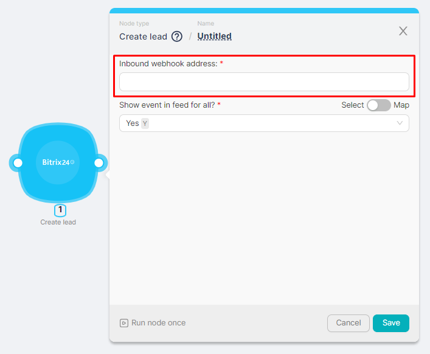
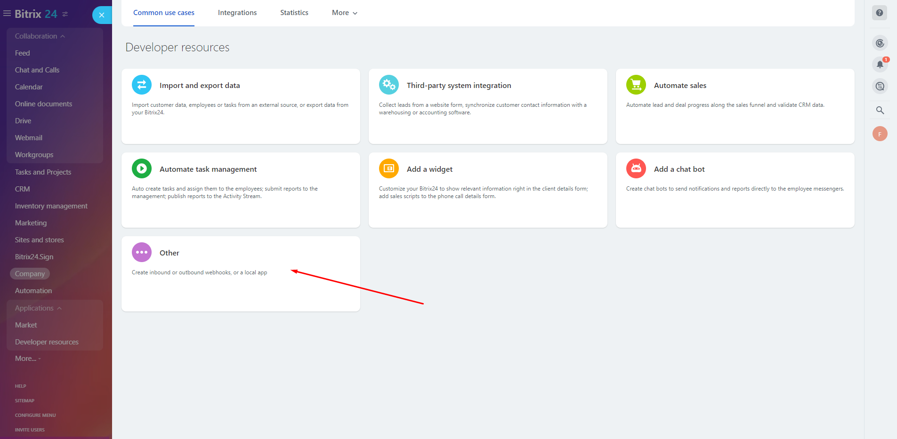
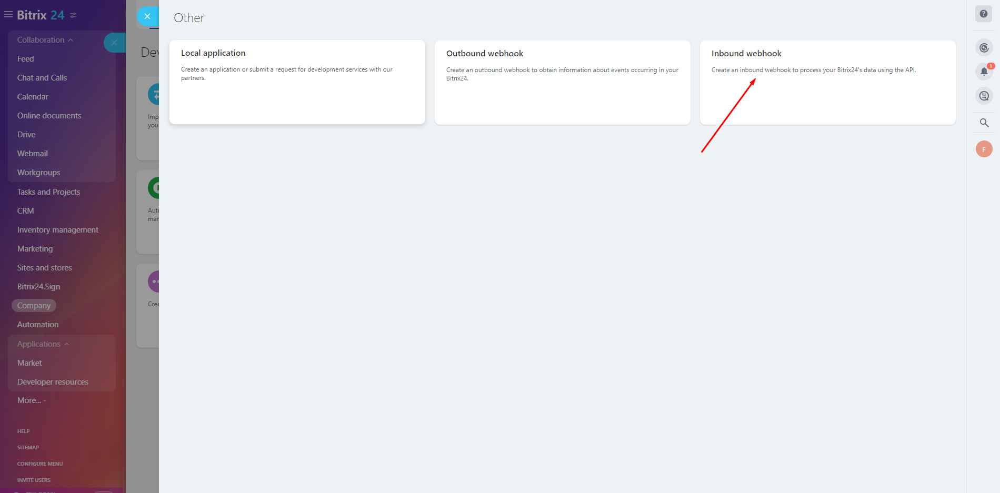
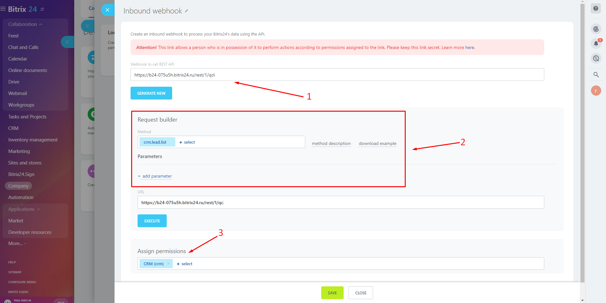
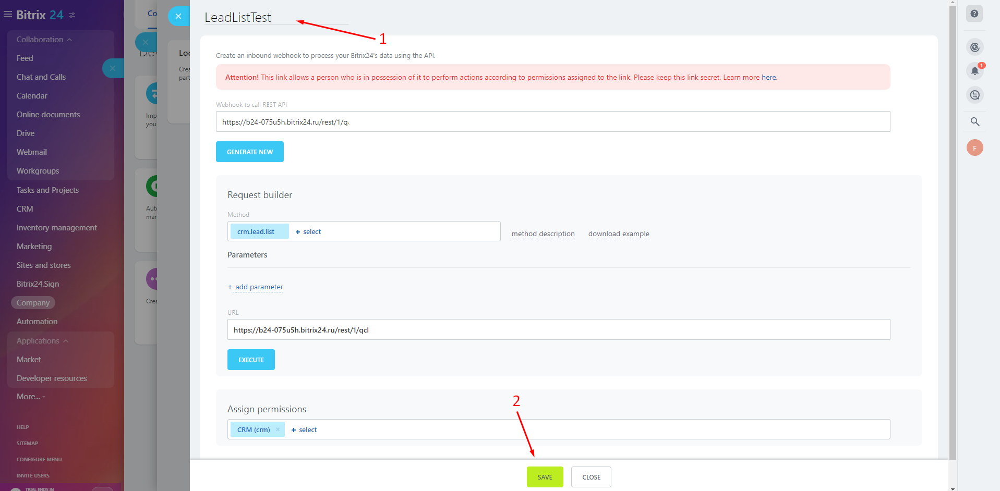
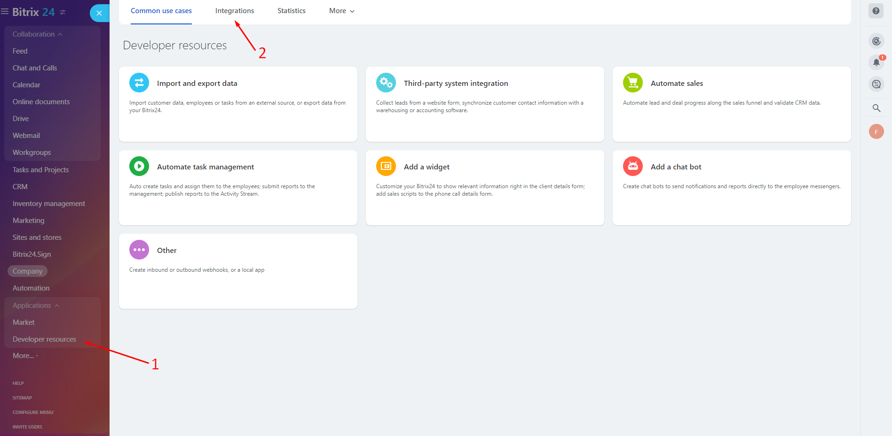
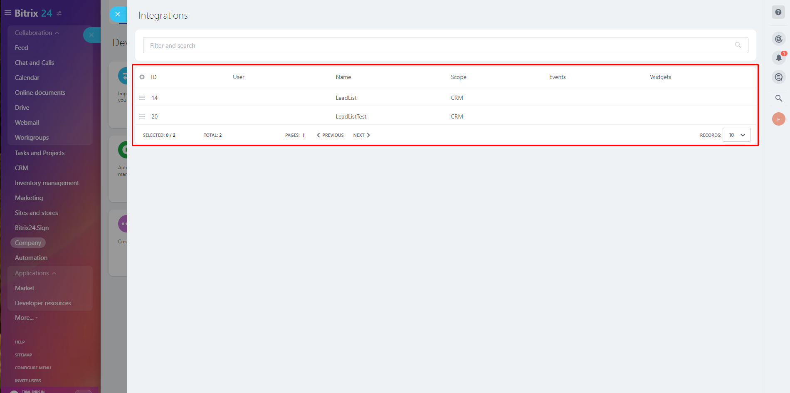

# Bitrix24

To use Bitrix24 nodes, you need to generate an incoming webhook in the application and get its address.

## Obtaining a webhook address

To get the address of a webhook you need to:

1. Register in the Bitrix24 application and go to the application. On the **Developer resources** page, select **Other**:

2. On the Other page, select **Inbound webhook**;

3. On the **Inbound webhook** page:

- **(1)** Copy the automatically generated webhook address;
- **(2)** Select the desired webhook method and, if necessary, configure the parameters;
- **(3)** Configure the necessary permissions (the parameter can be filled in automatically).

4. Add the name of the inbound webhook **(1)** and save the changes **(2)**.

The list of created webhooks is available on the Integrations tab:

