# Discord

For **Discord bot** group nodes to work, you need to get a token and perform authorization.

## Receiving a token

To obtain a token you need to:

1. Go to [Discord Developer Portal](https://discord.com/developers/applications) and create an application by clicking on the **New Application** button;

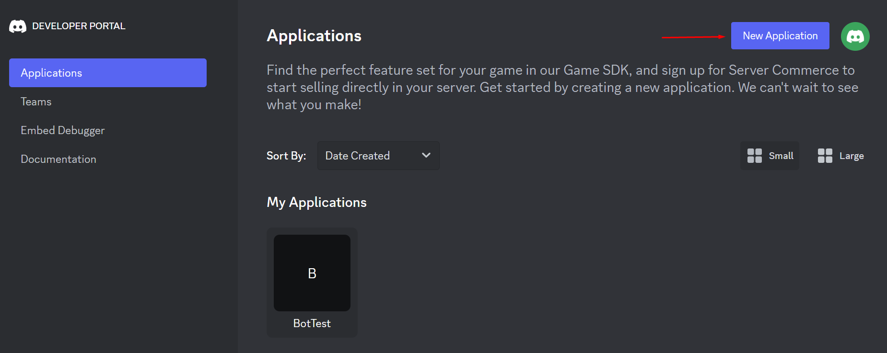

2. Fill in the name of the application, agree to the terms and policies, and then click **Create**;

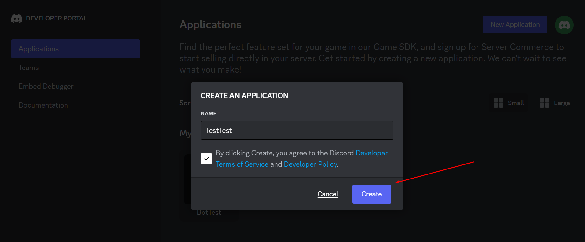

3. On the opened application page, click the tab **Bot**;

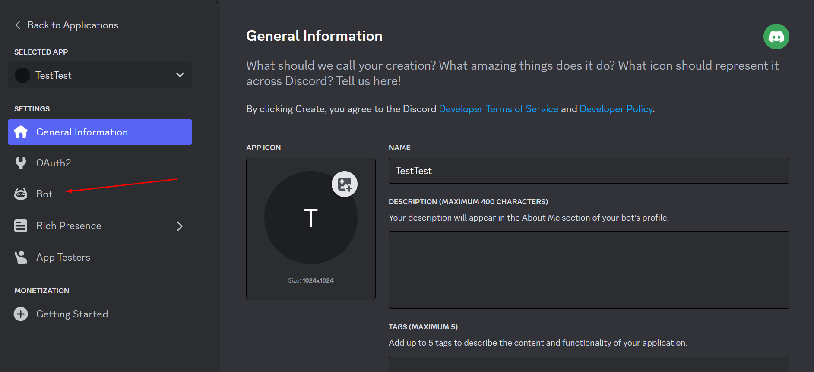

4. Check the privileges available for the bot (it is recommended to check MESSAGE CONTENT INTENT to display message content);

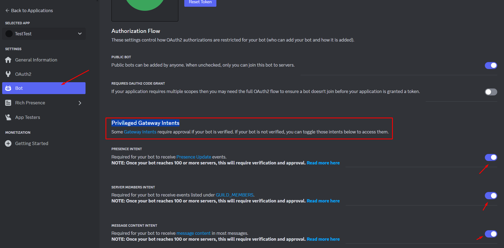

5. Mark bot permissions and save the changes;

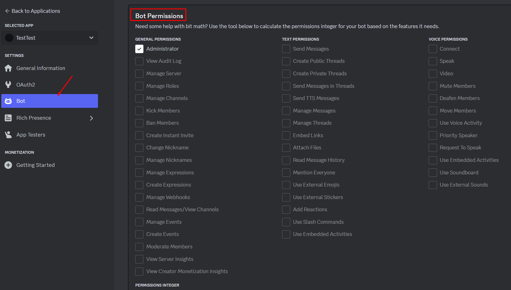

6. On the **OAuth2** tab, check the **bot** checkboxes and the permissions available to it;

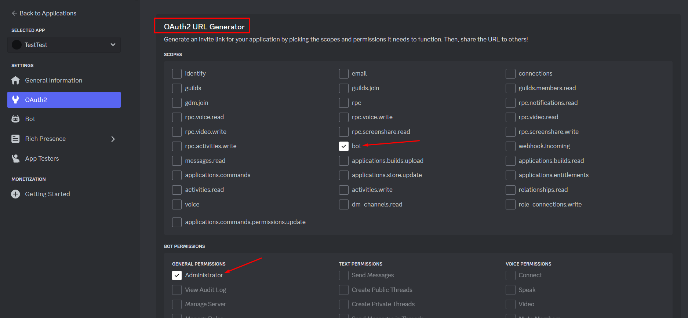

7. Copy the generated URL and navigate to the address in a new browser tab;

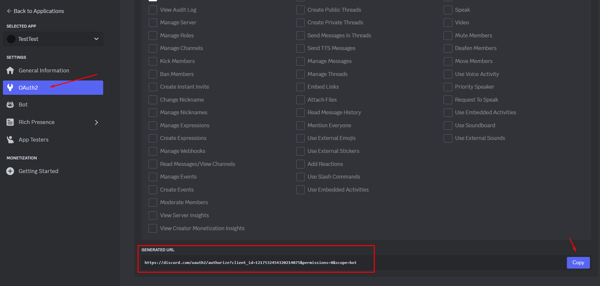

8. Select the server to which you want to add the bot and click **Continue**;

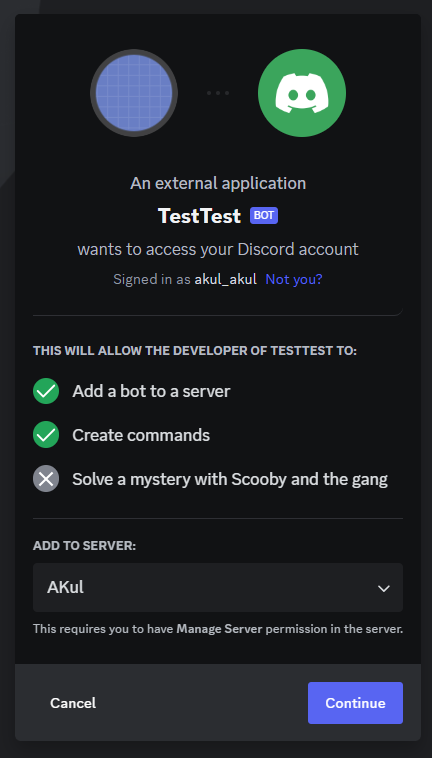

9. Confirm the bot's rights and click on the **Authorize** button. After authorization the bot will be added to the selected server;

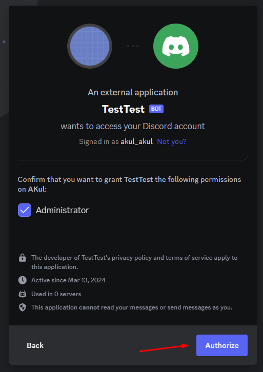

10. Click the **Reset Token** button;

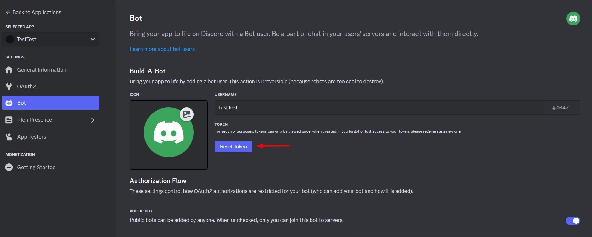

11. Copy the generated token and save it for later use.

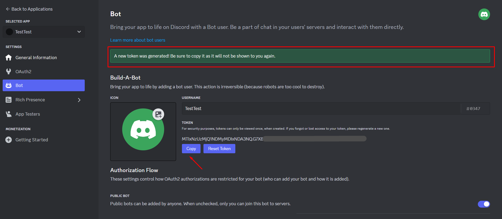
