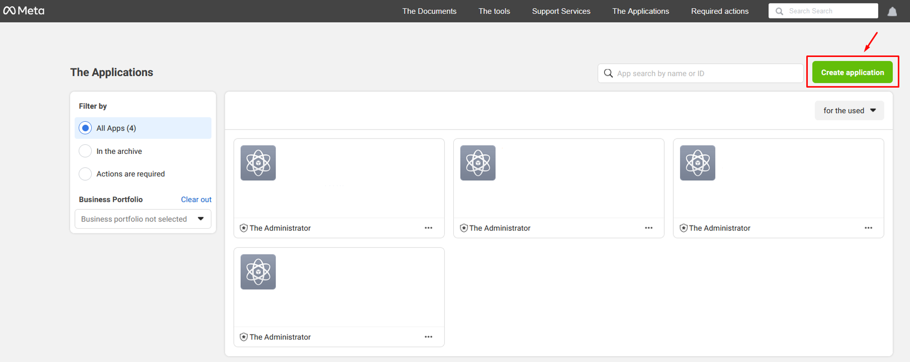
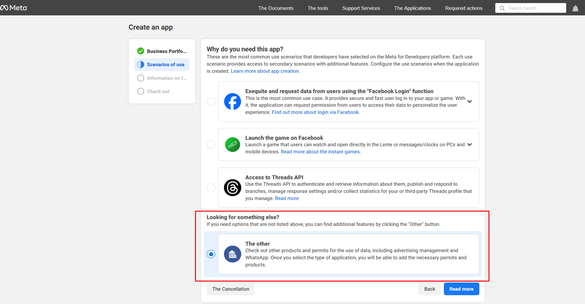
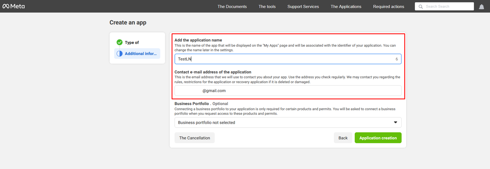
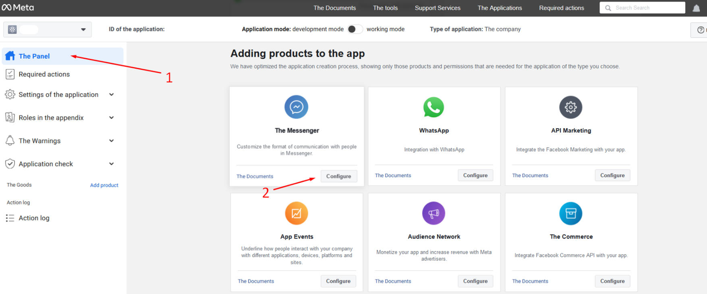
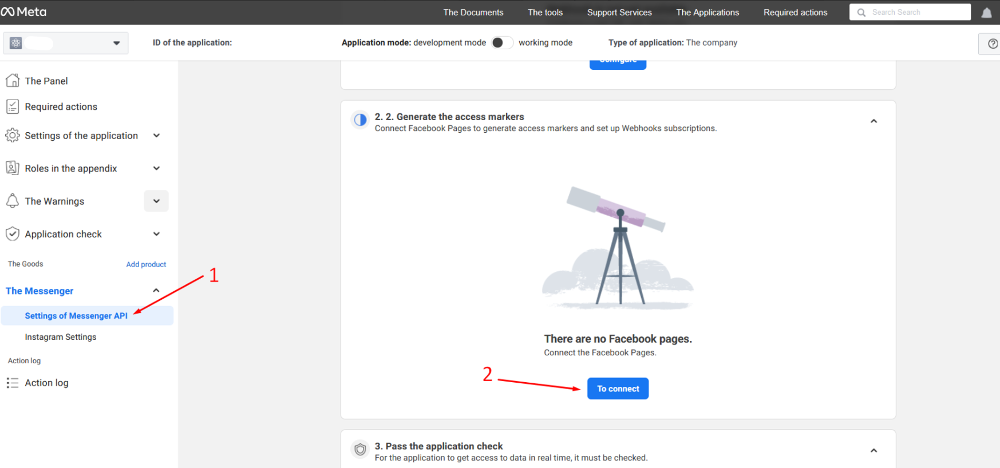
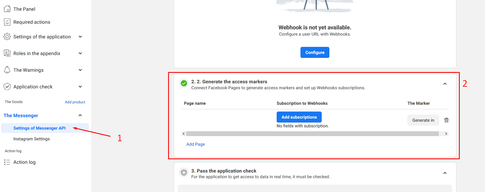

# Facebook

## Receiving a token

<Callout type="warn">
Before following the instructions, you need to sign up for **Facebook**.
</Callout>

For nodes of the **Facebook** group to work, it is necessary to get a token.

To obtain a token you need to:

1. Follow the [link](https://developers.facebook.com/apps) and click the **Create application** button;

2. On the **Create an app** page, select **The other** option and click **Read more**;

3. Fill in the application name, email address, and click the **Application creation** button;

4. On **The Panel** (1) application settings page, select **The messenger** and click **Configure** (2);

5. On the **Settings of Messenger API** (1) page, go to section 2.2 and click the **To connect** button (2). In the dialog box that opens, choose the pages you want your app to access and click Continue and Save.

6. On the **Settings of Messenger API** (1) page, in section 2.2, click the **Generate** button (2);

7. In the **Token Generated** dialog box, confirm that you understand and then copy the token.
