# Fauna

To use **Fauna** group nodes it is necessary to get a key (token) and perform authorization.

## Receiving a token

<Callout type="warn">
The received key (token) must be saved after copying, as it is displayed only when created.
</Callout>

To obtain a token you need to:

1. Register in the **Fauna** app and go to the main [page](https://dashboard.fauna.com/resources/home);

2. Click on the **Create Database** button;

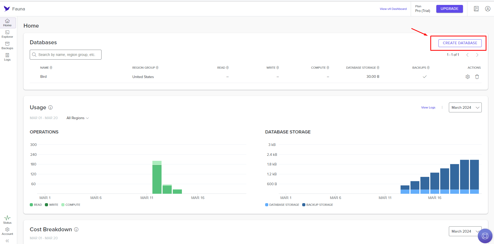

3. Configure the database and click the Create button;

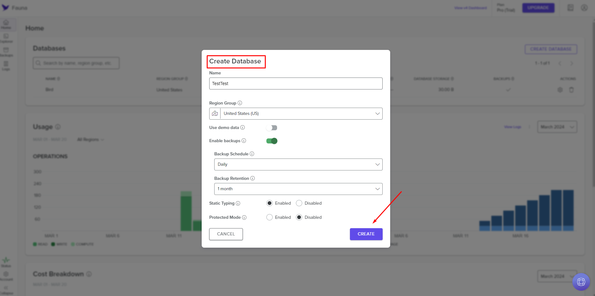

4. Select the required row in the list of databases in the **Databases** table;

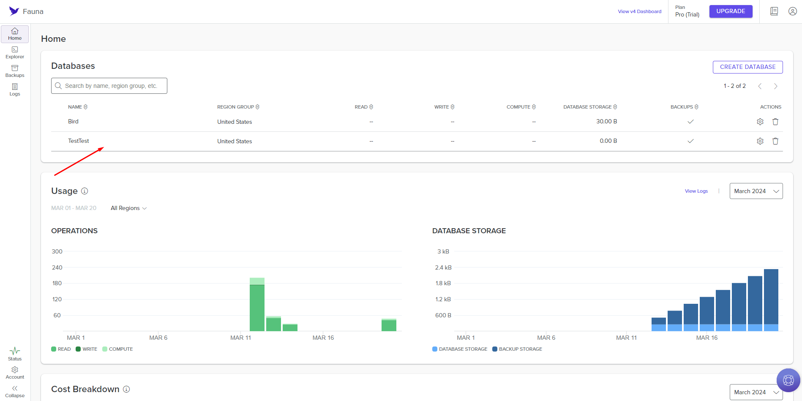

5. Place the cursor over the name of the desired database and click the **Manage Keys** icon;

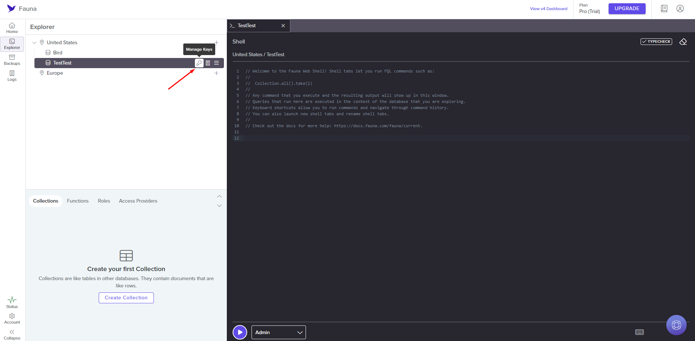

6. Click the **Create Key** button;

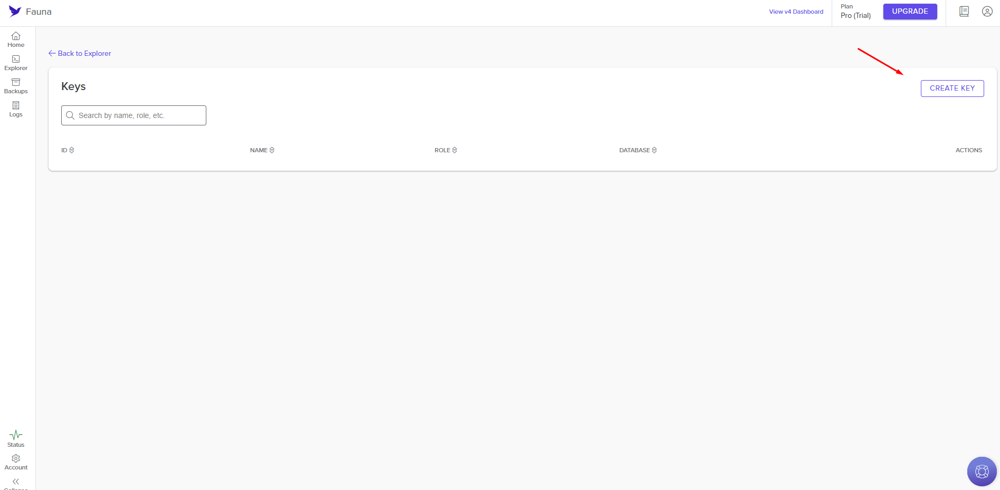

7. Configure the key parameters and click the **Save** button;

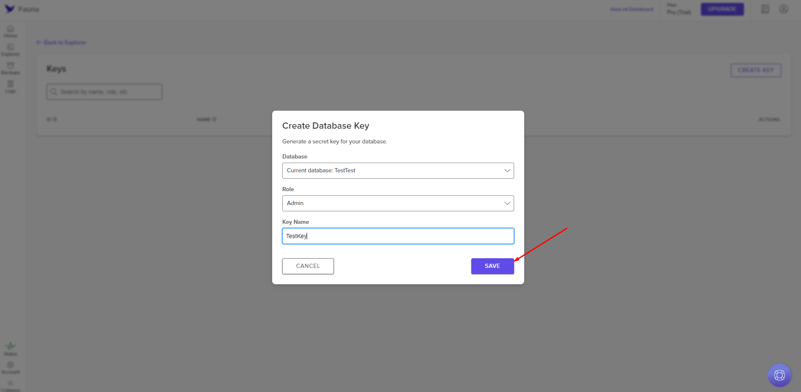

8. Copy the created key and save it.

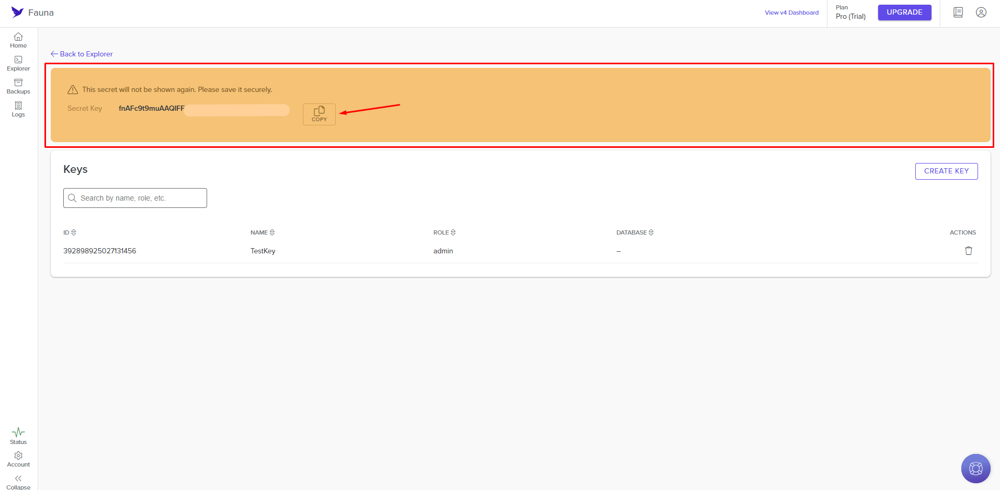

## Configuring authorization in nodes

When configuring a node in the **Fauna** group, authorization is required. To do this, you need to:

1. Select the required node from the **Fauna** group;

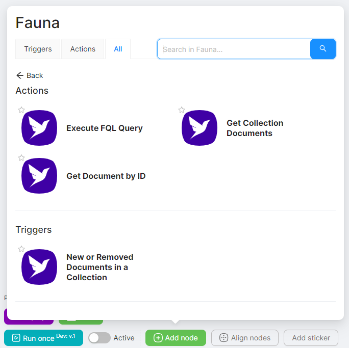

2. Click the **Create Authorization** button;

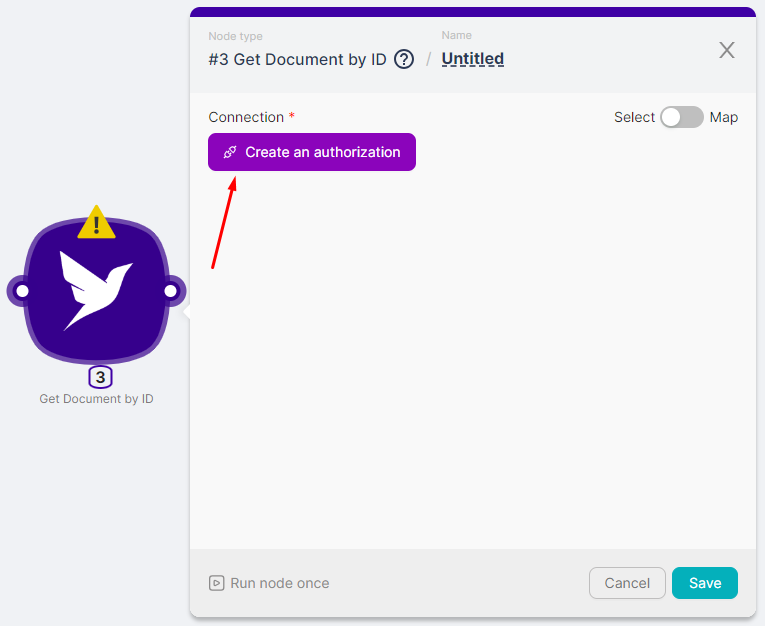

3. Click the **New Authorization** button and select **Access Token**;

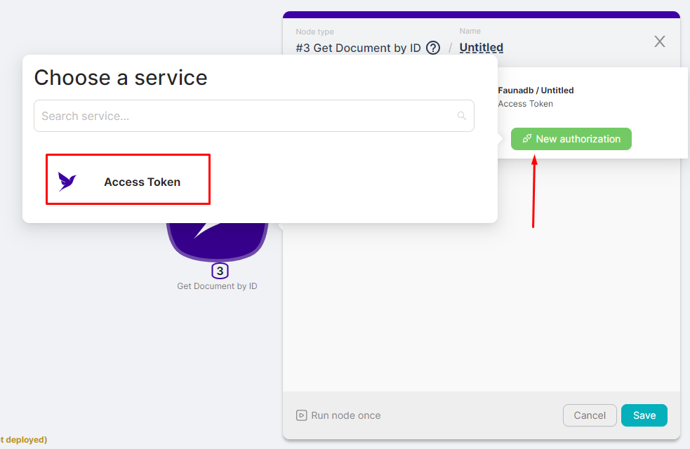

4. In the **access_token** field enter the token you received earlier and click the **Authorize** button;

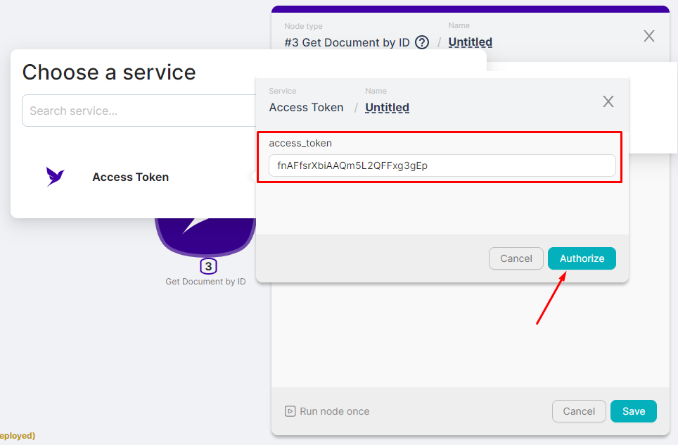

5. View whether the node has authorization and fill in the remaining node configuration fields.

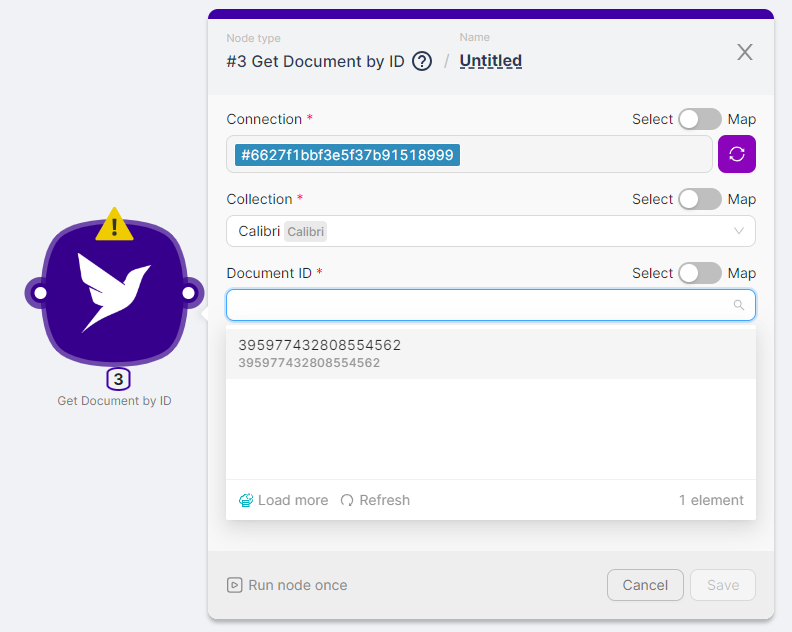

You can view the result of the node execution when you run the scenario or by clicking on the node's **Run Once** button.

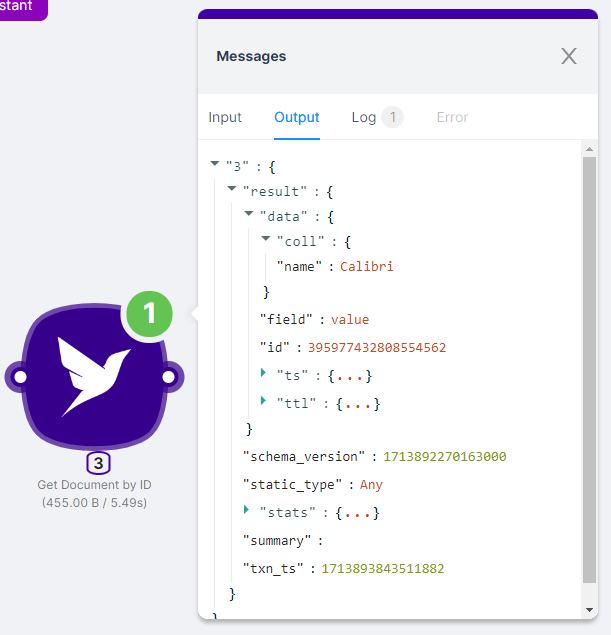
