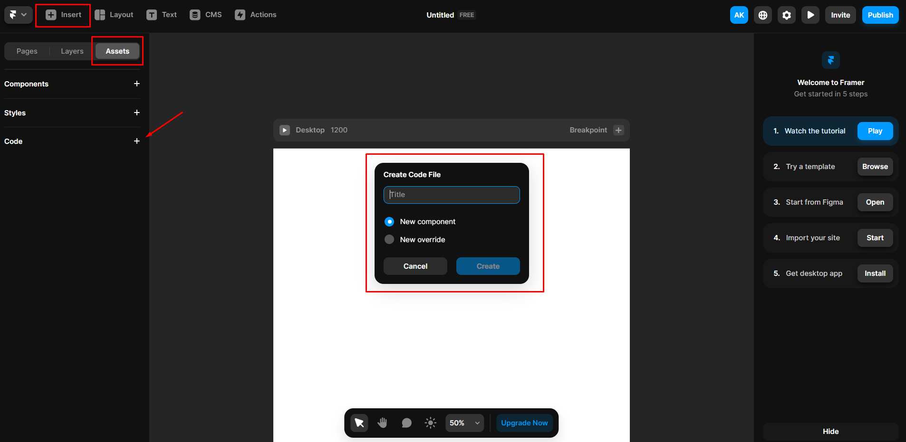
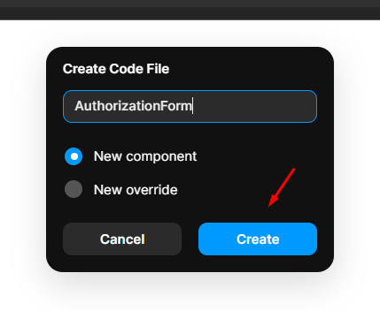
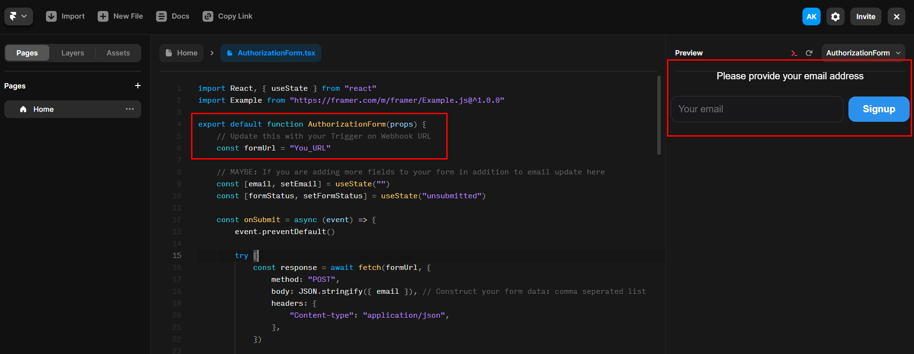
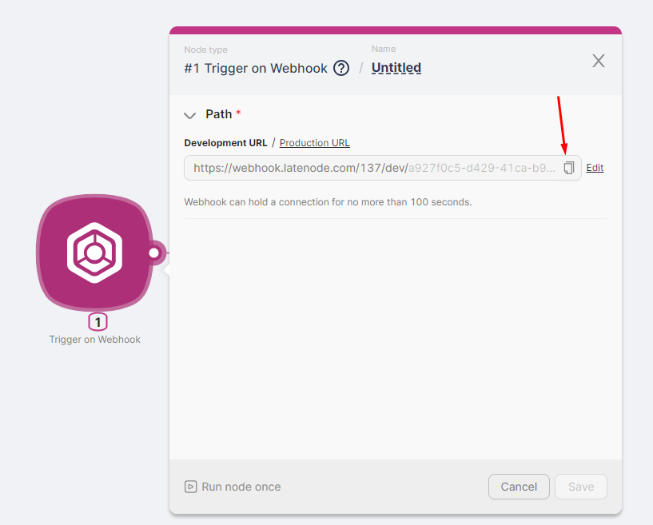
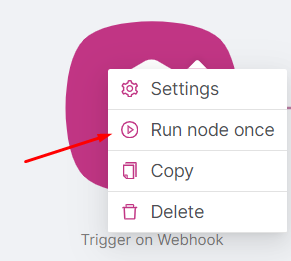
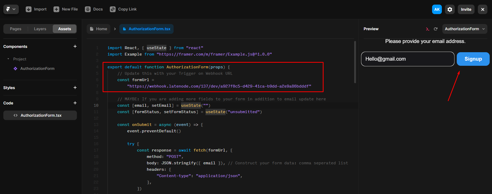
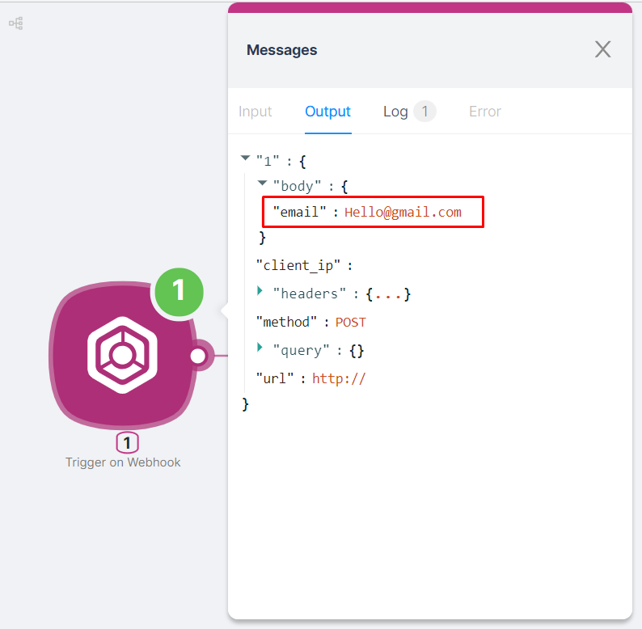
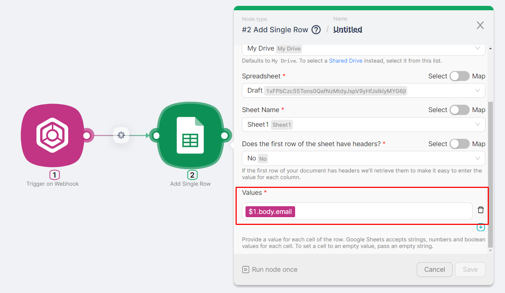
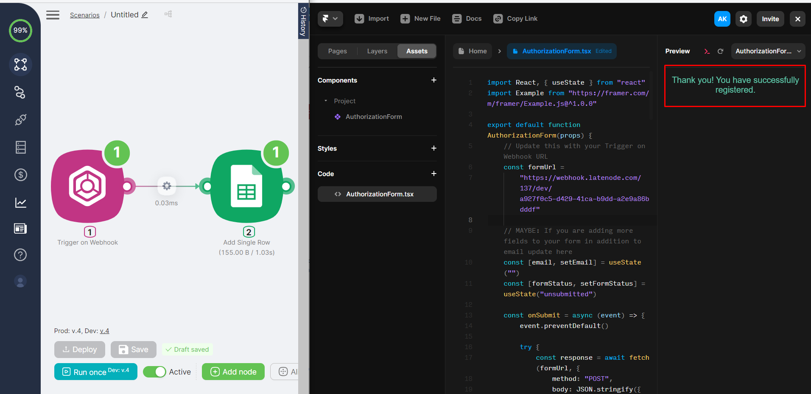
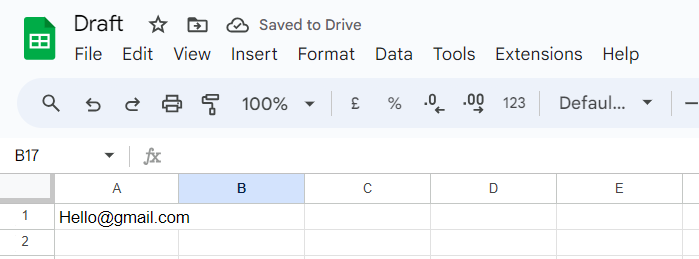

# Framer

The **Latenode** platform allows interaction with websites created using the **Framer** service. For interaction, only the **Trigger on Webhook** node is needed.

Let's create a scenario that records the email address entered in a website form into a Google Sheet. First, use the Framer service to create the registration form with a field for entering the email address and a confirmation button.

## Creating a Framer Form

1. In the Framer workspace, choose the method to add a **Code** element. In the **Create Code File** window, enter any name and select the **New component** option.



2. Click the **Create** button.



3. On the opened page, add the code below and save the changes by pressing Ctrl + S. The form with an email input field and a **Signup** button will appear on the right side of the interface.

```jsx
import React, { useState } from "react"
import Example from "https://framer.com/m/framer/Example.js@^1.0.0"

export default function AuthorizationForm(props) {
    // Update this with your Trigger on Webhook URL
    const formUrl = "Your_URL"

    const [email, setEmail] = useState("")
    const [formStatus, setFormStatus] = useState("unsubmitted")

    const onSubmit = async (event) => {
        event.preventDefault()

        try {
            const response = await fetch(formUrl, {
                method: "POST",
                body: JSON.stringify({ email }),
                headers: {
                    "Content-type": "application/json",
                },
            })

            if (!response.ok) {
                throw new Error("Network response was not ok")
            }

            setFormStatus("submitted")
        } catch (error) {
            console.error("Error during form submission: ", error)
            setFormStatus("error")
        }
    }

    const handleEmailChange = (event) => {
        setEmail(event.target.value)
    }

    if (formStatus === "submitted") {
        return (
            <div style={responseText}>
                Thank you! You have successfully registered.
            </div>
        )
    }

    if (formStatus === "error") {
        return <div>Something went wrong. Please refresh and try again!</div>
    }

    return (
        <>
            <div style={labelStyle}>Please provide your email address.</div>
            <form onSubmit={onSubmit} style={containerStyle}>
                <input
                    type="email"
                    value={email}
                    onChange={handleEmailChange}
                    placeholder="Your email"
                    required
                    style={inputStyle}
                />
                <input type="submit" value="Signup" style={submitButtonStyle} />
            </form>
        </>
    )
}

const containerStyle = {
    display: "flex",
    justifyContent: "space-between",
    alignItems: "center",
    padding: "0.5rem",
    borderRadius: "4px",
    maxWidth: "500px",
    margin: "auto",
}

const inputStyle = {
    flex: "1",
    fontSize: "16px",
    padding: "0.75rem",
    margin: "0",
    backgroundColor: "#18181B",
    border: "1px solid #333",
    borderRadius: "12px",
    color: "#FFF",
    marginRight: "0.5rem",
}

const submitButtonStyle = {
    fontSize: "16px",
    padding: "0.75rem 1.5rem",
    backgroundColor: "#2C91ED",
    color: "#FFF",
    border: "none",
    borderRadius: "12px",
    cursor: "pointer",
    fontWeight: "bold",
}

const responseText = {
    textAlign: "center",
    color: "#5FCEAE",
    fontSize: "16px",
    marginTop: "1rem",
}

const labelStyle = {
    textAlign: "center",
    color: "#FFF",
    fontSize: "16px",
    marginBottom: "1rem",
}
```



## Setting Up the Latenode Scenario and Sending Email

1. In the scenario created on the platform, add a **Trigger on Webhook** node. After adding, copy the URL address. You can run the node once to view the output data.





2. Replace `Your_URL` in the Framer form code with the URL address of the **Trigger on Webhook** node.

<Callout type="warn">
Remember, the **Production-branch** of the scenario is initiated by a request sent to the Production-version URL of the **Trigger on Webhook** node. The **Development-branch** of the scenario is initiated by a request sent to the Development-version URL of the **Trigger on Webhook** node.
</Callout>

3. After adding the URL address, fill in the field with a test email address and click the **Signup** button.



4. Once you click the **Signup** button, the **Trigger on Webhook** node will execute, and the output data will include the provided email address.



5. To record the received email address in a Google Sheet, add an **Add Single Row** node and configure it:

- Create or select an existing authorization.
- Choose the desired Google Sheet and sheet tab.
- Select the parameter from the previous node for the **Values** field in the auxiliary window.



The result of the scenario execution is that the email address entered in the **Framer** form is recorded in a cell of the **Google** Sheet.




