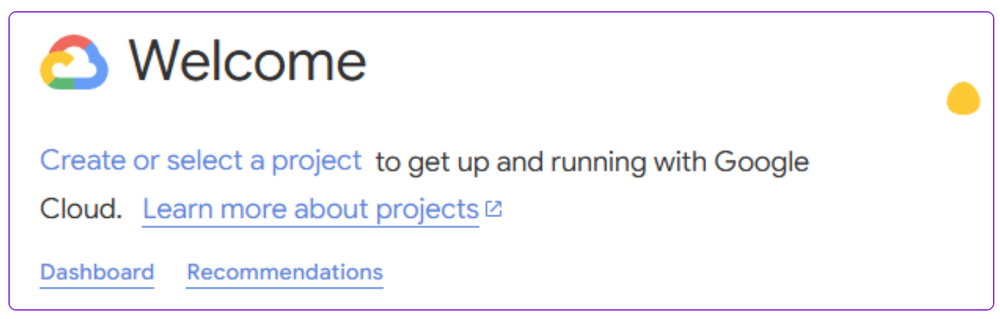
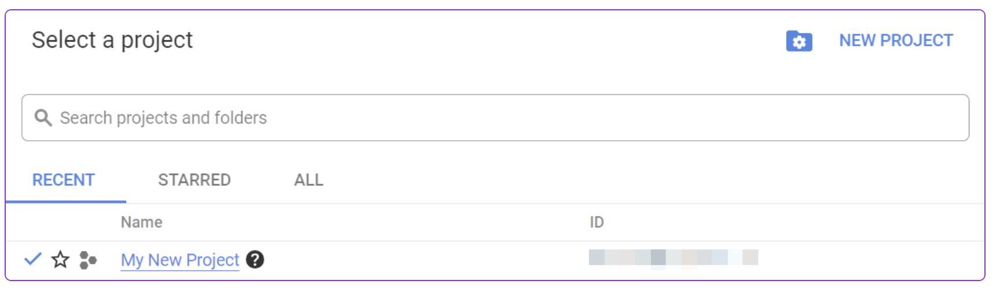
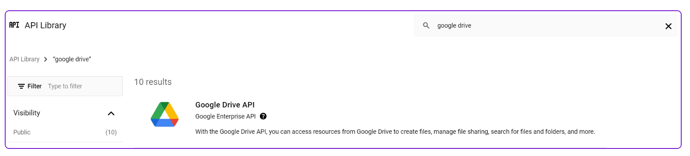
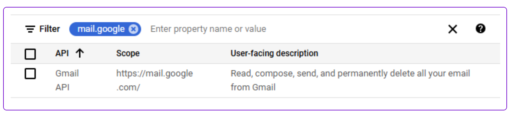
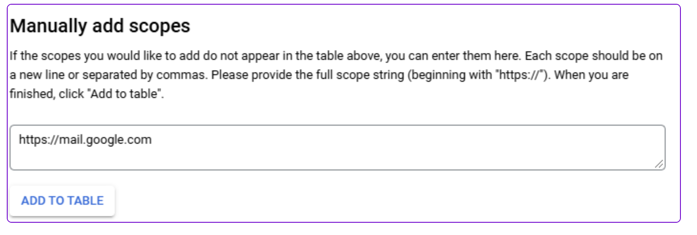
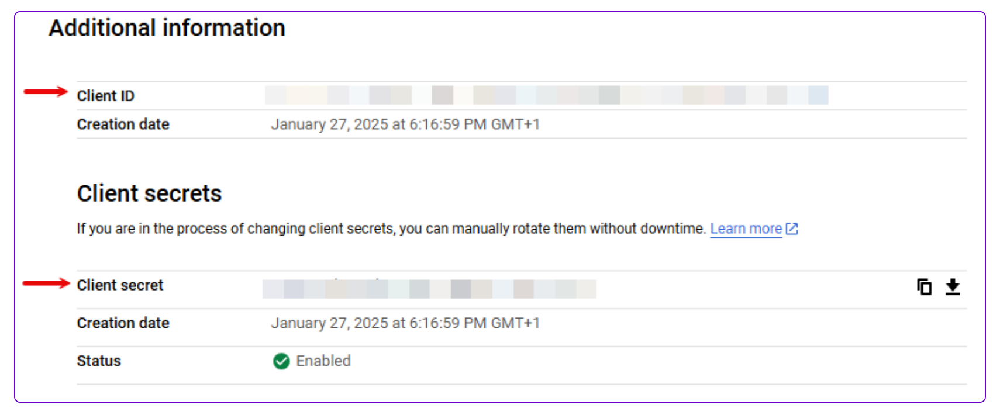

# Google Services (Personal Account)

## Create and configure a Google Cloud Platform project for Google Personal OAuth

<Callout type="info">
You need to follow this procedure if you use an email address that ends with `@gmail` or `@googlemail`.
To create a new project or work in the existing one, you need to have the `serviceusage.services.enable` permission. If you don't have this permission, ask the Google Cloud Platform Project Owner or Project IAM Admin to grant it to you.
</Callout>

To connect to Latenode using your own client credentials, you can create and configure a project in the Google Cloud Platform.

## Create a Google Cloud Platform project for Google Drive

To create a Google Cloud Platform project:

1. Log in to the Google Cloud Platform using your Google credentials.
2. On the welcome page, click **Create or select a project** > **New project**. If you already have a project, proceed to step 5.

3. Enter a **Project name** and select the **Location** for your project.
4. Click **Create**.
5. In the top menu, check if your new project is selected in the **Select a project** dropdown. If not, select the project you just created.

## Enable the required API

1. Open the left navigation menu and go to **APIs & Services** > **Library**.
2. Search for the following required APIs: e.g **Google Drive API**.
3. Click **Google Drive API** (or any other service API you need), then click **Enable**. If you see the **Manage** button instead of the **Enable** button, you can proceed to the next step: the API is already enabled.

## Configure your OAuth consent screen for Google Drive

To configure your OAuth consent screen:

1. In the left sidebar, click **Google Auth Platform**.
2. Click **Get Started**.
3. In the **Overview** section, under **App information**, enter **Latenode** as the app name and provide your Gmail address. Click **Next**.
4. Under **Audience**, select **External**. Click **Next**.

<Callout type="info">
For more information regarding user types, refer to [Google's Exceptions to verification requirements documentation](https://support.google.com/cloud/answer/9110914#exceptions-ver-reqts).
</Callout>

5. Under **Contact Information**, enter your Gmail address. Click **Next**.
6. Under **Finish**, agree to the Google User Data Policy.
7. Click **Continue** > **Create**.
8. Click **Create OAuth Client**.
9. In the **Branding** section, under **Authorized domains**, add `app.latenode.com`. Click **Save**.
10. Optional: In the **Audience** section, add your Gmail address on the **Test users** page, then click **Save and continue** if you want the project to remain in the **Testing** publishing status.
11. In the **Data Access** section, click **Add or remove scopes**, add the following scopes (please find table below with service reference).

You can add scopes using:

- A table with filters:

- A window to manually enter scopes:

12. Click **Update**.
13. Click **Save**.

## Create your Google OAuth client credentials

To create your client credentials:

1. In Google Auth Platform, click **Clients**.
2. Click **+ Create Client**.
3. In the **Application type** dropdown, select **Web application**.
4. Update the **Name** of your OAuth client. This will help you identify it in the platform.
5. In the **Authorized redirect URIs** section, click **+ Add URI** and enter the following redirect URI: `https://app.latenode.com/redirected/index.html`
6. Click **Create**.
7. Click the OAuth 2.0 Client you created, copy your **Client ID** and **Client secret** values, and store them in a safe place.

You will use these values in the **Client ID** and **Client Secret** fields in Latenode.

## Establish the connection in Latenode

1. Log in to your Latenode account, add a nodule to your scenario, and click **Create an authorization > New authorization > Personal App Google \<Service\> Oauth 2.0**
2. Optional: In the **Connection name** field, enter a name for the connection.
3. Enter your Client ID and Client secret that you created in the previous section.
4. Click **Sign in with Google**.
5. If prompted, authenticate your account, grant all requested permissions, and confirm access.

You have successfully established the connection. You can now edit your scenario and add more Google nodules.

## Required scopes for your connection

| Google OAuth | Scopes |
| --- | --- |
| Gmail | `https://www.googleapis.com/auth/userinfo.email` `https://mail.google.com/` |
| Google Calendar | `https://www.googleapis.com/auth/userinfo.email` `https://www.googleapis.com/auth/calendar` `https://www.googleapis.com/auth/calendar.readonly` `https://www.googleapis.com/auth/calendar.events.owned` `https://www.googleapis.com/auth/calendar.settings.readonly` |
| Google Analytics | `https://www.googleapis.com/auth/userinfo.email` `https://www.googleapis.com/auth/cloud-platform` `https://www.googleapis.com/auth/cloud-platform.read-only` `https://www.googleapis.com/auth/analytics` `https://www.googleapis.com/auth/analytics.edit` `https://www.googleapis.com/auth/analytics.manage.users` `https://www.googleapis.com/auth/analytics.manage.users.readonly` `https://www.googleapis.com/auth/analytics.provision` `https://www.googleapis.com/auth/analytics.readonly` `https://www.googleapis.com/auth/analytics.user.deletion` |
| Google Ads | `https://www.googleapis.com/auth/userinfo.email` `https://www.googleapis.com/auth/adwords` |
| Google BigQuery | `https://www.googleapis.com/auth/userinfo.email` `https://www.googleapis.com/auth/bigquery` `https://www.googleapis.com/auth/bigquery.insertdata` `https://www.googleapis.com/auth/bigquery.readonly` `https://www.googleapis.com/auth/cloud-platform` `https://www.googleapis.com/auth/cloud-platform.read-only` |
| Google Cloud Dialogflow | `https://www.googleapis.com/auth/cloud-platform.read-only` `https://www.googleapis.com/auth/cloud-platform` `https://www.googleapis.com/auth/dialogflow` |
| Google Cloud Firestore | `https://www.googleapis.com/auth/userinfo.email` `https://www.googleapis.com/auth/cloud-platform` `https://www.googleapis.com/auth/datastore` |
| Google Cloud Speech-to-Text/Text-to-Speech | `https://www.googleapis.com/auth/userinfo.email` `https://www.googleapis.com/auth/cloud-platform` |
| Google Cloud Translate | `https://www.googleapis.com/auth/userinfo.email` `https://www.googleapis.com/auth/cloud-translation` `https://www.googleapis.com/auth/cloud-platform` |
| Google Contacts | `https://www.googleapis.com/auth/contacts.other.readonly` `https://www.googleapis.com/auth/contacts.readonly` `https://www.googleapis.com/auth/contacts` `openid` `https://www.googleapis.com/auth/userinfo.profile` `https://www.googleapis.com/auth/userinfo.email` |
| Google Docs | `https://www.googleapis.com/auth/userinfo.email` `https://www.googleapis.com/auth/drive` `https://www.googleapis.com/auth/drive.readonly` `https://www.googleapis.com/auth/docs` `https://www.googleapis.com/auth/drive.file` |
| Google Drive | `https://www.googleapis.com/auth/userinfo.email` `https://www.googleapis.com/auth/drive` `https://www.googleapis.com/auth/drive.readonly` |
| Google Forms | `https://www.googleapis.com/auth/forms.body` `https://www.googleapis.com/auth/forms.body.readonly` `https://www.googleapis.com/auth/forms.responses.readonly` `https://www.googleapis.com/auth/userinfo.email` `https://www.googleapis.com/auth/drive` |
| Google Groups | `https://www.googleapis.com/auth/userinfo.email` `https://www.googleapis.com/auth/admin.directory.group` `https://www.googleapis.com/auth/admin.directory.domain` |
| Google Business Profile | `email` `https://www.googleapis.com/auth/business.manage` |
| Google Sheets | `https://www.googleapis.com/auth/drive` `https://www.googleapis.com/auth/drive.readonly` `https://www.googleapis.com/auth/spreadsheets` `https://www.googleapis.com/auth/user.emails.read` `https://www.googleapis.com/auth/userinfo.email` `https://www.googleapis.com/auth/userinfo.profile` |
| Google Slides | `https://www.googleapis.com/auth/userinfo.email` `https://www.googleapis.com/auth/drive` `https://www.googleapis.com/auth/drive.file` `https://www.googleapis.com/auth/drive.readonly` `https://www.googleapis.com/auth/presentations` `https://www.googleapis.com/auth/presentations.readonly` `https://www.googleapis.com/auth/spreadsheets` `https://www.googleapis.com/auth/spreadsheets.readonly` |
| Google Tasks | `https://www.googleapis.com/auth/userinfo.email` `https://www.googleapis.com/auth/tasks` `https://www.googleapis.com/auth/tasks.readonly` |
