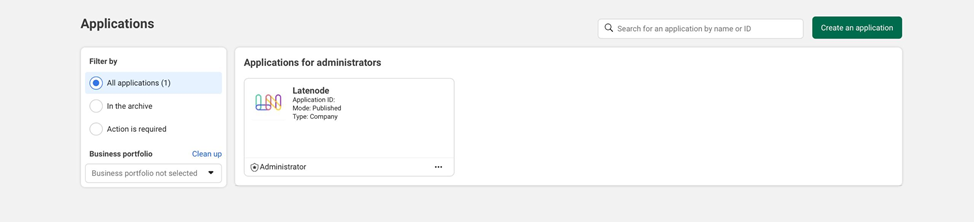
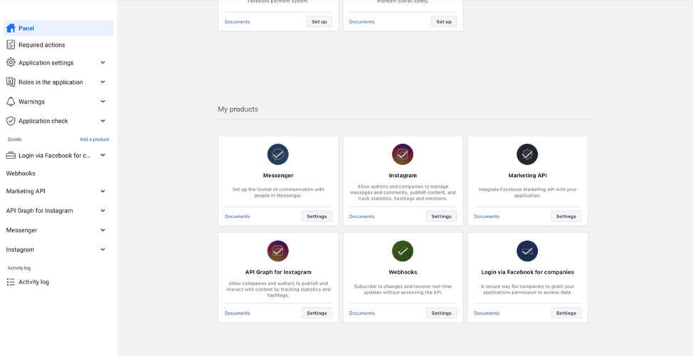
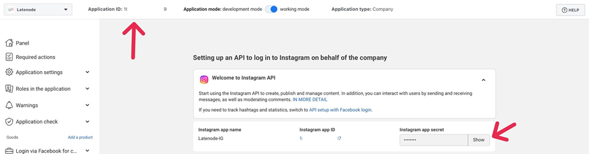
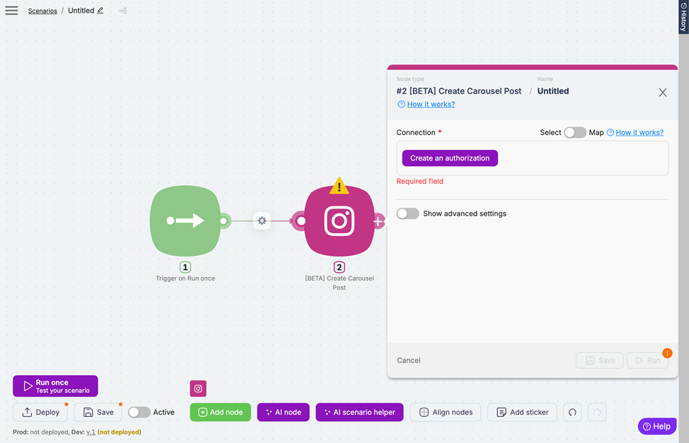

# Instagram for Business (Personal Account)

## Overview

Instagram for Business provides powerful tools including analytics, advertising options, and shopping capabilities to help companies showcase products, engage customers, and grow their brand online. With the Instagram for Business (Personal Account) integration on Latenode, you can automate workflows involving events, insights, media, users, comments, and stories from your Instagram Business account.

## Requirements

Before connecting Instagram for Business to Latenode, ensure you have:

1. A Facebook account with admin-level access to a Facebook Page connected to your Instagram account
2. An Instagram Business account (not a Creator account)

If you have a regular Instagram account, convert it to a Business account using [Instagram's guide](https://help.instagram.com/502981923235522)

## Creating a Facebook Developer App

1. Go to the [Facebook Developer Portal](https://developers.facebook.com/)
2. Click "My Apps" in the upper right corner and select "Create an app."
3. Click the admin app you created

4. On the main "Dashboard" page, find Instagram under "My Products" and click the "Settings" button.

5. On the "Set up Instagram Business Login API" page, copy the Instagram App ID and App Secret values.

## Connecting to Latenode

1. Log in to your Latenode account
2. Create a new scenario or open an existing one
3. Add an Instagram for Business action or trigger to your scenario
4. Click "Create an authorization" and click "New authorization"

5. Click **Personal App Instagram Oauth 2.0**
6. Enter your Client ID and Client secret that you created in the previous section
7. Configure the added action or trigger
8. Click "Save" or "Save & Run"

## Troubleshooting Connection Issues

If no Instagram pages appear in the dropdown:

1. Verify your Facebook account has admin access to the connected Facebook Page
2. Confirm your Instagram account is a Business account (not Creator)
3. Ensure proper connection between Facebook Page and Instagram account via Meta Business Suite

## Available Nodes

After connecting, you can use these nodes:

### Actions

- **Create Carousel Post** — Create multi-image carousel posts
- **Create Photo Post** — Publish single image posts
- **Download Media** — Download media content from your account
- **Get Media Insights** — Retrieve analytics for specific media items
- **Get User Insights** — Access detailed user analytics
- **List Album Media** — View all media in an album
- **List Media Comments** — Retrieve comments on specific media
- **List Stories** — Get a list of all active stories

### Triggers

- **New Media Posted in My Account** — Detects when new photos, videos, or carousels are published on your Instagram Business account.

## Additional Resources

- [Instagram API with Facebook Login documentation](https://developers.facebook.com/docs/instagram-api)
- [Instagram for Business Help Center](https://help.instagram.com/)
