# MongoDB

To use nodes in the **MongoDB** group, you must obtain authorization credentials.

## Obtaining credentials

To obtain a host, login credentials, and password, you must:

1. Register in the **MongoDB** application and start the cluster creation process. In the **Deploy your database** section, you can select the free plan and leave the default settings (cluster name in the **Name** field, etc.);

2. Click the **Create Deployment** button;

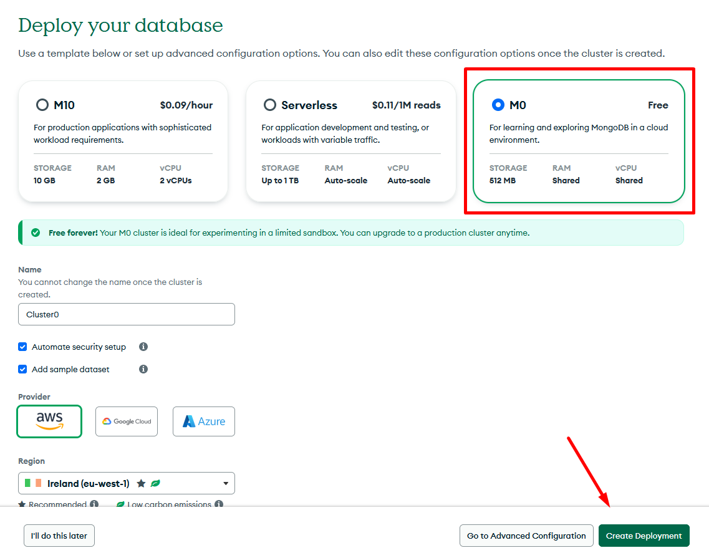

3. Add a user with access to the database by defining their login (**Username**) and password (**Password**). The data can be copied;

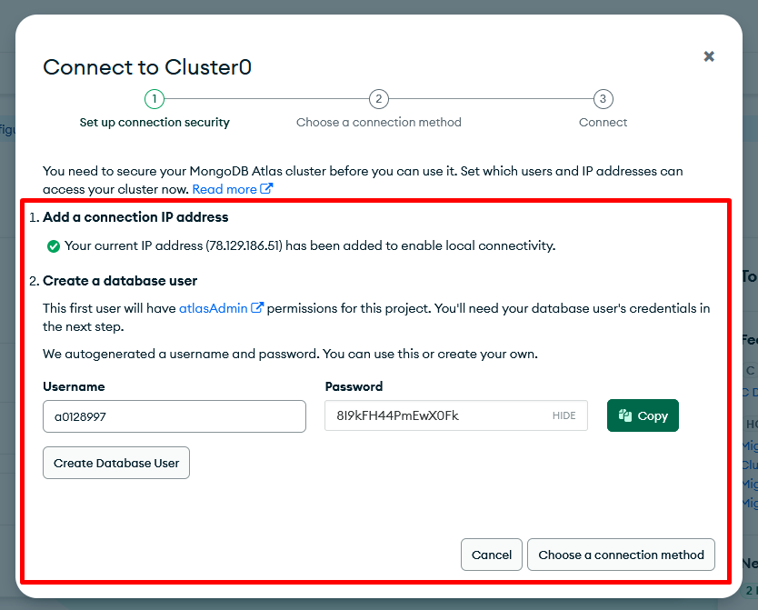

4. Click the **Create Database User** button;

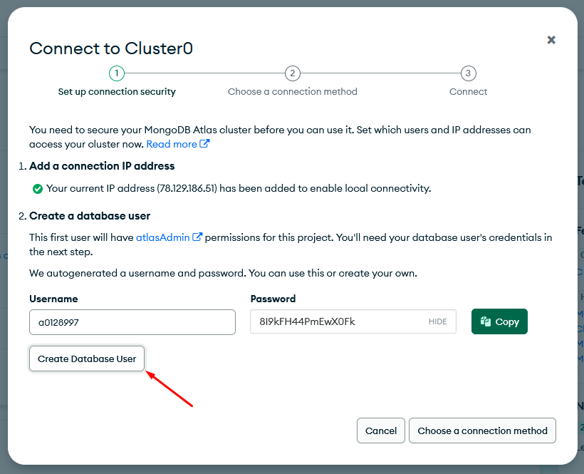

5. Click the **Choose a connection method** button;

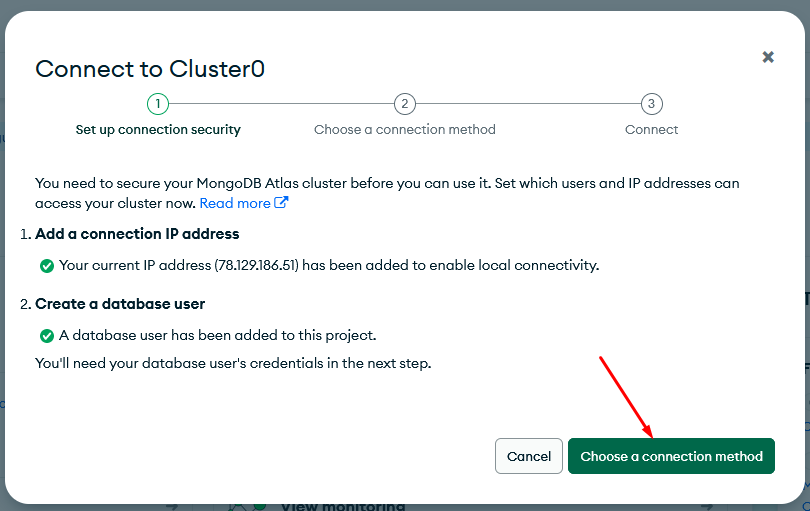

6. Select **Drivers**;

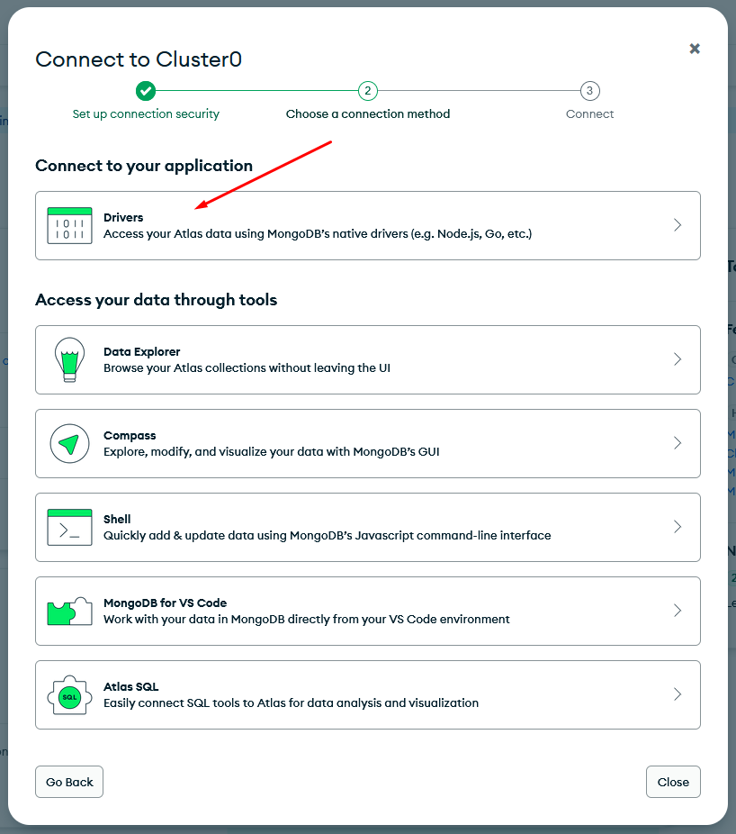

7. Leave the default settings and view the string generated in step 3. **Copy the part of the string after the @ and before the ?** In the example: `cluster0.piecrrs.mongodb.net/`. Click the **Review setup steps** button.

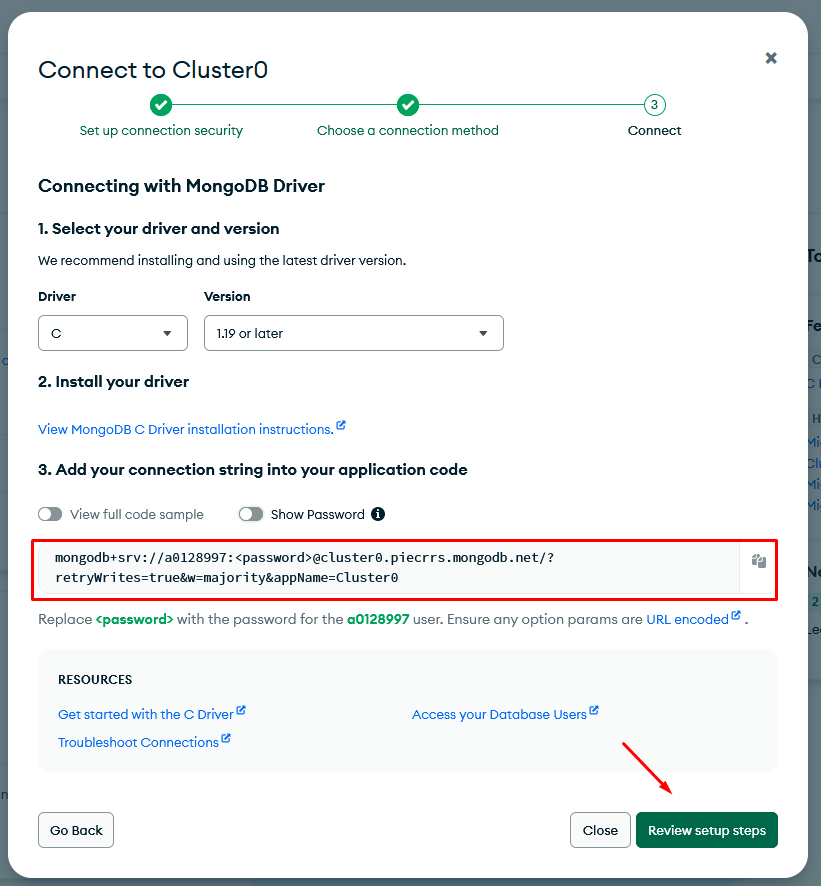

8. View the string to connect in the next setup window (you can copy part of the string if not done in the previous step). Click the **Done** button.

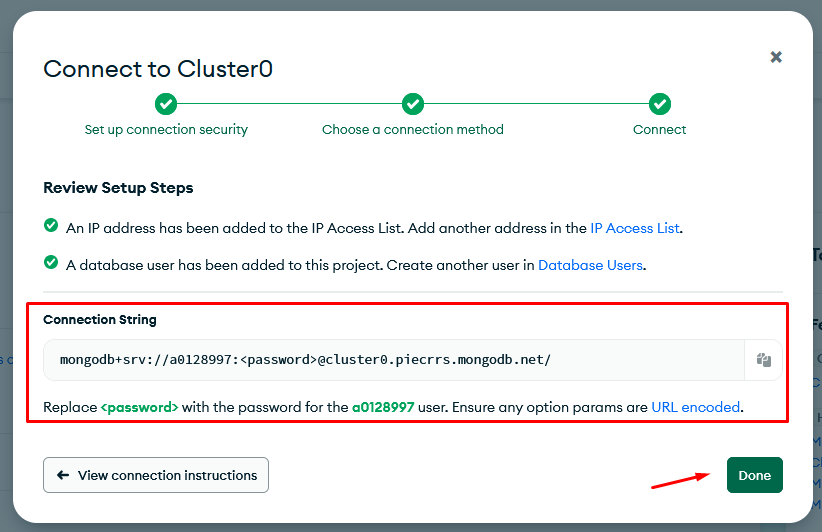

9. View the created cluster on the **Database** tab;

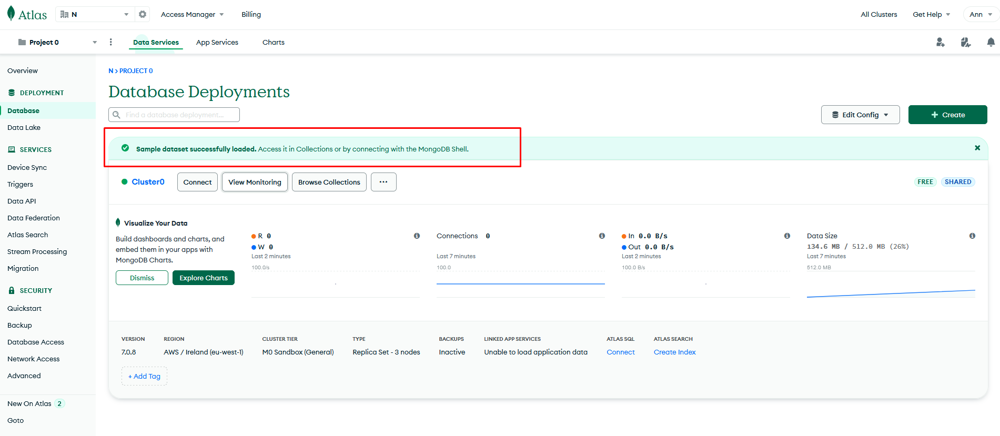

10. Go to the **Network Access** tab and click on the **Add IP Address** button;

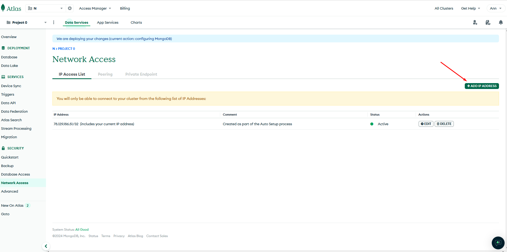

11. Click the **Allow access from anywhere** button (no special access settings are needed to test authorization). Click the **Confirm** button.

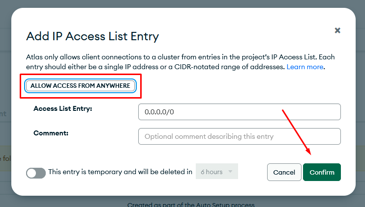

12. View access availability on the **Network Access** tab.

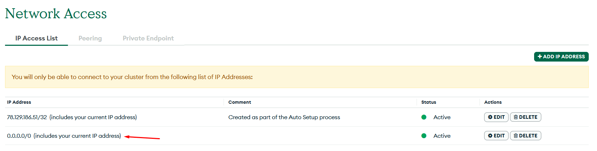

<Callout type="warn">
For authorization you will need: **login and password from step 3 and a part of the string from step 7.**
</Callout>

## Configuring authorization in nodes

When configuring a node in the **MongoDB** group, authorization is required. To do this, you need to:

1. Select the required node from the **MongoDB** group;

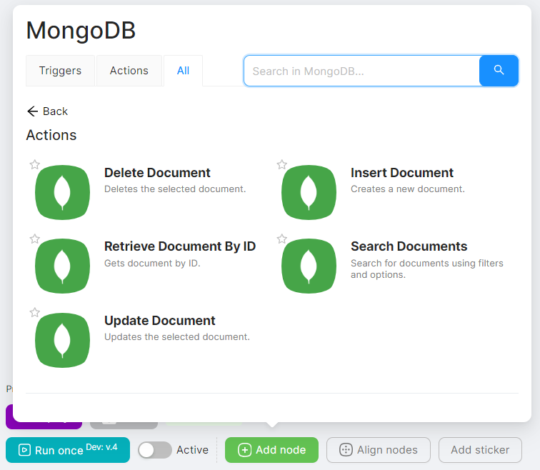

2. Click the **Create an authorization** button;

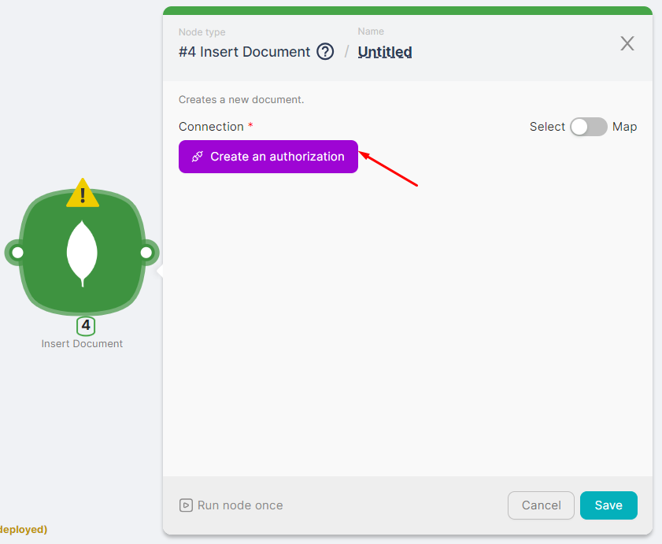

3. Click on **New Authorization** and select **MongoDB API Key**;

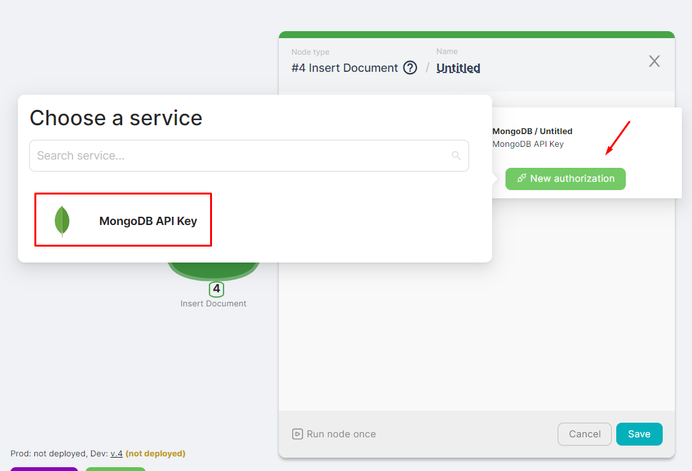

4. In the fields for credentials enter the host (part of the string from step 7 of the instructions above), login and password (from step 3 of the instructions above). Click the **Authorize** button;

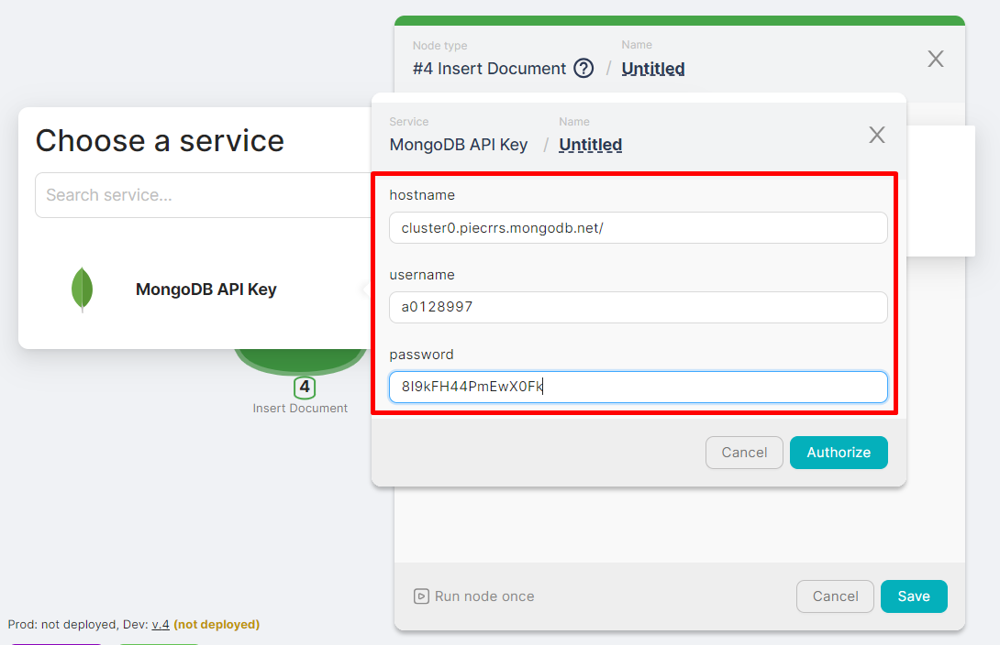

5. View whether the node is authorized and fill in the remaining node configuration fields.

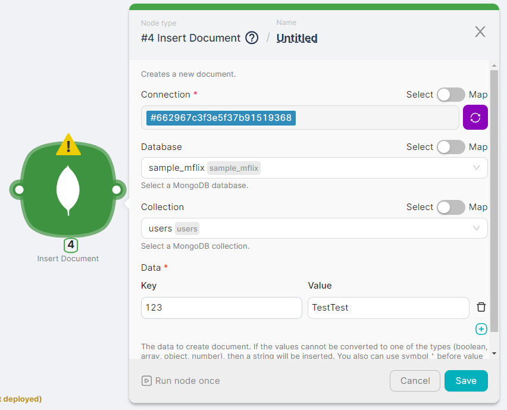

You can view the result of the node execution when you run the scenario or by clicking on the node's **Run Once** button.

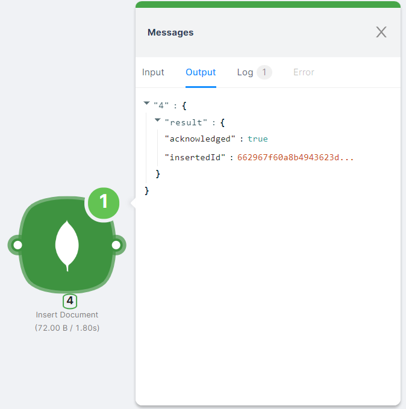
