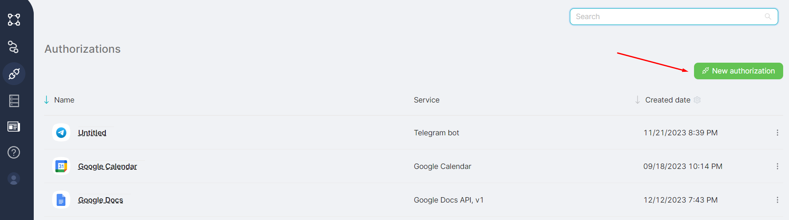
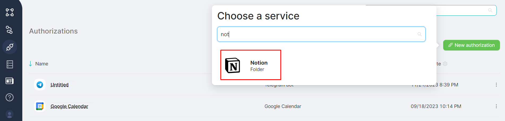
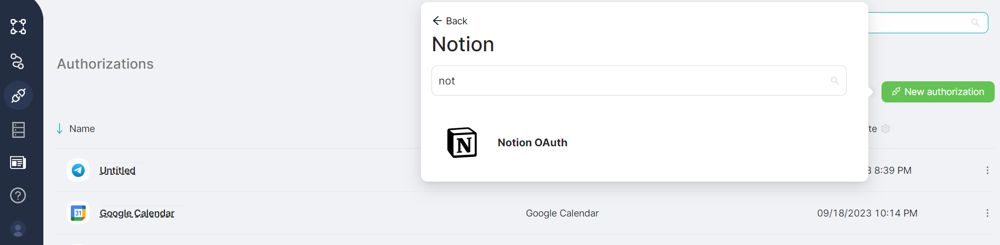
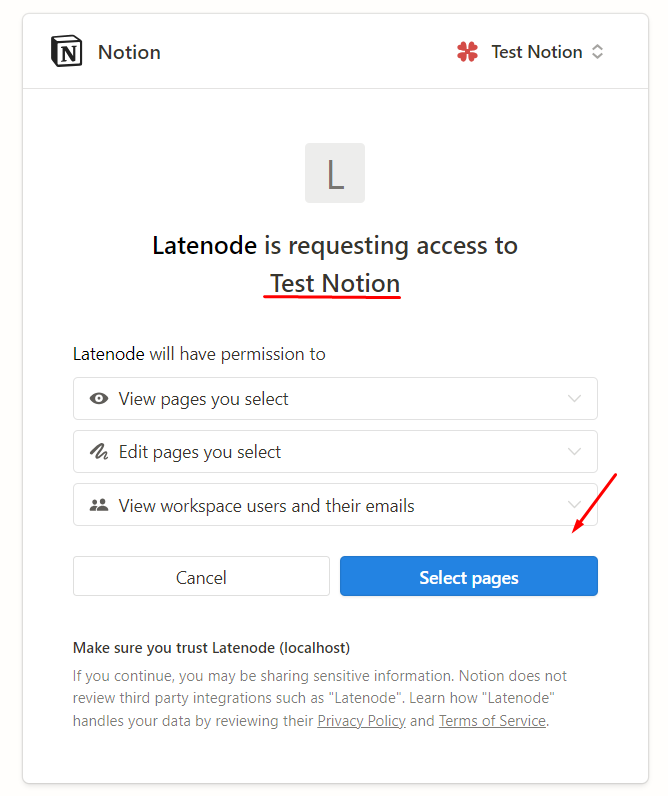
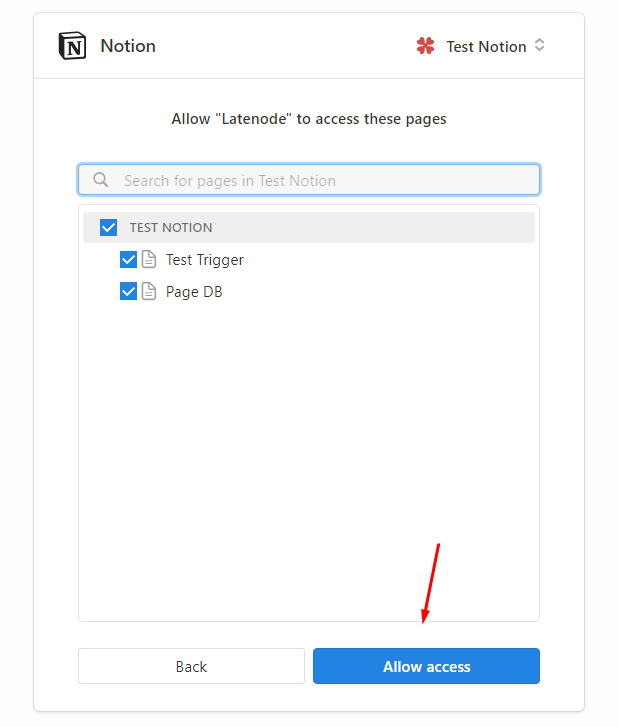

# Notion

To use the nodes in the **Notion** group, you need to create an authorization. Here's how to do it:

1. Go to the **Authorizations** page and click on the **New authorization** button;

2. In the **Choose a service** window, select **Notion**;

3. In the **Notion** authorization group, choose **OAuth2**;

4. Select the required workspace and click on the **Select Pages** button;

5. Choose the necessary pages within the workspace and click on the **Allow Access** button.

