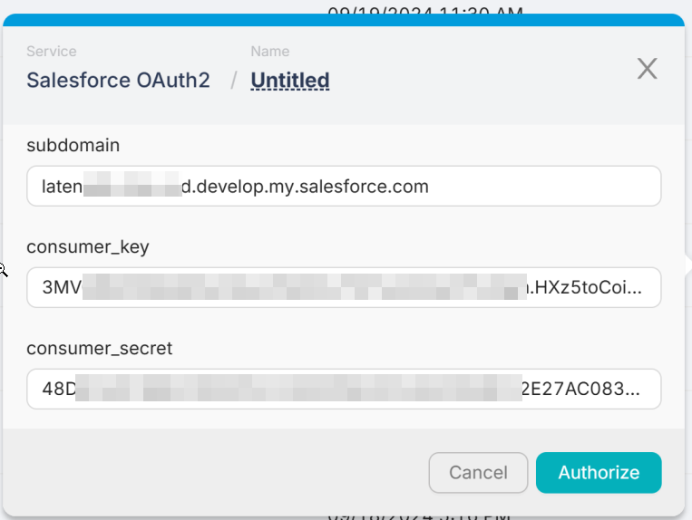

# Salesforce

To connect your **Salesforce** account to **Latenode**, you need to create a **custom app** in Salesforce. This is necessary to get the **Consumer Key**, **Consumer Secret**, and **Subdomain**.

Here's a quick overview of the steps:

1. **Log in to Salesforce** and go to **Setup** (click the gear icon in the top right).
2. In the left sidebar, search for **"App Manager"** and open it.
3. Click **"New Connected App"** in the top right corner.
4. Fill in the basic information like app name, API name, and email.
5. Click **"Enable OAuth Settings"**, then scroll down and **open "Advanced Settings"** to reveal additional options.
6. Set the **Callback URL** to any valid URL (e.g. `https://example.com` — Latenode doesn't use it directly).
7. Add the following **OAuth Scopes**:
    - `Full access (full)`
    - `Perform requests on your behalf at any time (refresh_token, offline_access)`
8. Save the app and wait a few minutes for it to become active.
9. After it's active, go back to the app detail page — there you'll find your **Consumer Key** and **Consumer Secret**.

## Subdomain

Take the first part of your Salesforce URL.

For example, if your login URL is:

```
https://yourcompany.my.salesforce.com
```

Then your subdomain is: `yourcompany`

Once you have these three values, enter them into Latenode like this:


