# Shopify

## Instructions for Authorization in Shopify

To complete authorization, you need to obtain the **Admin API Access Token** and the **Shop ID**. Here's how to do it:

---

## 1. Admin API Access Token

1. Navigate to your [Shopify Admin](https://admin.shopify.com/).

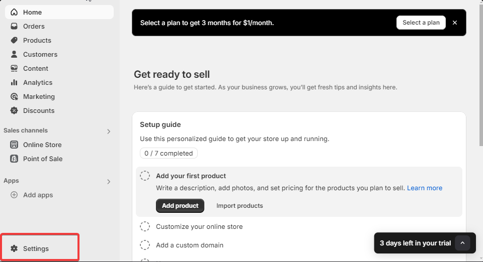

2. Go to **Settings** > [Apps and Sales Channels](https://admin.shopify.com/settings/apps) > Click **Develop apps**.

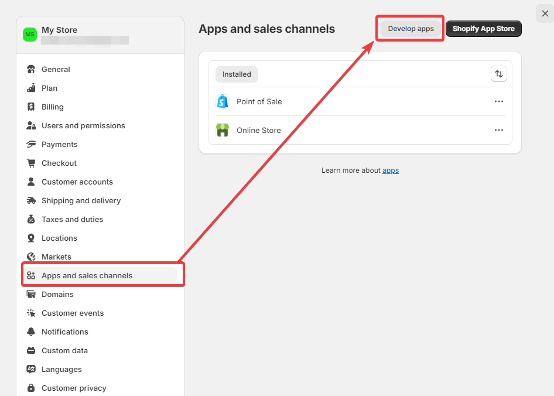

3. Click **Create a new app** or select an existing app.

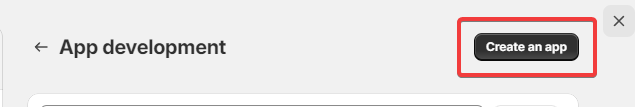

4. Provide a name for the app and assign an app administrator.

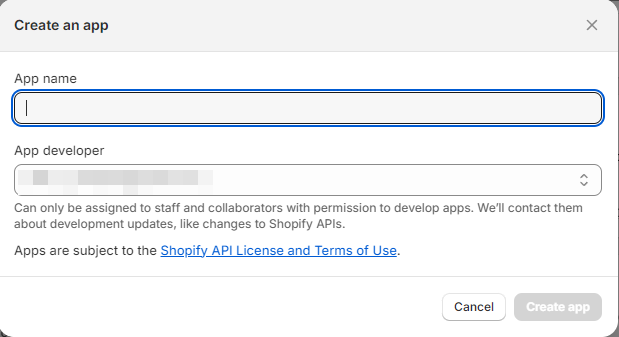

5. Proceed to the app setup screen.

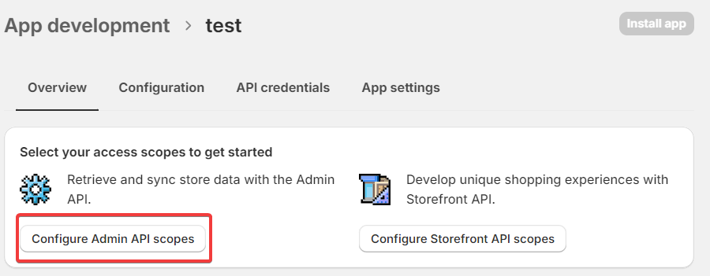

6. Select the necessary scopes (permissions) and save your changes (the **Save** button is at the bottom of the page).

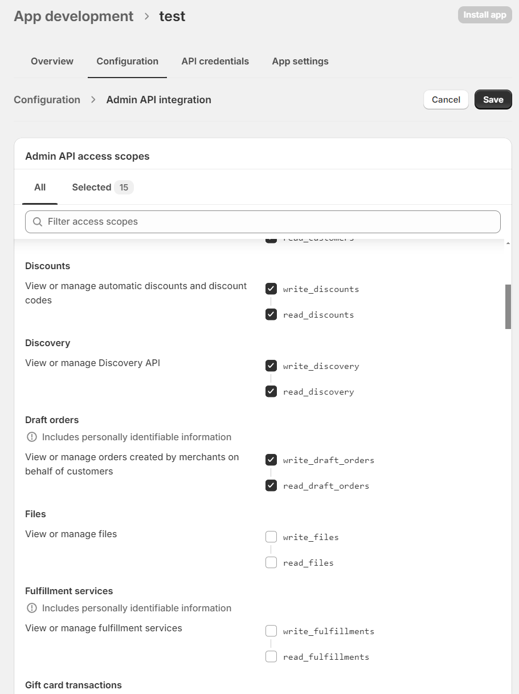

7. Go to the **API Credentials** section, click **Install App**, and agree to the prompt.

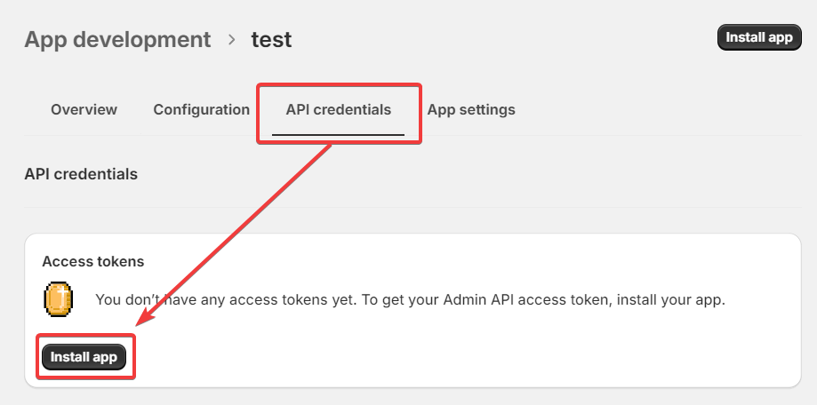

8. Once installed, your Admin API Access Token will be available. Copy it for later use.

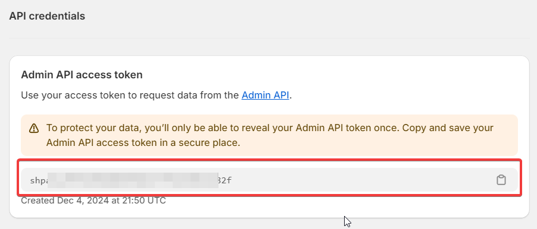

---

## 2. Shop ID

The Shop ID can always be found in the URL of your admin panel in your browser.

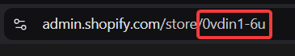

---

## 3. Authorization on Latenode

1. Add the required node in Latenode and click **New Authorization**.

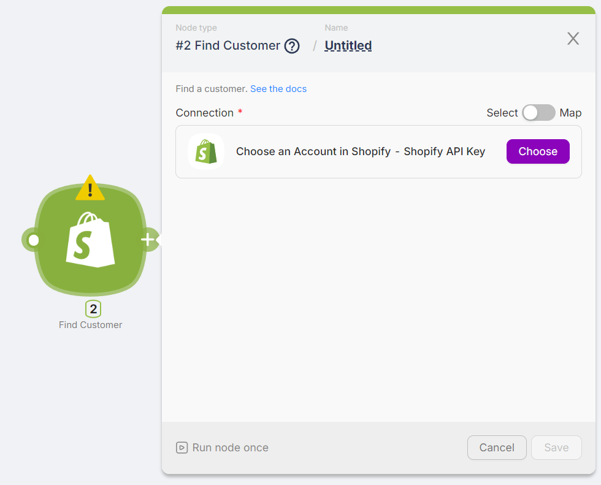

2. Enter the obtained credentials (Admin API Access Token and Shop ID).

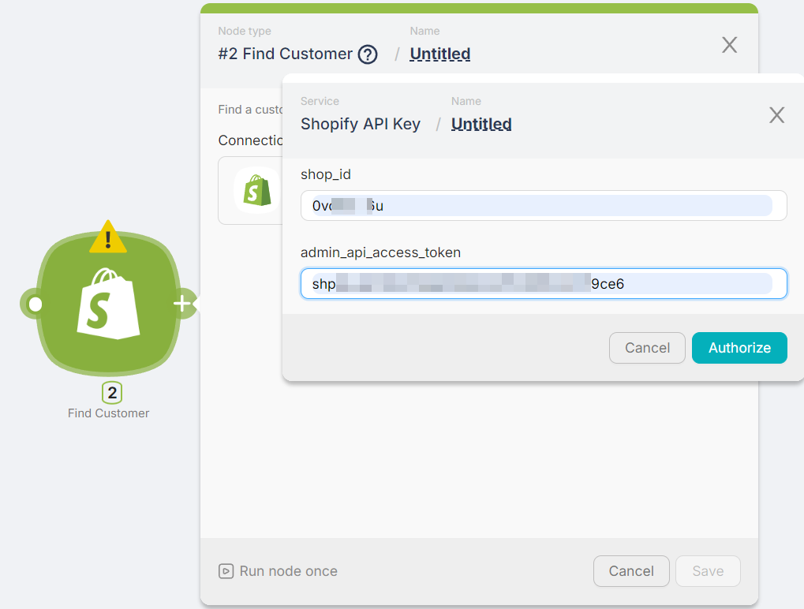

3. That's it! You're authorized. Perform a test run to check the results.

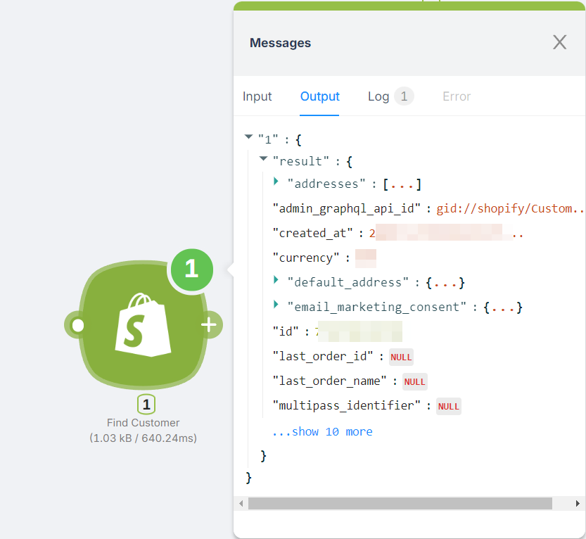

---

This process ensures that your Shopify and Latenode integration is set up correctly for seamless functionality.
