# Slack Bot

## Receiving a token

<Callout type="warn">
Before following the instructions, you need to sign up for **Slack** and create a workspace.
</Callout>

For nodes of the **Slack bot** group to work, it is necessary to get a token and perform authorization.

To obtain a token you need to:

1. Go to [Slack API](https://api.slack.com/apps) and create an app by clicking on **Create New App**;

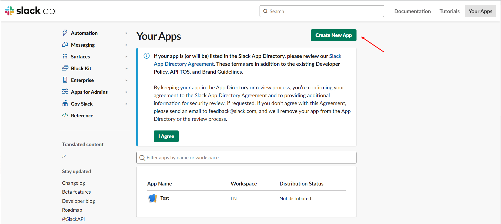

2. In the **Create an app** window, select the **From scratch** option;

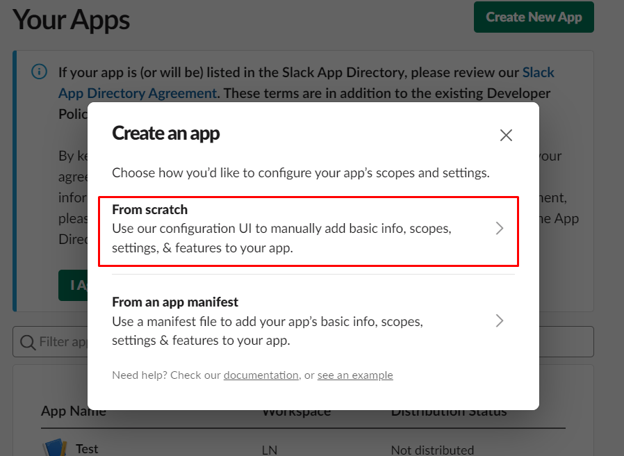

3. Customize the app - fill in the name and select the desired **Slack** space. Click the **Create App** button;

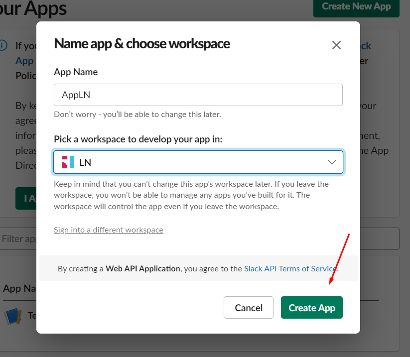

4. On the application settings page, click the **OAuth & Permissions** tab;

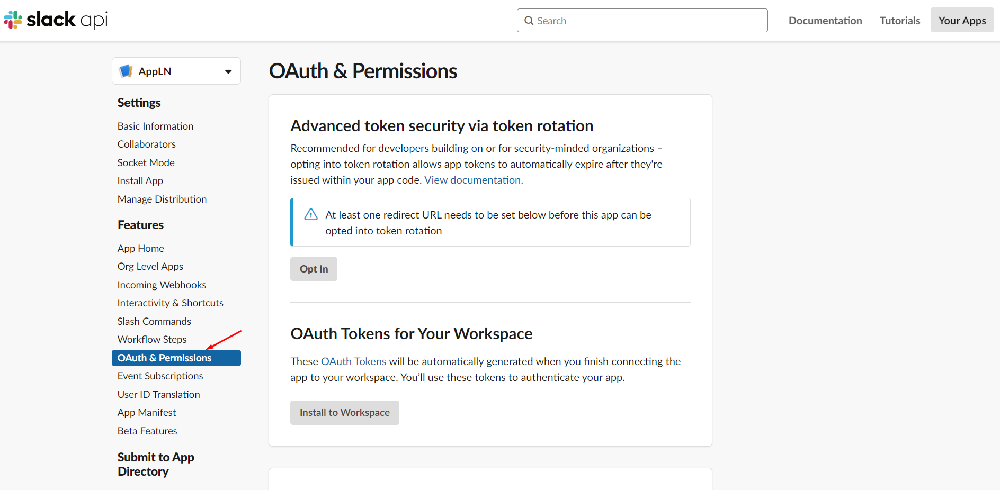

5. In the **Scopes** block, define the permissions available to the **Slack** bot;

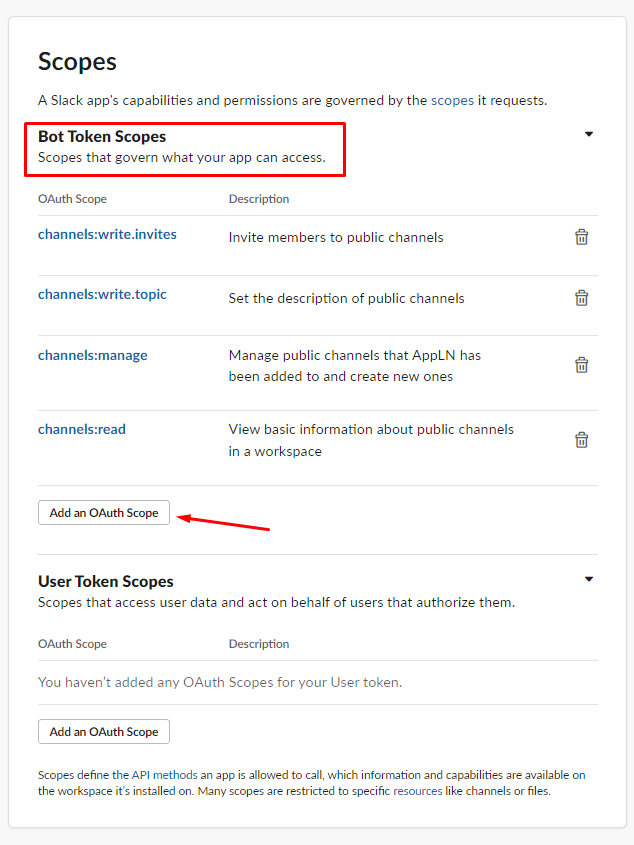

6. In the **OAuth Tokens for Your Workspace** block, click the **Install to Workspace** button.

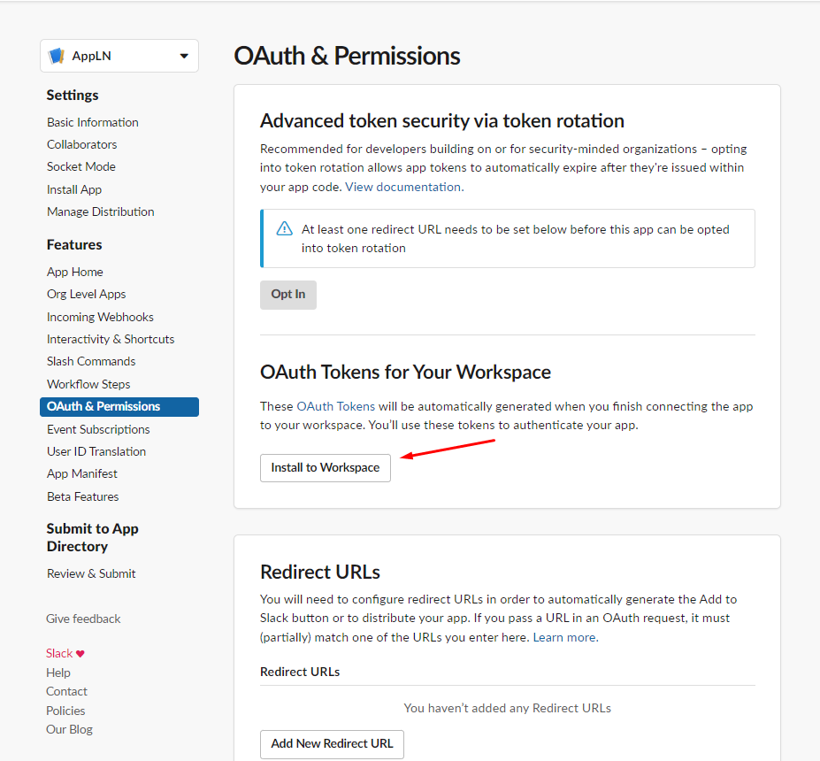

7. Confirm accesses by pressing the **Allow** button;

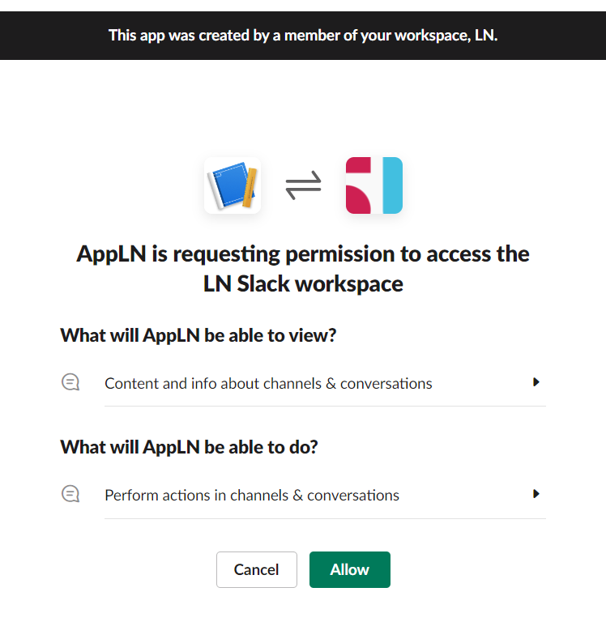

8. In the **OAuth Tokens for Your Workspace** block, view and copy the **Bot User OAuth Token**;

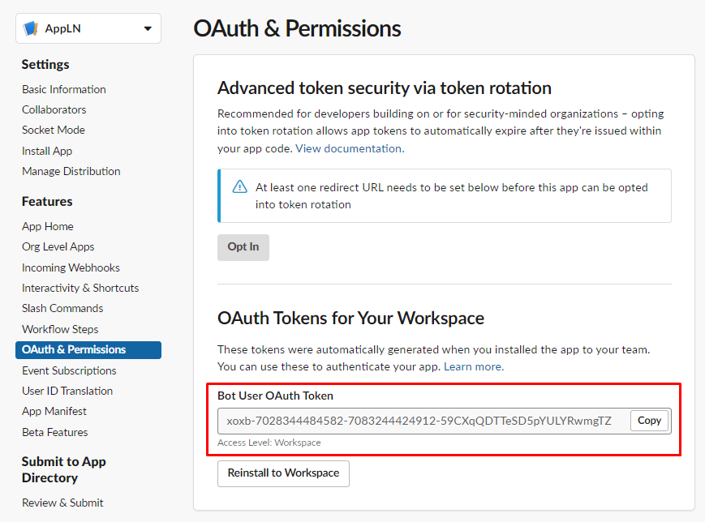

9. Add a bot to the required channel by sending the message `/invite @<botname>` to this channel, where `<botname>` is the name of the bot (corresponds to the name of the application that was created in the above step);

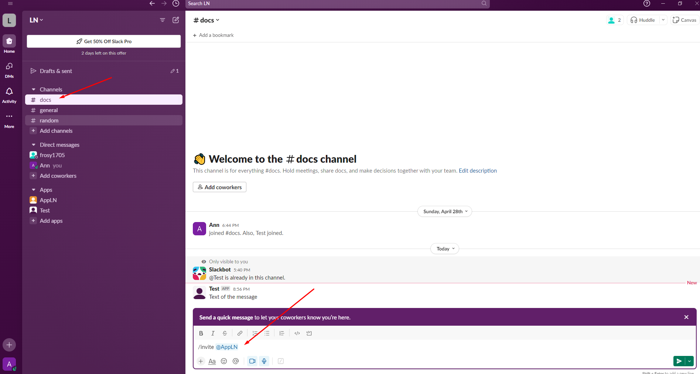

10. View the availability of a bot added to the channel;

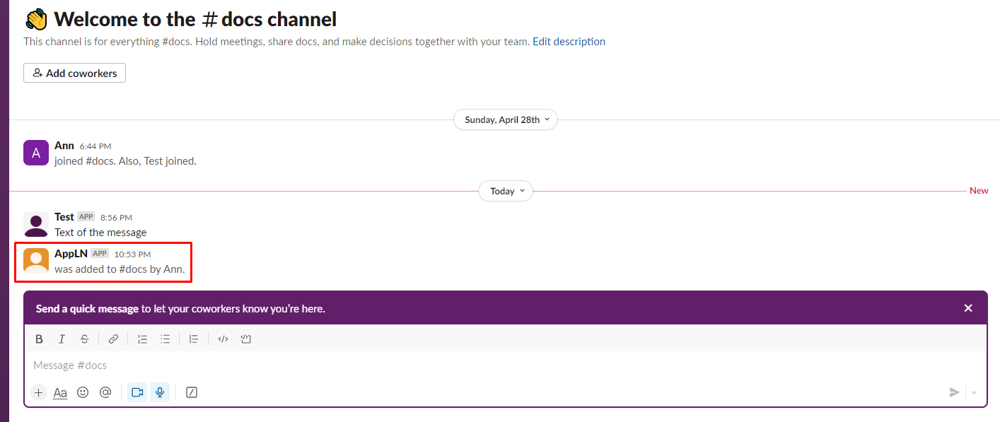

## Configuring authorization in nodes

When configuring a node in the **Slack bot** group, authorization is required. To do this, you need to:

1. Select the required node from the **Slack bot** group;

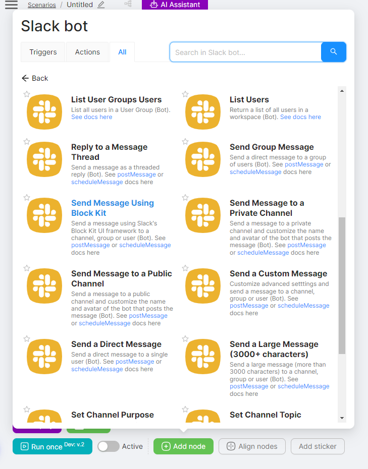

2. Click the **Create an authorization** button;

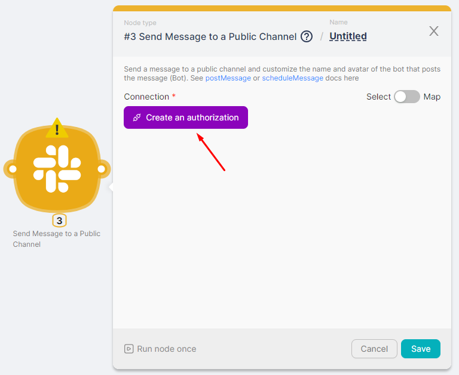

3. Click on **New authorization** (1) and select **Access Token** (2);

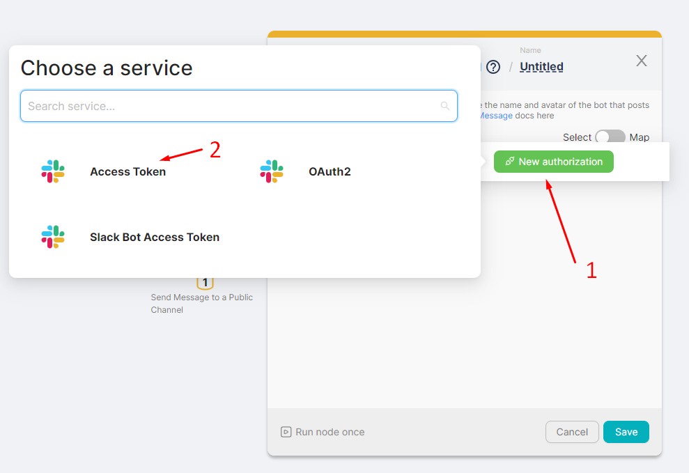

4. In the **access_token** field enter the token received in item 8 of the instructions above. Press the **Authorize** button;

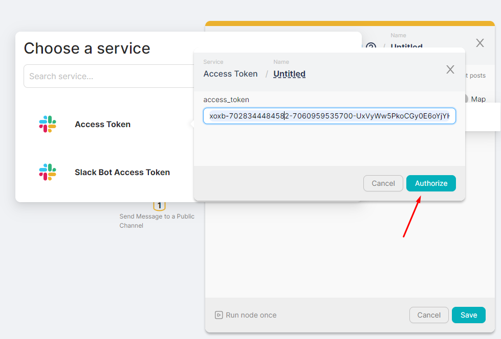

5. View the presence of authorization in the node;

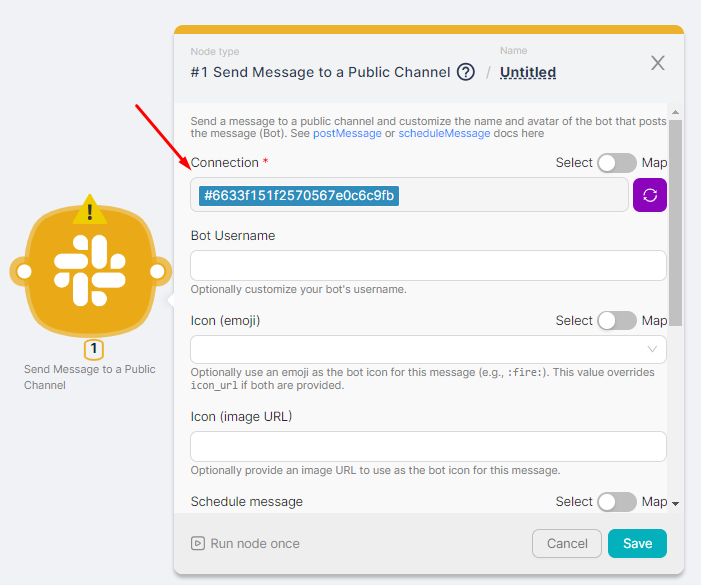

6. Fill in the required fields of the node settings.

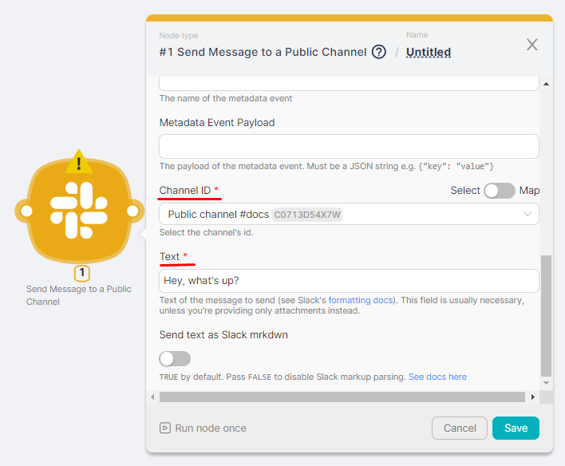

You can view the result of the node execution when you run the scenario or by clicking on the node's **Run Once** button. You can also see the message sent to the specified Slack channel.

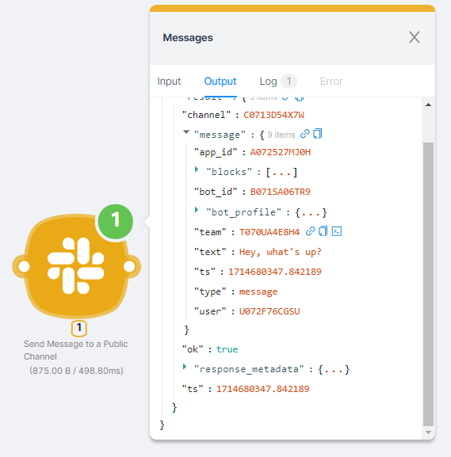

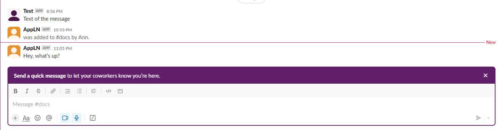
