# Supabase

## Using Trigger on Webhook node

To work with **Supabase** service you can use URL of [Trigger on Webhook](/integrations/core-nodes/trigger-on-webhook) nodes of **Latenode** platform. After registration in the **Supabase** application it is necessary to:

1. Click on the **New Project** button to create a new project;

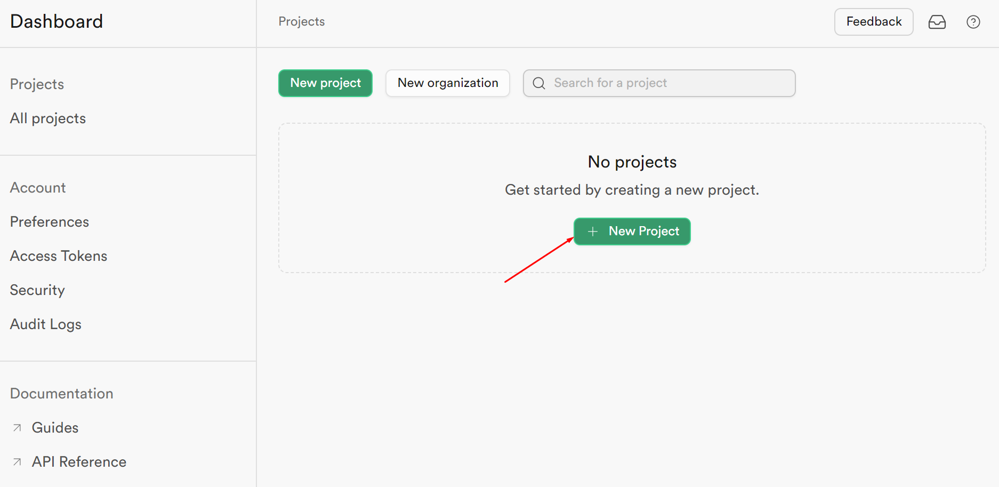

2. Create a new organization by clicking the **Create organization** button;

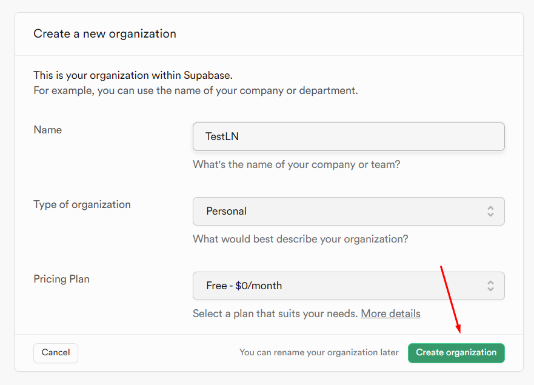

3. Create a new project by clicking the **Create new project** button;

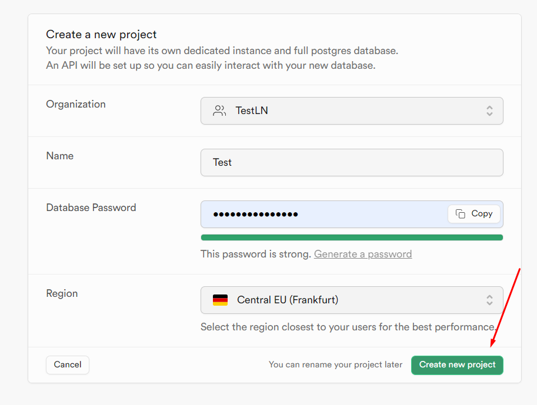

4. After creating the organization and project on the **Tables** tab, click on the **New table** button;

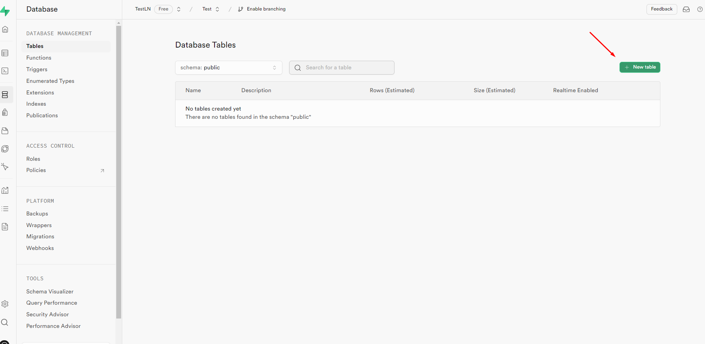

5. Create a new table in the **Create a new table under `public`** window, filling in the table name. If necessary, the required columns can be added to the table;

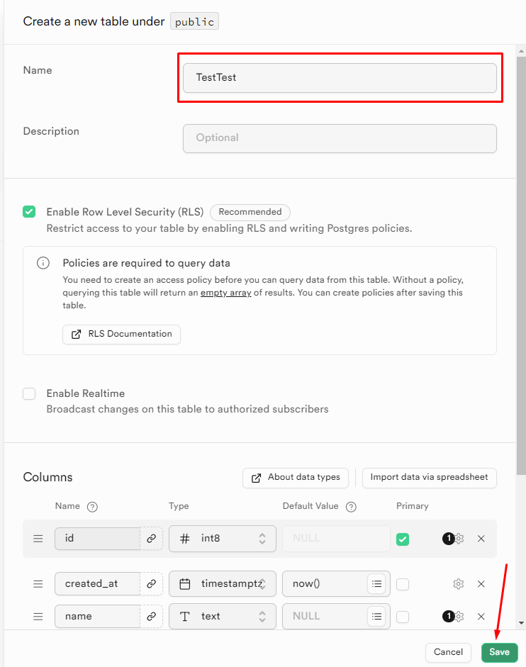

6. View the row with the new table on the **Tables** tab in the **Database Tables** block;

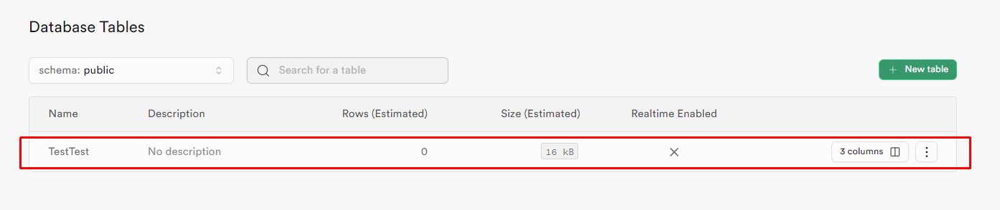

7. To view the table, click on the menu in the row and select **View table**;

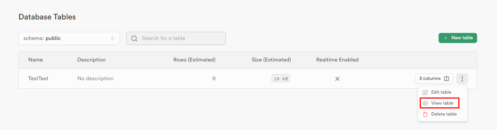

8. Press **Insert row** to add a row to the created table;

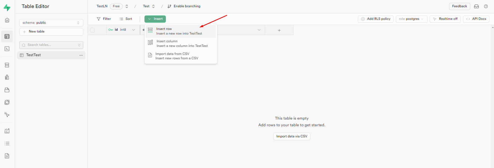

9. View the added row on the **Table Editor** tab;

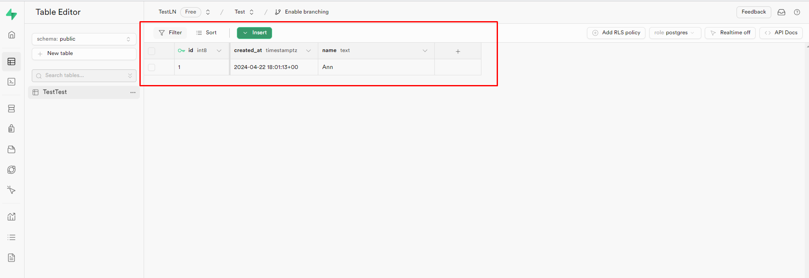

10. Go to the **Database** page and open the **Webhooks** tab. Click the **Enable webhooks** button;

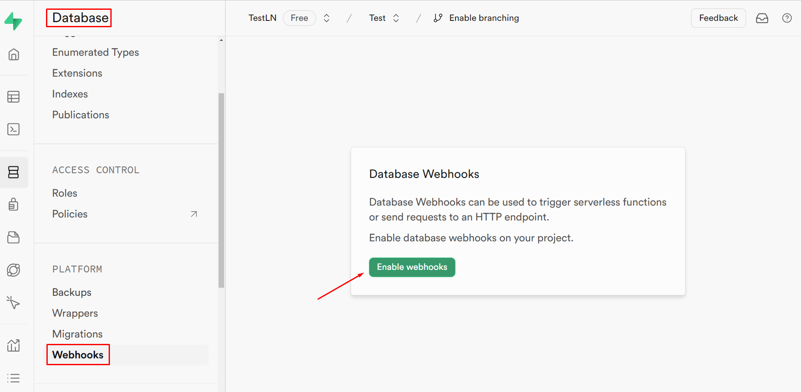

11. Click the **Create a new hook** button to create a new webhook;

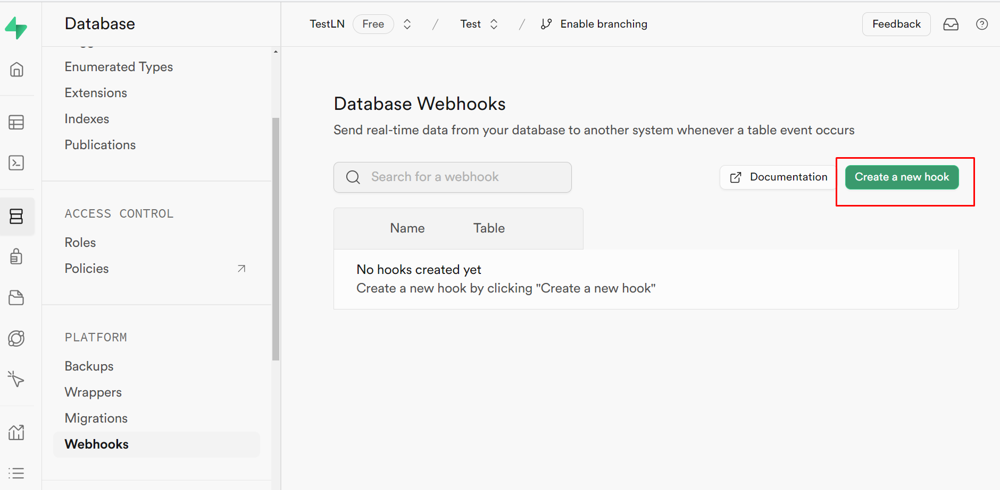

12. Configure the webhook in the **Create a new database webhook** window by adding its name (**Name**), defining the table (**Table**) and the events at which the query should be sent (**Events**).

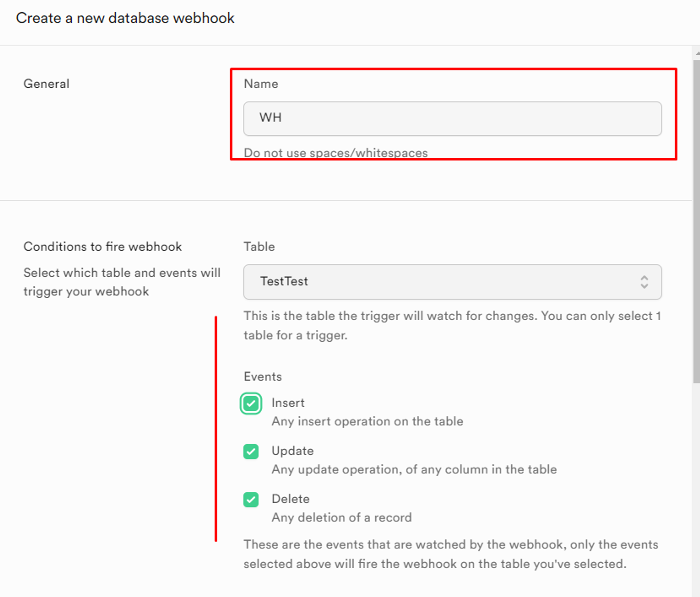

Select HTTP Request (**Type of webhook**) as the type of webhook, POST (**Method**) as the method, and the address of the [Trigger on Webhook](/integrations/core-nodes/trigger-on-webhook) node of the **Latenode** platform (**URL**) as the address. After selecting all the parameters, click on the **Create Webhook** button;

<Callout type="info">
To get the URL of the Trigger on Webhook node, you need to create a scenario and add this node to it. Clicking on the node will open its configuration window, where you can copy the URL.
</Callout>

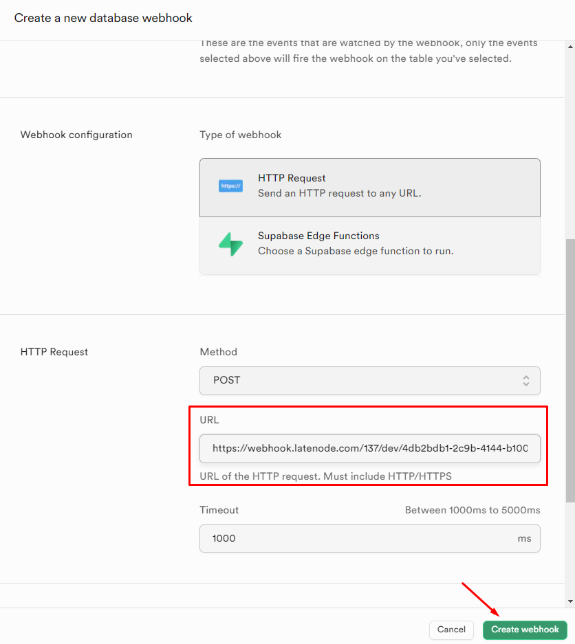

13. View the created webhooks in the **Database Webhooks** table;

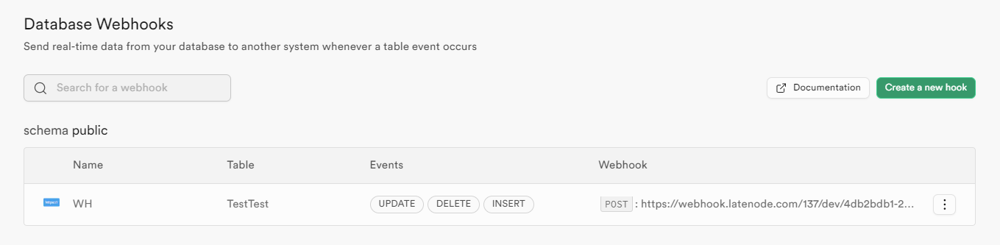

14. Go to the scenario page with the **Trigger on Webhook** (1) node whose URL was used to create the webhook in the **Supabase** application. Expand the scenario (2) and view its active status (3).

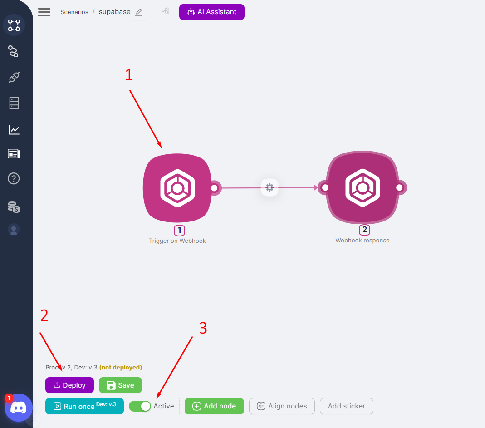

15. Add a row (id = 2) to the **Supabase** table;

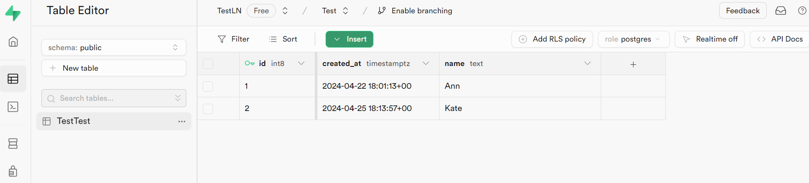

16. View the results of the scenario (1) in the history, including the output parameters of the Trigger on Webhook node (2).

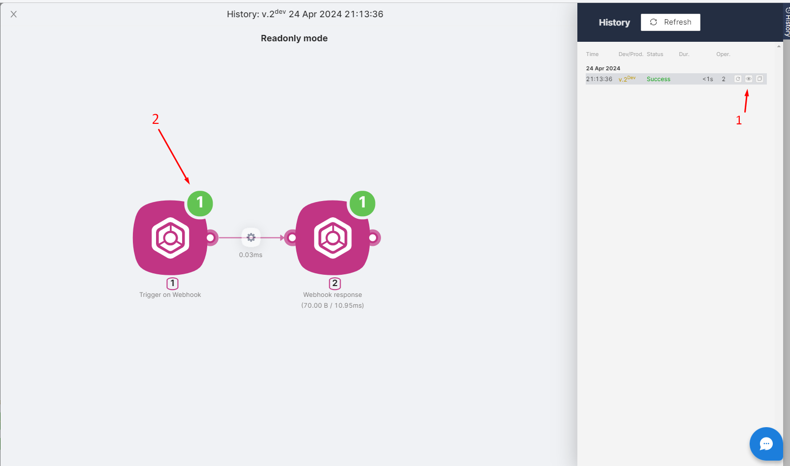

The output parameters of the Trigger on Webhook node are the added string data:

```json
{
  "body": {
    "old_record": null,
    "record": {
      "created_at": "2024-04-25T18:13:57+00:00",
      "id": 2,
      "name": "Kate"
    },
    "schema": "public",
    "table": "TestTest",
    "type": "INSERT"
  },
  "client_ip": "",
  "headers": {
    "Accept": "*/*",
    "Content-Length": "159",
    "Content-Type": "application/json",
    "User-Agent": "pg_net/0.8.0"
  },
  "method": "POST",
  "query": {},
  "url": "http://"
}
```
