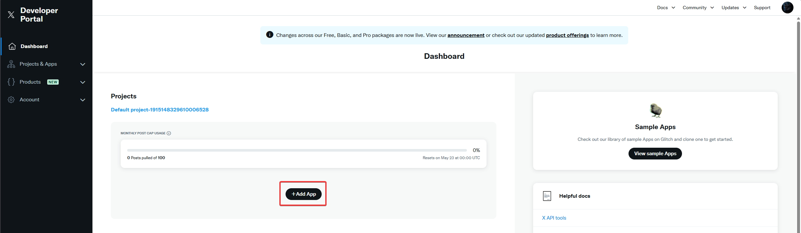
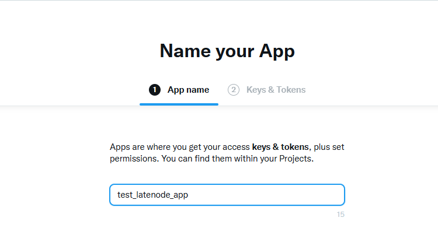
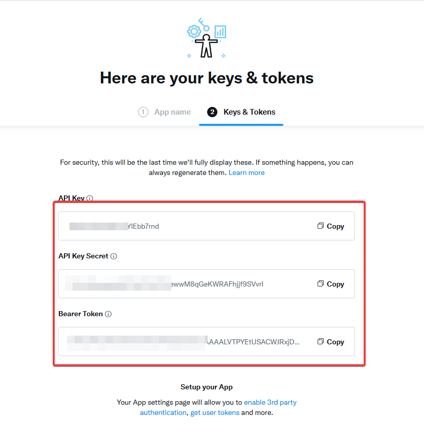
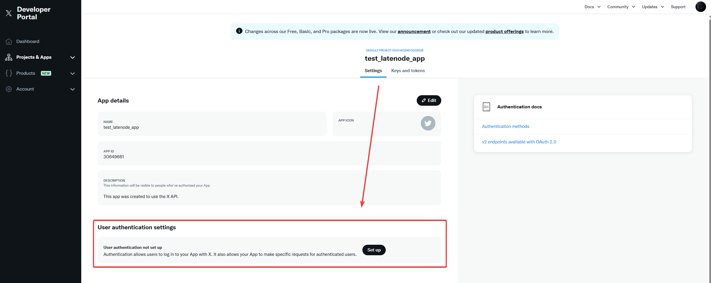
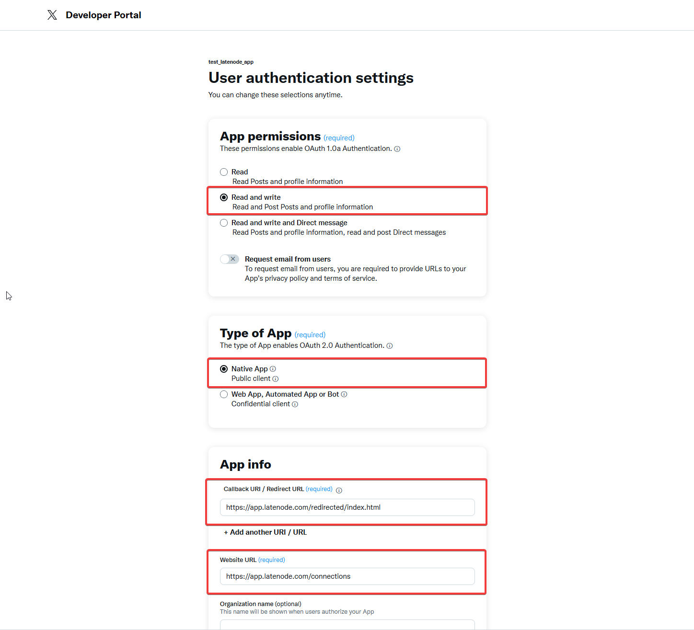
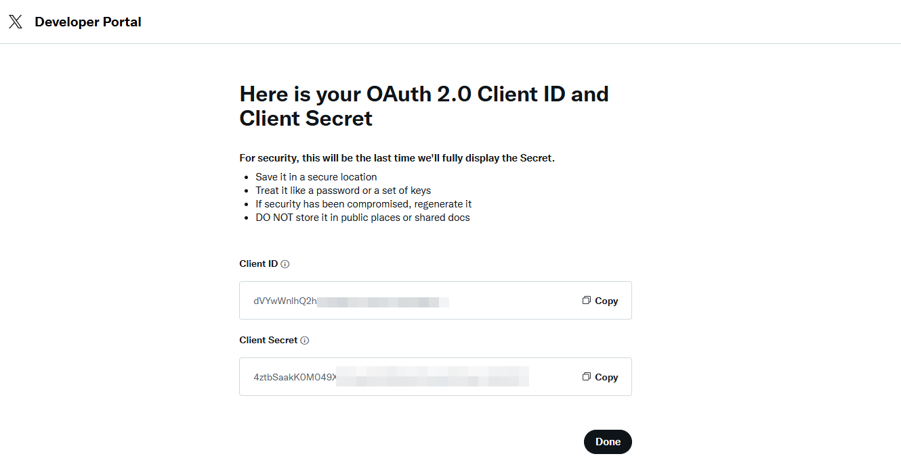
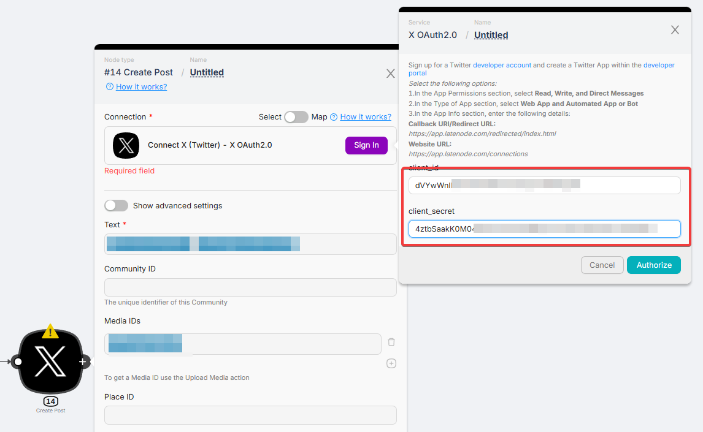

# Twitter (X)

## 1. Creating an App

Go to the [Twitter Developer Portal](https://developer.twitter.com/en/portal/dashboard)

In the **Projects** section, select the **Default project** (it is created automatically)

Click **Add App**

Enter a name for your app and click **Next**

The app is now created — but don't save the keys yet.

We'll return here later to get the necessary data.

---

## 2. Setting Permissions

Go to **User authentication settings**

Set the necessary permissions (e.g., **Read and Write**)

In the **Type of App** section, select:

- **Native App** — Public client

In the **App info** block, make sure to enter the following values exactly:

- **Callback URL / Redirect URL**:

`https://app.latenode.com/redirected/index.html`

- **Website URL**:

`https://app.latenode.com/connections`

<Callout type="warn">
**Important**: These fields must be entered exactly as shown — otherwise, the authorization won't work.
</Callout>

---

After this, you'll receive the **Client ID** and **Client Secret**.

These are the values you need to paste into the authorization form in **Latenode**, then confirm login.

