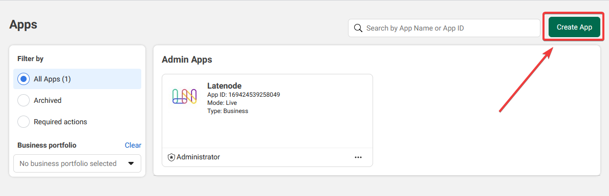
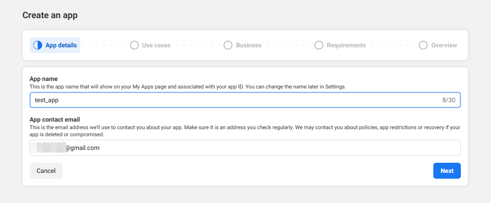
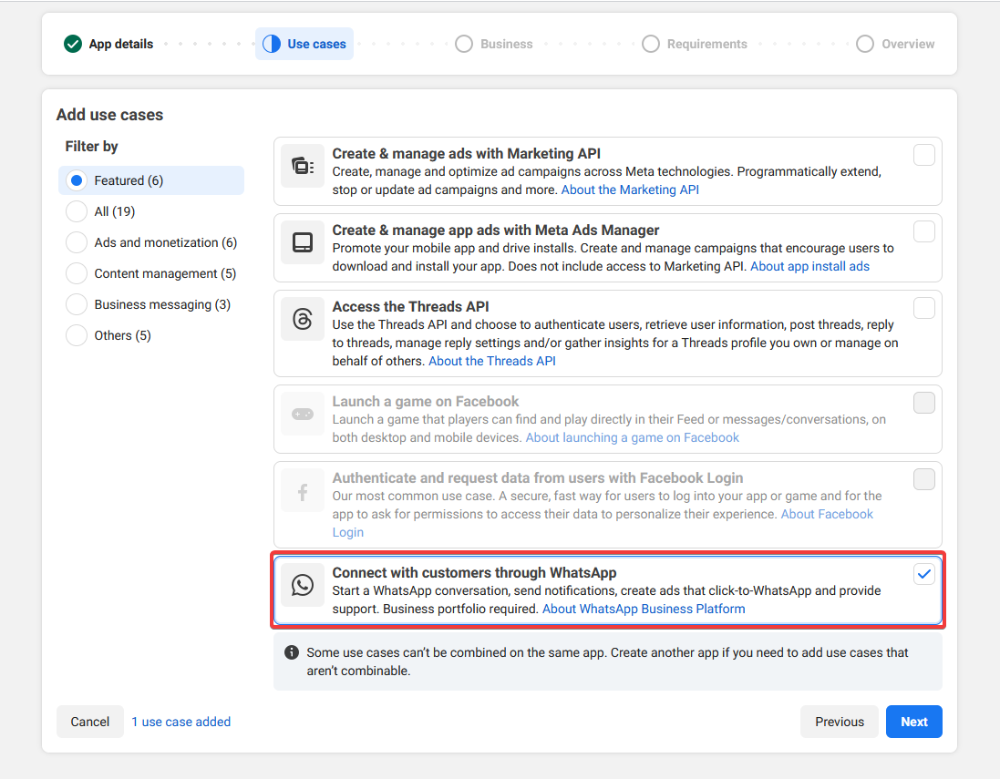
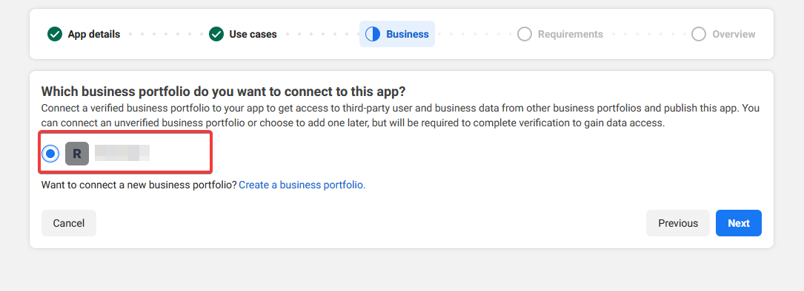
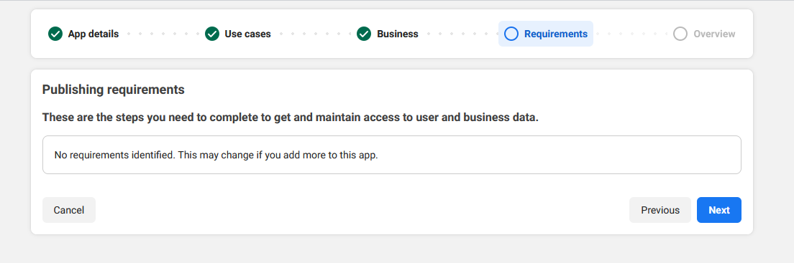
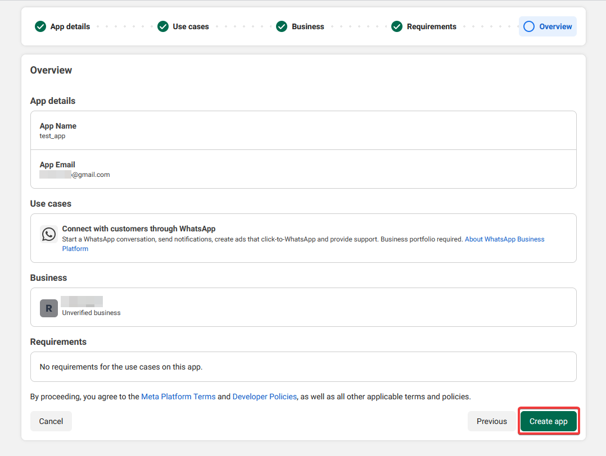
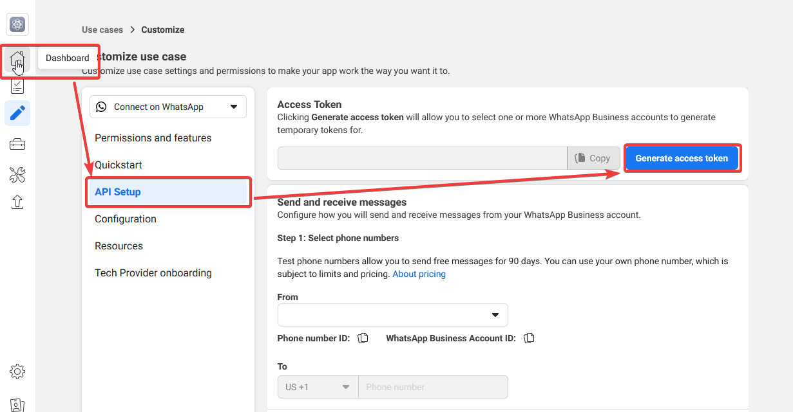
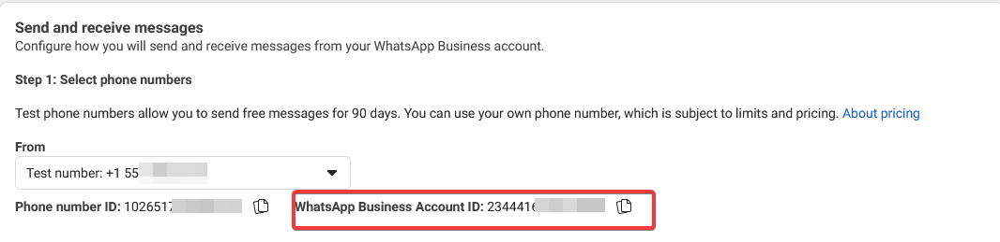
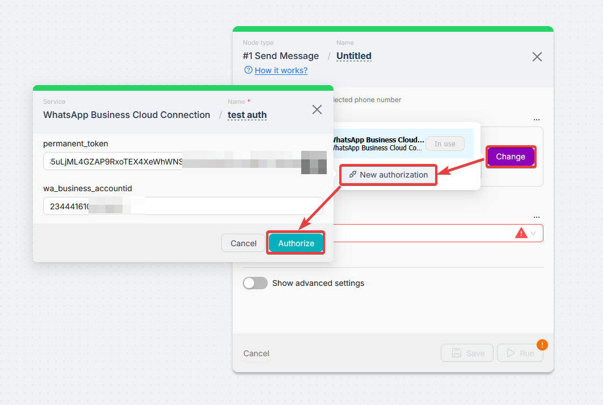

# WhatsApp Business Cloud (authorization)

## Overview

Use this page to prepare **Meta for Developers** and save a **WhatsApp Business Cloud** connection in Latenode. **Action fields** (Send Message, templates, files) are documented on [WhatsApp Business Cloud](/integrations/app-nodes/whatsapp-business-cloud).

## Requirements

1. A [Meta for Developers](https://developers.facebook.com/) account  
2. A **Meta Business Portfolio** and the **WhatsApp** product on your app (Cloud API)  
3. A WhatsApp **phone number** in Meta (test or production)  

Official: [WhatsApp Cloud API Get Started](https://developers.facebook.com/docs/whatsapp/cloud-api/get-started).

## Meta for Developers

UI labels move between updates; use the screens below as a visual path. Replace values with your own.

1. Open [Meta for Developers](https://developers.facebook.com/) and **My Apps**.

2. Open your app (or create one) and add the **WhatsApp** product if needed.

3. Open **WhatsApp** → **API Setup** (or the current equivalent).

4. Copy the access details Meta shows here (token, ids) into your Latenode connection form where each field asks for them.

5. Keep **Phone number ID** and sender details consistent with what you select later in **Sender ID** on nodes.

6. For inbound messages, you will set **Callback URL** and **Verify token** in the webhook section (see [Webhook (Callback URL)](#webhook-callback-url) and [Triggers (webhook)](/integrations/app-nodes/whatsapp-business-cloud#triggers-webhook)).

### API Setup example

On the **API Setup** screen, use the control to **get a test number** (wording may differ slightly in Meta). After the test number is issued, **WhatsApp Business Account ID** appears on the page — copy it into your **WhatsApp Business Cloud Connection** in Latenode if the form asks for it.

## Connection in Latenode

1. Sign in to Latenode.  
2. Add a **WhatsApp Business Cloud** node (or open **Authorizations**).  
3. Click **Create an authorization** and choose **WhatsApp Business Cloud Connection**.  
4. Paste the Meta values into the labeled fields and **Save**.  
5. Select the new connection in **Connection** on the node.  

## Webhook (Callback URL)

Point the Meta WhatsApp webhook at a **Webhook** trigger in Latenode. Duplicate the template scenario [WhatsApp webhook setup](https://app.latenode.com/shared-scenarios/6661daabc427fbac2441b544), then follow the numbered steps on [Triggers (webhook)](/integrations/app-nodes/whatsapp-business-cloud#triggers-webhook).

Short recap:

1. **Webhook** → **Webhook Response**  
2. Paste the trigger URL into Meta **Callback URL**; set **Verify token**; **Verify and Save**  
3. Run once to verify  
4. Move the **Webhook** link to your logic node; disconnect **Webhook Response** for live traffic  
5. **Deploy** and **Activate**  

## Troubleshooting

- **401 / invalid token** — Regenerate the token in Meta.  
- **Sender / number mismatch** — **Sender ID** on actions must match a number from this Meta app.  
- **Webhook verify fails** — **Webhook Response** must run during verify; URL and token must match Meta.  
- **Templates** — [WhatsApp Business Platform](https://developers.facebook.com/docs/whatsapp)  

## Related

- [WhatsApp Business Cloud app nodes](/integrations/app-nodes/whatsapp-business-cloud)
