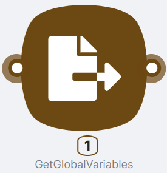
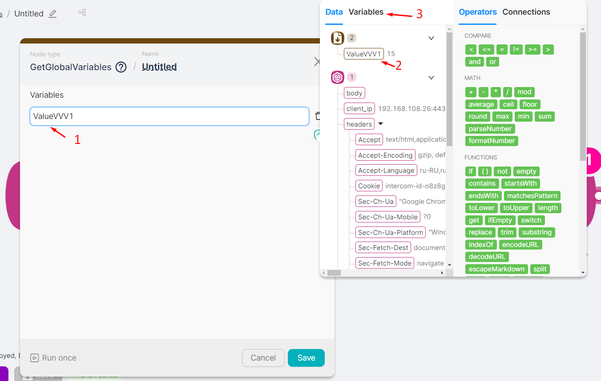

# GetGlobalVariables

## Node Description

**GetGlobalVariables** — an action-type node, necessary for obtaining and further using a global variable set in the **SetGlobalVariables** node.

For more information about global variables, see [Global Variables](../../visual-builder/variables/creating-and-editing-variables.mdx).

## Node Configuration

To configure the **GetGlobalVariables** node, it is necessary to fill in the **Variables (1)** field with the corresponding parameter name from the previous **SetGlobalVariables (2)** node or from the list of already created global variables (displayed on the Variables tab **(3)**).

<Callout type="warning">
If the global variable is being created for the first time in the scenario, a specific sequence of scenario nodes should be observed when using nodes for variable input and retrieval. The **SetGlobalVariables** node must be executed before the **GetGlobalVariables** node.

</Callout>