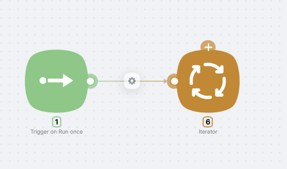

# Iterator

The **Iterator** processes data one element at a time: you pass it an array or object, and it feeds each item into the chain in order. Use it to loop over lists, object properties, or query results.

You can pass a **JSON array** (iteration over elements) or a **JSON object** (iteration over key–value pairs).

<Callout type="info">
Training video: [here](https://www.youtube.com/watch?v=q5lNoPncj5g). General topic: [Iterating](/visual-builder/data-flow/iterating).
</Callout>

## Configuration

### Data to iterate field

In the single **Data to iterate** field, specify the array or object to loop over. You can reference data from a previous node (e.g. `{{node.field}}`) or enter a fixed value.

### Connectors

- **Top connector** — connect nodes that should run **for each** element (the loop). They run as many times as there are items in the data.
- **Right connector** — runs **once after** all iterations finish. Useful for e.g. sending a webhook response or a final step.

<Callout type="warning">
A node connected to the **right** connector runs only once. Nodes on the **top** connector run on every iteration.
</Callout>

## Example

Typical flow: trigger or data node → **Iterator** (in Data to iterate, use an array like `["aaa", "bbb", "ccc"]` or a reference to a previous node’s output). Connect a node that processes one item (JavaScript, HTTP Request, Set Variables, etc.) to the **top** connector. Optionally connect a node that runs after the loop (e.g. Webhook Response) to the **right** connector.
