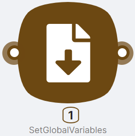
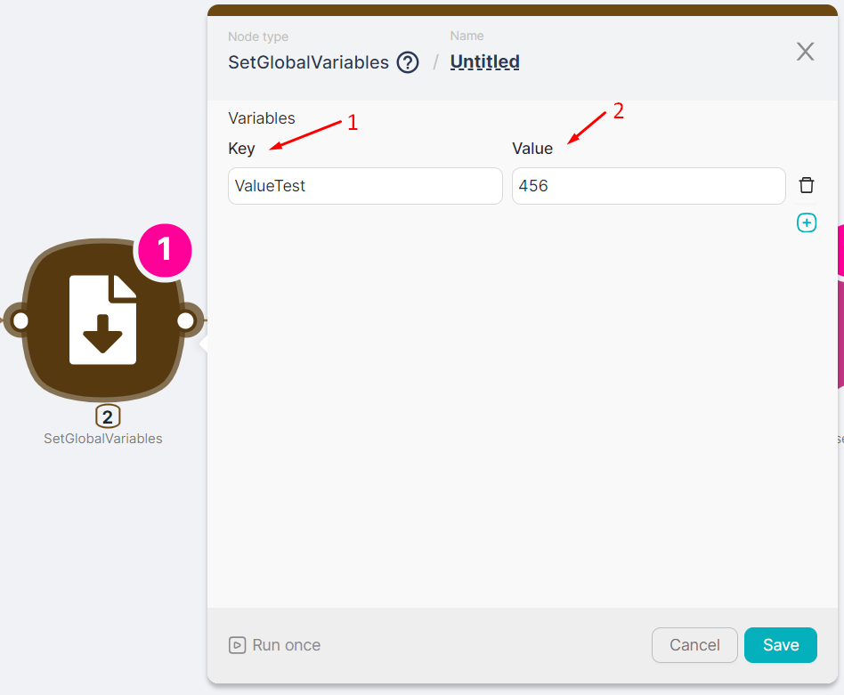
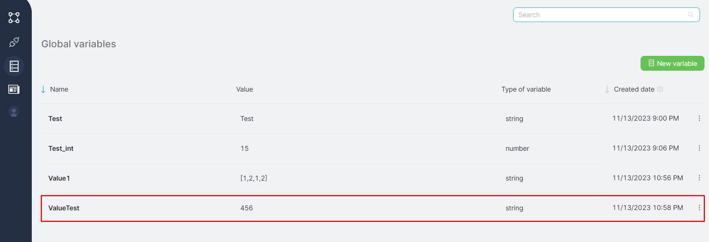
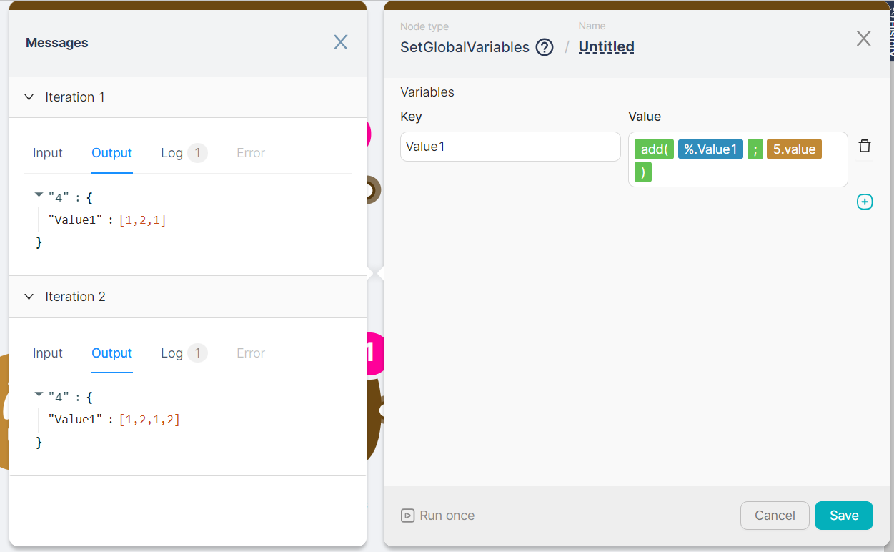

# SetGlobalVariables

## Node Description

**SetGlobalVariables** — an action-type node necessary for introducing a new global variable into the scenario. The added variable can subsequently be used in any account scenario.

<Callout type="info">
The added global variable can be modified during the execution of nodes. If two **SetGlobalVariables** nodes are placed consecutively and both define the value of the same variable, the final value for the variable will be set by the last **SetGlobalVariables** node.

</Callout>
For more information about global variables, see [Global Variables](../../visual-builder/variables/creating-and-editing-variables.mdx).

## Node Configuration

To configure the **SetGlobalVariables** node, it is necessary to fill in key-value pairs.

- **(1) Key** - a field for entering the name of the global variable;  
- **(2) Value** - a field for entering the value of the global variable.  

After creation using the **SetGlobalVariables** node, the global variable will be displayed in the table of all existing global variables.

If the **SetGlobalVariables** node is connected to a node through the top Iterator connection point and is executed multiple times sequentially, the node's output data is displayed with an indication of **Iterations**. Each iteration corresponds to its output data.

