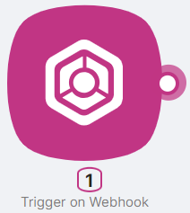
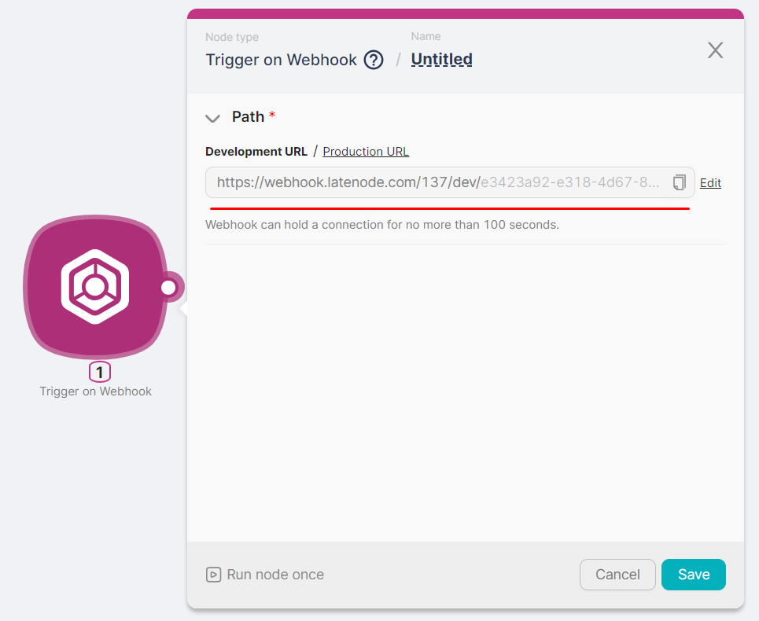
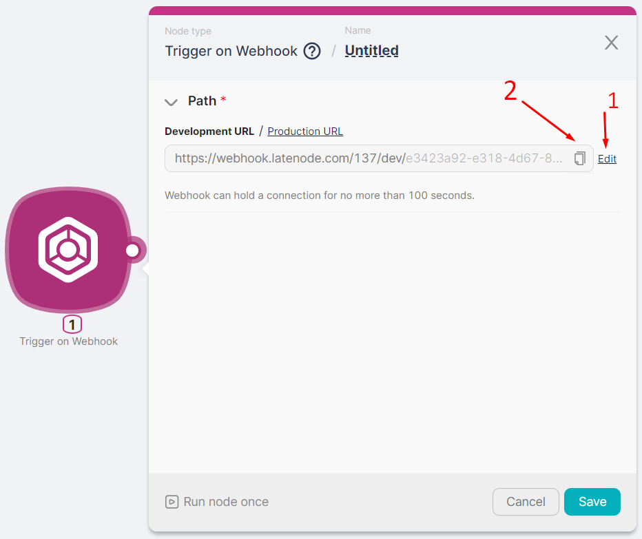

# Trigger on Webhook



## Node Description

**Trigger on Webhook** is a trigger node that serves as the entry point of a scenario. When a request is sent to the node's URL, the scenario starts executing.

## Node Configuration

After adding the **Trigger on Webhook** node, two URL versions are automatically generated and displayed in the **Path** field:

- **Production URL** — requests can be sent continuously; the scenario keeps running until manually stopped or a critical error occurs.
- **Development URL** — the scenario runs once after a single request, then stops. Use this for testing and debugging.



The generated URL can be partially modified **(1)** or copied **(2)** for use in requests.



<Callout type="info">
You can send requests to the **Trigger on Webhook** node using the **POST** method (to transmit data) or the **GET** method (to trigger the scenario without a body).
</Callout>

## Webhook Response Modes

The platform can reply to a webhook request in three ways:

1. **Default response (`200 OK`)** — if your scenario has no **Webhook Response** node, the platform returns `200 OK`.
2. **Custom response** — add a **Webhook Response** node to return a custom body, status code, and headers.
3. **Instant reply (fast mode)** — if the sender expects an immediate response (for example, due to a short timeout), use fast mode via URL parameters. See [Fast mode](#fast-mode-instant-webhook-reply) below.

## Fast mode (instant webhook reply)

Fast mode lets you return an **instant reply** using webhook URL query parameters. This is useful when the sender expects a response very quickly and may close the connection before the scenario finishes.

### `__ln.fast=1` — Fast Mode

When `__ln.fast=1` is set, the webhook returns a response **immediately**, before the scenario completes. In this mode, the **Webhook Response** node is not used for the webhook reply (it won’t run), because the response has already been sent to the sender.

<Callout type="warning" title="Important">
- In fast mode, the client sending the request may **not see scenario errors**, for example if the scenario is inactive and so on.
- If the webhook for requests with the `__ln.fast=1` parameter is **not found**, the platform will still return `200 OK`.
</Callout>


### Available `__ln.*` parameters


| Parameter | What it does | Example |
|---|---|---|
| `__ln.fast` | Enables fast mode: Latenode replies immediately, before the scenario runs. | `__ln.fast=1` |
| `__ln.resp.body` | Response body for async replies (no **Webhook Response** node, or `__ln.fast=1` enabled). | `__ln.resp.body=Hello%20World` |
| `__ln.resp.status` | HTTP status code for async replies. | `__ln.resp.status=201` |
| `__ln.resp.header.<header>` | Response header for async replies. | `__ln.resp.header.content-type=application/json` |

### Full URL Example

```text
https://<your-webhook-url>?__ln.fast=1&__ln.resp.body=Hello%20World&__ln.resp.status=201&__ln.resp.header.content-type=application/json
```