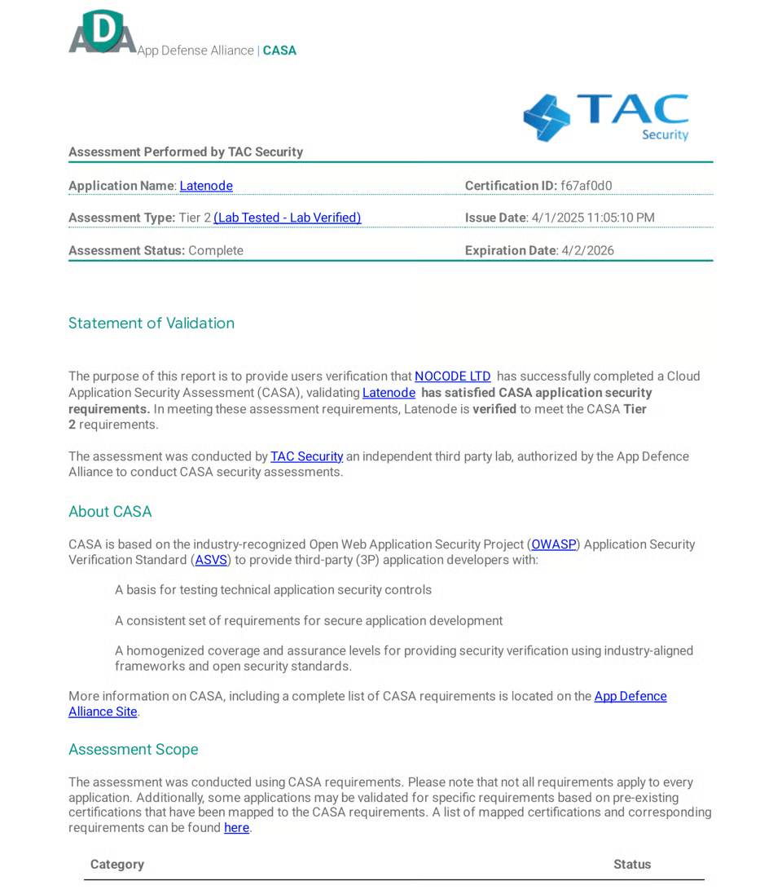
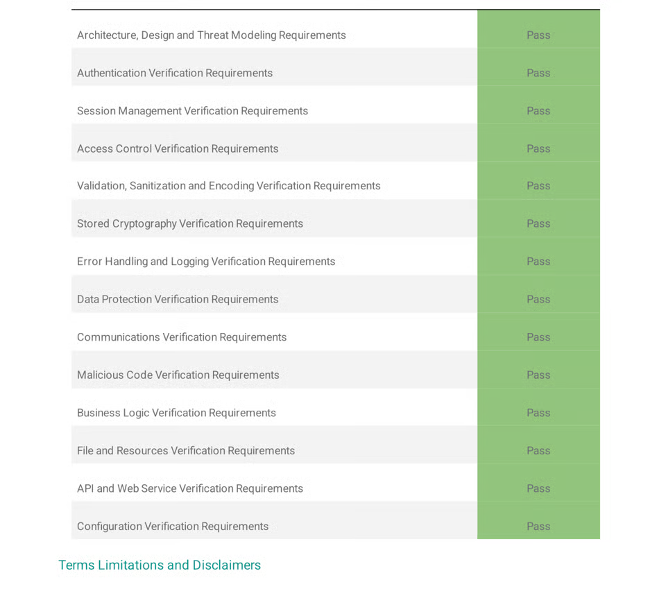

# Google Verified Security Standards With CASA Assessment

Latenode meets the highest security standards, implementing industry-leading protocols to ensure your data is protected at every step. Our commitment to security provides you with the confidence to automate workflows securely and efficiently.

# User accounts, authentication, and authorization

### Latenode Cloud

When you sign up for an Latenode cloud account, you create an account directly with Latenode. When you create an account on Latenode.cloud with a username and password, Latenode implements best practices for account management. For example, Latenode salts and hashes your password, then stores the hashed password in a database that�s encrypted at rest.

### Third-party accounts

A key part of Latenode's functionality is linking third-party services. When you link an account from a third-party application, you may need to either authorize Latenode OAuth application access to your account, or provide an API key or other credentials.

Latenode recommends using [OAuth](https://oauth.net/2/) for third-party applications that support it. The OAuth protocol allows Latenode to request scoped access to specific resources in your third-party account without you having to provide long-term credentials directly. Latenode must request short-term access tokens at regular intervals, and most applications provide a way to revoke Latenode's access to your account at any time.

Some third-party applications don't provide an OAuth interface. To access these services, you must provide the required authorization mechanism (often an API key). As a best practice, if your application provides such functionality, Latenode recommends limiting that API key's access to only the resources you need to access within Latenode.

When you use credentials in a workflow, Latenode loads them into the execution environment of your Latenode instance. For Latenode Cloud, customer instances are logically isolated from one another. Latenode doesn't log or export credentials by default. If you log their values you can always delete the data for that execution. The platform deletes execution data automatically based on your account�s retention settings.

You can delete your OAuth grants or key-based credentials at any time. Deleting OAuth grants within Latenode doesn't revoke Latenode�s access to your account. You must revoke that access wherever you manage OAuth grants in your third-party application.

### User authentication

A username and password are required to authenticate into the app.

### Cloud hosting & storage

Latenode cloud uses Microsoft Azure for hosting.

Latenode further secures access to Azure resources through a series of controls, including:

- Using multi-factor authentication to access Azure
- Hosting services within a private network that�s inaccessible to the public internet.

Latenode stores all OAuth tokens, key-based credentials, and the rest of your Cloud instance's database on a disk that's encrypted at rest using Azure server side encryption (at the time of writing, using AES256 and a FIPS-140-2 compliant implementation). For Latenode cloud, this database also resides in a private network. Backups of that database are also encrypted.

### Data encryption

### Latenode Cloud

When you use the Latenode web application, it encrypts traffic between your client and Latenode services in transit. The same applies for traffic related to the public API or webhook trigger nodes. Latenode uses Cloudflare to manage and renew SSL certificates.

### Network protection

An operational audit system constantly monitors Latenode's cloud infrastructure and sends alerts to appropriate personnel when necessary. We only use configurations that implement approved networking ports and protocols, including firewalls. For example, we maintain a Web Application Firewall to protect Latenode�s web application from malicious traffic and outside threats. And an Intrusion Detection System to detect potential intrusions.

### Audit logging

Latenode collects and stores all your server logs in a central location. Authorized users can query the log info as necessary to trace actions to individual users. We keep audit log history and historical activity records for at least 3 months, with at least the last one months immediately available for analysis.

# Secure development practices

### Version control system

Latenode uses a version control system to manage source code, documentation, release labeling, and other change management tasks. Any employee must get their access approved by a system admin to make code changes.

### Code review process

When Latenode's application code changes, someone other than the person who made the change reviews and tests the new code.

### Separate testing and production environments

Latenode uses separate environments for testing and production for our application.

### Restricted production code changes

Only authorized Latenode personnel can push or make changes to production code.

### Static Application Security Testing (SAST)

Latenode uses static application security testing (SAST) or an equivalent tool as part of the CI/CD pipeline to detect vulnerabilities in its code base. When vulnerabilities are identified, corrections are implemented before release as appropriate based on the nature of the vulnerability.

### Systems Monitoring

Latenode monitors its code, infrastructure, and core applications for known vulnerabilities and addresses critical vulnerabilities promptly.

# Access controls

### Strictly �need-to-know� access to data

Latenode grants employees access to systems containing sensitive data on a least-privilege basis. This means employees only have access to the data they need to perform their job. The company reviews system access quarterly, on any change in role, and upon termination.

### Restricted production code access

Latenode uses GitLab to store and version all production code. Employees use multi-factor authentication to access the GitLab organization. And only authorized Latenode personnel can deploy or make changes to production code.

### Required multi-factor authentication

We require MFA wherever it is available.

### Encrypted web-based access

Latenode uses encryption to protect user authentication and admin sessions of the internal admin tool transmitted over the Internet. All connections happen over SSL/TLS with a valid certificate from a reliable Certificate Authority.

# Corporate security

### Rigorous hiring process

Job candidates must pass through multiple stages of comprehensive background checks and interviews to ensure they comply with relevant laws, regulations, and ethics. All new employees must sign our data protection policy on hire.

### Strict offboarding process

When an employee leaves Latenode, we use a termination checklist to ensure that the employee's system access, including physical access, gets removed within one business day and all organization assets (physical or electronic) get returned.

# Threat & vulnerability management

### Vulnerability scans

Latenode conducts third-party vulnerability scans of its production environment at least once every 90 days.

### Penetration tests

Latenode conducts third-party penetration tests of its production environment at least once a year.

### Intrusion detection

Latenode operates an intrusion detection system (IDS) to detect potential intrusions and alert personnel when a potential intrusion is detected. Including a continuously updated anti-malware solution that scans continuously to detect, remove, or block all types of known malware.

### Phishing simulations

Latenode conducts periodic phishing simulations as part of the company's security awareness initiatives.

### Threat intelligence

Latenode has implemented mechanisms to collect threat information and produce threat intelligence (e.g., commercial cyber threat intelligence tools, security product/vendor intelligence feeds, open source feeds, etc.) in accordance with defined threat intelligence objectives.

### Backup, recovery, and business continuity

Latenode stores customer data in a secure production account in Azure. Latenode automatically backs up all customer and system data daily to protect against catastrophic loss due to unforeseen events that impact the entire system. This process backs up or replicates data to a separate region in the same country. And the backups are encrypted in the same way as live production data.

Latenode�s backup service monitors the entire backup process, and any failures automatically trigger an alert to the Incident Response Team.

Latenode has a defined and regularly tested Business Continuity Plan outlining the procedures to respond, recover, resume, and restore operations following a major natural disaster or catastrophic system failure.

### Disaster recovery plan

Latenode has formulated a detailed disaster recovery plan outlining the roles, responsibilities, and detailed procedures for recovering systems in case of failure.

### Security logs

Latenode collects and stores server logs in a central location. The system can be queried in an ad hoc fashion by authorized users.

### Information security policy

Latenode has an Information Security Policy to define security obligations for employees and contractors, together with its disciplinary process for violations of the policy.

### Vulnerability disclosure

Latenode has a dedicated process for employees to report security, confidentiality, integrity, and availability failures, incidents, and concerns.

In addition, Latenode maintains customer-accessible support documentation where you can find support contact information. We�re committed to ensuring Latenode is a safe and secure tool for all our users. So should you find any operational or security failures, incidents, system problems, concerns, or other issues/complaints, please don�t hesitate to contact the relevant Latenode personnel.

Last updated on August 4, 2025

