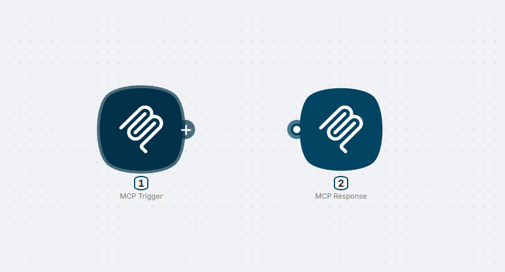
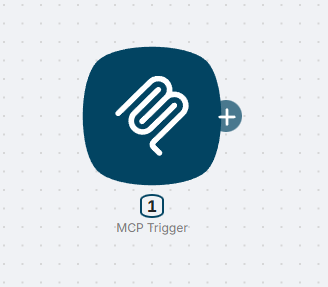
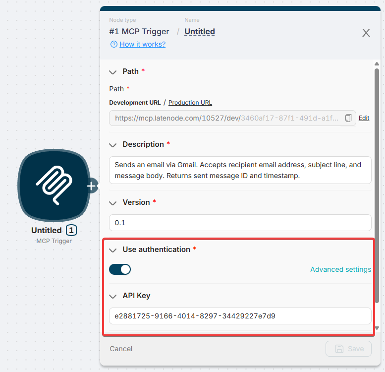
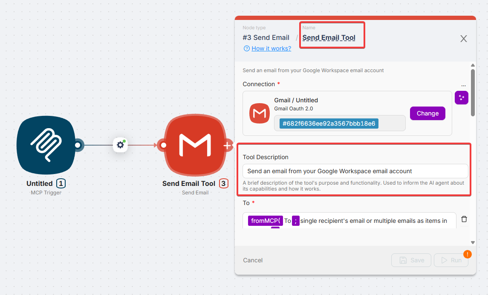
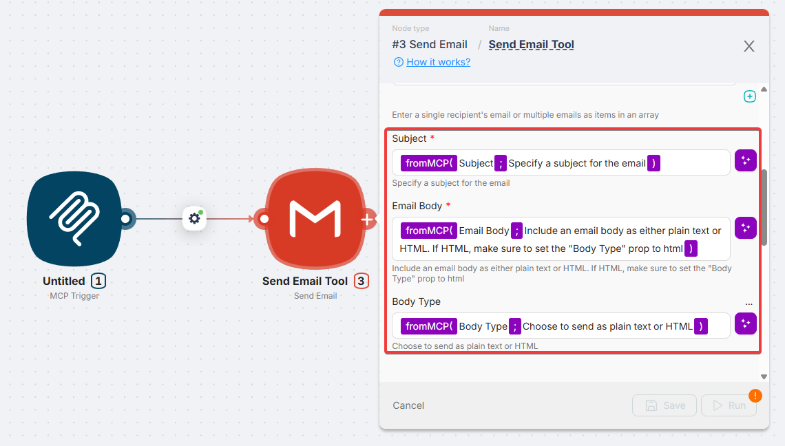
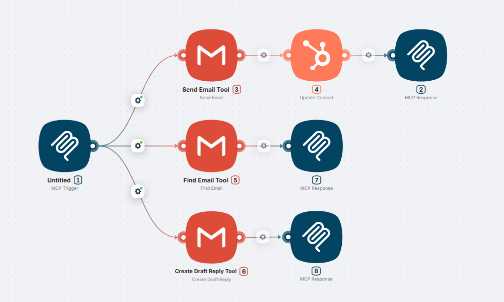
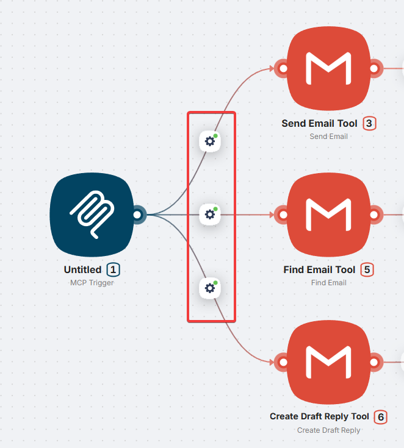
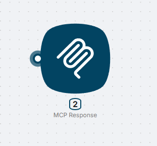
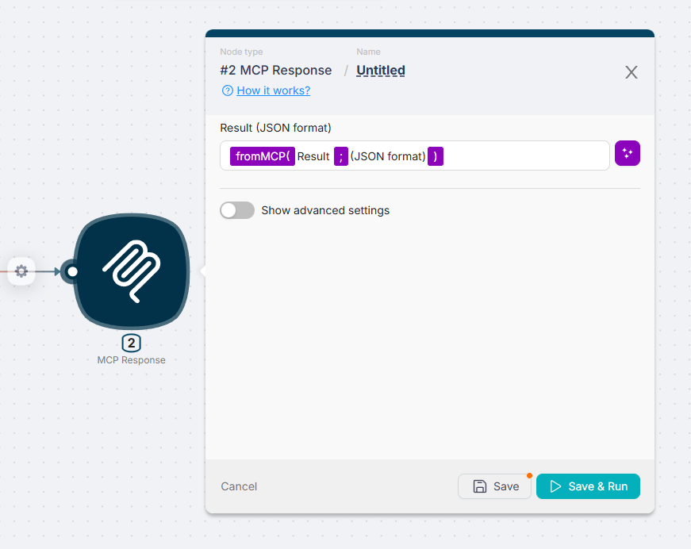
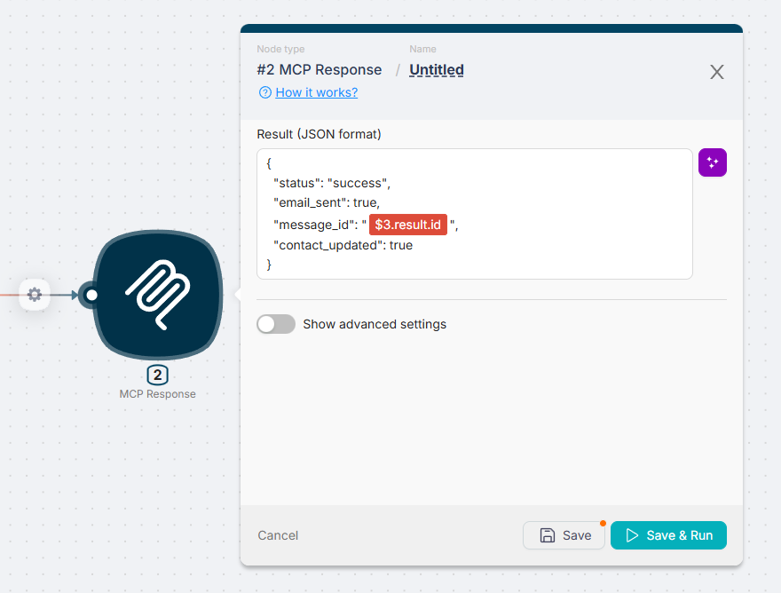

# MCP Nodes

Latenode **MCP server** allows external AI systems (AI agents) to run your scenarios as tools.
**Model Context Protocol (MCP)** is a communication standard between AI systems and external systems, enabling them to interact by defining endpoints and providing authentication.

With Latenode MCP, you can expose your scenarios to AI clients like **Claude Desktop**, **Cursor**, or any MCP-compatible application.



## MCP Trigger

**MCP Trigger** turns your scenario into an MCP server. Each node connected directly to MCP Trigger becomes a separate **tool** that AI clients can discover and call.



### Server settings

| Parameter | Description |
| --- | --- |
| **Server Description** | Description of your MCP server for AI context |
| Server URL | Copy this URL to use in your MCP client. |
| **Version** | Version identifier (any text, e.g., `1.0`) |
| **Authentication** | Enable to require API Key for access |



### Tool configuration

Each node connected to MCP Trigger becomes a tool. Configure it in the first connected node's settings:

| Parameter | Description |
| --- | --- |
| **Tool Name** | Required. Unique tool identifier (e.g., `create_lead`, `send_email`) |
| **Tool Description** | Description helping AI understand when to use this tool |



> ?? Important: Without **Tool Name**, the tool won't be visible to AI clients.

### Input parameters

Parameters define what data AI will pass when calling the tool.

| Field | Description |
| --- | --- |
| **Key** | Parameter name (e.g., `email`, `user_name`) |
| **Type** | Select `fromMCP` for AI-fillable parameters |
| **Description** | Explanation for AI � what data to pass |



**Example � lead creation tool parameters:**

| Key | Type | Description |
| --- | --- | --- |
| name | fromMCP | Contact name |
| email | fromMCP | Contact email address |
| phone | fromMCP | Phone number (optional) |



### Multiple tools

You can create **unlimited tools** in one MCP server by connecting multiple branches to MCP Trigger.



Each branch:

- Has its own **Tool Name** and **Description**
- Can contain any number of nodes
- Can use conditions, loops, AI agents, and any other Latenode nodes
- Operates independently

### Automatic routing

When connecting nodes to MCP Trigger, a **route filter** is created automatically. This filter routes requests to the correct tool branch.



> ?? The filter is auto-generated and non-editable.

## MCP Response

By default, the **output of the last node** in the tool chain is returned to the AI client. This often includes unnecessary data like headers or status codes.

**MCP Response** lets you specify exactly what data to return.



### When to use

- Return only specific fields (e.g., just `body` from HTTP response)
- Create a custom response structure
- Hide technical details from AI

### Configuration

Specify the data to return using variables from previous nodes.



## Example: Simple Echo Tool

### Step 1: Add MCP Trigger

1. Create a new scenario
2. Add **MCP Trigger** node
3. Set **Server Description**: `Test MCP server`

### Step 2: Configure Tool

1. Connect a Code node to MCP Trigger
2. Set **Tool Name**: `echo`
3. Set **Tool Description**: `Returns the provided text. Use for testing.`
4. Add parameter:
   - Key: `message`
   - Type: `fromMCP`
   - Description: `Text to return`

### Step 3: Return Result

In the Code node:

```javascript
return {
  result: msg.message
}
```

### Step 4: Deploy

1. Save the scenario
2. Copy URL from MCP Trigger
3. Connect to your MCP client

## Best practices

### Descriptions

Write clear descriptions so AI understands when and how to use your tools.

**? Good:**

```plain
Creates a task in Asana. Accepts task title and optional deadline.
Returns created task ID and link.
```

**? Bad:**

```plain
Creates task
```

### Parameters

- Use descriptive names (`user_email` not `param1`)
- Specify expected format in description (`Date in YYYY-MM-DD format`)
- Mark optional parameters

### Response data

- Return only necessary data via **MCP Response**
- Avoid exposing technical details
- Structure responses for AI readability

## Limitations

- MCP uses SSE (Server-Sent Events) � requires stable connection
- Tool execution time is limited by scenario timeout
- Binary data (files, images) requires additional handling


