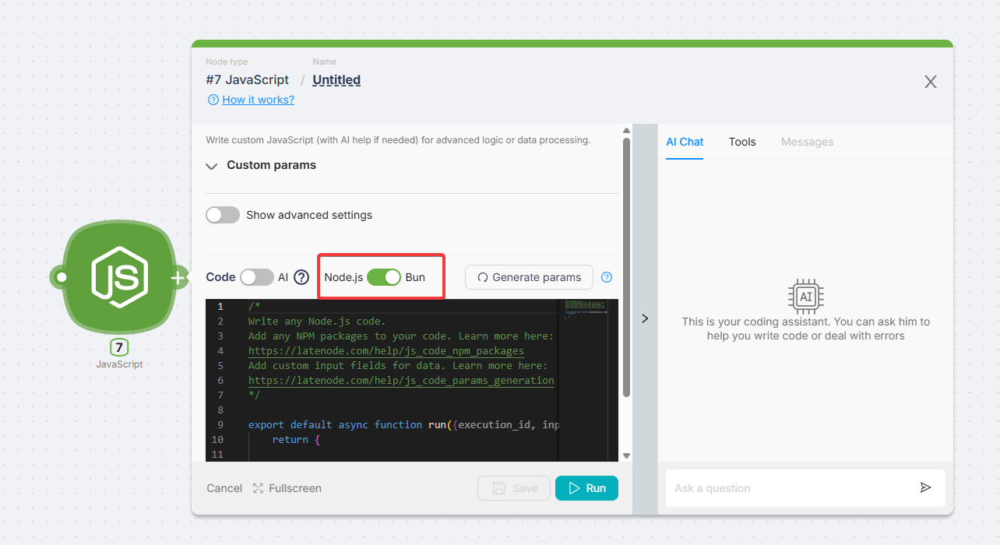

# Bun


## **Node Description**


The **Bun** runtime executes JavaScript code inside automation scenarios.

It is largely compatible with **Node.js**, but provides higher performance and additional built-in features such as **SQLite**, a fast package manager, and improved APIs.

In the low-code environment, **Bun** works the same way as **Node.js** — through the [JavaScript](./javascript.mdx) node, with a runtime switch available in settings.

## Adding Code to a Scenario

To add **Bun** code:

1. Add a **JavaScript** node to your scenario.
2. In the node settings, switch the runtime to **Bun**.
3. Edit the code template manually or with AI assistance.

## Data Exchange Between Nodes

### Using Data from Previous Nodes

You can access output data from previous nodes via the `data` object:

```jsx
export default async function run({ data }) {
  const username = data["{{1.body.user}}"];
  return { user: username };
}
```

### Passing Processed Data to Subsequent Nodes

A **Bun** node can return strings, numbers, JSON objects, or arrays:

```jsx
export default async function run() {
  return {
    status: "ok",
    count: 42,
  };
}
```

## Using NPM Packages

**Bun** supports importing **npm** libraries with the `import` statement.

Dependencies are installed automatically after saving the scenario.

```jsx
import axios from "axios";

export default async function run() {
  const response = await axios.get("https://api.github.com/repositories");
  return { total: response.data.length };
}
```

<Callout type="warning">
Some libraries may behave differently in Bun than in Node.js. Always check compatibility.
</Callout>

## Bun-Specific Features

### SQLite Support

**Bun** provides a built-in `bun:sqlite` module:

```jsx
import { Database } from "bun:sqlite";

export default async function run() {
  const db = new Database(":memory:");
  db.run("CREATE TABLE users (id INTEGER, name TEXT)");
  db.run("INSERT INTO users VALUES (?, ?)", [1, "Alice"]);

  const row = db.query("SELECT * FROM users").get();
  return { user: row };
}
```

### Logging

Use `console.log` for debugging. Output will appear in the **Log** tab.

## Limitations in Low-Code Environment

<Callout type="info">
The environment is isolated: listening to ports, running HTTP/WebSocket servers, or background daemons is not possible.
</Callout>

- Maximum execution time: **2 minutes**
- Only **JavaScript** is supported. TypeScript/JSX syntax (`: type`, interfaces, generics) is not available
- Use `import` instead of `require`
- Some Node.js core modules are not supported
- Not all npm packages are guaranteed to work
- `Bun.serve` and any server creation are not supported
