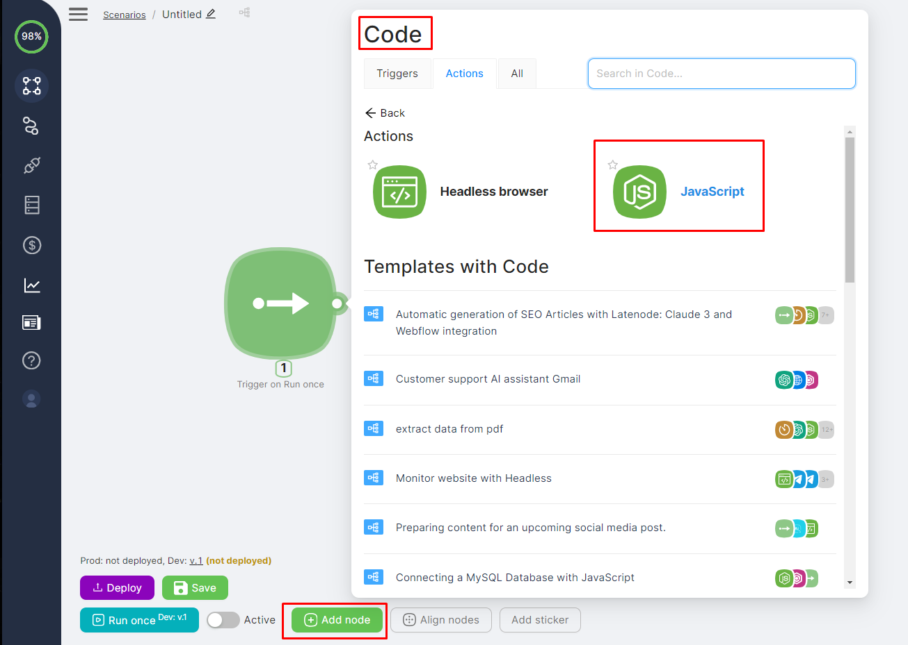
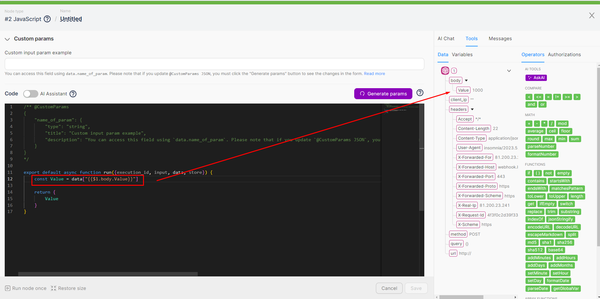
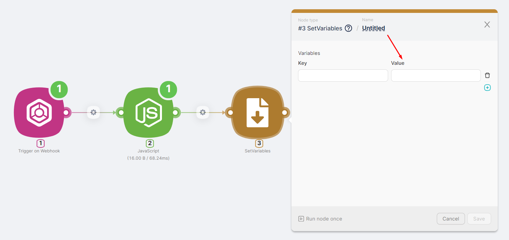
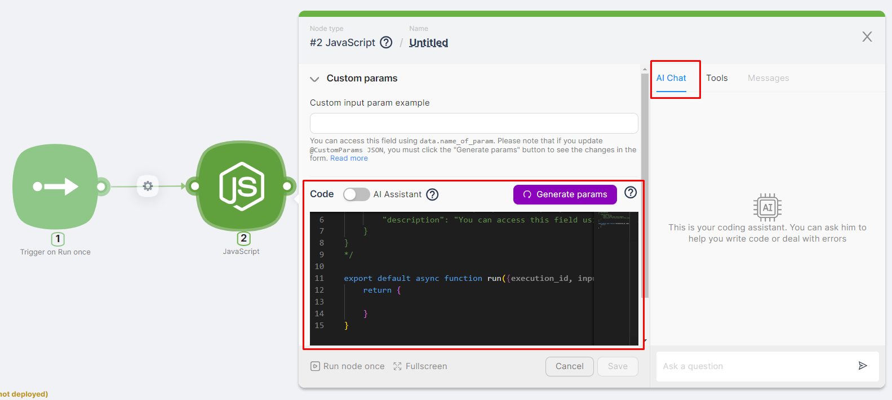
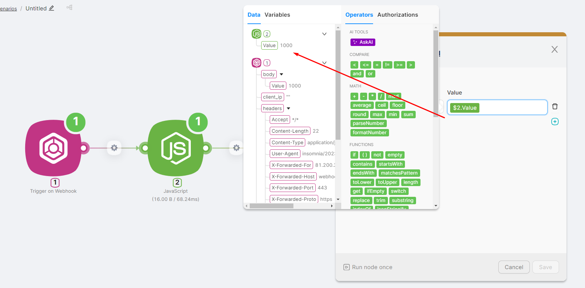
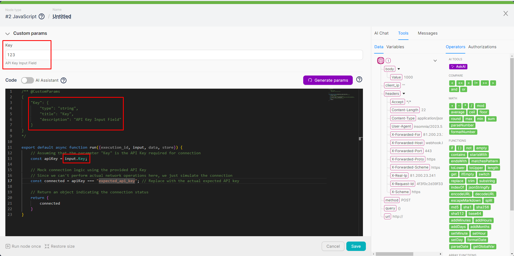
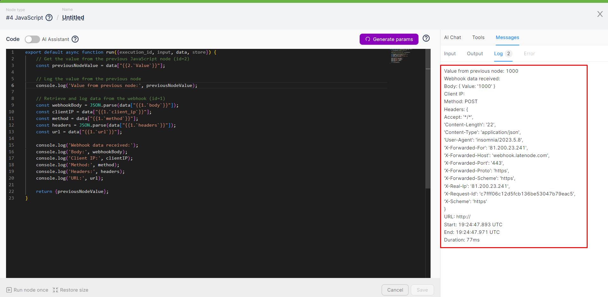
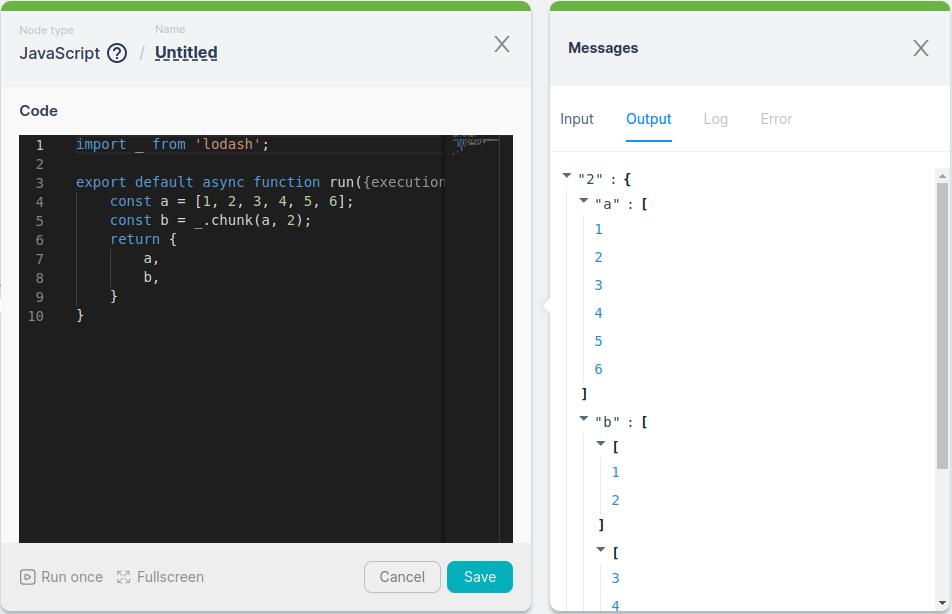
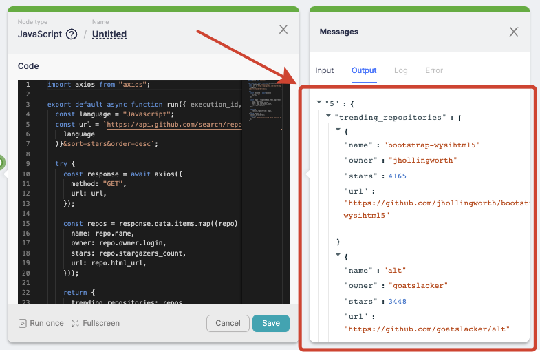

# Node.js

The [JavaScript](./javascript.mdx) node allows you to write and execute JavaScript code, import npm libraries, and handle various data processing tasks. This node provides robust support for integrating custom code into workflows, enhancing the flexibility and functionality of your scenarios.

## Adding Code to a Scenario

To add code to a scenario, follow these steps:

1. Click on one of the buttons to add a node.
2. In the application selection window, choose the [JavaScript](./javascript.mdx) node.



3. Open the added JavaScript node and make changes to the code template manually or with the help of the AI assistant.



## Data Exchange Between Nodes

### Using Data from Previous Nodes in Code

The code generated in the [JavaScript](./javascript.mdx) node can utilize the output data from previous nodes in the scenario. For example, in a JavaScript node, you can reference a parameter passed to the **Trigger on Webhook** node via an HTTP request. To do this, follow these steps:

- Write an expression to define a constant using `const =`.
- Select the necessary parameter from the previous nodes.

By doing so, you can seamlessly integrate and manipulate data across different nodes within your scenario.



<Callout type="warning">
When adding data from other nodes, part of the expression may be wrapped in backticks. For example: `data["{{1.headers.Content-Type}}"]`, even if another node returned the property without them. It is not necessary to remove the backticks, as they will be ignored during code execution. Removing them manually may result in code execution errors.

</Callout>
### Passing Processed Data to Subsequent Nodes

The result of the [JavaScript](./javascript.mdx) node can be a string, numerical value, JSON object, etc. The output data from the **JavaScript** node can also be used in other nodes within the scenario. For example, a parameter generated in the **JavaScript** node can be recorded as a variable. To do this:

1. In the **SetVariables** node, click on the **Value** field.



2. In the auxiliary window, select the parameter generated in the **JavaScript** node.

This way, you can efficiently pass and utilize processed data between nodes in your workflow.



### Using Variables

Variables created within the scenario or global variables can also be used in the [JavaScript](./javascript.mdx) node.

<Callout type="info">
Variables created within the scenario or global variables can also be used in the [JavaScript](./javascript.mdx) node.

</Callout>
<Callout type="info">
Learn more about using variables in the JavaScript node [here](../variables/variables-in-javascript-node.mdx). Learn more about using global variables in the **JavaScript** node [here](../variables/global-variables-in-javascript-node.mdx).

</Callout>
### Processing Files or Arrays of Files

The [JavaScript](./javascript.mdx) node can process files or arrays of files. For example, to upload a single file, you can use the following code:

```jsx
async function run({execution_id, input, data, page}) {
  const file = data["{{2.body.files.[0].content}}"];
  const uploadForm = await page.$x('//*/input[@type="file"]'))[0].uploadFile(file);
}
```

To iterate through an array of files with a known length, for example, 5, write the following code:

```jsx
async function run({execution_id, input, data, page}) {
  const files = [
    data["{{2.body.files.[0].content}}"],
    data["{{2.body.files.[1].content}}"],
    data["{{2.body.files.[2].content}}"],
    data["{{2.body.files.[3].content}}"],
    data["{{2.body.files.[4].content}}"]
  ].filter(file => file && file !== 'null');

  const uploadForm = await page.$x('//*/input[@type="file"]')[0];
  for (let file of files) {
      await uploadForm.uploadFile(file);
  }
}
```

### Return files from JavaScript

In a JavaScript node, you can create and edit files in the filesystem using, for example, the fs package. To return files from the node, you can use the following functions:

- `file(filePath)` � returns a single file from the specified path. The filePath parameter must be a string.
- `files(filePaths)` � returns an array of files from the specified paths. The filePaths parameter must be an array of strings.

<Callout type="info">
**Important:** These functions only work at the first level of nesting in the returned data from the node.

</Callout>
Example code:

```jsx
import fs from 'fs';
export default async function run({execution_id, input, data, store, db}) {
    fs.writeFileSync('file1.txt', 'some file content 1');
    fs.writeFileSync('file2.txt', 'some file content 2');
    fs.writeFileSync('file3.txt', 'some file content 3');
    return {
        file: file('file1.txt'),
        files: files(['file2.txt', 'file3.txt'])
    }
}
```

This will **not** work (functions file/files are deeper than the first level of nesting):

```jsx
import fs from 'fs';
export default async function run({execution_id, input, data, store, db}) {
    fs.writeFileSync('file1.txt', 'some file content 1');
    fs.writeFileSync('file2.txt', 'some file content 2');
    fs.writeFileSync('file3.txt', 'some file content 3');
    return {
        object: {
            file: file('file1.txt'),
            files: files(['file2.txt', 'file3.txt'])
        }
    }
}
```

## Custom Parameters in JavaScript

Custom parameters in the [JavaScript](./javascript.mdx) node allow you to externalize certain parts of the code into special input fields, eliminating the need to edit the code itself.

For example, if your code uses an API key, you can generate a separate input field for this parameter in the JavaScript node. This way, you only need to change the value in the designated field rather than modifying the code directly when updating the API key.

<Callout type="info">
Learn more about all possible custom parameters [here](./custom-js-parameters.mdx).
</Callout>



## Logging

Logging in the [JavaScript](./javascript.mdx) node is available using the `console.log` command. Logged data will be displayed in the **Log** tab.



## Using NPM Packages

The [JavaScript](./javascript.mdx) node supports the import of **npm** libraries using the `import` statement. For example, importing and using the "lodash" library:



You can specify the version of the library you want to use with the `@` symbol. For example:

```jsx
import _ from 'lodash@4.16.6';
import _ from 'axios@^1.2.0';
```

After each scenario with a **JavaScript** node is saved, a check is performed to see if there are any library imports and changes to the list of libraries and their versions (if specified):

- If there are changes, the libraries are installed.
- If there are no changes, the saved libraries and versions are used.

<Callout type="warning">
Library installation takes some time. If the user starts the node before the installation is complete, an error message will appear: "Dependency installation is not yet completed. Please try again in a few seconds." In this case, simply wait a short while before proceeding.

</Callout>
**Node Package Manager (NPM)** is a tool for developers working with Node.js, as it allows them to leverage a vast library of ready-made packages and easily manage project dependencies. Using the **axios** package enables developers to easily fetch data from external APIs or other web services without having to write extensive code for handling HTTP requests and responses.



An example of such a scenario is fetching a list of current GitHub repositories based on a selected programming language using the **axios** package:

```jsx
import axios from "axios";

export default async function run({ execution_id, input, data }) {
  const language = "Javascript";
  const url = `https://api.github.com/search/repositories?q=language:${encodeURIComponent(
    language
  )}&sort=stars&order=desc`;

  try {
    const response = await axios({
      method: "GET",
      url: url,
    });

    const repos = response.data.items.map((repo) => ({
      name: repo.name,
      owner: repo.owner.login,
      stars: repo.stargazers_count,
      url: repo.html_url,
    }));

    return {
      trending_repositories: repos,
    };
  } catch (error) {
    console.error(error);
    return {
      error: "An error occurred while fetching data from the GitHub API.",
    };
  }
}
```

Another example of using NPM packages is a scenario for calculating the time remaining until a deadline using the **Moment** package:

```jsx
import moment from "moment";

export default async function run({ execution_id, input, data }) {
  const deadline = "25.10.2024"; // Retrieve deadline from input
  const now = moment(); // Get current time
  const deadlineMoment = moment(deadline, "DD.MM.YYYY"); // Parse deadline string to Moment object using custom format
  const remainingTime = deadlineMoment.from(now); // Calculate remaining time

  return {
    remainingTime
  };
}
```

## JavaScript Node Limitations

The maximum execution time for the [JavaScript](./javascript.mdx) node is **2 minutes**.

<Callout type="info">
You can add multiple JavaScript nodes to a scenario for sequential execution to handle more complex tasks.

</Callout>