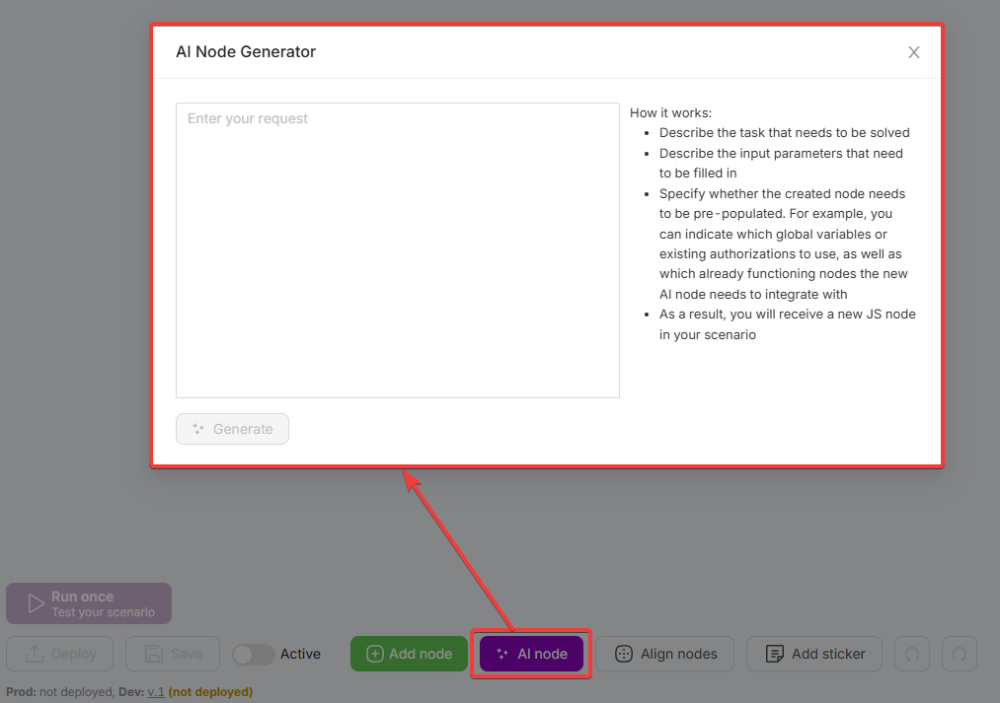
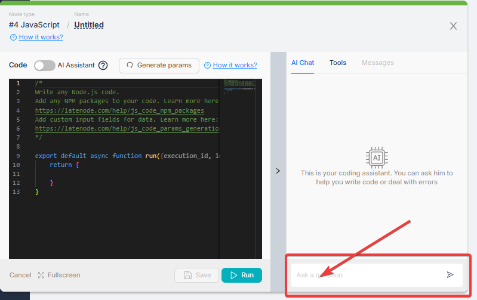
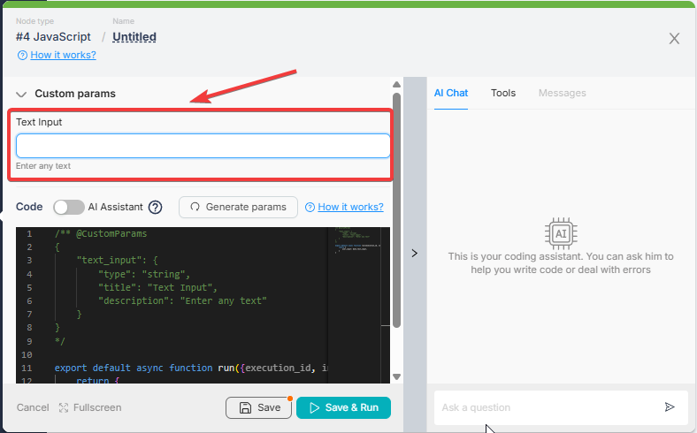

# Using AI to Generate Code (Ai Node)

An AI assistant is available inside the JavaScript node. It helps you generate, modify, and debug code directly inside your scenario ? just by describing what you want in natural language.

The assistant works contextually: it understands the current node, available data, and even connections to other blocks. You can ask it to build logic, create inputs, work with global variables, integrate with APIs, and more.

## Where the AI Assistant Is Available

You can launch AI Assistant in two ways:

**1.Via the "AI Node" button** at the bottom of the editor. This opens a dedicated chat window with assistant.



**2.Inside any JavaScript node**. Open the node and enter your message to start a conversation.



### Table of contents: What Assistant Can Do

1. **Create custom input parameters**
2. **Process data from other nodes**
3. **Work with global variables**
4. **Integrate with services like Telegram (example of creating custom api calls)**
5. **Debug and explain existing code**
- And more ? just describe your task!

## 1. Custom Parameters

Assistant can automatically create custom input parameters for your nodes.



Instead of hardcoding a value:

```
const message = "Hello world";
```

Copilot will rewrite it to:

```
const message = input.text_input;
```

And it will automatically add the `text_input` field to the node UI ? as shown in the screenshot above.

More info: [Custom JS Parameters](https://help.latenode.com/advanced-features/46DTZD5aggy7NR22L329Ge/custom-js-parameters/46DTZD5aggyL65Vhn4v8cA)

## 2. Request to process data from other nodes

> ? *Generate code to process data from the Trigger on Webhook node so that based on the Name and Count parameters, text is generated based on the following pattern: Hi, Name! Count of your scenarios has been executed in X on the Latenode platform! Instead of X, substitute the name of the current month.*


The assistant will provide the answer: 

To generate the required text based on the parameters from the "Trigger on Webhook" node, you can follow these steps inside the provided?**`run`**?function. First, we'll extract the?**`Name`**?and?**`Count`**?values from the data provided by the webhook node with ID?**`4`**. Then, we'll use JavaScript's?**`Date`**?object to get the current month and format it as a name. Finally, we'll construct the message according to the pattern you've requested.

Here is how you can do it:

```jsx
export default async function run({execution_id, input, data, store}) {
    // Extracting Name and Count from the webhook data
    const name = data["{{4.`body`.`Name`}}"];
    const count = data["{{4.`body`.`Count`}}"];

    // Getting the current month as a name
    const monthNames = ["January", "February", "March", "April", "May", "June", "July", "August", "September", "October", "November", "December"];
    const currentMonthName = monthNames[new Date().getMonth()];

    // Generating the message
    const message = `Hi, ${name}! ${count} of your scenarios has been executed in ${currentMonthName} on the Latenode platform!`;

    // Returning the generated message
    return {
        message
    };
}
```

Explanation:

- **`data["{{4.body.Name}}"]`**?and?**`data["{{4.body.Count}}"]`**?access the?**`Name`**?and?**`Count`**?values from the webhook's body.
- We use JavaScript's?**`Date`**?object to get the current month as an index (**`getMonth()`**?returns a zero-based index for the months), and then we use this index to get the month's name from the?**`monthNames`**?array.
- The message is constructed using template literals, embedding the?**`name`**,?**`count`**, and?**`currentMonthName`**?variables into the predefined text pattern.
- Finally, the function returns an object containing the generated message, which can be used by subsequent nodes in your scenario.

## 3. Request for processing global variables

> ?? It is assumed that global variables GlobalVar_number1 and GlobalVar_number2 exist in the account. See the section on global variables.


> ? *Generate code that adds up the values of two global variables GlobalVar_number1 and GlobalVar_number2 and return an array of the values: sum of variables, GlobalVar_number1, GlobalVar_number2. Get global variables using store.getGlobalVariable*


The assistant will provide the answer: 

To accomplish the task you've described, we will use the?**`store.getGlobalVariable`**?method to retrieve the values of the global variables?**`GlobalVar_number1`**?and?**`GlobalVar_number2`**. Then, we'll add these values together, and return an array that includes the sum,?**`GlobalVar_number1`**, and?**`GlobalVar_number2`**?in that order. Here's how you can do it:

```jsx
export default async function run({execution_id, input, data, store}) {
    // Retrieve the values of the global variables
    const number1 = await store.getGlobalVariable('GlobalVar_number1');
    const number2 = await store.getGlobalVariable('GlobalVar_number2');
    
    // Convert the retrieved values to numbers, if they are not already
    const num1 = parseFloat(number1);
    const num2 = parseFloat(number2);

    // Calculate the sum of the two numbers
    const sum = num1 + num2;

    // Return an array with the sum, GlobalVar_number1, and GlobalVar_number2
    return {
        result: [sum, num1, num2]
    };
}
```

This code snippet does the following:

1. It uses?**`store.getGlobalVariable`**?to fetch the values of?**`GlobalVar_number1`**?and?**`GlobalVar_number2`**. These methods are asynchronous, so we use?**`await`**?to wait for the promises to resolve.
2. It then converts these values to numbers using?**`parseFloat`**?to ensure that arithmetic operations can be performed correctly. This is a safeguard in case the values are stored as strings.
3. It calculates the sum of the two numbers.
4. Finally, it returns an object with a?**`result`**?key that maps to an array containing the sum,?**`GlobalVar_number1`**, and?**`GlobalVar_number2`**.

Ensure that the global variables?**`GlobalVar_number1`**?and?**`GlobalVar_number2`**?are set and contain numeric values. If these variables contain non-numeric values,?**`parseFloat`**?will return?**`NaN`**, and the sum calculation will not work as expected.

## **4. Request to connect to Telegram to send messages (example of creating custom api calls)**

> ? *Generate a code with a Telegram connection to send a message to the desired chat room with a given ID*


The assistant will provide the answer: 

To send a message to a Telegram chat room, you will need to use the Telegram Bot API. First, ensure you have created a bot and obtained your bot's API token from BotFather in Telegram. Then, you can use the?**`axios`**?library to make HTTP requests to the Telegram API. Here?s how you can do it:

1. **Install Axios**: Since your environment automatically installs npm packages, you just need to import it.
2. **Use the Telegram Bot API**: You'll need to use the?**`sendMessage`**?method of the Telegram Bot API to send a message to a chat.

Here's an example code snippet that sends a message to a specified chat ID using a Telegram bot:

```jsx
import axios from 'axios';

export default async function run({execution_id, input, data, store}) {
    // Your Telegram Bot Token
    const botToken = 'YOUR_BOT_TOKEN_HERE';
    
    // The chat ID you want to send a message to
    const chatId = 'YOUR_CHAT_ID_HERE';
    
    // The message you want to send
    const message = 'Hello, this is a message from my bot!';
    
    // Telegram API URL to send messages
    const apiUrl = `https://api.telegram.org/bot${botToken}/sendMessage`;
    
    try {
        // Making a POST request to the Telegram API to send the message
        const response = await axios.post(apiUrl, {
            chat_id: chatId,
            text: message,
        });
        
        // Returning the response from the Telegram API
        return {
            success: true,
            response: response.data,
        };
    } catch (error) {
        // Returning the error if the request failed
        return {
            success: false,
            error: error.message,
        };
    }
}
```

Replace?**`'YOUR_BOT_TOKEN_HERE'`**?with your actual Telegram bot token and?**`'YOUR_CHAT_ID_HERE'`**?with the chat ID you want to send a message to.

**Important Notes:**

- Ensure your bot is added to the chat room you want to send a message to.
- The chat ID can be a user ID, group ID, or channel username (prepend with?**`@`**?for channels).
- This function runs asynchronously, leveraging?**`axios`**?for HTTP requests.
- The code handles basic success and error cases, returning the API response or error message.

## 5. Debugging & Error Fixes

If the assistant generates code that doesn't work as expected ? no problem. Just send the **error message or the broken code back to the assistant**, and it will:

- Analyze what went wrong
- Suggest and generate a corrected version
- Explain what was fixed (if needed)

You don't need to debug manually ? just say something like:

> ?This code throws an error: Cannot read property 'xyz' of undefined ? fix it?
> 

Or:

> ?This returns undefined, but I expect the message to be shown ? what's wrong??
> 

The assistant is designed to **iteratively** improve the output, so feel free to go back and forth. It?s part of the workflow.

---

## Tips & Notes

- The assistant understands your context and node configuration.
- You can ask complex multi-step queries (e.g. "get data from webhook, filter it, and send to Telegram").
- If something goes wrong, try rephrasing your request ? the assistant will adapt.
- Responses include explanations ? great for learning and debugging.