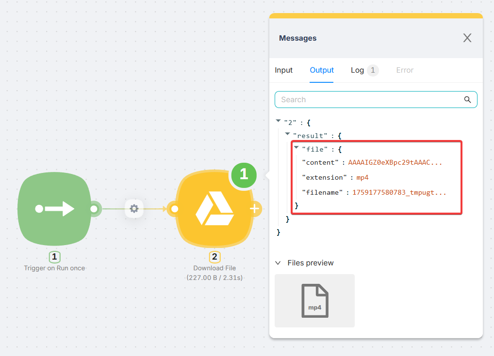
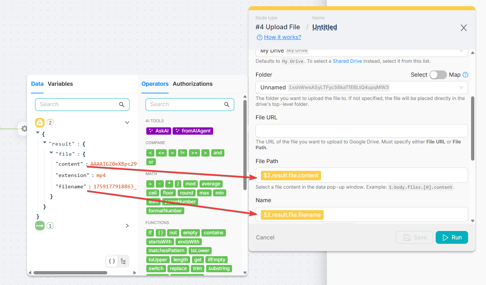
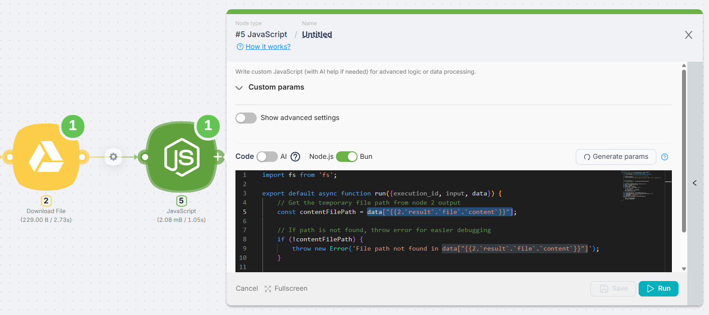
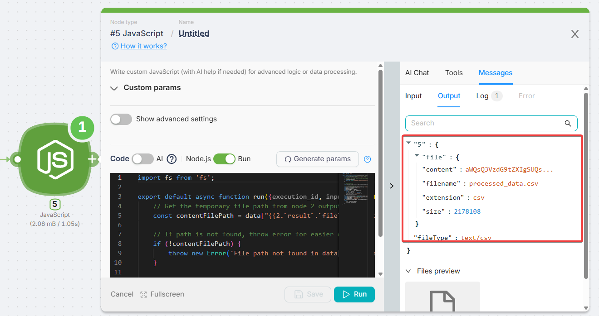

# Handling Files

Latenode supports two ways of working with files in scenarios:

- **No-code nodes**: you pass a file reference from one node to another.
- **JavaScript node**: you read/modify/create a file in code and return it back as a file output.

## Passing files between no-code nodes

When a node outputs a file, it usually contains a `file` object with fields like `content` (internal path/reference), `filename`, `extension`, and more.



### Typical mapping in receiving nodes

Most nodes either accept the whole file object or ask for specific fields (for example, **File Path** and **Name**). Use the helper widget to insert the values from previous nodes.

| Receiving node field | What to map | Example |
| --- | --- | --- |
| **File Path / File Content** | File reference/path | `{{$2.result.file.content}}` |
| **Name** | File name | `{{$2.result.file.filename}}` |
| **Extension** (optional) | File extension | `{{$2.result.file.extension}}` |



## Working with files in the JavaScript node

If you need to **read**, **transform**, or **generate** a file in code, you must work with a file path and Node.js `fs`.

### Step 1: Get the temporary file path

Use the templated data accessor to pull the file path from a previous node (example: Node 2).

```js
const contentFilePath = data["{{2.result.file.content}}"];
```



### Step 2: Read/modify the file (Buffer)

Read the file from the path, perform your transformation, and build a new `Buffer` (or write bytes directly).

### Step 3: Write and return the file

Write the output file to the temporary filesystem and return it using the `file()` helper so other nodes can consume it.

<Callout type="warning" title="Important">
Do not return the raw path from `data[...]` as your final output. Always follow: get path > read > modify > write > return `file(...)`.
</Callout>



## Tip: Ask the AI agent to return a binary file

The AI agent inside the **JavaScript** node can generate code that returns **binary files** (images, PDFs, CSVs, videos, etc.) out of the box. You can explicitly ask it to:

- Read a file from a specific node output (for example, �Node 2�).
- Process it (convert, resize, compress, parse, etc.).
- **Return the result as a file output** using `file()` and a correct `fileType`.

Example prompt you can paste into the AI chat in the JavaScript node:

> Read the file from Node 2 output (`result.file.content`), convert it to PDF, and return it as a binary file output with the correct MIME type.

## Complete example: Read > Modify > Write > Return (CSV)

```js
import fs from 'fs';

export default async function run({ data }) {
  // 1) Get the temporary file path from Node 2 output
  const contentFilePath = data["{{2.result.file.content}}"];

  if (!contentFilePath) {
    throw new Error(
      'File path not found. Check that Node 2 outputs result.file.content and insert it via the helper widget.'
    );
  }

  // 2) Read file as a Buffer
  const contentFileBuffer = fs.readFileSync(contentFilePath);

  // 3) Modify (example: add ',"Processed"' column to each CSV row)
  const csvContent = contentFileBuffer.toString('utf8');
  const rows = csvContent.split('\n');

  const header = rows[0] ?? '';
  const processedRows = [header];

  for (let i = 1; i < rows.length; i++) {
    const row = rows[i];
    if (!row || row.trim() === '') continue;
    processedRows.push(`${row.trim()},"Processed"`);
  }

  const processedCsvString = processedRows.join('\n');
  const processedFileBuffer = Buffer.from(processedCsvString, 'utf8');

  // 4) Write and return as a file output
  const newFileName = 'processed_data.csv';
  fs.writeFileSync(newFileName, processedFileBuffer);

  return {
    file: file(newFileName),
    fileType: 'text/csv',
  };
}
```