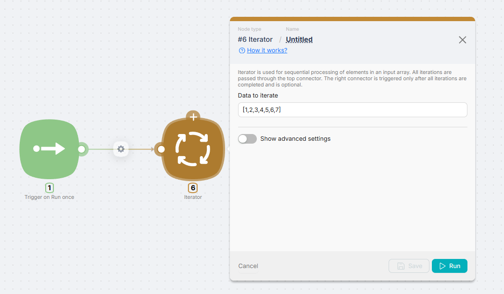
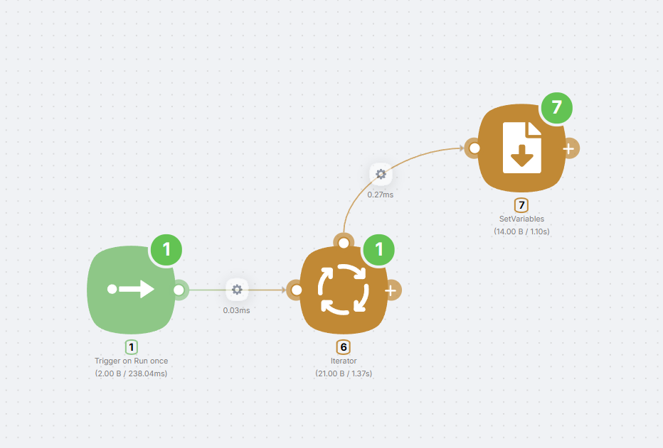

# Iterating

Iterating means processing a collection (an array or object) **one item at a time**: the same steps run for each item. In Latenode this is done with the [**Iterator**](/integrations/core-nodes/iterator) node: you give it data to iterate over and connect nodes that should run inside the loop.

## What is an Iterator

The **Iterator** is a node that processes selected data sequentially, one element at a time. You can pass a JSON array (iteration over array elements) or a JSON object (iteration over key–value pairs).

## Setup

### Data to Iterate field

In the node's single configuration field — **Data to Iterate** — specify the array or object to iterate over. This can come from previous nodes (e.g. `{{node.field}}`) or be a fixed value.

### Top connector (cycle)

Unlike regular nodes, **Iterator** has an extra connector on **top**. This is the cycle output: each iteration goes through it. Connect here the nodes that should run for every element — as many times as there are items in the data.

### Right connector (after all iterations)

The **right** connector runs **only after all iterations are done**. It's optional and is typically used for "when everything is processed" actions — for example, sending a webhook response that data was processed successfully.

<Callout type="info">
A node connected to the **right** Iterator connector runs once after the loop. Nodes connected to the **top** connector run on every iteration.
</Callout>

## Example

Common pattern: trigger → data → **Iterator** → connect a node (e.g. Set Variables or HTTP Request) to the top connector to process one item; connect **Webhook Response** to the right connector to send the response to the caller after all items are processed.

For more on the node's parameters and examples, see [Iterator](/integrations/core-nodes/iterator).
